The Community Hub serves as a collaborative platform for gathering and managing community-driven contributions. Whether you're proposing new content, requesting features, reporting issues, or ideation for dApps, this repo is your entry point. We use GitHub's built-in features like issues, projects, and automations to ensure ideas are triaged efficiently and turned into actionable tasks.

## How to Contribute

Ready to jump in? It's as simple as [**creating an issue**](https://github.com/midnightntwrk/community-hub/issues/new/choose).

## Our Workflow: From Idea to Reality

```mermaid
graph LR;
    A["💡 Your Idea"] --> B["[Community Board]<br/>(Triage)"];
    B --> C["[Grab n' Go Board]<br/>(Development)"];
    C --> D["✅ Done!"];
```

## Step 1: The Community Board (Triage)

All new issues land here for initial review. This board is public, so everyone can see what's being proposed.

```mermaid
graph TD;
    A["New Issue"] -->|Begin Review| B["In Triage"];
    B -->|Is it valid & clear?| D{Decision};
    D -- Yes --> E["✅ Approved<br/>(Moves to next board)"];
    D -- No --> F["❌ Rejected"];
    D -- Needs More Info --> C["Needs Discussion"];
    C -->|Feedback Provided| B;
```

- `New`: Your issue has been submitted and is awaiting review.
- `In Triage`: The triage committee is actively reviewing your submission for validity, clarity, and priority.
- `Needs` Discussion: The issue requires more feedback or clarification from the community or the original poster.
- `Rejected`: The issue is out-of-scope or invalid. We will always provide a clear explanation.

Once an issue is approved, it gets a triaged label and is automatically moved to the next stage.

## Step 2: The Grab n' Go Board (Development)

This board contains approved, ready-to-work-on tasks. It's the community's backlog!

```mermaid
graph TD;
    A(📥 Triaged Issue Enters Board) --> B["Ready<br/><i>Waiting for a contributor to claim</i>"];
    B -->|Contributor assigns themself| C["In Progress<br/><i>Work has started</i>"];
    C -->|Pull Request is Merged| D["✅ Done<br/><i>Issue is automatically closed</i>"];

    subgraph "Grab n' Go Board"
        B
        C
        D
    end

    style A fill:#f9f,stroke:#333,stroke-width:2px
```

- `Ready`: Triaged issues waiting for a contributor to pick them up. Look for labels like good-first-issue if you're new!
- `In Progress`: A contributor has assigned themselves the issue and is actively working on it.
- `Done`: The work is complete and the issue has been closed (this happens automatically when a linked PR is merged).

## Choosing the Right Issue Template

To help us categorize and review your ideas faster, please use the best template for your submission:

- 📝 `Content Proposal`: Suggest new articles, tutorials, or educational resources to engage the community.
- 💡 `Feature Request/Suggestion`: Propose new features or enhancements for our tools and processes.
- 🐛 `Bug Report`: Report any defects, errors, or unexpected behavior. Please include clear reproduction steps!
- 🌐 `dApp Proposal`: Share your vision for a new decentralized application, integration, or improvement.

Selecting a template automatically applies the right labels, helping our automation keep things organized.

Our goal is to foster a truly collaborative environment where the collective wisdom of our community helps us build more robust, community-driven solutions.

## Why Now? The Developer Relations Perspective

You might be asking, "Why is the Developer Relations (DevRel) team launching this?" That's a great question, and it gets to the very core of our mission!

At its heart, Developer Relations is about empowering developers.

The Community Board is a natural, powerful extension of this mission. Here’s why it’s so crucial for us:

1. Direct Feedback Loop: Before, collecting structured feedback could be spread across multiple channels. The Community Board centralizes this, giving us a clear, prioritized view of what matters most to you.
2. Transparency and Prioritization: You'll be able to see what other developers are asking for, upvote ideas you support, and even watch as issues move from "Under Review" to "Planned" to "Shipped." This transparency helps you understand our roadmap and how your contributions fit in.
3. Community-Driven Development: We genuinely believe that the best products are built in collaboration with their users. The board allows us to tap into the collective intelligence of our community, surfacing the most impactful ideas and validating them with real-world needs.
4. Building Stronger Relationships: By giving you a clear, actionable way to contribute, we hope to build an even stronger, more engaged community where everyone feels invested in our shared success.
