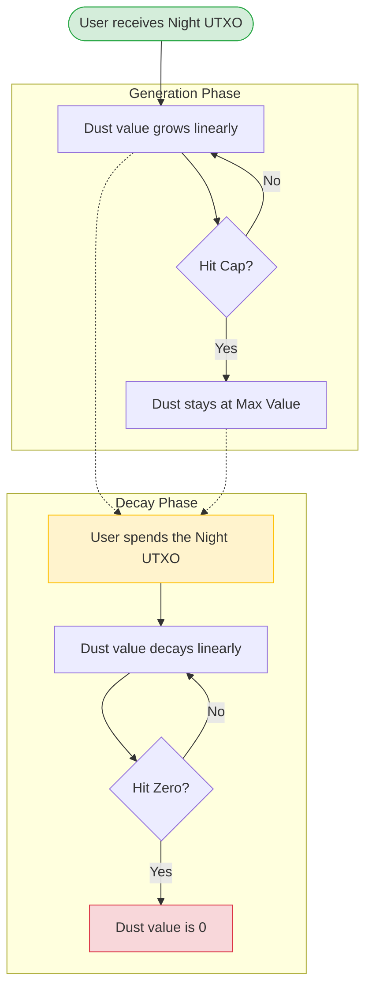
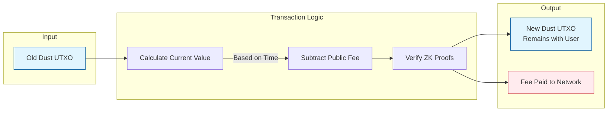
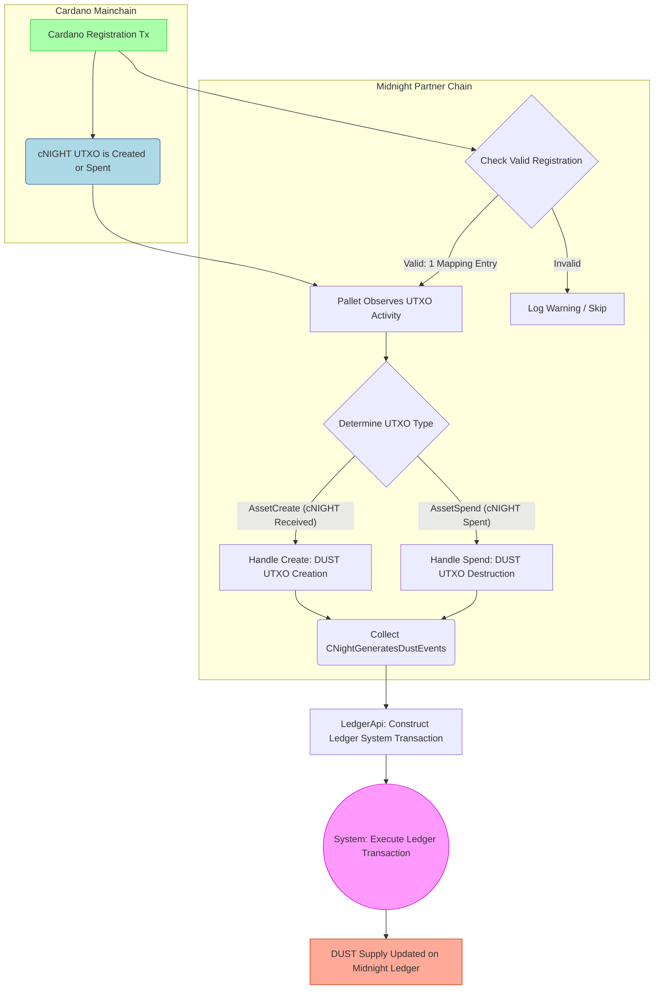

# Architecture Overview DUST and Fee Payments

To understand this system, it helps to use an analogy.

- **Night** is like a **Solar Panel**. It is a valuable asset you hold.
- **Dust** is like **Electricity**. It is generated by the Solar Panel (Night) over time.
- **Fees**: You use the Electricity (Dust) to pay for transaction costs on the network.

Unlike standard cryptocurrencies where you have a static balance (e.g., "I have 5 coins"), your Dust balance changes dynamically based on time and the status of your Night tokens.

## Dust and fee payments

Dust operates similarly to, but separately from, [Zswap](https://github.com/midnightntwrk/midnight-ledger/blob/main/spec/zswap.md). It operates as the fee payment token of Midnight, but has the following unique properties:

  - **Shielded & Non-transferable:** Dust is a shielded token used *only* for fees. It cannot be transferred between users.
  - **Dynamic Value:** The value of a Dust UTXO is dynamically computed and derived from an associated Night UTXO.
  - **Growth & Decay:** The computed value grows over time to a maximum based on its Night UTXO, and decays to zero after its Night UTXO is spent.
  - **Non-Persistent:** The system may redistribute it on hardforks. (Note: The Midnight protocol reserves the right to modify Dust allocation rules, e.g., for garbage collection).

## Design overview

Similar to Zswap, Dust is built on hashes and the commitment/nullifier paradigm. Each Dust UTXO has a **commitment** inserted into an append-only Merkle tree upon creation, and a **nullifier** inserted into a nullifier set upon spending.

A Dust "spend" is a 1-to-1 "transfer" (Self-Spend):

1.  **Input:** 1 Dust UTXO (nullifier).
2.  **Output:** 1 Dust UTXO (commitment).
3.  **Fee:** A public declaration of fees paid.

It includes a zero-knowledge proof that:

1.  The input is valid and exists in the Merkle tree.
2.  The output value equals the *updated* input value minus the fee.
3.  The output nullifier is correct, and the owner remains the same.

### Lifecycle: NIGHT generates DUST

Conceptually, Dust is generated over time by held *Night* UTXOs. As long as a backing Night UTXO remains unspent, the associated Dust UTXO generates value up to a cap ($\rho$). Once the backing Night is spent, the Dust UTXO "decays" to zero.

The following diagram illustrates this lifecycle:



The rate of generation depends on the amount of night held ($N$), the ratio of the Dust cap to Night held ($\rho$), and "time to cap" ($\Delta$).

**Spending Rules:**

  * Dust may be spent multiple times; a new UTXO is always created, even if its value is zero.
  * Spending during decay is permitted and does not change the decay rate.
  * Once the backing Night is spent, Dust immediately starts to decay, even if it was still in the generation phase.
  * If only a portion of backing Night is spent, the change creates a new Night UTXO (starting fresh Dust generation), while the old Dust UTXO decays.


**Implementation Note:**
In practice, value is not processed continuously. It is calculated **at the time of spend** using metadata ("generation info"):

1.  Creation time of the Dust UTXO.
2.  Creation time of the backing Night UTXO.
3.  Deletion time of the backing Night UTXO.

Since Dust and Night use different keys, a **Registration Table** links Night public keys to Dust public keys. A new Dust UTXO is created if and only if a Night UTXO is created *and* its key has a table entry.

**The Grace Period:**
Because Dust payments are shielded, the value is computed for the time of *transaction creation*. To account for network delays, the protocol defines a **Dust Grace Period** (e.g., 3 hours). A transaction is accepted if its timestamp is within this window relative to the block time.

## Preliminaries

Dust uses ZK-friendly hashes.

```rust
type DustSecretKey = Fr;
type DustPublicKey = field::Hash<DustSecretKey>;
```

Dust UTXOs have owners, values, and **nonces**. Nonces evolve deterministically to enable wallet recovery.

  * **First Dust UTXO:** Nonce derived from the originating Night UTXO intent hash.
  * **Subsequent Dust UTXOs:** Nonce derived from the previous sequence number and owner's secret key.

```rust
struct DustOutput {
    initial_value: u128,   // Specks at creation
    owner: DustPublicKey,
    nonce: field::Hash<(InitialNonce, u32, Fr)>,
    seq: u32,
    ctime: Timestamp,
}
```

State components include the commitment tree, nullifier set, and root history:

```rust
struct DustUtxoState {
    commitments: MerkleTree<DustCommitment>,
    commitments_first_free: usize,
    nullifiers: Set<DustNullifier>,
    root_history: TimeFilterMap<MerkleTreeRoot>,
}
```

## Initial DUST parameters

* **Night Unit:** `Star (1 Night = 10^6 Stars)`
* **Dust Unit:** `Speck (1 Dust = 10^15 Specks)`

```rust
const INITIAL_DUST_PARAMETERS: DustParameters = {
    night_dust_ratio = 5_000_000_000; // 5 DUST per NIGHT
    generation_decay_rate = 8_267; // ~1 week generation time
    dust_grace_period = Duration::from_hours(3),
};
```

## Dust actions

Users influence Dust state via **Intents**.

```rust
struct DustActions<S, P> {
    spends: Vec<DustSpend<P>>,
    registrations: Vec<DustRegistration>,
    ctime: Timestamp,
}
```

### Registrations and fees

`DustRegistration` links a Night key to a Dust key.

  * Registrations happen sequentially.
  * If a registration transaction uses Night inputs that *were not yet generating Dust* (i.e., had no previous registration), the system can "backdate" the registration to use the Dust those inputs *would have generated* to pay for the transaction fees.

## Generating DUST

Night inputs/outputs trigger updates to a **Dust Generation Tree**.

  * **DustGenerationInfo:** Stores the amount of Night, the owner, and the `dtime` (deletion time).
  * **Address Map:** Links Night Addresses -\> Dust Addresses.

```rust
struct DustGenerationInfo {
    value: u128,
    owner: DustPublicKey,
    nonce: InitialNonce,
    dtime: Timestamp, // Set to MAX if Night is unspent
}
```

## Dust value and spends

The value of a Dust UTXO is calculated based on four linear time segments:

1.  **Generating:** From creation to Capacity (or Night spend).
2.  **Constant (Max):** At capacity until Night spend.
3.  **Decaying:** From Night spend until value hits zero.
4.  **Constant (Zero):** Forever after.

### The Spend transaction

A `DustSpend` consumes a UTXO and creates a new one with updated value minus fees.



The validation logic (`dust_spend_valid`) ensures:

  * `commitment_merkle_tree` contains the input.
  * `dust_spend.old_nullifier` matches the derived nullifier.
  * `updated_value` covers the fee.
  * `new_commitment` is correctly formed.

## Wallet recovery

Wallets recover funds by:

1.  Identifying owned Night UTXOs (the start of the chain).
2.  Linearly searching for commitments corresponding to sequence numbers ($0, 1, 2...$).
3.  **Privacy:** Wallets should query commitments using bit-prefixes (stochastic filtering) rather than exact lookups to preserve privacy against the indexing service.


## The implementation

### DUST Generation from Cardano NIGHT Token — Full Process

The generation of **DUST** from the Cardano **NIGHT** token (cNIGHT) is a cross-chain process managed by the **Native Token Observation Pallet** (`pallet_cnight_observation`) on the Midnight partner chain.



### Summary of the full flow

1/ User registers their Cardano reward address + DUST public key on Cardano.

2/ Any time a cNIGHT UTXO is created (received) or spent (sent) by that address, the event is broadcast.

3–4/ The Midnight pallet validates that exactly one valid registration exists and observes the cNIGHT activity.

5–6/ It determines whether it’s a receive (creation) or send (destruction) of cNIGHT → generates corresponding DUST creation or destruction event.

7–9/ All events in a block are batched, wrapped into a single system transaction via LedgerApi, and executed on the Midnight ledger.

→ Final result: DUST supply and UTXOs are updated 1:1 with cNIGHT movements on Cardano.

---

👉 **Now that you have an overview of DUST, checkout the [DUST spec](https://github.com/midnightntwrk/midnight-ledger/blob/main/spec/dust.md) on Github!**

👉 **Get involved in [the code](https://raw.githubusercontent.com/midnightntwrk/midnight-node/refs/heads/main/primitives/mainchain-follower/src/data_source/cnight_observation.rs) on Github!**