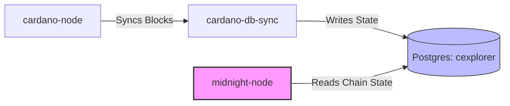
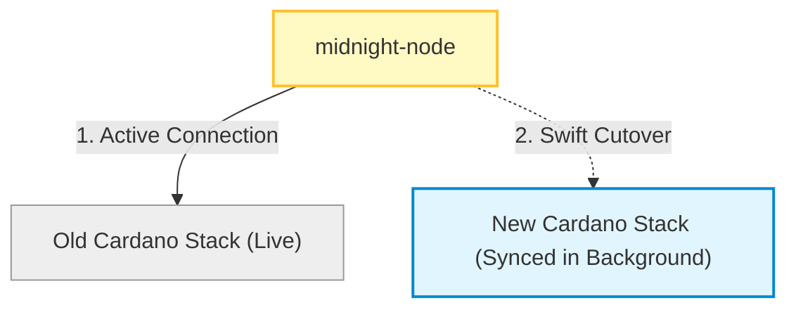

As a data-protection partner chain, Midnight is intrinsically tethered to Cardano. This close relationship provides robust security and interoperability, but it also means that when Cardano undergoes a major evolution, Midnight must move in lockstep.

With the Cardano network preparing for the **Van Rossem Hard Fork**, Midnight faces a classic infrastructure challenge: how do you upgrade a live blockchain without pulling the plug on the network?

Here is a high-level look at why Cardano hard forks require a unique approach from Midnight operators, and how the ecosystem reduces potential downtime.

## Why Cardano Hard Forks Matter to Midnight

To understand the upgrade process, you first have to understand the architecture. A Midnight node doesn't just run Midnight software; it relies on a local Cardano infrastructure stack consisting of `cardano-node`, `cardano-db-sync`, and a Postgres database (`cexplorer`).

The Midnight node constantly reads Cardano main-chain state from this Postgres database to to produce Midnight blocks, read partner chain contract events, and fetch NIGHT/ DUST generation UTXOs.

When a Cardano hard fork occurs:

* **The Protocol Shifts:** Pre-fork software cannot validate post-fork blocks.
* **The Chain Reaction:** If an operator's underlying `cardano-node` stops tracking the tip, `cardano-db-sync` stops feeding data to Postgres.
* **The Result:** The Midnight node goes down, stops producing blocks shortly after, or becomes a partner chain to the incorrect Cardano chain.

Therefore, every Midnight node operator must upgrade their entire Cardano stack for the  **Van Rossem hard fork** hard-fork.

## The Migration Dilemma

Upgrading a blockchain stack isn't as simple as clicking "update" and restarting an app. Major upgrades often introduce foundational data changes. For the Van Rossem fork, `cardano-node` transitions to a brand-new **LSM-tree ledger storage backend** (which drastically reduces steady-state RAM), while `cardano-db-sync` introduces entirely new ledger snapshot formats and schema migrations.

Processing these changes on mainnet-sized data is incredibly heavy, leading operators to choose between two distinctly different operational paths.

### Parallel Cardano Stack (Recommended)

Instead of tampering with the live, block-producing system, the operator builds a completely separate Cardano stack alongside the existing one.

* **How it works:** The new stack (`cardano-node` 11+, `cardano-db-sync` 13.7.0.5+, and Postgres 17) is provisioned and bootstrapped in the background. Testnets may take hours to replay, but it takes days to replay the Mainnet ledger and run schema migrations, but the live Midnight node remains untouched, happily producing blocks on the old stack.
* **The Cutover:** Once the new stack is fully synced to the live tip and soaked for stability, the operator executes a swift cutover. They gracefully redirect `midnight-node`, to point to the new Postgres instance that has the new database.

### Typical In-place Upgrade

The operator shuts down the live Midnight-node and upgrades the software directly on the existing host hardware.

Because the database formats have changed, the host must sit idle while it sequentially processes hours of disk-intensive ledger replays and single-threaded schema migrations.

:::important
Because the Van Rossem Hard Fork requires a state replay, operators must use the parallel Cardano stack method to avoid service downtime. Federated node operators, faucets, RPCs, and other critical services should follow this approach to minimize downtime.
:::

**The big takeaway:** Minimizing downtime isn't just about preserving an individual node's uptime metrics. It's about maintaining the health, throughput, and decentralized integrity of the entire Midnight Network while Cardano evolves beneath the surface.