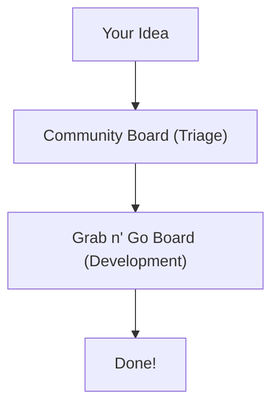

# Contribute to Midnight

Midnight documentation is open source and welcomes contributions from the community. Whether you're fixing a typo, improving an explanation, or adding new content, your help makes the docs better for everyone.

Every contribution, no matter how small, helps improve Midnight documentation for the entire community. Thank you for taking the time to contribute.

## Ways to contribute

### Quick edits

The fastest way to contribute is using the "Edit this page" button at the bottom of any documentation page.

1. Click **"Edit this page"**, located towards the end of each page.
2. Make your changes in the GitHub editor.
3. Create a pull request.

This method works great for:
- Fixing typos or grammatical errors
- Clarifying confusing explanations
- Updating outdated information
- Adding missing links

### Open an issue

Found a problem but not sure how to fix it? Open an issue if:

- You found incorrect or outdated information
- Something is confusing or unclear
- You have a suggestion for new content
- You discovered a broken link or code example

**How to open an issue:**

1. Go to the [Midnight documentation repository](https://github.com/midnightntwrk/midnight-docs)
2. Click the **Issues** tab
3. Click **New issue**
4. Choose the appropriate issue template.
5. Fill out the template with details.
6. Submit the issue


### Create a pull request

For larger contributions, create a pull request. Create a pull request (PR), if you are:

- Adding new documentation pages
- Making substantial revisions
- Contributing code examples
- Reorganizing content structure


#### How to create a pull request

1. **Fork the [repository](https://github.com/midnightntwrk/midnight-docs)**

2. **Clone the repository**
   ```bash
   git clone https://github.com/YOUR_USERNAME/midnight-docs.git
   cd midnight-docs
   ```

3. **Set up commit signing** (if not already configured)

   ```bash
   # Configure GPG signing
   git config --global user.signingkey YOUR_KEY_ID
   git config --global commit.gpgsign true
   
   # Or configure SSH signing
   git config --global gpg.format ssh
   git config --global user.signingkey ~/.ssh/id_ed25519.pub
   git config --global commit.gpgsign true
   ```

4. **Create a branch**

   ```bash
   git checkout -b fix/update-transfer-guide
   ```

5. **Make your changes**

   - Edit the relevant markdown files
   - Test your changes locally
   - Follow the style guide

6. **Commit your changes**

   ```bash
   git add .
   # Commits are automatically signed if you set commit.gpgsign true
   git commit -m "Fix code example in transfer guide"
      
   # Or manually sign individual commits with -S flag
   git commit -S -m "Fix code example in transfer guide"
   ```

7. **Push to your fork**

   ```bash
   git push origin fix/update-transfer-guide
   ```

8. **Create the pull request**

   - Click "Compare & pull request"
   - Fill out the PR template
   - Submit the PR


## Test your changes locally

Before submitting, test your changes locally to ensure they render correctly. 

### Setup

```bash
# Install dependencies
npm install

# Start the development server
npm run dev
```

The docs site will be available at `http://localhost:3000`.

:::note 
You can also preview changes, after your pull request is authorized by a Midnight member.
:::


### What to check

- [ ] All links work correctly
- [ ] Code blocks render properly
- [ ] Images display correctly
- [ ] Navigation works as expected
- [ ] No broken internal references
- [ ] Mobile view looks good


## Style guide

Follow the [style guidelines](/contribute/style-guide) to maintain consistency across the documentation.


### Add a new page

1. **Determine the section** - Where does this fit?
2. **Create the file** - Use kebab-case naming
3. **Add frontmatter** (if required by your framework)
4. **Write the content** - Follow the style guide
5. **Update navigation** - Add links to/from the page
6. **Test locally** - Verify everything works


### Add a new section

Creating a new top-level section requires:
1. Create the folder
2. Add an `index.md` overview page
3. Update the main `index.md` to link to the new section
4. Update the site navigation configuration


## Verified commits required

All pull requests to Midnight documentation must use verified commits. This ensures the authenticity and integrity of contributions.


### What are verified commits?

Verified commits are cryptographically signed to prove they came from you. They provide the following:

- **Security** - Prevents impersonation and unauthorized changes
- **Authenticity** - Proves commits come from the claimed author
- **Trust** - Builds confidence in the contribution chain
- **Compliance** - Meets security requirements for open source projects


### Set up commit signing

You can sign commits using GPG. GPG is the most common method.

#### GPG signing

**Step 1: Generate a GPG key**

   ```bash
   # Generate a new GPG key
   gpg --full-generate-key

   # When prompted:
   # - Choose RSA and RSA (default)
   # - Use at least 4096 bits
   # - Set expiration (1 year recommended)
   # - Enter your name and email (must match GitHub email)
   ```

**Step 2: Get your GPG key ID**

   ```bash
   # List your GPG keys
   gpg --list-secret-keys --keyid-format=long

   # Output will look like:
   # sec   rsa4096/3AA5C34371567BD2 2024-01-01 [SC]
   # Your key ID is: 3AA5C34371567BD2
   ```

**Step 3: Export your public key**

   ```bash
   # Export the public key (replace YOUR_KEY_ID)
   gpg --armor --export YOUR_KEY_ID
   ```

**Step 4: Add the key to GitHub**

   1. Copy the entire GPG key, including `-----BEGIN PGP PUBLIC KEY BLOCK-----` and `-----END PGP PUBLIC KEY BLOCK-----`
   2. Go to GitHub Settings → [SSH and GPG keys](https://github.com/settings/keys)
   3. Click **New GPG key**
   4. Paste your public key
   5. Click **Add GPG key**

**Step 5: Configure Git to sign commits**

   ```bash
   # Tell Git to use your GPG key (replace YOUR_KEY_ID)
   git config --global user.signingkey YOUR_KEY_ID

   # Sign all commits by default
   git config --global commit.gpgsign true

   # For Windows, you may need to set the GPG program
   git config --global gpg.program "C:\Program Files (x86)\GnuPG\bin\gpg.exe"
   ```

**Step 6: Test signing**

   ```bash
   # Make a test commit
   git commit -S -m "Test signed commit"

   # Verify it's signed
   git log --show-signature -1
   ```

### Sign commits in your PR

Once configured, your commits will be automatically signed.

**Making a signed commit:**

   ```bash
   # If you set commit.gpgsign true, all commits are signed automatically
   git commit -m "Fix typo in wallet guide"

   # Or manually sign individual commits
   git commit -S -m "Fix typo in wallet guide"
   ```

**Signing existing commits:**

If you already made commits without signing, you can re-sign them:

   ```bash
   # Re-sign the last commit
   git commit --amend --no-edit -S

   # Re-sign multiple commits (interactive rebase)
   git rebase -i HEAD~3 --signoff
   # In the editor, change 'pick' to 'edit' for commits to sign
   # Then for each commit:
   git commit --amend --no-edit -S
   git rebase --continue
   ```

**Force push the signed commits:**

   ```bash
   git push --force-with-lease origin your-branch-name
   ```

### Verify your commits on GitHub

After pushing, verify your commits are signed.

**Troubleshooting unverified commits:**

| Issue | Solution |
|-------|----------|
| Email mismatch | Ensure your Git email matches your GitHub email: `git config user.email` |
| Key not added to GitHub | Add your GPG/SSH key to GitHub Settings |
| Key expired | Generate a new key or extend expiration |
| `gpg: signing failed` | Ensure GPG agent is running: `gpgconf --launch gpg-agent` |
| Wrong key format | Verify you're using GPG or SSH format correctly |


### Get help with commit signing

If you have trouble setting up commit signing:

- [GitHub's commit signing documentation](https://docs.github.com/en/authentication/managing-commit-signature-verification)
- [GPG signing troubleshooting guide](https://docs.github.com/en/authentication/troubleshooting-commit-signature-verification)
- Ask on [Midnight Discord](https://discord.gg/midnight)
- Comment on your PR if you need help - maintainers can assist

## Community Hub

Midnight uses the [Community Hub](https://github.com/midnightntwrk/community-hub) to manage community-driven contributions across all projects, including documentation.

### What is the Community Hub?

The Community Hub is a collaborative platform that uses GitHub's built-in features (issues, projects, and automations) to efficiently triage ideas and turn them into actionable tasks.

**Use the Community Hub for:**
- **Content proposals** - Suggesting new articles, tutorials, or educational resources
- **Feature requests** - Proposing enhancements for tools and processes
- **Bug reports** - Reporting defects or unexpected behavior
- **dApp proposals** - Sharing visions for new decentralized applications

### How the workflow works



#### Stage 1: Community Board (Triage)

All new issues land here for initial review. The triage committee reviews for validity, clarity, and priority.

**Issue statuses:**
- **New** - Submitted and awaiting review
- **In Triage** - Being actively reviewed by the committee
- **Needs Discussion** - Requires more feedback or clarification
- **Rejected** - Out of scope or invalid (with explanation provided)

Once approved, issues get a `triaged` label and automatically move to the next stage.

#### Stage 2: Grab n' Go Board (Development)

This board contains approved, ready-to-work-on tasks - the community's backlog!

**Issue statuses:**
- **Ready** - Waiting for a contributor to claim (look for `good-first-issue` labels!)
- **In Progress** - A contributor is actively working on it
- **Done** - Complete and automatically closed when linked PR is merged

### Choose the right issue template

The Community Hub provides several templates to help categorize submissions:

| Template | Use for | Label applied |
|----------|---------|---------------|
| Content Proposal | New articles, tutorials, educational resources | `content` |
| Feature Request | New features or enhancements | `enhancement` |
| Bug Report | Defects, errors, unexpected behavior | `bug` |
| dApp Proposal | New dApps, integrations, improvements | `dapp-idea` |

**For documentation contributions specifically:**
- **Small fixes** (typos, clarifications) → Create PR directly in [midnight-docs](https://github.com/midnightntwrk/midnight-docs)
- **New content ideas** → Use Community Hub's Content Proposal template
- **Documentation bugs** → Use Community Hub's Bug Report template
- **Major restructuring** → Use Community Hub's Feature Request template

### Get involved with Community Hub

**Browse existing issues:**

Visit the [Community Hub repository](https://github.com/midnightntwrk/community-hub) to see:
- Active proposals and discussions
- Issues ready to be worked on (Grab n' Go board)
- Community priorities and voting
- What's being planned and shipped

**Submit your idea:**

1. Go to [Community Hub Issues](https://github.com/midnightntwrk/community-hub/issues/new/choose)
2. Choose the appropriate template
3. Fill out all required fields with clear details
4. Submit and wait for triage
5. Respond promptly to any feedback requests
6. Watch your issue progress through the workflow

**Claim an issue:**

1. Browse the [Grab n' Go Board](https://github.com/midnightntwrk/community-hub/projects)
2. Find an issue marked `Ready`
3. Comment "I'd like to work on this"
4. Wait for assignment or self-assign (if you have permissions)
5. Move the issue to `In Progress`
6. Create your PR and link it to the issue with "Closes #123" in the PR description

**Participate in discussions:**

Even if you're not submitting or claiming issues, you can:

- Comment on proposals to share your perspective
- Upvote issues you think are important
- Help clarify requirements or provide additional context
- Test proposed solutions and provide feedback

For more information about the Community Hub, including the Developer Relations vision and how it empowers developers, read **[Welcome to the Midnight Community Hub](https://docs.midnight.network/blog/community-hub)**

## Review process

After you submit a PR:

1. **Automated checks run** - Link checking, build verification, verified commits check
2. **Maintainer review** - A team member reviews your changes
3. **Feedback** - You may be asked to make adjustments
4. **Approval** - Once approved, your PR is merged
5. **Deployment** - Changes go live automatically

:::warning
Pull requests with unverified commits cannot be merged. You'll be asked to sign your commits before the pull request can proceed.
:::

### Review timeline

- Small fixes (typos, formatting): Usually within 3-5 days
- Medium changes (new sections): Usually within 7-10 days  
- Large contributions (new pages): Usually within 3-5 weeks

### What reviewers look for

- Accuracy of technical content
- Clarity and readability
- Consistency with existing docs
- Working code examples
- Proper formatting and style

## Get help

Need help with your contribution?

### Discord
Join the [Midnight Discord server](https://discord.gg/midnight) and ask in the `#documentation` channel.

### Documentation issues
Check existing [documentation issues](https://github.com/midnightntwrk/midnight-docs/issues) - your question might already be answered.

## Recognition

Contributors are recognized in:
- The repository's contributors list
- The community Discord with a "Contributor" role

## Code of conduct

All contributors must follow the [Midnight Code of Conduct](https://github.com/midnightntwrk/midnight-docs/blob/main/CODE_OF_CONDUCT.md).


## License

By contributing to Midnight documentation, you agree that your contributions will be licensed under the same license as the project (typically Apache 2.0 or MIT - check the repository for specifics).

---

## Quick links

- [Documentation repository](https://github.com/midnightntwrk/midnight-docs)
- [Open an issue](https://github.com/midnightntwrk/midnight-docs/issues/new)
- [View existing issues](https://github.com/midnightntwrk/midnight-docs/issues)
- [Midnight Discord](https://discord.gg/midnight)
- [Code snippets repository](https://github.com/midnightntwrk/midnight-wallet/tree/main/packages/docs-snippets)
