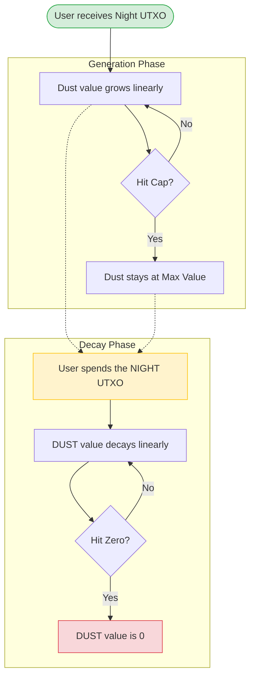
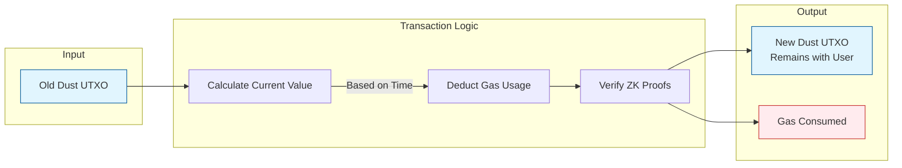
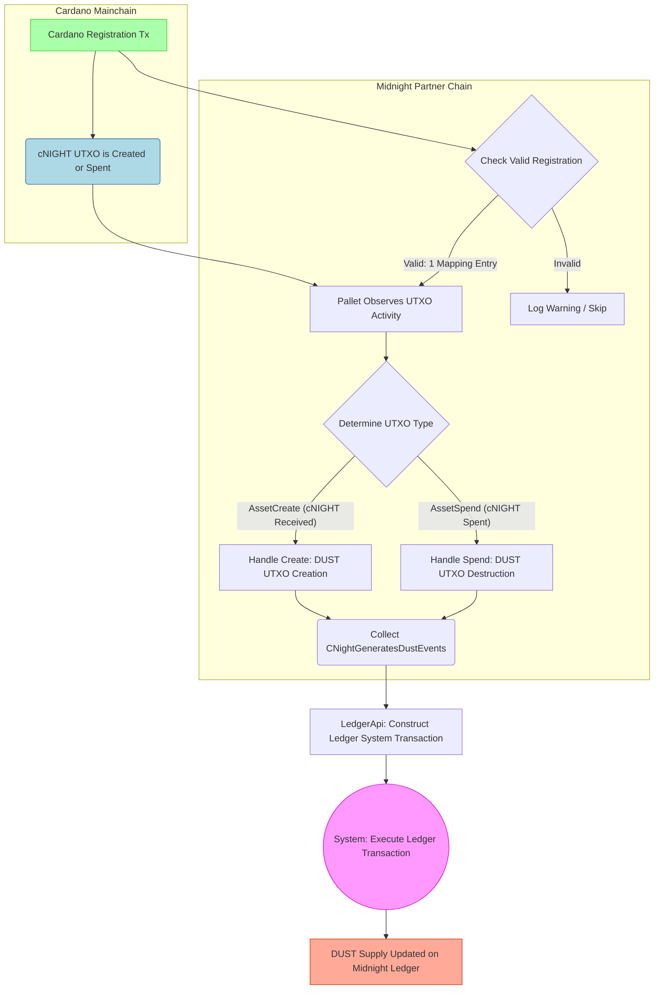

# DUST architecture

To understand the DUST architecture, it helps to use an analogy.

- **NIGHT**: Analogous to a *Solar Panel*. It is a valuable asset you hold.
- **DUST**: Analogous to *Electricity*. It represents the computational throughput or gas generated by the Solar Panel (NIGHT).
- **Usage**: You consume the Electricity (DUST) as gas to power your operations on the network.

Unlike standard cryptocurrencies where you have a static balance (for example, "I have 5 coins"), your DUST balance changes dynamically based on time and the status of your NIGHT tokens.

## DUST and network usage

Dust operates similarly to, but separately from, [Zswap](https://github.com/midnightntwrk/midnight-ledger/blob/main/spec/zswap.md). Dust operates as the resource credit system for Midnight. It function

- **Shielded and non-transferable**: DUST is a shielded capacity resource *only* for gas. You cannot transfer DUST between users.
- **Dynamic capacity**: The available gas in a DUST UTXO is dynamically computed and derived from an associated NIGHT UTXO.
- **Growth and decay**: The computed value grows over time to a maximum based on its NIGHT UTXO, and decays to zero after its NIGHT UTXO is spent.
- **Non-persistent**: The system may redistribute it on hardforks. 

:::note

The Midnight protocol reserves the right to modify DUST allocation rules, for example, for garbage collection.

:::

## Design overview

Similar to Zswap, DUST is built on hashes and the commitment/nullifier paradigm. Each DUST UTXO has a **commitment** inserted into an append-only Merkle tree upon creation, and a **nullifier** inserted into a nullifier set upon spending.

A DUST "spend" is a 1-to-1 "transfer" (Self-Spend):

- **Input**: 1 DUST UTXO (nullifier).
- **Output**: 1 DUST UTXO (commitment).
- **Fee**: A public declaration of fees paid.

It includes a zero-knowledge proof that:

- The input is valid and exists in the Merkle tree.
- The output value equals the *updated* input value minus the gas consumed.
- The output nullifier is correct, and the owner remains the same.

### Lifecycle: NIGHT generates DUST

Conceptually, your NIGHT UTXOs holding DUST generate DUST over time. As long as a backing NIGHT UTXO remains unspent, the associated DUST UTXO generates value up to a cap ($\rho$). Once the backing NIGHT is spent, the DUST UTXO "decays" to zero.

The following diagram illustrates this lifecycle:



The rate of generation depends on the amount of NIGHT held ($N$), the ratio of the DUST cap to NIGHT held ($\rho$), and "time to cap" ($\Delta$).

#### Spending rules

Spending rules are as follows:

* DUST may be spent multiple times; a new UTXO is always created, even if its value is zero.
* You can spend DUST during decay and it does not change the decay rate.
* Once the backing NIGHT is spent, DUST immediately starts to decay, even if it was still in the generation phase.
* If only a portion of your NIGHT is spent, the change creates a new NIGHT UTXO (starting fresh DUST generation), while the old DUST UTXO decays.

#### Implementation note

In practice, the system does not process value continuously. Instead, it calculates value *at the time of spend* using metadata ("generation info"):

- Creation time of the DUST UTXO.
- Creation time of the backing NIGHT UTXO.
- Deletion time of the backing NIGHT UTXO.

Since DUST and NIGHT use different keys, a **Registration Table** links NIGHT public keys to DUST public keys. A new DUST UTXO is created if and only if a NIGHT UTXO is created *and* its key has a table entry.

#### The grace period

Because DUST usage is shielded, the system computes value for the time of *transaction creation*. To account for network delays, the protocol defines a *DUST Grace Period* (for example, 3 hours). A transaction is accepted if its timestamp is within this window relative to the block time.

## Preliminaries

DUST uses ZK-friendly hashes:

```rust
type DustSecretKey = Fr;
type DustPublicKey = field::Hash<DustSecretKey>;
```

DUST UTXOs have owners, values, and *nonces*. Nonces evolve deterministically to enable wallet recovery.

  * **First DUST UTXO**: Nonce derived from the originating NIGHT UTXO intent hash.
  * **Subsequent DUST UTXOs**: Nonce derived from the previous sequence number and owner's secret key.

```rust
struct DustOutput {
    initial_value: u128,   // Specks at creation
    owner: DustPublicKey,
    nonce: field::Hash<(InitialNonce, u32, Fr)>,
    seq: u32,
    ctime: Timestamp,
}
```

State components include the commitment tree, nullifier set, and root history:

```rust
struct DustUtxoState {
    commitments: MerkleTree<DustCommitment>,
    commitments_first_free: usize,
    nullifiers: Set<DustNullifier>,
    root_history: TimeFilterMap<MerkleTreeRoot>,
}
```

## Initial DUST parameters

DUST and NIGHT use different units. These are their respective units and initial parameters:

* **NIGHT unit**: `Star (1 NIGHT = 10^6 Stars)`
* **DUST unit**: `Speck (1 DUST = 10^15 Specks)`

```rust
const INITIAL_DUST_PARAMETERS: DustParameters = {
    night_dust_ratio = 5_000_000_000; // 5 DUST per NIGHT
    generation_decay_rate = 8_267; // ~1 week generation time
    dust_grace_period = Duration::from_hours(3),
};
```

## DUST actions

Users influence DUST state via *Intents*.

```rust
struct DustActions<S, P> {
    spends: Vec<DustSpend<P>>,
    registrations: Vec<DustRegistration>,
    ctime: Timestamp,
}
```

### Registrations and fees

`DustRegistration` links a NIGHT key to a DUST key.

  * Registrations happen sequentially.
  * If a registration transaction uses NIGHT inputs that *were not yet generating DUST* (meaning that they had no previous registration), the system can "backdate" the registration to use the DUST those inputs *would have generated* to pay for the gas.

## Generate DUST

NIGHT inputs/outputs trigger updates to a *DUST Generation Tree*.

  * **DustGenerationInfo**: Stores the amount of NIGHT, the owner, and the `dtime` (deletion time).
  * **Address map**: Links NIGHT Addresses -\> DUST Addresses.

```rust
struct DustGenerationInfo {
    value: u128,
    owner: DustPublicKey,
    nonce: InitialNonce,
    dtime: Timestamp, // Set to MAX if Night is unspent
}
```

## DUST value and spends

The value of a DUST UTXO is calculated based on four linear time segments:

1. **Generating**: From creation to Capacity (or NIGHT spend).
2. **Constant (maximum)**: At capacity until NIGHT spend.
3. **Decaying**: From NIGHT spend until value hits zero.
4. **Constant (zero)**: Forever after.

### The spend transaction

A `DustSpend` consumes a UTXO and creates a new one with updated value minus fees.



The validation logic (`dust_spend_valid`) ensures:

  * `commitment_merkle_tree` contains the input.
  * `dust_spend.old_nullifier` matches the derived nullifier.
  * `updated_value` covers the fee.
  * `new_commitment` is correctly formed.

## Wallet recovery

Wallets recover funds by:

- Identifying owned NIGHT UTXOs (the start of the chain).
- Linearly searching for commitments corresponding to sequence numbers ($0, 1, 2...$).
- **Privacy**: Wallets should query commitments using bit-prefixes (stochastic filtering) rather than exact lookups to preserve privacy against the indexing service.

## The implementation

This section describes the implementation of DUST generation from Cardano NIGHT token.

### DUST generation from Cardano NIGHT token

The generation of *DUST* from the Cardano *NIGHT* token (cNIGHT) is a cross-chain process managed by the *Native Token Observation Pallet* (`pallet_cnight_observation`) on the Midnight partner chain.



### Summary of the full flow

1/ User registers their Cardano reward address + DUST public key on Cardano.

2/ Any time a cNIGHT UTXO is created (received) or spent (sent) by that address, the event is broadcast.

3–4/ The Midnight pallet validates that exactly one valid registration exists and observes the cNIGHT activity.

5–6/ It determines whether it’s a receive (creation) or send (destruction) of cNIGHT → generates corresponding DUST creation or destruction event.

7–9/ The system batches all events in a block, wraps them into a single system transaction via LedgerApi, and executes that transaction on the Midnight ledger.

→ **Final result**: DUST supply and UTXOs update 1:1 with cNIGHT movements on Cardano.

## Next steps

Now that you have an overview of DUST, checkout the [DUST spec](https://github.com/midnightntwrk/midnight-ledger/blob/main/spec/dust.md) on GitHub.

Get involved in [the code](https://raw.githubusercontent.com/midnightntwrk/midnight-node/refs/heads/main/primitives/mainchain-follower/src/data_source/cnight_observation.rs) on GitHub.
