Your device computes a Midnight transaction privately and proves it correct; only then does the network verify it publicly. Private data participates in the computation but never reaches the chain. What crosses the boundary is the public record of execution, plus zero-knowledge proofs that it is correct.

This page connects the whole journey in one diagram. Each stage links to a page that covers it in depth.

## The complete flow

```mermaid
flowchart TB
    accTitle: Midnight end-to-end architecture
    accDescr: A transaction flows from the private domain on your device (private state, witness functions, local circuit execution, proof generation, wallet balancing) across the network boundary (public transcripts, proofs, commitments, nullifiers) into the public domain (transaction pool checks, guaranteed and fallible execution, ledger state updates) and out through the indexer read layer.
    subgraph DEVICE["Your device: the private domain"]
        direction TB
        DAPP["DApp invokes a circuit"]
        PS[("Private state<br/>stored locally")]
        WIT["Witness functions<br/>supply private inputs"]
        CIRC["Circuit executes locally<br/>(compiled from Compact)"]
        PRIVT["Private transcript<br/>stays on the device"]
        PUBT["Public transcripts:<br/>the public record of execution<br/>(guaranteed and fallible sections)"]
        PROVE["Proof server generates the ZK proofs<br/>(you choose where it runs; a remote<br/>proof server sees your witness values)"]
        WALLET["Wallet balances the transaction:<br/>adds the coin inputs and outputs needed<br/>to cover value imbalance, and attaches<br/>the DUST fee payment"]
        DAPP --> CIRC
        PS --> WIT
        WIT --> CIRC
        WIT -.->|updates*| PS
        CIRC --> PRIVT
        CIRC --> PUBT
        PRIVT --> PROVE
        PUBT --> PROVE
        PROVE --> WALLET
    end

    TX["What crosses to the network:<br/>contract address and entry point,<br/>public transcripts, ZK proofs,<br/>commitments, nullifiers,<br/>encrypted coin info for recipients<br/>(output ciphertexts)<br/><br/>What never reaches the network:<br/>private state, witness values,<br/>secret keys, the private transcript"]

    subgraph NETWORK["Midnight network: the public domain"]
        direction TB
        POOL["Transaction pool:<br/>well-formedness check.<br/>Proofs verified against verifier keys<br/>stored on chain; balance checks"]
        EXEC["Block inclusion:<br/>guaranteed phase, then fallible phase.<br/>Impact VM confirms the declared<br/>effects match execution"]
        LEDGER[("Ledger state updates:<br/>contract public state,<br/>commitment Merkle tree grows,<br/>nullifiers inserted into the nullifier set,<br/>duplicates rejected (double-spend protection)")]
        POOL --> EXEC
        EXEC --> LEDGER
    end

    subgraph READ["Read layer"]
        direction TB
        IDX["Indexer serves public data:<br/>blocks, transactions,<br/>contract actions, public state"]
        VIEW["A wallet holding a viewing key<br/>can additionally decrypt<br/>its own shielded history"]
        IDX --> VIEW
    end

    WALLET ==> TX
    TX ==> POOL
    LEDGER --> IDX
    VIEW -.->|"query results"| DAPP
```

\* The updated private state persists on the device only after the transaction succeeds.

## What each layer can and cannot see

| Layer | Can see | Cannot see |
|---|---|---|
| Chain observer (anyone) | Contract address, which circuit the transaction invoked, public transcripts, ledger operation arguments, disclosed values, commitments, nullifiers, block timing | Witness return values (unless disclosed into a public position), private state, internal computation, the value inserted into a Compact `MerkleTree` (guessable if low entropy), which commitment a given nullifier spends |
| Node (validator) | Same as a chain observer, plus mempool timing | Same as a chain observer |
| Indexer | Everything on chain (it indexes public data) | Private state, witness values; it cannot open commitments |
| Indexer, with your viewing key | Your own shielded transaction history (decrypt-only access; the indexer operator learns it too) | Other users' shielded data; a viewing key cannot spend or sign |
| Proof server | Everything in the proof request, including witness values. It is a trust boundary: run your own; with wallet-delegated proving, the proving step moves to whatever proof server the wallet uses | Nothing; it sees the full request |

## Go deeper into each stage

- Transaction anatomy, offers, and binding: [Building blocks](./building-blocks)
- How a contract splits into local, circuit, and ledger parts, and what a transcript is: [Smart contracts](./smart-contracts)
- Well-formedness, the guaranteed and fallible phases, and ledger state updates: [Transaction semantics](./semantics)
- Commitments, nullifiers, and the techniques that keep data private: [Keeping data private](./keeping-data-private)
- How transactions move through the node: [Transactions on the network](../network-architecture/transactions)
- Exactly what is visible on chain, and the proof server and indexer trust boundaries: [Security and best practices](../../guides/security-best-practices)
- The same flow from the SDK's point of view, provider by provider: [Midnight.js](/sdks/official/midnight-js)
