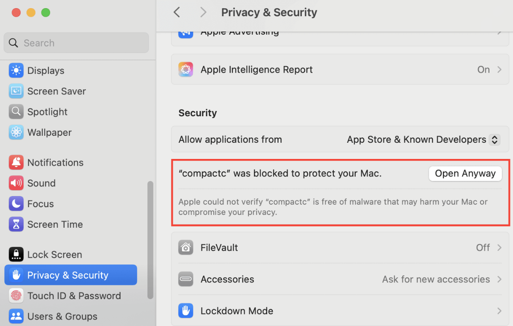

import Step, { StepsProvider } from "@site/src/components/Step/Step";

# Midnight Preview Network developer onboarding 

This guide helps existing DApp developers migrate from testnet-02 to the Preview network using the new midnight-js v3.0.0 SDK.

The v3.0.0 release introduces significant breaking changes to improve security, transaction handling, and developer experience. This document provides everything you need to update your applications.

:::note
This guide assumes familiarity with Midnight development. If you're new to Midnight, please refer to the [getting started documentation](./getting-started) first.
:::

## What's new in Preview
The Preview network and midnight-js v3.0.0 introduce the following major changes:

### Token model changes
| Token | Purpose |
|-------| ------- |
| NIGHT | Primary unshielded (public) token |
| DUST  | Transaction fee resource |

- Transactions are paid with DUST.
- Holding NIGHT generates DUST.
- Your wallet must designate DUST production to an address (usually your own).
- Your wallet now has three addresses: Shielded, Unshielded, and DUST.

### SDK breaking changes
- **LevelPrivateStateProvider**: Must provide `walletProvider` or `privateStoragePasswordProvider`.
- **Async transactions**: `submitTx` now returns `Promise<TransactionId>`.
- **WalletProvider.balanceTx**: Returns discriminated union (BalancedProvingRecipe).
- **Contract calls**: All contract calls now return` Promise<R>`.
- **ZswapOffer**: Empty offers return `undefined`.
- **networkId**:  Changed from enum to string literal.

### New features
- Configurable password provider for encrypted storage
- Async transaction handling
- AES-256-GCM storage encryption
- BalancedProvingRecipe types (3 discriminated types)
- Compact compiler 0.27.0 with .js output
- Fixed ESM/CJS dual package support
- Unshielded token support (NIGHT)
- High-level transaction functions (submitDeployTx, submitCallTx)
- Transaction TTL configuration

## Prerequisites

Before migrating to the preview environment, here's the minimum software versions that you need installed on your machine.

| Software | Version | Verification command |
|----------|---------|--------------------- |
| Node.js  | 22.x or higher | `node --version` |
| TypeScript | 5.0 or higher | `tsc --version` |
| Compact Compiler | 0.27.0 or higher | `compactc --version` |
| Docker | Latest | `docker --version` |


## Install the Compact compiler

Compact 0.27.0 is required for Preview network contracts. The compiler now generates `.js` files instead of `.cjs`.
:::warning
The standard `compact update` command will not work for this version. You must download and set it up manually.
:::

### Download Compact

Download the Compact 0.27.0 binaries from the [prerelease repository](https://github.com/midnightntwrk/compact/tree/main/prerelease).
 
After downloading, add the `compactc` binary to your `PATH`.

Then verify the installation using the command:

```shell
compactc --version
# Should output: 0.27.0
```

:::note
macOS users may encounter issues when installing the binary. See the [troubleshooting section](#unsigned-binary-permissions-macos) for details on how to resolve this issue.
:::

### Contract export changes
Update your contract imports to use the new `.js` extension:

```typescript
// OLD (v2.1.0)
export * as Counter from "./managed/counter/contract/index.cjs";

// NEW (v3.0.0)
export * as Counter from "./managed/counter/contract/index.js";
```

## Network configuration

This section highlights changes to the network configuration.

| Service | Endpoint |
| ------- | -------- |
| RPC Node (wss/https) | `rpc.preview.midnight.network` |
| Indexer (wss/https) | `indexer.preview.midnight.network/api/v3/graphql` |
| Faucet | https://faucet.preview.midnight.network |
| Proof Server | `http://localhost:6300` (local) |

### Network ID
The `networkId` type changed from `enum` to `string` in v3.0.0:

```typescript
// OLD (v2.1.0)
import { NetworkId } from '@midnight-ntwrk/midnight-js-types';
const config = { networkId: NetworkId.Testnet };

// NEW (v3.0.0) — use string literals
const config = { networkId: 'preview' };
```

Here is the list of supported `networkId` values:
- `'mainnet'` — Production network
- `'testnet-02'` — Public testnet
- `'preview'` — Preview network
- `'devnet'` — Development network
- `'undeployed'` — Local testing

### Proof server setup
Run the proof server locally using Docker:

```shell
docker run -p 6300:6300 midnightnetwork/proof-server:6.1.0-alpha.6 \
  -- midnight-proof-server --network preview
```

You'll need to keep this terminal running while developing. The proof server must be available before deploying contracts or submitting transactions.

## Package dependencies
Update your `package.json` with the following dependencies for Preview network.

### Core SDK packages

```json
{
  "@midnight-ntwrk/compact-runtime": "0.11.0-rc.1",
  "@midnight-ntwrk/midnight-js-contracts": "3.0.0-alpha.11",
  "@midnight-ntwrk/midnight-js-http-client-proof-provider": "3.0.0-alpha.11",
  "@midnight-ntwrk/midnight-js-indexer-public-data-provider": "3.0.0-alpha.11",
  "@midnight-ntwrk/midnight-js-level-private-state-provider": "3.0.0-alpha.11",
  "@midnight-ntwrk/midnight-js-network-id": "3.0.0-alpha.11",
  "@midnight-ntwrk/midnight-js-node-zk-config-provider": "3.0.0-alpha.11",
  "@midnight-ntwrk/midnight-js-types": "3.0.0-alpha.11",
  "@midnight-ntwrk/midnight-js-utils": "3.0.0-alpha.11"
}
```

### Ledger package

```json
{
  "@midnight-ntwrk/ledger-v6": "6.1.0-alpha.6"
}
```

### Wallet SDK packages (for lower level Wallet primitives)

```json
{
  "@midnight-ntwrk/wallet-sdk-abstractions": "1.0.0-beta.9",
  "@midnight-ntwrk/wallet-sdk-dust-wallet": "1.0.0-beta.10",
  "@midnight-ntwrk/wallet-sdk-facade": "1.0.0-beta.12",
  "@midnight-ntwrk/wallet-sdk-hd": "3.0.0-beta.7",
  "@midnight-ntwrk/wallet-sdk-shielded": "1.0.0-beta.11",
  "@midnight-ntwrk/wallet-sdk-unshielded-wallet": "1.0.0-beta.13"
}
```

### Install the dependencies
After updating the `package.json` file, you can now re-install the packages. First, remove the node_modules folder using the command below:
```shell
# Clean install recommended
rm -rf node_modules package-lock.json
```

Then, run the command below to install the packages:
```shell
npm install
```

## Wallet and transaction API
This section covers the v3.0.0 API surface for providers, transaction handling, and private state storage.

### Provider interface
DApps interact with the wallet through providers.

```typescript
interface MidnightProviders<ICK, PSI, PS> {
  walletProvider: WalletProvider;
  midnightProvider: MidnightProvider;
  publicDataProvider: PublicDataProvider;
  privateStateProvider: PrivateStateProvider<PSI, PS>;
  proofProvider: ProofProvider<ICK>;
  zkConfigProvider: ZKConfigProvider<ICK>;
  loggerProvider?: LoggerProvider;
}
```

For complete details, refer to the [types reference](https://github.com/midnightntwrk/midnight-js/blob/main/packages/types/src/providers.ts).

### WalletProvider interface
The wallet interface used by Midnight.js for keys and transaction balancing:

```typescript
interface WalletProvider {
  getCoinPublicKey(): string;
  getEncryptionPublicKey(): string;
  balanceTx(
    tx: UnprovenTransaction,
    newCoins?: ShieldedCoinInfo[],
    ttl?: Date
  ): Promise<BalancedProvingRecipe>;
}
```

### BalancedProvingRecipe types
The `balanceTx` method returns a discriminated union of three types:

```typescript
type TransactionToProve = {
  readonly type: 'TransactionToProve';
  readonly transaction: UnprovenTransaction;
};

type BalanceTransactionToProve<TTransaction> = {
  readonly type: 'BalanceTransactionToProve';
  readonly transactionToProve: UnprovenTransaction;
  readonly transactionToBalance: TTransaction;
};

type NothingToProve<TTransaction> = {
  readonly type: 'NothingToProve';
  readonly transaction: TTransaction;
};

type BalancedProvingRecipe = 
  | TransactionToProve
  | BalanceTransactionToProve<UnprovenTransaction | FinalizedTransaction>
  | NothingToProve<UnprovenTransaction | FinalizedTransaction>;
```

### Canonical transaction flow
Here's how to handle all three recipe types when processing transactions:

```typescript
const recipe = await walletProvider.balanceTx(unprovenTx, newCoins, ttl);

if (recipe.type === 'TransactionToProve') {
  // Transaction needs proving
  const provenTx = await prover.prove(recipe.transaction);
  await midnightProvider.submitTx(provenTx);
  
} else if (recipe.type === 'BalanceTransactionToProve') {
  // Transaction needs balancing and proving
  const provenTx = await prover.prove(recipe.transactionToProve);
  await midnightProvider.submitTx(provenTx);
  
} else {
  // NothingToProve — ready to submit directly
  await midnightProvider.submitTx(recipe.transaction);
}
```

### Async transaction submission
Transaction submission is now asynchronous:
```typescript
interface MidnightProvider {
  submitTx(tx: FinalizedTransaction): Promise<TransactionId>;
}

// Usage
const txId = await midnightProvider.submitTx(transaction);
console.log(`Transaction submitted: ${txId}`);
```

### Transaction TTL (optional)
Configure transaction time-to-live for expiry management:

```typescript
// Set 10-minute TTL
const ttl = new Date(Date.now() + 10 * 60 * 1000);
const recipe = await walletProvider.balanceTx(unprovenTx, newCoins, ttl);

// No TTL (default behavior)
const recipe = await walletProvider.balanceTx(unprovenTx);
```

### High-level transaction functions (recommended)
Use the simplified transaction functions that handle proving internally:

```typescript
import { submitDeployTx, submitCallTx } from '@midnight-ntwrk/midnight-js-contracts';

// Deploy a contract
const deployResult = await submitDeployTx(providers, {
  contract: myContract,
  initialState: { balance: 0n }
});

// Call a contract circuit
const callResult = await submitCallTx(providers, {
  contract: myContract,
  circuit: 'transfer',
  args: [fromAddress, toAddress, amount]
});

console.log('Transaction ID:', callResult.txId);
```

### Private state storage (LevelDB)
Encrypted local persistence for contract private state. You must provide either `walletProvider` or `privateStoragePasswordProvider`.

```typescript
import { LevelPrivateStateProvider } from '@midnight-ntwrk/level-private-state-provider';

// Option A: Derive encryption from wallet
const privateStateProvider = new LevelPrivateStateProvider({
  midnightDbName: 'my-dapp-db',
  privateStateStoreName: 'private-states',
  signingKeyStoreName: 'signing-keys',
  walletProvider: myWalletProvider
});

// Option B: Explicit password provider (recommended)
const privateStateProvider = new LevelPrivateStateProvider({
  midnightDbName: 'my-dapp-db',
  privateStateStoreName: 'private-states',
  signingKeyStoreName: 'signing-keys',
  privateStoragePasswordProvider: async () => process.env.STORAGE_PASSWORD!
});
```

## Run the Counter example on Preview
Build and run the sample Counter DApp on the Preview network.
<StepsProvider>
<Step>
Clone and install the Counter DApp locally:
```shell
git clone https://github.com/midnightntwrk/example-counter.git
cd example-counter && npm install
```
</Step>
<Step>
After installing the dependencies, compile the contract.
```shell
cd contract
npm run compact
npm run build
cd ..
```
This generates TypeScript bindings in the `managed/` directory.

</Step>
<Step>
Build the Command Line Interface (CLI).
```shell
cd counter-cli && npm run build
```
</Step>
<Step>
Start the proof server in a separate terminal using the command:
```shell
docker run -p 6300:6300 midnightnetwork/proof-server:6.1.0-alpha.6 \
  -- midnight-proof-server --network preview
```
:::note
You'll need to keep the proof server running while developing.
:::
</Step>
<Step>
Run the application.
```shell
npm run preview
```
</Step>
<Step>
Now, you'll need to create and fund your wallet. The CLI will prompt you to either:
- Generate a fresh wallet (requires funding).
- Enter an existing 24-word mnemonic.
- Use a mnemonic from your `.env` file.

For a new wallet, copy the displayed address and request test tokens from the [preview faucet](https://faucet.preview.midnight.network).

You might need to wait two to three minutes for tokens to arrive.

:::info[]
New wallets must delegate DUST production. The easiest way is through the Midnight Lace Preview wallet.
:::

</Step>
<Step>
Deploy and interact with the DAapp. You can use the CLI menu to:
- **Deploy**: Create a new counter contract.
- **Increment**: Increase the counter value.
- **Display**: View the current counter state.
</Step>
</StepsProvider>

## Migration checklist
Use this checklist to ensure you've completed all migration steps.
### Update dependencies
- [ ] Remove old `package-lock.json` and `node_modules`.
- [ ] Update `package.json` with new SDK packages (v3.0.0-alpha.11).
- [ ] Add `@midnight-ntwrk/ledger-v6` (6.1.0-alpha.6).
- [ ] Add wallet SDK packages (optional).
- [ ] Run `npm install`.

### Update configuration
- [ ] Change `networkId` from enum to string literal (`'preview'`).
- [ ] Update endpoints to Preview URLs.
- [ ] Add `STORAGE_PASSWORD` to `.env` file.

### Update LevelPrivateStateProvider
- [ ] Add `privateStateStoreName` to config.
- [ ] Add `signingKeyStoreName` to config.
- [ ] Add `walletProvider` OR `privateStoragePasswordProvider`.

### Update transaction code
- [ ] Add `await` to all `midnightProvider.submitTx()` calls.
- [ ] Add `await` to all contract calls.
- [ ] Handle all three `BalancedProvingRecipe` types.
- [ ] Update function signatures to return `Promise<T>`.

### Update ledger imports
- [ ] Replace `@midnight-ntwrk/ledger` with `@midnight-ntwrk/ledger-v6`.
- [ ] Update `nativeToken()` to `ledger.nativeToken().raw`.

### Update contract exports
- [ ] Change   imports to `.js` in contract index exports.

### Update Docker commands
- [ ] Update proof server image to `6.1.0-alpha.6`.
- [ ] Change `--network` flag from `testnet` to `preview`.

### Handle ZswapOffer changes
- [ ] Add undefined checks to all `zswapStateToOffer()` calls.

### Test
- [ ] Recompile contracts with `npm run compact`.
- [ ] Build CLI application.
- [ ] Start proof server with new image.
- [ ] Run application and verify functionality.
- [ ] Test transaction submission.
- [ ] Test contract calls.
- [ ] Test storage encryption.

## Troubleshooting
This sections covers some of the issues you'll likely encounter when migrating from testnet-02 to preview and how to resolve them.

### Unsigned binary permissions (macOS)
**Problem**: On macOS, the binaries are unsigned and will be blocked initially.

**Solution**: When you see a dialog stating the binary "cannot be opened", click **Done** to proceed. Do not select the Move to Bin option.


After that, open System Settings and navigate to **Privacy & Security**. Scroll to the bottom where you'll see: "compactc" was blocked to protect your Mac. Click **Open Anyway** to proceed.



Repeat the same process for the `zkir` binary. This binary is invoked automatically during key generation.

### Type errors after upgrade
**Problem**: TypeScript compilation fails with type errors.

**Solution**: Ensure you're using TypeScript 5.0+ and all Midnight packages are v3.0.0-alpha.11.
```shell
npm ls @midnight-ntwrk/midnight-js-types
```

### Missing await on submitTx
**Problem**: `submitTx` returns a Promise instead of `TransactionId`.

**Solution**: Add `await` to your transaction:

```typescript
// Before (v2.1.0)
const txId = midnightProvider.submitTx(tx);

// After (v3.0.0)
const txId = await midnightProvider.submitTx(tx);
```

### Storage decryption fails
**Problem**: Cannot access encrypted private state.

**Solution**: Ensure password provider returns a consistent password across sessions.

### Module resolution errors
**Problem**: Cannot find module or ESM/CJS conflicts.

**Solution**:
```shell
rm -rf node_modules package-lock.json
npm install
```

Update bundler configuration for ESM/CJS if needed.

### ZswapOffer undefined
**Problem**: `Cannot read property 'inputs' of undefined`

**Solution**: Check for undefined:

```typescript
const offer = zswapStateToOffer(state, encKey);
if (!offer) {
  console.log('Empty Zswap state');
  return;
}
```

### Contract calls not awaited
**Problem**: Contract call returns Promise object instead of result.

**Solution**: Add `await` to contract calls:

```typescript
// Before (v2.1.0)
const result = myContract.call.transfer(from, to, amount);

// After (v3.0.0)
const result = await myContract.call.transfer(from, to, amount);
```

## Resources
- **Documentation**
  - [Midnight developer docs](https://docs.midnight.network/)
  - [Midnight.js GitHub repository](https://github.com/midnightntwrk/midnight-js)
  - [API Reference](https://github.com/midnightntwrk/midnight-js/tree/main/packages/types)

- **Tools**
  - [Preview Faucet](https://faucet.preview.midnight.network/)
  - [Lace Midnight Preview wallet (Chrome)](https://chromewebstore.google.com/detail/lace-midnight-preview/hgeekaiplokcnmakghbdfbgnlfheichg)
  - [Compact Compiler 0.27.0](https://github.com/midnightntwrk/compact/tree/main/prerelease)

- **Support**
  - [GitHub issues](https://github.com/midnightntwrk/midnight-js/issues)
  - [GitHub discussions](https://github.com/midnightntwrk/midnight-js/discussions)
  - [Forum](https://forum.midnight.network/)

## Appendix: Complete migration example
Here's an example of the before-and-after preview migration snippets for a contract.

### Before (v2.1.0)
```typescript
import { LevelPrivateStateProvider } from '@midnight-ntwrk/level-private-state-provider';
import { NetworkId } from '@midnight-ntwrk/midnight-js-types';

const provider = new LevelPrivateStateProvider({
  midnightDbName: 'midnight-db'
});

const config = {
  networkId: NetworkId.Testnet
};

function transfer(from: string, to: string, amount: bigint) {
  const recipe = walletProvider.balanceTx(unprovenTx);
  const proof = prover.prove(recipe);
  const tx = createTransaction(proof);
  const txId = midnightProvider.submitTx(tx);
  return txId;
}
```

### After (v3.0.0)
```typescript
import { LevelPrivateStateProvider } from '@midnight-ntwrk/level-private-state-provider';
import { submitCallTx } from '@midnight-ntwrk/midnight-js-contracts';

const provider = new LevelPrivateStateProvider({
  midnightDbName: 'midnight-db',
  privateStateStoreName: 'private-states',
  signingKeyStoreName: 'signing-keys',
  privateStoragePasswordProvider: async () => process.env.STORAGE_PASSWORD!
});

const config = {
  networkId: 'preview'
};

async function transfer(
  from: string,
  to: string,
  amount: bigint
): Promise<TransactionId> {
  const result = await submitCallTx(providers, {
    contract: myContract,
    circuit: 'transfer',
    args: [from, to, amount]
  });
  
  return result.txId;
}

```
