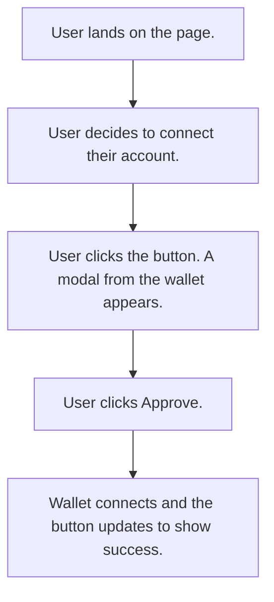

import Step, { StepsProvider } from "@site/src/components/Step/Step";

# Set up a wallet connect button

A wallet connect button is required for actions such as initiating transfers or interacting with smart contracts like lending protocols. 

You can add a wallet connect button in a Next.js app using the Midnight dapp connector API and the Lace wallet.
	
Establishing a connection enables secure account access and transaction prompts from the browser.

:::warning
- Midnight Network works on Mac or Linux system.
- [Lace Wallet](https://chromewebstore.google.com/detail/lace-midnight-preview/hgeekaiplokcnmakghbdfbgnlfheichg) must be installed in Chrome
:::

Start from a new Next.js project.

Learn more about the framework in the [documentation](https://nextjs.org/).


# Creating a wallet connect component

<div align="center">

</div>

## Running the UI

<StepsProvider>
    <Step>Start the development server. Run npm run dev at the root of the project.</Step>
    <Step>The website  appears in the browser at http://localhost:3000/</Step>
</StepsProvider>

## Creating the component

<StepsProvider>
    <Step>Install the DApp connector api package to access the wallet’s state, and wallet interactions. Run: `npm install @midnight-ntwrk/dapp-connector-api`</Step>
    <Step>Create the components folder in the app folder.</Step>
    <Step>Create a component named `ConnectWalletButton.tsx`</Step>
    <Step>Implement a basic button with minimal styling that prompts your Lace wallet to connect to your application.</Step>

```ts
"use client"; // Next.js directive for client-side rendering
import "@midnight-ntwrk/dapp-connector-api"; // Import Midnight wallet connector

export default function ConnectWalletButton() {

    const handleClick = async () => {
        try {
            const api = await window.midnight.mnLace.enable(); // Prompt Lace wallet to connect
        } catch (error) {
            console.log("failed to connect", error); // Log errors
        }
    };

    return (
        <nav className="flex items-center w-full">
            <div className="mx-2 flex gap-4" /> {/* Spacer */}
            <button
                type="button"
                onClick={handleClick} // Call connect handler
                className="ml-auto m-2 px-2 py-1 rounded-2xl bg-black text-white"
            >
Connect Wallet 
            </button>
        </nav>
    );
}
```
</StepsProvider>

To use a different wallet, replace `mnLace` with that wallet’s namespace exposed on window.midnight.

For more information on the Dapp Connector API, see the [documentation](https://docs.midnight.network/develop/reference/midnight-api/dapp-connector/).

## View the component

<StepsProvider>
    <Step>In layout.tsx, import the ConnectWalletButton component: `import ConnectWalletButton from "./components/ConnectWalletButton";`</Step>
    <Step>Render it near the top of the layout body: `<ConnectWalletButton />`</Step>
    <Step>Refresh the browser. The Connect Wallet button is displayed in the top right corner of the screen.</Step>
</StepsProvider>

## Connect the wallet

<StepsProvider>
    <Step>Click Connect Wallet.</Step>
    <Step>A Lace connection modal appears. Click Authorize.</Step>
    <Step>Choose Always  or Only once, to select your preferred access.</Step>
</StepsProvider>

The wallet is now connected to the website.

## Verify wallet cnnection in wallet

<StepsProvider>
    <Step>Open the Lace wallet extension.</Step>
    <Step>Click the desired Lace wallet in the top right corner of the site and click  Settings.</Step>
    <Step>Click Authorized DApps.</Step>
    <Step>If the wallet is connected to the website, http://localhost:3000 appears in the authorized DApps panel.</Step>
</StepsProvider>

The Lace wallet is now connected to the website and can be prompted to process transactions, and read personal data.

## Managing state

Reloading an entire page to reflect that a wallet is connected is inefficient. The connection status can instead be reflected directly in the button component by managing its state. The button should display “Connect Wallet” before authorization, and switch to “Connected” once the wallet is successfully enabled.

This is done by using React’s `useState` hook. The essential pieces look like this:
```ts
// Import the React Hook that tracks state inside the component
import { useState } from "react";

// Declare a new state variable to track connection status
const [connected, setConnected] = useState(false);

// If the wallet connection succeeded, update the state to "connected"
if (api) setConnected(true);

// Display "Connected" if the state is true, otherwise show "Connect Wallet"
{connected ? "Connected" : "Connect Wallet"}
```

All of these lines are part of the button component. The complete example is included below to show how they fit together.

```ts
import { useState } from "react"; // React hook for state

export default function ConnectWalletButton() {
    const [connected, setConnected] = useState(false); // Track wallet connection status
    const handleClick = async () => {
        try {
            const api = await window.midnight.mnLace.enable(); // Prompt Lace wallet to connect
            if (api) setConnected(true); // Update state if connection succeeds
        } catch (error) {
            console.log("an error occurred", error); // Log errors
        }
    };

    return (
        <nav className="flex items-center w-full">
            <div className="mx-2 flex gap-4" /> {/* Spacer */}
            <button
                type="button"
                onClick={handleClick} // Call connect handler
                className="ml-auto m-2 px-2 py-1 rounded-2xl bg-black text-white"
            >
                {connected ? "Connected" : "Connect Wallet"} {/* Change text based on state */}
            </button>
        </nav>
    );
}

```

Navigate to the browser and connect a wallet if not connected. The button will update to show Connected. Now the application will update the UI when a user connects.