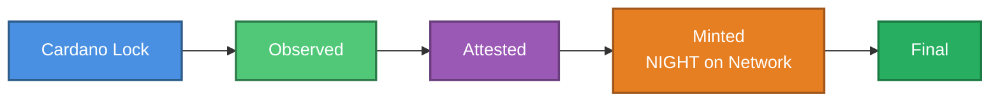

# Bridge builder integration

Guidance for third-party builders integrating with the protocol bridge.

## Canonical state flow (high level)

- **Cardano lock:** Source assets are locked on Cardano.
- **Observed:** The bridge has detected and indexed the lock.
- **Attested:** Required attestations/mappings are produced and verified.
- **Unlocked (NIGHT on the Network):** Corresponding NIGHT is unlocked on Midnight.
- **Final:** All windows satisfied (e.g., reorg/finality); state is stable.

:::note
Show a **“Finality window in progress”** indicator between *Unlocked* and *Final*.
:::

## Interfaces and events

- Observe Cardano lock transactions relevant to the bridge.
- Track attestation / mapping artifacts and their validity.
- Subscribe to unlock events for NIGHT on the Network (destination chain).
- Expose a read API that returns the current canonical state from the flow above.

## Minimum UX guidance

- Surface states exactly as: **Locked → Observed → Attested → Unlocked → Final**.
- Before **Final**, display a persistent banner: *“Finality window in progress—status may change.”*
- Include slot/epoch (or block) references and timers to the end of the window.
- Provide clear retry/error states for missing or invalid attestations.

## Patterns

- **Wrapped-asset UX:** show pending/finalized states with reorg tolerance; disable irreversible actions until **Final**.
- **Reconciliation:** periodic scans to reconcile your off-chain cache with canonical on-chain status (both chains).

## Best practices

- Never infer finality from a single signal; always respect the **finality window**.
- Make user-visible status mirror protocol phases and block heights/slots.
- Idempotent processing: re-handle duplicated events safely.

## Security considerations

- Validate **policy IDs**, **mapping rules**, and datum formats.
- Strictly parse attestations; unknown/extra fields ⇒ **non-authoritative**.
- Pin dependencies and verify message signatures where applicable.

## Developer checklist

- [ ] Map internal enums to **Locked/Observed/Attested/Unlocked/Final**.
- [ ] Implement “Finality window in progress” UI before **Final**.
- [ ] Add reconciliation jobs for both Cardano and Midnight views.
- [ ] Log and surface block/slot anchors for auditability.
