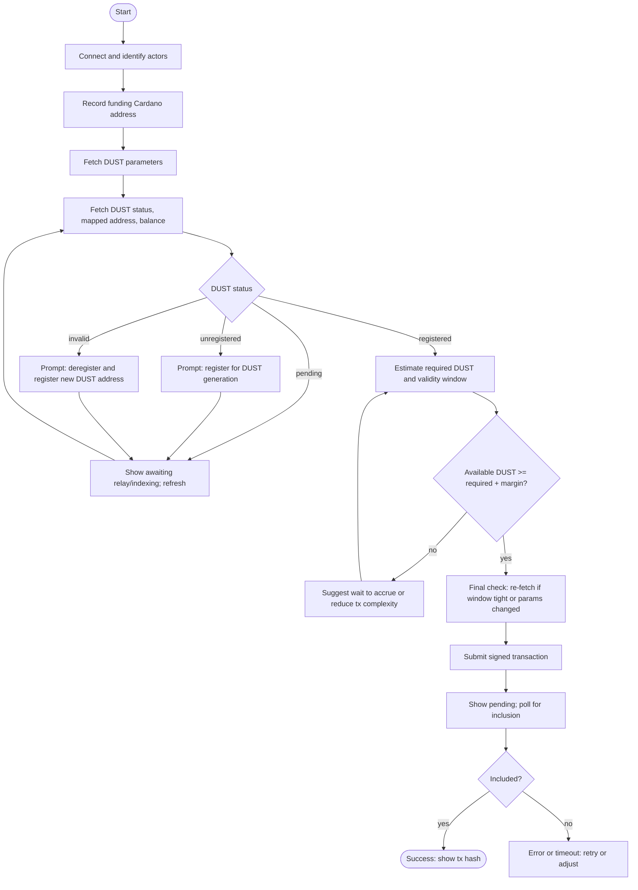

# Building DApps with DUST

Guidance for using DUST as the execution resource in DApps.

## Paying fees in DUST

- Transactions consume DUST Ensure the sender has enough DUST under the current parameters (generation, decay, caps).

## Estimating cost

- Do not hardcode constants. Always query live parameters (generation, decay, caps).
- Prefer node/SDK estimators where available; otherwise use a short **“estimate → submit within validity window”** flow.
- Over-pay fees to ensure transactions get included even if fees are adjusted before inclusion in a block.

## Wallet connection and checks

- Before submit, verify:
  - **Registration state** and **mapped DUST address** (when relevant).
  - **Available DUST** ≥ estimated requirement (with a safety margin).
  - Provide a remediation path if prerequisites aren’t met.

## End-to-end flow (no code)

### Connect and identify actors
<StepsProvider>
  <Step>
    Use the [CIP-30](https://cips.cardano.org/cips/cip30/) dApp Connector API to connect to the user’s Cardano wallet.  
    This enables your dApp to read wallet addresses and sign transactions for locking tokens.
  </Step>
  <Step>
    Record the selected Cardano address that funds the bridge or transaction.
  </Step>
  <Step>
    (Optional) If sending to another user, collect the recipient’s Midnight account address.
  </Step>
  <Step>
    If the user is sending to themselves, derive or use their own linked Midnight address.
  </Step>
</StepsProvider>

### Fetch live parameters and status
<StepsProvider>
  <Step>Retrieve current DUST parameters (generation, decay, caps).</Step>
  <Step>Fetch the wallet’s DUST status: <em>unregistered</em>, <em>pending</em>, <em>registered</em>, or <em>invalid</em>, plus the mapped DUST address and current DUST balance.</Step>
</StepsProvider>

### Gate on prerequisites
<StepsProvider>
  <Step>If <strong>unregistered</strong>: direct the user to <em>Register for DUST generation</em>.</Step>
  <Step>If <strong>pending</strong>: show “Awaiting relay/indexing” and provide a refresh action.</Step>
  <Step>If <strong>invalid</strong>: direct the user to <em>Update DUST address</em> (deregister + new register).</Step>
</StepsProvider>

### Estimate required DUST
<StepsProvider>
  <Step>Ask the node/SDK to estimate the DUST needed for the prepared transaction and return a short validity window for the estimate.</Step>
  <Step>Compare required DUST to the user’s available DUST with a small margin.</Step>
</StepsProvider>

### Final pre-submit check
<StepsProvider>
  <Step>Re-fetch status if the validity window is tight or if parameters may have changed.</Step>
  <Step>If DUST is insufficient, suggest waiting for generation to accrue or reducing transaction complexity.</Step>
</StepsProvider>

### Submit and monitor
<StepsProvider>
  <Step>Submit the signed transaction.</Step>
  <Step>Show a <em>Pending</em> state; poll for inclusion. On success, surface the transaction hash and completion state.</Step>
</StepsProvider>

## Errors and recovery (UI guidance)

- **unregistered**  
  **Meaning:** No valid mapping (Cardano → DUST address) yet.  
  **UI:** Offer a clear **Register** call-to-action and link to the registration tutorial. If status is **pending**, show “Awaiting relay/indexing” with **Refresh**.

- **invalid** (mapping/address)  
  **Meaning:** Node reports an invalid or unrecognized DUST address for this wallet.  
  **UI:** Offer **Update DUST address** (deregister + new register). Block submission until resolved.

- **insufficient_dust**  
  **Meaning:** Available DUST is below the estimate.  
  **UI:** Show required vs. available; suggest **wait to accrue** or **simplify the transaction**; provide a one-click **Re-estimate** after refresh.

- **params_outdated / quote_expired**  
  **Meaning:** Parameters changed or the estimate validity window elapsed.  
  **UI:** **Refresh parameters**, re-estimate, re-check balance; provide **Recalculate and resubmit**.

- **network/inclusion_timeout**  
  **Meaning:** Transaction not observed within your UI window.  
  **UI:** Keep a **Pending** state with the tx hash; offer **Continue watching**, **Open in explorer**, or **Cancel and rebuild**.

## Testing

- Use local/test environments with predictable parameters.
- Exercise edge cases: near-zero DUST, immediately after registration relay during a parameter change, and when estimate windows expire.

## Developer notes

- All values are governed and may change. Always query dynamically (parameters, registration, balances).
- Expect relay/indexing latency between Cardano events and node visibility; surface a pending state.
- Treat DUST as a non-transferable resource; rely on protocol parameters and estimators rather than fee-market heuristics.

