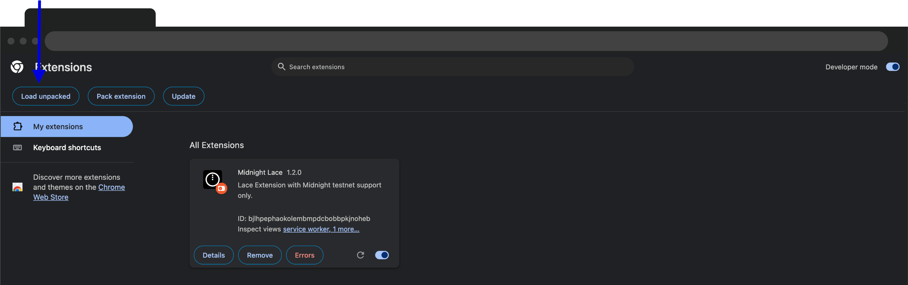

# Midnight Lace wallet - alpha version for testnet

There is a Midnight-enabled edition of the
Lace wallet.
The Midnight Lace wallet is an alpha version specifically for the testnet, functioning as a Chrome extension.

:::important Chrome browser

You must use the Chrome web browser or its derivatives to complete
web-based transactions on the Midnight testnet.

Only the Chrome browser itself is fully supported. The Midnight Lace
wallet may not be able to connect to your local proof server from
Chrome derivatives. If you choose to use Brave, for example, it will
be necessary to disable Brave shields when running this tutorial's
welcome DApp, so that the DApp (hosted at one address) can contact
your local proof server (hosted on your system, at a different
address) through the Midnight Lace extension.

Supported Chromium version: 119 or later.

:::

## Install Midnight Lace wallet (alpha)

1. Go to the [Midnight Lace wallet releases page](../../../relnotes/lace).
2. Select the required version according to the [release compatibility matrix](../../../relnotes/comp-matrix).
3. Click **ZIP Archive** under **Artifacts** to
   download the archive.
3. Unzip the file.
4. In your Google Chrome (or derived) web browser, go to
   **Settings** > **Extensions**. If necessary, go to **Manage
   Extensions**, so that you see a toggle-switch for **Developer
   mode**. Enable developer mode.
5. Additional buttons should appear above your extensions, including
   the one labeled **Load unpacked**.
6. Click the **Load unpacked** button and select the folder that was
   created when you unzipped the Midnight Lace wallet ZIP file.

The extension tile in your browser's list of installed extensions may
show the existence of some error messages about being unable to
connect to the standard set of servers. You may safely ignore these
errors.

You may want to go to the Midnight Lace wallet extension's detailed settings
and enable the toggle-switch labeled **Pin to toolbar**, so that the
wallet is easily accessible.

## Set up Midnight Lace wallet (alpha)

1. Start the extension, either by clicking its icon on the web
   browser's toolbar (if you pinned it there after the preceding
   steps) or by clicking on it in the list of extensions under the
   extensions icon in your browser's toolbar.
2. The first page you see presents the options of creating a new
   wallet or restoring an existing one.
   
   At this point, create a new wallet.
3. Read and accept the 'Lace Terms of Use'.
   
4. Give your wallet a name to help you identify it later, maybe a name
   like _Midnight testnet_.
   
5. Choose and save a strong password for your wallet. Please make sure to keep your password in a safe place. No one will have
access to or the ability to retrieve or recover your password.
If you lose your password, you will need to restore your wallet with your secret passphrase.
6. In the next step, the wallet asks for the network addresses and
   ports of the three client service components it needs:

   - the Midnight network you are going to connect to. If you're connecting to our testnet, choose the "Testnet" option. If you're running a local version of midnight testnet, choose the "Undeployed" option.
   - the Midnight network node through which transactions are to be
     submitted
   - the Midnight Indexer of the blockchain, which
     transmits ledger updates to the wallet
   - the proof server, which generates zero-knowledge proofs of the
     validity of your Midnight transactions

:::note
f you're using Midnight Lace Wallet version `≥ 2.0.0` and interacting with DApps, ensure those DApps are using midnight.js version `≥ 1.0.0` for compatibility.
:::

   

:::important
   Notice that the default proof server address points to a local instance
   that you have installed. This is because the proof server requires
   private data as inputs, and using a remote instance could compromise
   users' private data.
:::

7. Finally, fill in all the words for a secret passphrase, which may
   be needed to restore your wallet in the future.
   _Do not lose this passphrase! Please write down and keep your passphrase in a safe place. No one will have access to or the ability to retrieve or recover your passphrase. If you lose your passphrase, you will not be able to restore your wallet._
   

8. After you have verified your passphrase, a page confirming that you
   have completed the setup is displayed.
   

Then the main page for your new wallet appears, with 0.00 tDUST as its
initial balance. You can access this view at any time by clicking on the
Midnight Lace wallet extension icon again.

Before your wallet has received any tDUST, the main page displays the
wallet address, so that you can copy it into some place that will
transfer funds to the wallet.
Visit the [token acquisition page](/docs/develop/tutorial/1-using/faucet.mdx) to find out more.
Later, you can access the wallet address
at any time by clicking on the **Receive** button at the top of the
page.

