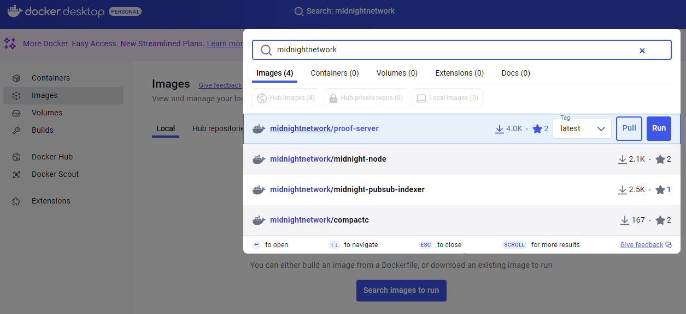

# Using Midnight

In this first part of the Midnight developer tutorial, you will:

1. Learn to install and configure the components needed to connect to the
   Midnight network
2. Acquire some tDUST to pay for transactions on the network
3. Run a DApp that connects to the network and performs a transaction.

When you are done with part 1, you will have connected to the Midnight
network and made real changes to the Testnet blockchain ledger.

Remember, if you run into any problems, ask for help using the
pathways described in the [getting help](/docs/develop/getting-help.mdx) section.

# Prerequisites

## Supported platforms

These instructions have been tested on recent versions of macOS and
various Linux distributions.  Development on Windows has been tested
using the Windows Subsystem for Linux (WSL), specifically
`Ubuntu 22.04.2 LTS (GNU/Linux 5.15.90.1-microsoft-standard-WSL2 x86_64)`.

## Docker

A working Docker installation is needed to continue with this tutorial. 
The easiest and recommended installation is [Docker Desktop](https://docs.docker.com/desktop/).

Check that you can invoke Docker. If you type the following at a
shell prompt, you should see a recent version number, such as 24.0.5.

```shell
docker --version
```

List available images from Midnight docker repository.

```shell
docker search midnightnetwork
```

You can also manually add our images through Docker Desktop.



If you cannot complete this step, contact the Midnight DevRel team, as
described in the [getting help](/docs/develop/getting-help.mdx) section.
