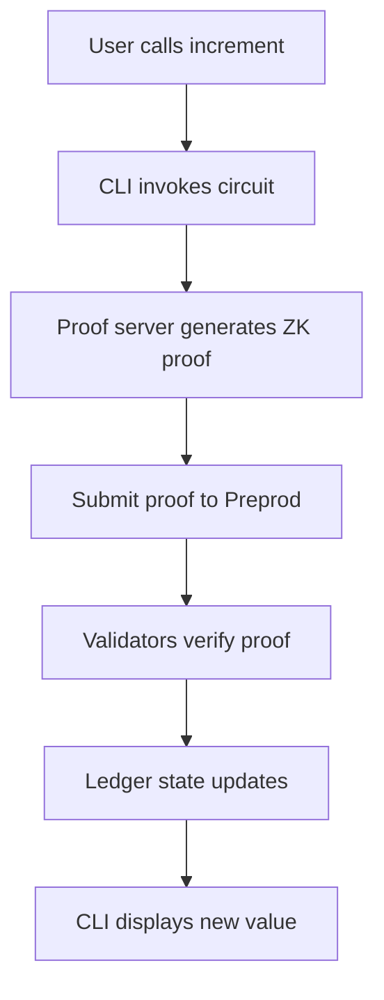

# Counter DApp

The Counter contract demonstrates the fundamentals of building on Midnight using the Compact language. This example shows how to create a simple smart contract that maintains a counter value with an increment operation, backed by Zero Knowledge (ZK) proofs.

The Counter example is a minimal DApp that introduces core Midnight concepts:

- Writing smart contracts in Compact
- Deploying contracts to the Preprod network
- Interacting with deployed contracts through a CLI
- Using Zero Knowledge (ZK) proofs for state transitions

By the end of this guide, you will understand how the Counter contract works, how to deploy it, and how to interact with it using the command-line interface.

## Contract architecture

The Counter example uses a simple structure with two main components:

```
example-counter/
├── contract/                  # Smart contract in Compact language
│   ├── src/counter.compact    # The actual smart contract
│   └── src/test/              # Contract unit tests
└── counter-cli/               # Command-line interface
    └── src/                   # CLI implementation
```

### The Counter contract

The Counter contract is written in Compact and includes the following components:

**Ledger state**: A single `Counter` type named `round` that maintains the on-chain counter value. The Counter type automatically initializes to zero and provides built-in methods for increment operations.
**Circuit**: One exported circuit that serves as the entry point to the contract. This circuit is called `increment()` and it increases the counter value by 1 using the `round.increment(1)` method.

Here's the complete contract:

```compact
pragma language_version 0.20;

import CompactStandardLibrary;

// public state
export ledger round: Counter;

// transition function changing public state
export circuit increment(): [] {
  round.increment(1);
}
```

The contract demonstrates several key Compact concepts:

- **Language version directive**: Specifies which version of Compact the contract requires
- **Standard library import**: Provides access to built-in types like `Counter`
- **Ledger declaration**: Defines the on-chain state of the contract
- **Export keyword**: Makes the circuit callable from external code and includes it in the deployed contract
- **Unit type `[]`**: Indicates circuits that return no value

### Zero Knowledge (ZK) proofs in action

When you call `increment()`:

1. Your local machine executes the circuit logic.
2. The proof server generates a Zero Knowledge (ZK) proof that the operation was performed correctly.
3. The proof is submitted to the Preprod network.
4. Validators verify the proof without seeing your private data.
5. The ledger state updates if the proof is valid.

## Prerequisites

Before working with the Counter example, ensure that you have:

- Node.js version 22 or higher
- Docker Desktop installed and running
- Compact toolchain installed
- Command-line familiarity

For more information, refer to [install the toolchain](../getting-started/installation). 

## Set up the example

This section explains the process of setting up and running the Counter DApp locally.

### Clone the repository

Get the Counter example from GitHub:

```bash
git clone https://github.com/midnightntwrk/example-counter.git
cd example-counter
```

### Install dependencies

Install all required Node.js packages:

```bash
npm install
```

This command installs packages for both the contract and CLI components. You should see output without errors, though some warnings may appear.

## Start the proof server

The proof server generates Zero Knowledge (ZK) proofs for transactions locally to protect private data. It must be running before you can deploy or interact with contracts.

Start the proof server for Preprod:

```bash
docker run -p 6300:6300 midnightntwrk/proof-server:7.0.0 -- midnight-proof-server -v
```

You should see output similar to:

```
starting service: "actix-web-service-0.0.0.0:6300", workers: 14, listening on: 0.0.0.0:6300
```

:::tip Keep it running
Keep this terminal window open. The proof server _must_ stay active while using the DApp.
:::

## Compile the contract

Open a new terminal window and navigate to the `contract` directory:

```bash
cd contract
```

Compile the contract by running the `compact` script:

```bash
npm run compact
``` 

The `npm run compact` script runs the following command:

```bash
compact compile src/counter.compact src/managed/counter
```

This command compiles the contract and builds the TypeScript API and JavaScript implementation of the contract.

You should see the following output:

```
> compact compile src/counter.compact src/managed/counter

Compiling 1 circuits:
  circuit "increment" (k=5, rows=24) 
```

The compiled artifacts are placed in the `src/managed/counter` directory.

```
src/
├── counter.compact
├── managed
│   └── counter
│       ├── compiler
│       ├── contract
│       ├── keys
│       └── zkir
```

## Launch the Counter CLI

Open a new terminal window and navigate to the `counter-cli` directory:

```bash
cd counter-cli
```

The `package.json` file for the counter-cli folder has a script called `preprod` that launches the CLI on the Preprod network.

Launch the CLI by running the `preprod` script.

```bash
npm run preprod
```

The CLI displays a welcome screen:

```
╔══════════════════════════════════════════════════════════════╗
║                                                             ║
║              Midnight Counter Example                       ║
║              ────────────────────────                       ║
║              A privacy-preserving smart contract demo       ║
║                                                             ║
╚══════════════════════════════════════════════════════════════╝


──────────────────────────────────────────────────────────────
  Wallet Setup
──────────────────────────────────────────────────────────────
  [1] Create a new wallet
  [2] Restore wallet from seed
  [3] Exit
──────────────────────────────────────────────────────────────
```

## Set up your wallet

The Counter CLI uses a headless wallet implementation that runs locally, separate from browser wallets like Lace Midnight Preview.

### Create a new wallet

Select option `[1] Create a new wallet` from the menu.

The CLI generates a new wallet and displays the wallet overview:

```
──────────────────────────────────────────────────────────────
  Wallet Overview                            Network: preprod
──────────────────────────────────────────────────────────────
  Seed: [64-character hex string]

  Unshielded Address (send tNight here):
  mn_addr_preprod1...

  Fund your wallet with tNight from the Preprod faucet:
  https://faucet.preprod.midnight.network/
──────────────────────────────────────────────────────────────
```

:::warning Save your seed phrase
Store the wallet seed in a secure location. You need it to recover your wallet if needed.
:::

### Restore an existing wallet

If you already have a wallet seed, then select option `[2] Restore wallet from seed`.

Enter your wallet seed when prompted:

```
> 2
Enter your wallet seed: bbee2c8886837784............

  ✓ Building wallet
```

The CLI restores your wallet and displays your addresses and balances.

## Get faucet tokens

Before deploying contracts, you need tNight tokens from the faucet.

1. Copy your unshielded address from the wallet overview.
2. Visit the [Preprod faucet](https://faucet.preprod.midnight.network/).
3. Paste your unshielded address.
4. Request tokens.
5. Wait for the transaction to confirm. It usually takes 1-2 minutes.

After syncing, the CLI displays your updated balances:

```
──────────────────────────────────────────────────────────────
  Wallet Overview                            Network: preprod
──────────────────────────────────────────────────────────────
  Seed: bbee2c8886837784............
──────────────────────────────────────────────────────────────

  Shielded (ZSwap)
  └─ Address: mn_shield-addr_preprod1...

  Unshielded
  ├─ Address: mn_addr_preprod12gseaq...
  └─ Balance: 2,000,000,000 tNight

  Dust
  └─ Address: mn_dust_preprod1w0darle...

──────────────────────────────────────────────────────────────
  ✓ Dust tokens already available (4,693,721,522,000,000,000 DUST)
  ✓ Configuring providers
```

The wallet automatically delegates tNight holdings to generate DUST tokens, which are required for contract operations.

## Deploy the contract

With your wallet funded, deploy the Counter contract to Preprod.

From the Contract Actions menu, select option `[1] Deploy a new counter contract`:

```
──────────────────────────────────────────────────────────────
  Contract Actions                    DUST: 4,693,721,522,000,000,000
──────────────────────────────────────────────────────────────
  [1] Deploy a new counter contract
  [2] Join an existing counter contract
  [3] Monitor DUST balance
  [4] Exit
──────────────────────────────────────────────────────────────
> 1
```

The CLI deploys your contract and displays the contract address:

```
[11:44:34.335] INFO (10378): Deploying counter contract...
  ⠋ Deploying counter contract
[11:44:58.724] INFO (10378): Deployed contract at address: ea87c25015951b..........
  ✓ Deploying counter contract
  Contract deployed at: ea87c25015951b..........
```

:::note Transaction time
Contract deployment typically takes 20-30 seconds on Preprod as the network processes your transaction and Zero Knowledge (ZK) proofs.
:::

## Interact with the contract

Once deployed, you can interact with your Counter contract.

The Counter Actions menu appears:

```
──────────────────────────────────────────────────────────────
  Counter Actions                     DUST: 4,693,901,007,999,999,999
──────────────────────────────────────────────────────────────
  [1] Increment counter
  [2] Display current counter value
  [3] Exit
──────────────────────────────────────────────────────────────
```

### Check the current value

Select option `[2] Display current counter value` to see the current counter value:

```
> 2
INFO (10378): Checking contract ledger state...
INFO (10378): Ledger state: 0
INFO (10378): Current counter value: 0
```

The counter initializes to zero when the contract is deployed.

### Increment the counter

Select option `[1] Increment counter` from the menu. The CLI:

1. Generates a Zero Knowledge (ZK) proof locally
2. Submits the proof to Preprod
3. Waits for transaction confirmation
4. Updates the displayed DUST balance

```
> 1
 INFO (10378): Incrementing...
  ⠇ Incrementing counter
 INFO (10378): Transaction 00fe2faaa99f71216162d2c850123ea067d74e08e77fef1d7d4c534a256e55de8f added in block 262860
  ✓ Incrementing counter

──────────────────────────────────────────────────────────────
  Counter Actions                     DUST: 4,699,057,227,999,999,998
──────────────────────────────────────────────────────────────
  [1] Increment counter
  [2] Display current counter value
  [3] Exit
──────────────────────────────────────────────────────────────
```

:::info Transaction details
Each increment creates a real transaction on Midnight Preprod. The transaction includes a Zero Knowledge (ZK) proof that you correctly incremented the counter, without revealing any private information.
:::

### Verify the increment

Select option `[2] Display current counter value` again to confirm the increment:

```
> 2
INFO (10378): Checking contract ledger state...
INFO (10378): Ledger state: 1
INFO (10378): Current counter value: 1
```

The counter value is now 1, confirming the increment operation succeeded.

## Understand the workflow

The Counter example demonstrates the complete Midnight DApp workflow:

<div style={{display: 'flex', justifyContent: 'center'}}>



</div>

### Key concepts demonstrated

- **Public ledger state**: The counter value is public and visible on-chain. Anyone can query it, but only those with valid proofs can modify it.
- **Zero Knowledge (ZK) proofs**: Each state transition is proven locally without revealing private data. Validators accept the proof without seeing your computation details.
- **Circuit entry points**: The `increment()` circuit is compiled into a Zero Knowledge (ZK) circuit that enforces correct state transitions.
- **Atomic operations**: Each circuit call is a single atomic transaction. If any part fails, the entire transaction is rejected and state remains unchanged.

## Extend the example

The Counter example serves as a foundation for building more complex DApps. Consider adding the following enhancements.

### Add custom increment amounts

Modify the circuit to accept a parameter:

```compact
export circuit incrementBy(amount: Uint<8>): [] {
  round.increment(amount);
}
```

### Add a decrement circuit

Implement decrement functionality:

```compact
export circuit decrement(): [] {
  round.decrement(1);
}
```

:::caution Cannot go below zero
The Counter type prevents negative values. Attempting to decrement below zero results in a runtime error that the contract rejects.
:::

## Next steps

Now that you understand the Counter example:

- **Explore the GitHub repository**: [Counter repository](https://github.com/midnightntwrk/example-counter)
- **Build your own contract**: Learn how to [build the counter smart contract](../tutorials/beginner/counter/smart-contract).

