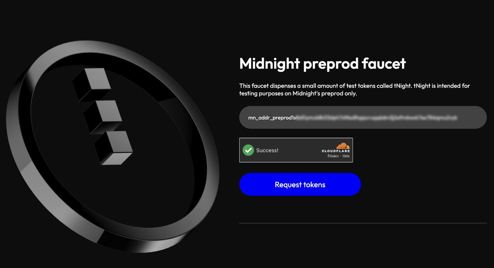
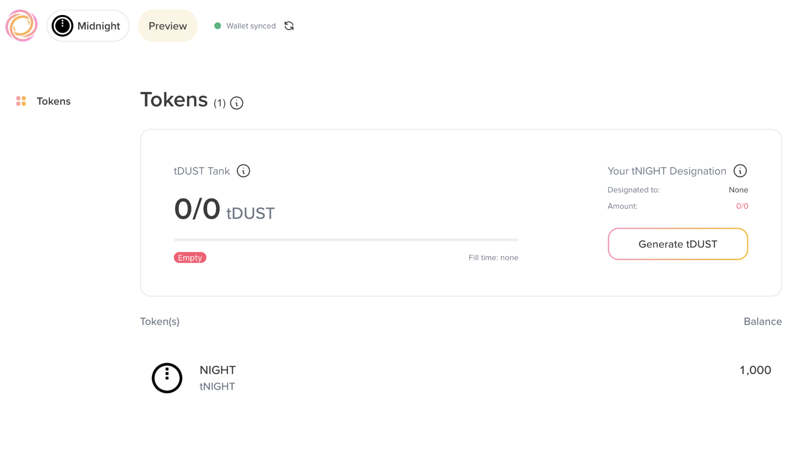
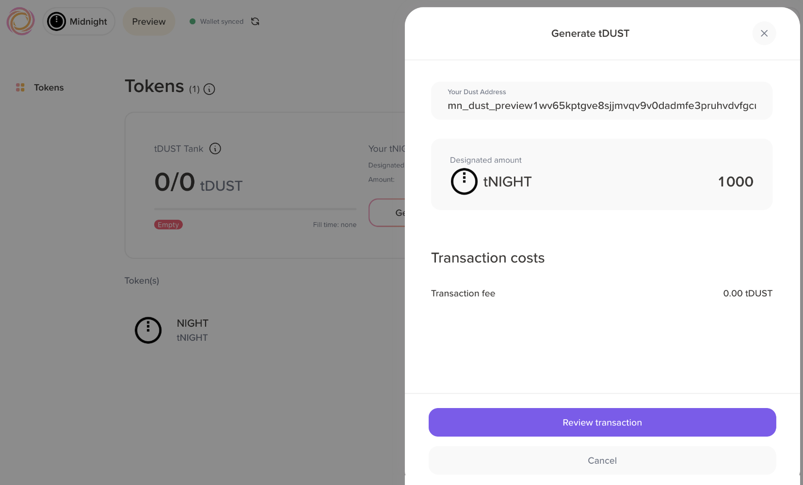
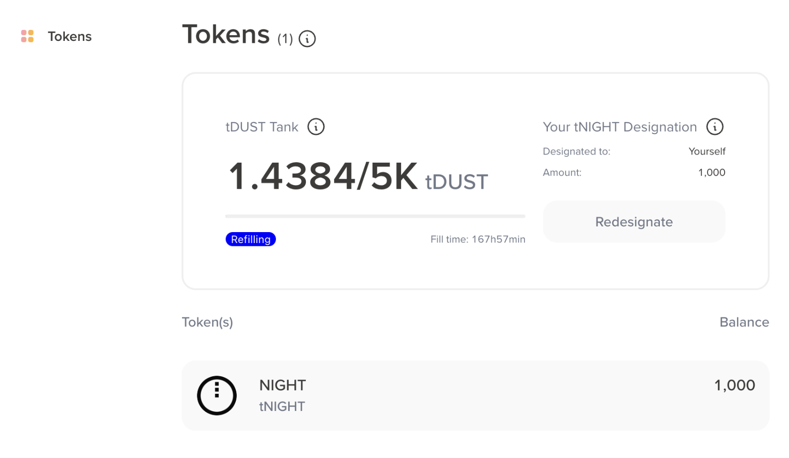

# Token acquisition

:::warning Disclaimer
The Midnight Preview network is unstable and might experience downtime. Preview-related guides are intended for experienced developers.
:::

In the production Midnight network, to run a DApp you need
to hold some DUST in a persistent wallet and spend some of it on each
transaction. However, a supply of free tDUST is
available for developers who want to experiment with Midnight DApps.

## Get tNIGHT

tNIGHT is the test token for the Midnight Preview network. It is used to generate tDUST for testing purposes. Here are the steps to get tNIGHT:

1. Log in to your Lace Midnight Preview wallet and copy your Unshielded wallet address.

  :::note Bech32m Address Format
  All wallet addresses are shown in Bech32m format by default. The faucet supports both formats, however the legacy (HEX) format will be dropped in future versions.
  :::

2. Visit [Midnight faucet](https://faucet.preview.midnight.network/) and enter your Unshielded wallet address.



3. Select **Request tokens**. This might take a few seconds to process and returns a transaction hash in the following format:

```
Transaction submitted. You will receive 1000 tNight, this should take about 2 mins. Its id is 00ec3ff48b7...
```

You should have received 1000.0 tNIGHT from the faucet. You can verify the balance in your wallet.

## Delegate tDUST

After you have received tNIGHT, you need to delegate it to an address to generate tDUST. Here's how to do it:

1. Log in to your Lace wallet, and then click **Generate tDUST**. You'll see your tDUST address populated in the input field.



2. Click **Review transaction** to proceed, then select **Confirm** to submit the transaction.



You should see your tDUST tank generating test tokens for your wallet.



## Troubleshooting

Below are some common issues you might encounter when using the faucet and how to resolve them.

### Provided address is invalid

- **Error**: `Provided address is invalid`

- **Solution**: Ensure that you're using the correct address. The address should be the Unshielded wallet address on the Lace Midnight Preview wallet.

### Rate limit exceeded

- **Error**: `{“status”:“rate_limit_error”,“message”:“Reached maximum number of requests for this address”}`

- **Solution**: Wait a few hours and try again. If the issue persists after 24 hours, then contact [Midnight support](mailto:support@midnight.network) or ask for help in the [Midnight Discord server](https://discord.gg/midnightnetwork).