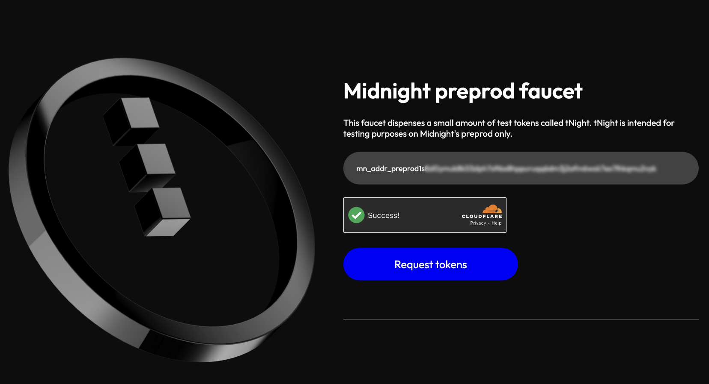
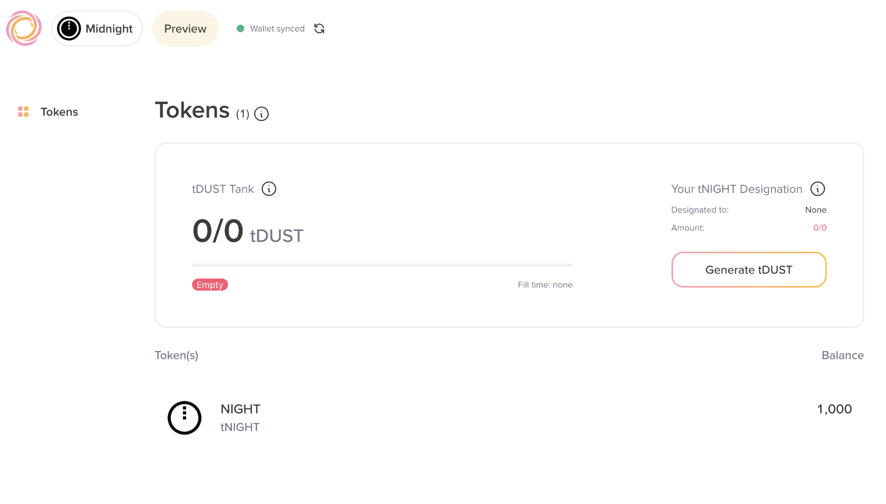
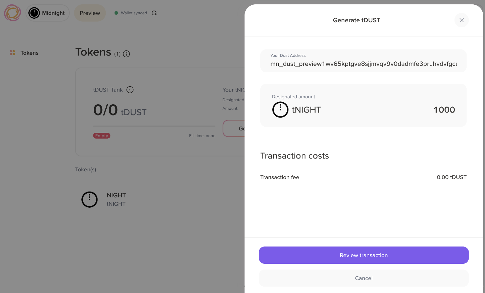
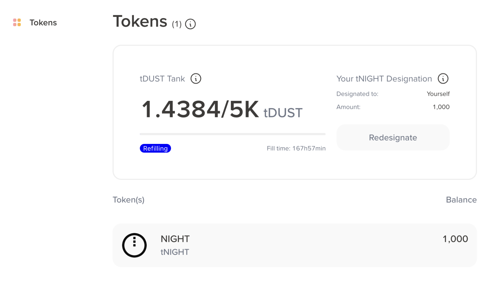

# Funding a wallet

Every transaction on Midnight consumes DUST, and DUST comes from NIGHT that you have registered for DUST generation. On the test networks both halves are free: a faucet sends you tNIGHT, and registering it starts tDUST accruing. This guide walks the whole path. You request tNIGHT from the faucet, register it in the Lace wallet, and then do the same programmatically with the wallet SDK when you need funding to be scriptable. For why the two-token model works this way, see [Funding and transaction cost](./networks-and-environments#funding-and-transaction-cost).

One term matters throughout. You **register** NIGHT for DUST generation, the on-chain operation the protocol and SDK also call registration. Lace labels the button **Generate tDUST** and displays the result as your tNIGHT designation.

## Prerequisites

These apply to every procedure in this guide:

- A [Lace wallet](../getting-started/installation) set up on the target test network, for the faucet and Lace procedures.
- Node.js version 22 or higher, for the wallet SDK procedure.
- A local [proof server](./run-proof-server) on port 6300, for the wallet SDK procedure.

{/* _mod-docs-content-type: PROCEDURE */}
## Getting tNIGHT from the faucet

Request free test tokens for the network you develop on. The faucets are rate limited, and test tokens carry no real value. On the local `undeployed` network there is no faucet and none is needed; use the [local network funding menu](./networks-and-environments#running-a-local-network) instead.

### Procedure

1. Copy your **unshielded** wallet address. In Lace, open your Midnight wallet and copy the address that starts with `mn_addr_`; the faucet rejects shielded and DUST addresses.

   :::note Bech32m address format
   Lace shows wallet addresses in Bech32m format by default. The address encodes its network, for example `mn_addr_preprod1...` on Preprod.
   :::

2. Open the faucet for your network: the [Preprod faucet](https://midnight-tmnight-preprod.nethermind.dev/) or the [Preview faucet](https://midnight-tmnight-preview.nethermind.dev/). The [Environment reference](./networks-and-environments#environment-reference) lists both.

   

3. Paste the address, complete the captcha, and select **Request tokens**. The faucet confirms the submission:

   ```text
   Transaction submitted. You will shortly receive 1000 tNight in your wallet. This is the transaction ID: 00f15defb8d3...
   ```

### Verification

The tNIGHT balance appears in your wallet within a couple of minutes: 1,000.0 tNIGHT per Preprod faucet request. In Lace, the unshielded balance updates on the wallet's main view. In code, the balance watcher in [Registering for DUST generation with the wallet SDK](#registering-for-dust-generation-with-the-wallet-sdk) resolves as soon as the funds land.

{/* _mod-docs-content-type: PROCEDURE */}
## Registering NIGHT for DUST generation in Lace

Turn your tNIGHT into a source of tDUST. Holding NIGHT alone generates nothing; the registration transaction is what starts generation.

### Prerequisites

- tNIGHT in your wallet, from [Getting tNIGHT from the faucet](#getting-tnight-from-the-faucet).

### Procedure

1. In Lace, select **Generate tDUST**. Your tDUST address populates the input field.

   

2. Select **Review transaction**, then **Confirm** to submit the registration.

   

### Verification

The tDUST tank starts filling and continues to accrue over time, up to a cap set by how much NIGHT you registered.



{/* _mod-docs-content-type: PROCEDURE */}
## Registering for DUST generation with the wallet SDK

Do the same registration from code, so funding works in scripts and CI. The flow builds a wallet from a seed, syncs it, waits for faucet funds, then registers the NIGHT UTXOs and watches the DUST balance grow. The snippets below form one script.

The wallet SDK ships as the single barrel package `@midnightntwrk/wallet-sdk`, which re-exports every wallet sub-package. That scope has no hyphen, unlike the `@midnight-ntwrk/` packages alongside it.

### Procedure

1. Create a project and install the version-matched dependencies. Check the [support matrix](../relnotes/support-matrix) when versions change:

   ```json title="package.json"
   {
     "type": "module",
     "scripts": {
       "start": "tsx src/index.ts"
     },
     "dependencies": {
       "@midnight-ntwrk/midnight-js-network-id": "4.1.1",
       "@midnight-ntwrk/midnight-js-protocol": "4.1.1",
       "@midnight-ntwrk/midnight-js-utils": "4.1.1",
       "@midnightntwrk/wallet-sdk": "1.2.0",
       "rxjs": "^7.8.1",
       "ws": "^8.19.0"
     },
     "devDependencies": {
       "@types/ws": "^8.18.1",
       "tsx": "^4.19.0"
     }
   }
   ```

   Then run `npm install`.

2. Start your local [proof server](./run-proof-server) and confirm it answers on port 6300:

   ```bash
   curl http://localhost:6300/health
   ```

3. Create `src/index.ts` and add the imports and configuration. The script assigns the `ws` package as the global WebSocket before any wallet code runs, which keeps WebSocket behavior consistent across Node versions. The endpoints come from the [Environment reference](./networks-and-environments#environment-reference):

   ```typescript
   import { WebSocket } from 'ws';
   (globalThis as any).WebSocket = WebSocket;

   import { Buffer } from 'buffer';
   import * as Rx from 'rxjs';
   import {
     HDWallet,
     Roles,
     generateRandomSeed,
     WalletFacade,
     ShieldedWallet,
     DustWallet,
     UnshieldedWallet,
     createKeystore,
     PublicKey,
     NoOpTransactionHistoryStorage,
     DustAddress,
     MidnightBech32m,
   } from '@midnightntwrk/wallet-sdk';
   import { toHex } from '@midnight-ntwrk/midnight-js-utils';
   import * as ledger from '@midnight-ntwrk/midnight-js-protocol/ledger';
   import { unshieldedToken } from '@midnight-ntwrk/midnight-js-protocol/ledger';
   import { setNetworkId, getNetworkId } from '@midnight-ntwrk/midnight-js-network-id';

   setNetworkId('preprod');

   const CONFIG = {
     indexerHttpUrl: 'https://indexer.preprod.midnight.network/api/v4/graphql',
     indexerWsUrl: 'wss://indexer.preprod.midnight.network/api/v4/graphql/ws',
     node: 'https://rpc.preprod.midnight.network',
     proofServer: 'http://localhost:6300',
   };
   ```

4. Derive the wallet's three key roles from a seed. One seed produces the shielded (`Zswap`), unshielded (`NightExternal`), and `Dust` key sets by hierarchical deterministic derivation. Save the seed; it is the only way to restore the wallet:

   ```typescript
   const seed = toHex(Buffer.from(generateRandomSeed()));
   console.log(`Seed (save this): ${seed}`);

   const deriveKeys = (seed: string) => {
     const hd = HDWallet.fromSeed(Buffer.from(seed, 'hex'));
     if (hd.type !== 'seedOk') throw new Error('Invalid seed');
     const result = hd.hdWallet
       .selectAccount(0)
       .selectRoles([Roles.Zswap, Roles.NightExternal, Roles.Dust])
       .deriveKeysAt(0);
     if (result.type !== 'keysDerived') throw new Error('Key derivation failed');
     hd.hdWallet.clear();
     return result.keys;
   };

   const keys = deriveKeys(seed);
   ```

5. Build the three sub-wallets and unify them behind the `WalletFacade`:

   ```typescript
   const shieldedSecretKeys = ledger.ZswapSecretKeys.fromSeed(keys[Roles.Zswap]);
   const dustSecretKey = ledger.DustSecretKey.fromSeed(keys[Roles.Dust]);
   const unshieldedKeystore = createKeystore(keys[Roles.NightExternal], getNetworkId());

   const shieldedConfig = {
     networkId: getNetworkId(),
     indexerClientConnection: {
       indexerHttpUrl: CONFIG.indexerHttpUrl,
       indexerWsUrl: CONFIG.indexerWsUrl,
     },
     provingServerUrl: new URL(CONFIG.proofServer),
     relayURL: new URL(CONFIG.node.replace(/^http/, 'ws')),
   };
   const unshieldedConfig = {
     networkId: getNetworkId(),
     indexerClientConnection: {
       indexerHttpUrl: CONFIG.indexerHttpUrl,
       indexerWsUrl: CONFIG.indexerWsUrl,
     },
     txHistoryStorage: new NoOpTransactionHistoryStorage(),
   };
   const dustConfig = {
     ...shieldedConfig,
     costParameters: {
       additionalFeeOverhead: 300_000_000_000_000n,
       feeBlocksMargin: 5,
     },
   };

   const wallet = await WalletFacade.init({
     configuration: { ...shieldedConfig, ...unshieldedConfig, ...dustConfig },
     shielded: (cfg) => ShieldedWallet(cfg).startWithSecretKeys(shieldedSecretKeys),
     unshielded: (cfg) => UnshieldedWallet(cfg).startWithPublicKey(PublicKey.fromKeyStore(unshieldedKeystore)),
     dust: (cfg) =>
       DustWallet(cfg).startWithSecretKey(dustSecretKey, ledger.LedgerParameters.initialParameters().dust),
   });
   await wallet.start(shieldedSecretKeys, dustSecretKey);
   ```

6. Print the unshielded address, fund it from the [faucet](#getting-tnight-from-the-faucet), and watch for the funds. Balances stream in while the wallet is still syncing, and a partial sync can only undercount, so a positive balance means the tokens have arrived:

   ```typescript
   console.log(`Send tNIGHT to: ${unshieldedKeystore.getBech32Address()}`);

   const nightBalance = await Rx.firstValueFrom(
     wallet.state().pipe(
       Rx.throttleTime(10_000),
       Rx.map((state) => state.unshielded.balances[unshieldedToken().raw] ?? 0n),
       Rx.filter((balance) => balance > 0n),
     ),
   );
   console.log(`tNIGHT received: ${nightBalance}`);
   ```

7. Wait for the wallet to sync, then register the unregistered NIGHT UTXOs for DUST generation. Registration needs a fully synced wallet, so `waitForSyncedState` gates this step; keep the process running, because a restarted script syncs again from the beginning. The registration is built as a recipe, signed by the unshielded keystore, finalized, and submitted. To direct the generated DUST to a different wallet, decode that wallet's DUST address as the receiver instead:

   ```typescript
   const state = await wallet.waitForSyncedState();

   const unregistered = state.unshielded.availableCoins.filter(
     (coin) => coin.meta?.registeredForDustGeneration !== true,
   );

   const ownDustAddress = DustAddress.encodePublicKey(getNetworkId(), state.dust.publicKey);
   const dustReceiver = MidnightBech32m.parse(String(ownDustAddress)).decode(DustAddress, getNetworkId());

   const recipe = await wallet.registerNightUtxosForDustGeneration(
     unregistered,
     unshieldedKeystore.getPublicKey(),
     (payload) => unshieldedKeystore.signData(payload),
     dustReceiver,
   );
   const finalized = await wallet.finalizeRecipe(recipe);
   await wallet.submitTransaction(finalized);
   ```

8. Watch the DUST balance become positive. Generation begins once the registration transaction lands on-chain:

   ```typescript
   await Rx.firstValueFrom(
     wallet.state().pipe(
       Rx.throttleTime(5_000),
       Rx.filter((s) => s.isSynced),
       Rx.filter((s) => s.dust.balance(new Date()) > 0n),
     ),
   );
   const dustBalance = (await Rx.firstValueFrom(wallet.state())).dust.balance(new Date());
   console.log(`DUST balance: ${dustBalance}`);
   await wallet.stop();
   ```

### Verification

Key derivation is deterministic, the addresses carry the network's prefixes, and the facade connects all three wallets to Preprod. The connectivity test distinguishes connected from synced on purpose: a fresh wallet connects in seconds and syncs much later.

```typescript title="wallet-construction.test.ts"
import { describe, it, expect, afterAll } from 'vitest';
import { WebSocket } from 'ws';
(globalThis as any).WebSocket = WebSocket;
import { Buffer } from 'buffer';
import * as Rx from 'rxjs';
import {
  HDWallet,
  Roles,
  generateRandomSeed,
  WalletFacade,
  ShieldedWallet,
  DustWallet,
  UnshieldedWallet,
  createKeystore,
  PublicKey,
  NoOpTransactionHistoryStorage,
  DustAddress,
  MidnightBech32m,
} from '@midnightntwrk/wallet-sdk';
import { toHex } from '@midnight-ntwrk/midnight-js-utils';
import * as ledger from '@midnight-ntwrk/midnight-js-protocol/ledger';
import { setNetworkId, getNetworkId } from '@midnight-ntwrk/midnight-js-network-id';

setNetworkId('preprod');

const CONFIG = {
  indexerHttpUrl: 'https://indexer.preprod.midnight.network/api/v4/graphql',
  indexerWsUrl: 'wss://indexer.preprod.midnight.network/api/v4/graphql/ws',
  node: 'https://rpc.preprod.midnight.network',
  proofServer: 'http://localhost:6300',
};

const deriveKeys = (seed: string) => {
  const hd = HDWallet.fromSeed(Buffer.from(seed, 'hex'));
  if (hd.type !== 'seedOk') throw new Error('bad seed');
  const res = hd.hdWallet
    .selectAccount(0)
    .selectRoles([Roles.Zswap, Roles.NightExternal, Roles.Dust])
    .deriveKeysAt(0);
  if (res.type !== 'keysDerived') throw new Error('derive failed');
  hd.hdWallet.clear();
  return res.keys;
};

let wallet: any;

afterAll(async () => {
  if (wallet) await wallet.stop();
});

describe('building a funding wallet', () => {
  it('derives the three key roles deterministically from one seed', () => {
    const seed = toHex(Buffer.from(generateRandomSeed()));
    const first = deriveKeys(seed);
    const second = deriveKeys(seed);
    expect(Buffer.from(first[Roles.NightExternal])).toEqual(Buffer.from(second[Roles.NightExternal]));
    expect(Buffer.from(first[Roles.Zswap])).toEqual(Buffer.from(second[Roles.Zswap]));
    expect(Buffer.from(first[Roles.Dust])).toEqual(Buffer.from(second[Roles.Dust]));
  });

  it('encodes a preprod unshielded address with the mn_addr_preprod prefix', () => {
    const keys = deriveKeys(toHex(Buffer.from(generateRandomSeed())));
    const keystore = createKeystore(keys[Roles.NightExternal], getNetworkId());
    expect(String(keystore.getBech32Address())).toMatch(/^mn_addr_preprod1/);
  });

  it('builds the wallet facade and connects all three wallets to preprod', { timeout: 120_000 }, async () => {
    const keys = deriveKeys(toHex(Buffer.from(generateRandomSeed())));
    const shieldedSecretKeys = ledger.ZswapSecretKeys.fromSeed(keys[Roles.Zswap]);
    const dustSecretKey = ledger.DustSecretKey.fromSeed(keys[Roles.Dust]);
    const unshieldedKeystore = createKeystore(keys[Roles.NightExternal], getNetworkId());

    const shieldedConfig = {
      networkId: getNetworkId(),
      indexerClientConnection: {
        indexerHttpUrl: CONFIG.indexerHttpUrl,
        indexerWsUrl: CONFIG.indexerWsUrl,
      },
      provingServerUrl: new URL(CONFIG.proofServer),
      relayURL: new URL(CONFIG.node.replace(/^http/, 'ws')),
    };
    const unshieldedConfig = {
      networkId: getNetworkId(),
      indexerClientConnection: {
        indexerHttpUrl: CONFIG.indexerHttpUrl,
        indexerWsUrl: CONFIG.indexerWsUrl,
      },
      txHistoryStorage: new NoOpTransactionHistoryStorage(),
    };
    const dustConfig = {
      ...shieldedConfig,
      costParameters: { additionalFeeOverhead: 300_000_000_000_000n, feeBlocksMargin: 5 },
    };

    wallet = await WalletFacade.init({
      configuration: { ...shieldedConfig, ...unshieldedConfig, ...dustConfig },
      shielded: (cfg: any) => ShieldedWallet(cfg).startWithSecretKeys(shieldedSecretKeys),
      unshielded: (cfg: any) => UnshieldedWallet(cfg).startWithPublicKey(PublicKey.fromKeyStore(unshieldedKeystore)),
      dust: (cfg: any) => DustWallet(cfg).startWithSecretKey(dustSecretKey, ledger.LedgerParameters.initialParameters().dust),
    });
    await wallet.start(shieldedSecretKeys, dustSecretKey);

    const connected = await Rx.firstValueFrom(
      wallet.state().pipe(
        Rx.filter(
          (s: any) =>
            s.shielded.state.progress.isConnected &&
            s.unshielded.state.progress.isConnected &&
            s.dust.state.progress.isConnected,
        ),
      ),
    );
    expect(connected.isSynced).toBe(false);
    expect(connected.dust.balance(new Date())).toBe(0n);

    const dustAddress = DustAddress.encodePublicKey(getNetworkId(), connected.dust.publicKey);
    expect(String(dustAddress)).toMatch(/^mn_dust_preprod1/);
    expect(MidnightBech32m.parse(String(dustAddress)).decode(DustAddress, getNetworkId())).toBeDefined();
  });
});
```

```text
 ✓ wallet-construction.test.ts > building a funding wallet > derives the three key roles deterministically from one seed
 ✓ wallet-construction.test.ts > building a funding wallet > encodes a preprod unshielded address with the mn_addr_preprod prefix
 ✓ wallet-construction.test.ts > building a funding wallet > builds the wallet facade and connects all three wallets to preprod

 Test Files  1 passed (1)
      Tests  3 passed (3)
```

Running the full procedure against Preprod carries this through to a submitted registration: the wallet reports the faucet's 1,000 tNIGHT as a single unregistered UTXO, and the registration transaction goes out once the wallet is synced. Once the registration lands, DUST accrues toward the cap that your registered NIGHT sets. Watch it with the balance check in the final step, or in Lace's tDUST tank.

{/* _mod-docs-content-type: REFERENCE */}
## Funding troubleshooting

The failure modes readers hit most often on the funding path, and their fixes.

| Symptom | Fix |
|---|---|
| Faucet says `Provided address is invalid` | Use the **unshielded** address (`mn_addr_...`) with no surrounding whitespace. The faucet rejects shielded and DUST addresses. |
| Faucet says `rate_limit_error` or `Reached maximum number of requests` | Wait a few hours and retry. If it persists, open a ticket at the [Midnight Service Desk](https://midnightntwrk.github.io/servicedesk/) or ask in [Discord](https://discord.gg/midnightnetwork). |
| `Cannot find module` when running the script | Run `npm install` first. If it persists, delete `node_modules` and `package-lock.json`, then reinstall. |
| Connection refused on port 6300 | The proof server is not running; see [Run the proof server](./run-proof-server). |
| Balance stays zero after the faucet confirms | Give it a couple of minutes; the wallet detects funds after its next sync. Confirm the address you pasted matches the printed one exactly. |
| DUST stays zero after registration | Give the registration time to land on-chain, then confirm the proof server answers on `http://localhost:6300/health`. |
| `Invalid dust address` when directing DUST elsewhere | DUST addresses start with `mn_dust_` plus the network name; shielded (`mn_shield-addr_...`) and unshielded (`mn_addr_...`) addresses are different types. |

## Additional resources

- [Funding and transaction cost](./networks-and-environments#funding-and-transaction-cost): why NIGHT generates DUST and what transactions consume.
- [Environment reference](./networks-and-environments#environment-reference): faucets and endpoints per network.
- [Run the proof server](./run-proof-server): the local proof server the SDK path depends on.
- [Wallet developer guide](/sdks/official/wallet-developer-guide): the full wallet SDK surface behind the facade.
- [Support matrix](../relnotes/support-matrix): which wallet SDK versions pair with which network components.
- [Tokens on Midnight](../tokens/overview): the NIGHT and DUST model in depth.
