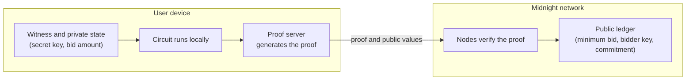

# How to build a private smart contract on Midnight

A private smart contract keeps its inputs and state confidential while the network can still verify that every rule was followed. On Midnight, you write the contract in Compact, sensitive data stays on the user's device, and the network receives only a zero-knowledge proof plus the values your contract deliberately makes public. By the end of this guide, you have a compiled contract with private inputs, tested on a local devnet.

{/* _mod-docs-content-type: REFERENCE */}
## How to build a private smart contract

To build a private smart contract on Midnight, follow these six steps:

1. [Set up your environment](#step-1-set-up-your-environment): install the Compact toolchain, Docker, and Node.js.
2. [Decide what stays private and what goes public](#step-2-decide-what-stays-private-and-what-goes-public): list every piece of data the contract touches and give each one a side.
3. [Write the contract in Compact](#step-3-write-the-contract-in-compact): declare public state with `ledger`, keep secrets in a private state, store only commitments or hashes on-chain, and use `disclose()` only where a value must become public.
4. [Compile the contract](#step-4-compile-and-understand-the-output): `compact compile` produces the zero-knowledge circuits, the keys, and the TypeScript bindings.
5. [Test on a local devnet](#step-5-test-on-a-local-devnet): deploy and call the contract with a local proof server, so private data stays on your machine.
6. [Deploy to Preprod](#step-6-deploy-to-preprod): run the same code against the public test network.

{/* _mod-docs-content-type: CONCEPT */}
## Why "private" in Solidity is not private

Marking a Solidity state variable `private` does not make it confidential. The [Solidity documentation](https://docs.soliditylang.org/en/latest/contracts.html#state-variable-visibility) says: "Making something `private` or `internal` only prevents other contracts from reading or modifying the information, but it will still be visible to the whole world outside of the blockchain." The keyword controls which code can access a variable, not who can read it. Every node stores the contract's data in the open.

Real privacy needs a different execution model, where sensitive data never reaches the chain in readable form. Projects approach this in different ways, including zero-knowledge rollups (for example Aztec), fully homomorphic encryption (for example Zama FHEVM), and trusted execution environments. Midnight uses zero-knowledge proofs: the contract runs on the user's device, and the chain verifies a proof of that execution.

{/* _mod-docs-content-type: CONCEPT */}
## How privacy works in a Midnight contract

A Midnight contract splits every interaction into a private part that runs on the user's device and a public part that the network verifies and stores. Compact makes that split visible in the code:

- **Privacy is the default.** Circuit arguments and witness results are private unless you deliberately publish them. Disclosure requires a `disclose()` annotation.
- **`ledger` fields are public, on-chain contract state.** Anyone can read them.
- **`circuit` definitions encode the rules.** The compiler turns them into zero-knowledge circuits, so a transaction proves that the rules held without showing the private inputs.
- **`witness` functions run off-chain on the user's machine** and provide private data to the circuit, such as a secret key kept in local private state.
- **The compiler enforces the boundary.** It rejects any program where witness data, or a value derived from it, reaches public state, an exported circuit's return value, or a contract call without `disclose()`.
- **Some actions always need `disclose()`.** The compiler treats ledger writes, unshielded token transfers, contract-to-contract calls (Compact toolchain 0.33.0 and later), and the return values of exported circuits as places where private data leaves the proof. Ledger writes and unshielded transfers are visible on-chain. A return value is not written to the ledger or readable in the transaction, which carries only a randomized commitment to the call's inputs and outputs. The compiler still requires `disclose()` when the returned value comes from a witness, because the value leaves the circuit, to your DApp or to a calling contract.

`disclose()` does not publish a value by itself. It tells the compiler that you intend the value to cross into one of those positions. For the full model, read [Compact as a privacy-first language](../concepts/how-midnight-works/compact-privacy-first-language) and the public and private state overview in [What is Midnight?](../what-is-midnight).

The following diagram shows where each part runs. The witness, the private state, and proof generation stay on the user's device. The network receives the proof and the public values, verifies the proof, and updates the ledger.



{/* _mod-docs-content-type: PROCEDURE */}
## Step 1: Set up your environment

You need the Compact toolchain, Node.js, and Docker. The starter repository from [Hello world](../getting-started/hello-world) supplies the project scaffolding, the local network, and a test harness built on Midnight.js.

1. Follow [Install the toolchain](../getting-started/installation) to install:

   - The Compact CLI and compiler, version 0.31.1. The [compatibility matrix](../relnotes/support-matrix) lists the version that each network supports.
   - Docker, which runs the proof server and the local network.
   - The Compact VS Code extension, for syntax highlighting.

2. Install [Node.js](https://nodejs.org/) version 22 or later. The starter repository uses Yarn. If the `yarn` command is missing, run `corepack enable`, which ships with Node.js 22 and 24.

3. Clone the starter repository and install its dependencies:

   ```bash
   git clone https://github.com/midnightntwrk/example-hello-world.git
   cd example-hello-world
   yarn install
   ```

   Run every later command from the `example-hello-world` directory.

### Verification

Confirm the compiler version:

```bash
compact compile --version
```

```text
0.31.1
```

{/* _mod-docs-content-type: REFERENCE */}
## Step 2: Decide what stays private and what goes public

Before you write code, list every piece of data the contract touches and decide which side of the boundary it belongs on. A value is public only if the network or other users need to read it.

The example in this guide is a private bid contract. A bidder places a bid that must meet a public minimum. The network verifies that the bid meets the minimum without learning the amount, and the bidder can reveal the amount later.

| Data | Private or public | Where it lives | Why |
|---|---|---|---|
| Minimum bid | Public | `sealed ledger` field | Every bidder needs to know the rule, and it must not change after deployment. |
| Bid amount | Private | Circuit argument, on the bidder's device | The amount is the secret. The proof shows that it meets the minimum. |
| Bidder's secret key | Private | Witness, from local private state | It identifies the bidder to the contract and never leaves the device. |
| Bidder key | Public, as a hash | `ledger` map key | The contract needs a stable identifier for each bidder. A hash of the secret key and the contract address reveals neither the key nor a wallet address. |
| Bid commitment | Public, as a commitment | `ledger` map value | It binds the bidder to one amount without revealing it. |
| Revealed amount | Public, only after the bidder reveals it | `ledger` map value | The bidder chooses to publish it. |

{/* _mod-docs-content-type: PROCEDURE */}
## Step 3: Write the contract in Compact

Start from the public baseline. This is the contract from [Hello world](../getting-started/hello-world):

```compact
pragma language_version 0.23;

export ledger message: Opaque<"string">;

export circuit storeMessage(newMessage: Opaque<"string">): [] {
  message = disclose(newMessage);
}
```

The `newMessage` argument starts out private, but `storeMessage` discloses it and writes it to the ledger, so the message is public. A private contract keeps the same shape and changes what reaches the ledger: a commitment or a hash instead of the value.

Create `contracts/private-bid.compact` and build it up in order. Add each block to the end of the file, with one blank line between blocks.

1. Declare the language version, import the standard library, and declare the public state with `export ledger`:

   ```compact title="contracts/private-bid.compact"
   pragma language_version 0.23;

   import CompactStandardLibrary;

   // Public state: every ledger field is stored on-chain.
   export sealed ledger minimumBid: Uint<64>;
   export ledger bidCommitments: Map<Bytes<32>, Bytes<32>>;
   export ledger revealedBids: Map<Bytes<32>, Uint<64>>;
   ```

   Only the constructor, or a helper circuit that it calls, can set a `sealed ledger` field, so the minimum cannot change after deployment.

2. Declare a `witness` that supplies the bidder's secret key from their device. A witness has no body in Compact. You implement it in TypeScript in [Step 5](#step-5-test-on-a-local-devnet).

   ```compact
   // Private input: the witness runs on the bidder's device.
   witness localSecretKey(): Bytes<32>;
   ```

3. Set the public rule in the constructor:

   ```compact
   constructor(minimum: Uint<64>) {
     // The minimum is a public rule, so the deployer discloses it.
     minimumBid = disclose(minimum);
   }
   ```

4. Add a helper circuit that derives values from the secret key with `persistentHash`. It binds each value to a purpose label and to this contract's address, which `kernel.self()` returns. The same secret key then produces unrelated values in another contract, or in another deployment of this one.

   ```compact
   // Derives a value that is unique to the secret key, this deployed contract, and one purpose.
   circuit derive(purpose: Bytes<32>, secretKey: Bytes<32>): Bytes<32> {
     return persistentHash<Vector<3, Bytes<32>>>([purpose, kernel.self().bytes, secretKey]);
   }
   ```

5. Write the `export circuit` that places a bid. It uses the secret, checks the rule, and stores only a commitment:

   ```compact
   export circuit placeBid(amount: Uint<64>): [] {
     const secretKey = localSecretKey();

     // The proof shows that the rule holds without revealing the amount.
     assert(amount >= minimumBid, "Bid is below the minimum");

     // The ledger needs a key for this bidder, so disclose the hash, not the secret.
     const bidder = disclose(derive(pad(32, "private-bid:key:"), secretKey));
     assert(!bidCommitments.member(bidder), "This bidder already placed a bid");

     // Store a commitment to the amount. The amount itself stays on the device.
     const salt = derive(pad(32, "private-bid:salt:"), secretKey);
     bidCommitments.insert(bidder, persistentCommit<Uint<64>>(amount, salt));
   }
   ```

   `persistentCommit` hashes the amount together with a second value that hides it, here a salt derived from the secret key. The compiler accepts a `persistentCommit` result on the ledger without `disclose()`, because it treats a commitment as hiding its input. It does not check that the second argument is random, so supplying a secret, high-entropy value is your responsibility. A plain `persistentHash` of the amount would not be safe: bid amounts are guessable, and anyone can hash guesses until one matches.

   The salt is the same for every call from one bidder. That is safe here because the contract accepts one commitment per bidder. If a contract commits more than once for the same user, use a fresh random value for each commitment, because the same value and the same salt always produce the same commitment.

6. Write the circuit that reveals a bid. This is the only place the amount becomes public:

   ```compact
   export circuit revealBid(amount: Uint<64>): [] {
     const secretKey = localSecretKey();
     const bidder = disclose(derive(pad(32, "private-bid:key:"), secretKey));
     const salt = derive(pad(32, "private-bid:salt:"), secretKey);

     assert(bidCommitments.member(bidder), "This bidder has not placed a bid");
     assert(bidCommitments.lookup(bidder) == persistentCommit<Uint<64>>(amount, salt),
       "Amount does not match the committed bid");

     // The bidder chooses to publish the amount, so disclose it.
     revealedBids.insert(bidder, disclose(amount));
   }
   ```

:::note Witness or circuit argument

Both keep data off-chain. The contract reads the secret key through a witness because the key lives in the bidder's private state and every call needs it. The amount is a circuit argument because the caller supplies it for each call.

:::

<details>
<summary>Full contract</summary>

```compact title="contracts/private-bid.compact"
pragma language_version 0.23;

import CompactStandardLibrary;

// Public state: every ledger field is stored on-chain.
export sealed ledger minimumBid: Uint<64>;
export ledger bidCommitments: Map<Bytes<32>, Bytes<32>>;
export ledger revealedBids: Map<Bytes<32>, Uint<64>>;

// Private input: the witness runs on the bidder's device.
witness localSecretKey(): Bytes<32>;

constructor(minimum: Uint<64>) {
  // The minimum is a public rule, so the deployer discloses it.
  minimumBid = disclose(minimum);
}

// Derives a value that is unique to the secret key, this deployed contract, and one purpose.
circuit derive(purpose: Bytes<32>, secretKey: Bytes<32>): Bytes<32> {
  return persistentHash<Vector<3, Bytes<32>>>([purpose, kernel.self().bytes, secretKey]);
}

export circuit placeBid(amount: Uint<64>): [] {
  const secretKey = localSecretKey();

  // The proof shows that the rule holds without revealing the amount.
  assert(amount >= minimumBid, "Bid is below the minimum");

  // The ledger needs a key for this bidder, so disclose the hash, not the secret.
  const bidder = disclose(derive(pad(32, "private-bid:key:"), secretKey));
  assert(!bidCommitments.member(bidder), "This bidder already placed a bid");

  // Store a commitment to the amount. The amount itself stays on the device.
  const salt = derive(pad(32, "private-bid:salt:"), secretKey);
  bidCommitments.insert(bidder, persistentCommit<Uint<64>>(amount, salt));
}

export circuit revealBid(amount: Uint<64>): [] {
  const secretKey = localSecretKey();
  const bidder = disclose(derive(pad(32, "private-bid:key:"), secretKey));
  const salt = derive(pad(32, "private-bid:salt:"), secretKey);

  assert(bidCommitments.member(bidder), "This bidder has not placed a bid");
  assert(bidCommitments.lookup(bidder) == persistentCommit<Uint<64>>(amount, salt),
    "Amount does not match the committed bid");

  // The bidder chooses to publish the amount, so disclose it.
  revealedBids.insert(bidder, disclose(amount));
}
```

</details>

The [Private party tutorial](../tutorials/private-party/smart-contract) builds a larger contract from the same patterns, and adds token payments and access control.

{/* _mod-docs-content-type: PROCEDURE */}
## Step 4: Compile and understand the output

The compiler checks the privacy boundary, then turns each exported circuit into a zero-knowledge circuit with its own keys.

1. Compile the contract:

   ```bash
   compact compile contracts/private-bid.compact contracts/managed/private-bid
   ```

   The first argument is the source file and the second is the output directory. The starter's `yarn compile` script still points at the Hello world contract, so update it in `package.json` to the same command:

   ```json title="package.json"
   "compile": "compact compile contracts/private-bid.compact contracts/managed/private-bid",
   ```

2. Review the output in `contracts/managed/private-bid`:

   - **Zero-knowledge circuits** in `zkir/`: one circuit for each exported circuit, `placeBid` and `revealBid`.
   - **Prover and verifier keys** in `keys/`: the proof server uses the prover key to generate a proof, and the network uses the verifier key to check it.
   - **JavaScript and TypeScript bindings** in `contract/`: the `Contract` class, the `ledger` reader, and the types that your DApp imports.

   A fourth directory, `compiler/`, holds a JSON description of the contract for other tools.

### Verification

The compiler reports both circuits:

```text
Compiling 2 circuits:
  circuit "placeBid" (k=14, rows=10227)
  circuit "revealBid" (k=14, rows=10200)
Overall progress [====================] 2/2
```

To see the compiler enforce the boundary, remove `disclose()` from the last line of `revealBid` so that it reads `revealedBids.insert(bidder, amount);`, then compile again. The compiler rejects the program:

```text
Exception: private-bid.compact line 48 char 15:
  potential witness-value disclosure must be declared but is not:
    witness value potentially disclosed:
      the value of parameter amount of exported circuit revealBid at line 38 char 26
    nature of the disclosure:
      ledger operation might disclose the witness value
    via this path through the program:
      the second argument to insert at line 48 char 15
```

The message names the private value (`amount`), where it would become public (a ledger operation), and the path between the two. Your line numbers differ if your file has different spacing. To fix the error, either stop the value from reaching the ledger or, when publishing it is the intent, wrap it in `disclose()` again:

```compact
revealedBids.insert(bidder, disclose(amount));
```

Restore the line and recompile before you continue.

{/* _mod-docs-content-type: PROCEDURE */}
## Step 5: Test on a local devnet

The starter repository runs a local devnet in Docker: a Midnight node, an indexer, and a proof server. Its test harness uses Midnight.js to deploy and call your contract with a wallet that is pre-funded on the local devnet. The proof server generates every proof locally, so the bid amount and the secret key do not leave your machine.

1. Implement the witness. Create `contracts/witnesses.ts`:

   ```typescript title="contracts/witnesses.ts"
   import type { Witnesses } from './managed/private-bid/contract/index.js';

   // Private state lives on the bidder's device and never reaches the network.
   export type PrivateBidPrivateState = {
     readonly secretKey: Uint8Array;
   };

   export const witnesses: Witnesses<PrivateBidPrivateState> = {
     // Returns the unchanged private state and the value the circuit asked for.
     localSecretKey: ({ privateState }) => [privateState, privateState.secretKey],
   };
   ```

   The generated `Witnesses` type checks that every witness the contract declares has an implementation with the right return type.

2. Point the project at the new contract. Replace the contents of `contracts/index.ts`:

   ```typescript title="contracts/index.ts"
   import { CompiledContract } from '@midnight-ntwrk/midnight-js-protocol/compact-js';
   import path from 'node:path';

   export {
     Contract,
     ledger,
     type Ledger,
   } from './managed/private-bid/contract/index.js';
   export { witnesses, type PrivateBidPrivateState } from './witnesses.js';
   import { Contract } from './managed/private-bid/contract/index.js';
   import { witnesses } from './witnesses.js';

   const currentDir = path.resolve(new URL(import.meta.url).pathname, '..');
   export const zkConfigPath = path.resolve(currentDir, 'managed', 'private-bid');

   export const CompiledPrivateBidContract = CompiledContract.make(
     'PrivateBidContract',
     Contract,
   ).pipe(
     CompiledContract.withWitnesses(witnesses),
     CompiledContract.withCompiledFileAssets(zkConfigPath),
   );
   ```

3. Replace the test file. Delete `src/test/hw.test.ts` and create `src/test/private-bid.test.ts` with the full file below. The wallet and provider setup is the starter's own; the parts specific to this contract are the import from `contracts/index.js`, the `call` helper, and the five tests:

   ```typescript title="src/test/private-bid.test.ts (tests only)"
     const MINIMUM_BID = 100n;
     const BID = 250n;

     // Calls a circuit of the deployed contract with the local private state.
     const call = (circuitId: 'placeBid' | 'revealBid', amount: bigint) =>
       submitCallTx(providers, {
         compiledContract: CompiledPrivateBidContract,
         contractAddress,
         privateStateId: PRIVATE_STATE_ID,
         circuitId,
         args: [amount],
       });

     it('Deploys the contract with a public minimum bid', async () => {
       // The secret key is created on this machine and stays in private state.
       const initialPrivateState: PrivateBidPrivateState = {
         secretKey: randomBytes(32),
       };

       const deployed = await deployContract(providers, {
         compiledContract: CompiledPrivateBidContract,
         privateStateId: PRIVATE_STATE_ID,
         initialPrivateState,
         args: [MINIMUM_BID],
       });
       contractAddress = deployed.deployTxData.public.contractAddress;
       logger.info(`Contract deployed at: ${contractAddress}`);

       const state = await queryLedger(providers);
       expect(state.minimumBid).toEqual(MINIMUM_BID);
       expect(state.bidCommitments.isEmpty()).toBe(true);
     });

     it('Rejects a bid below the minimum', async () => {
       await expect(call('placeBid', 50n)).rejects.toThrow(
         'Bid is below the minimum',
       );
     });

     it('Places a bid without putting the amount on the ledger', async () => {
       await call('placeBid', BID);

       const state = await queryLedger(providers);
       const [[bidder, commitment]] = [...state.bidCommitments];
       logger.info(`Bidder key:  ${Buffer.from(bidder).toString('hex')}`);
       logger.info(`Commitment:  ${Buffer.from(commitment).toString('hex')}`);
       expect(state.bidCommitments.size()).toEqual(1n);
       expect(state.revealedBids.isEmpty()).toBe(true);
     });

     it('Rejects a reveal that does not match the commitment', async () => {
       await expect(call('revealBid', 300n)).rejects.toThrow(
         'Amount does not match the committed bid',
       );
     });

     it('Reveals the bid when the bidder chooses to', async () => {
       await call('revealBid', BID);

       const state = await queryLedger(providers);
       const [[, amount]] = [...state.revealedBids];
       expect(amount).toEqual(BID);
     });
   });
   ```

   <details>
   <summary>Full test file</summary>

   ```typescript title="src/test/private-bid.test.ts"
   import { describe, it, expect, beforeAll, afterAll } from 'vitest';
   import { WebSocket } from 'ws';
   import { setNetworkId } from '@midnight-ntwrk/midnight-js-network-id';
   import {
     deployContract,
     submitCallTx,
   } from '@midnight-ntwrk/midnight-js-contracts';
   import type { ContractAddress } from '@midnight-ntwrk/midnight-js-protocol/compact-runtime';
   import {
     type EnvironmentConfiguration,
     waitForFunds,
   } from '@midnight-ntwrk/testkit-js';
   import pino from 'pino';

   import { getConfig } from '../config.js';
   import {
     MidnightWalletProvider,
     syncWallet,
     type WalletSecret,
   } from '../wallet.js';
   import { buildProviders, type HelloWorldProviders } from '../providers.js';
   import { randomBytes } from 'node:crypto';
   import {
     CompiledPrivateBidContract,
     ledger,
     zkConfigPath,
     type PrivateBidPrivateState,
   } from '../../contracts/index.js';

   // Required for GraphQL subscriptions in Node.js
   // @ts-expect-error WebSocket global assignment for apollo
   globalThis.WebSocket = WebSocket;

   process.on('unhandledRejection', (reason, promise) => {
     console.error('UNHANDLED REJECTION:', reason);
     console.error('Promise:', promise);
   });

   process.on('uncaughtException', (err) => {
     console.error('UNCAUGHT EXCEPTION:', err);
   });

   const ALICE_LOCAL_SEED =
     '0000000000000000000000000000000000000000000000000000000000000001';
   const PRIVATE_STATE_ID = 'AlicePrivateBidState';

   const logger = pino({
     level: process.env['LOG_LEVEL'] ?? 'info',
     transport: { target: 'pino-pretty' },
   });

   const network = process.env['MIDNIGHT_NETWORK'] ?? 'local';

   function resolveSecret(net: string): WalletSecret {
     if (net === 'local') return { kind: 'seed', value: ALICE_LOCAL_SEED };

     const upper = net.toUpperCase();
     const mnemonicEnv = `MIDNIGHT_${upper}_MNEMONIC`;
     const seedEnv = `MIDNIGHT_${upper}_SEED`;
     const mnemonic = process.env[mnemonicEnv]?.trim().replace(/\s+/g, ' ');
     const seedHex = process.env[seedEnv]?.trim();

     if (mnemonic && seedHex) {
       throw new Error(
         `Set only one of ${mnemonicEnv} or ${seedEnv} (both are defined).`,
       );
     }
     if (mnemonic) {
       return { kind: 'mnemonic', value: mnemonic };
     }
     if (seedHex) {
       if (!/^[0-9a-fA-F]+$/.test(seedHex) || seedHex.length % 2 !== 0) {
         throw new Error(
           `${seedEnv} must be a hex string of even length (no 0x prefix).`,
         );
       }
       return { kind: 'seed', value: seedHex };
     }
     throw new Error(
       `Either ${mnemonicEnv} or ${seedEnv} is required for network '${net}'. ` +
         `Set one in .env.${net} or the shell.`,
     );
   }

   describe(`Private Bid Contract (${network})`, () => {
     let wallet: MidnightWalletProvider;
     let providers: HelloWorldProviders;
     let contractAddress: ContractAddress;

     const config = getConfig();
     const secret = resolveSecret(network);
     const isRemote = network !== 'local';
     const syncTimeoutMs = Number(
       process.env['MIDNIGHT_SYNC_TIMEOUT_MS'] ??
         (isRemote ? 60 * 60_000 : 10 * 60_000),
     );

     async function queryLedger(p: HelloWorldProviders) {
       const state = await p.publicDataProvider.queryContractState(contractAddress);
       expect(state).not.toBeNull();
       return ledger(state!.data);
     }

     beforeAll(async () => {
       setNetworkId(config.networkId);

       const envConfig: EnvironmentConfiguration = {
         walletNetworkId: config.networkId,
         networkId: config.networkId,
         indexer: config.indexer,
         indexerWS: config.indexerWS,
         node: config.node,
         nodeWS: config.nodeWS,
         faucet: config.faucet,
         proofServer: config.proofServer,
       };

       wallet = await MidnightWalletProvider.build(logger, envConfig, secret);
       await wallet.start();
       await syncWallet(logger, wallet.wallet, syncTimeoutMs);

       if (isRemote) {
         // NIGHT→DUST registration. Seed is pre-funded via the faucet page; idempotent.
         const nightBalance = await waitForFunds(
           wallet.wallet,
           envConfig,
           false,
           wallet.unshieldedKeystore,
         );
         logger.info(`Wallet NIGHT balance on '${network}': ${nightBalance}`);
       }

       providers = buildProviders(wallet, zkConfigPath, config);
       logger.info(`Providers initialized on '${network}'. Ready to test!`);
     });

     afterAll(async () => {
       if (wallet) {
         logger.info('Stopping wallet...');
         await wallet.stop();
       }
     });

     const MINIMUM_BID = 100n;
     const BID = 250n;

     // Calls a circuit of the deployed contract with the local private state.
     const call = (circuitId: 'placeBid' | 'revealBid', amount: bigint) =>
       submitCallTx(providers, {
         compiledContract: CompiledPrivateBidContract,
         contractAddress,
         privateStateId: PRIVATE_STATE_ID,
         circuitId,
         args: [amount],
       });

     it('Deploys the contract with a public minimum bid', async () => {
       // The secret key is created on this machine and stays in private state.
       const initialPrivateState: PrivateBidPrivateState = {
         secretKey: randomBytes(32),
       };

       const deployed = await deployContract(providers, {
         compiledContract: CompiledPrivateBidContract,
         privateStateId: PRIVATE_STATE_ID,
         initialPrivateState,
         args: [MINIMUM_BID],
       });
       contractAddress = deployed.deployTxData.public.contractAddress;
       logger.info(`Contract deployed at: ${contractAddress}`);

       const state = await queryLedger(providers);
       expect(state.minimumBid).toEqual(MINIMUM_BID);
       expect(state.bidCommitments.isEmpty()).toBe(true);
     });

     it('Rejects a bid below the minimum', async () => {
       await expect(call('placeBid', 50n)).rejects.toThrow(
         'Bid is below the minimum',
       );
     });

     it('Places a bid without putting the amount on the ledger', async () => {
       await call('placeBid', BID);

       const state = await queryLedger(providers);
       const [[bidder, commitment]] = [...state.bidCommitments];
       logger.info(`Bidder key:  ${Buffer.from(bidder).toString('hex')}`);
       logger.info(`Commitment:  ${Buffer.from(commitment).toString('hex')}`);
       expect(state.bidCommitments.size()).toEqual(1n);
       expect(state.revealedBids.isEmpty()).toBe(true);
     });

     it('Rejects a reveal that does not match the commitment', async () => {
       await expect(call('revealBid', 300n)).rejects.toThrow(
         'Amount does not match the committed bid',
       );
     });

     it('Reveals the bid when the bidder chooses to', async () => {
       await call('revealBid', BID);

       const state = await queryLedger(providers);
       const [[, amount]] = [...state.revealedBids];
       expect(amount).toEqual(BID);
     });
   });
   ```

   </details>

4. Start the local devnet, which includes the proof server:

   ```bash
   yarn env:up
   ```

5. Wait until the pre-funded wallet can pay fees. A fresh devnet needs a few seconds to generate DUST for it, and a deploy before then fails with `Wallet.InsufficientFunds`:

   ```bash
   yarn wait:dust
   ```

6. Run the tests:

   ```bash
   yarn test:local
   ```

### Verification

The run ends with all five tests passing:

```text
[14:42:34.953] INFO (81529): Providers initialized on 'local'. Ready to test!
[14:42:57.063] INFO (81529): Contract deployed at: f57d950b4ead7c06194fb09699ee173e31155d56efc0eb5fc43ffdebbde06cf3
[14:43:21.080] INFO (81529): Bidder key:  0cb7214533e92fd1c358ea86176e3ac1048354d4314fb992f0498fba1313f432
[14:43:21.080] INFO (81529): Commitment:  1cebbecc9f752886923cbcfef116a04703182ffa1337cb7ca6ed906e5a03e0b0
 ✓ src/test/private-bid.test.ts (5 tests) 69514ms
     ✓ Deploys the contract with a public minimum bid  22119ms
     ✓ Places a bid without putting the amount on the ledger  23938ms
     ✓ Reveals the bid when the bidder chooses to  22685ms

 Test Files  1 passed (1)
      Tests  5 passed (5)
```

Your contract address, keys, and timings differ. The test runner lists only the tests that take longer than 300 ms. The two rejected calls fail on your machine before the proof server generates a proof, so they usually finish faster than that.

What an observer of the chain learns at each step:

- After the deploy: the minimum bid.
- After `placeBid`: that a bid at or above the minimum exists, an opaque bidder key, and an opaque commitment. The amount, 250, is not in the contract's public state.
- After `revealBid`: the amount, linked to that same bidder key, which is the point of a reveal.
- Always: the number of bids, and which circuit each transaction called.

Proof generation takes time. In this run, each transaction took between 22 and 24 seconds from the call to confirmation on the local devnet.

When you finish, stop the devnet:

```bash
yarn env:down
```

{/* _mod-docs-content-type: PROCEDURE */}
## Step 6: Deploy to Preprod

Preprod is a public Midnight test network. The contract and the test code do not change. Only the network configuration and the wallet do, and the proof server still runs on your machine.

1. Fund a wallet on the Preprod network with tNIGHT and register it for DUST generation, in the Lace wallet or with the wallet SDK. [Funding a wallet](./acquire-tokens) covers both paths.

2. Copy the example environment file and set one wallet secret in it, either the mnemonic or the seed:

   ```bash
   cp .env.preprod.example .env.preprod
   ```

   The repository's `.gitignore` excludes `.env.preprod`. Never commit or share it.

3. Start a local proof server:

   ```bash
   yarn proof:up
   ```

4. Run the same tests against Preprod:

   ```bash
   yarn test:preprod
   ```

   The first sync of a wallet on Preprod takes much longer than on the local devnet.

For the deployment code behind these scripts and how to confirm a deployment in a block explorer, read [Promoting a deployment to Preprod](./deploy-and-operate#promoting-a-deployment-to-preprod).

{/* _mod-docs-content-type: REFERENCE */}
## Common mistakes

- **Disclosing more than needed.** `disclose()` silences the compiler for whatever you wrap in it. Disclose the narrowest value that works, such as a hash, a commitment, or the result of a check, not the raw input.
- **Returning private values from exported circuits.** A return value leaves the proof and goes to the code that called the circuit, so the compiler requires `disclose()` on any returned value derived from a witness. Keep private values inside the circuit, and return nothing or a commitment.
- **Assuming unshielded transfers are private.** Unshielded tokens, including NIGHT, move in public. A contract that takes an unshielded payment reveals the payer and the amount.
- **Storing raw personal data on the ledger instead of a commitment.** Every ledger field is public. Store a `persistentCommit` with a random value, and keep the data in private state. Anyone can reverse a plain hash of a guessable value by guessing.

## Next steps

- [Private party tutorial](../tutorials/private-party/smart-contract): the full walkthrough of a larger private contract, with token payments and access control.
- [Tutorials](../tutorials): complete DApps, from a bulletin board to a ZK loan.
- [Compact language](../compact): the language reference, including [explicit disclosure](../compact/reference/explicit-disclosure).
- [Midnight.js](/sdks/official/midnight-js): the TypeScript framework that deploys and calls contracts.
- [Security and best practices](./security-best-practices): authenticate callers, validate inputs, and prevent replay.
- [The Developer Experience of Building on Midnight](https://midnight.network/blog/Developer-Experience): an overview of the tooling.
- [Midnight Developer Hub](https://midnight.network/developer-hub): the developer entry point.

## Frequently asked questions

### How do you build a private smart contract?

Decide which data must stay private and which must be public, then use a platform that keeps private data off-chain and proves correct execution with zero-knowledge proofs. On Midnight, you write the contract in Compact, keep secrets in witnesses that run on the user's device, mark the values that must become public with `disclose()`, compile, and test on a local devnet.

### Are private variables in Solidity actually private?

No. According to the Solidity documentation, `private` and `internal` only prevent other contracts from reading or modifying the data. It is still visible to anyone outside the blockchain. Confidential data needs a different model, where sensitive values never reach the public ledger.

### What is a private smart contract?

A private smart contract runs on a blockchain but keeps some or all of its inputs and state confidential, while the network can still verify that the contract's rules were followed. Common techniques include zero-knowledge proofs, fully homomorphic encryption, and trusted execution environments. Midnight uses zero-knowledge proofs.

### Do I need to know cryptography to build a private smart contract on Midnight?

No. You do not write circuits or proofs by hand. Compact has a TypeScript-like syntax, and the compiler generates the zero-knowledge circuits for you. You decide what is private and what is public, and you choose where a hash or a commitment protects a value.

### What does `disclose()` do in Compact?

`disclose()` tells the compiler that you intend a private value to cross into a public position, such as a ledger field, and the compiler rejects the program without it. It does not publish the value by itself; see [How privacy works in a Midnight contract](#how-privacy-works-in-a-midnight-contract).

### Where is private data stored in a Midnight contract?

Private data stays on the user's device, in local private state that witnesses and circuit arguments feed into the circuit, and only proofs and deliberately public values reach the network. The proof server sees the private inputs while it builds a proof, so run it on a machine you control; see [Step 5](#step-5-test-on-a-local-devnet).

### Can I test a private smart contract locally?

Yes. The local devnet comes with pre-funded wallets and a proof server in Docker, so you can deploy and call your contract before you move to Preprod, as [Step 5](#step-5-test-on-a-local-devnet) shows.
