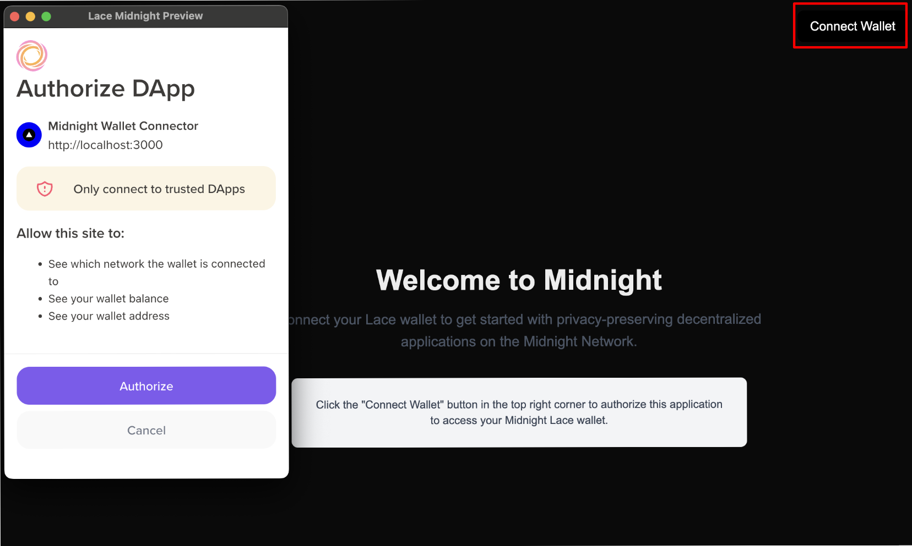
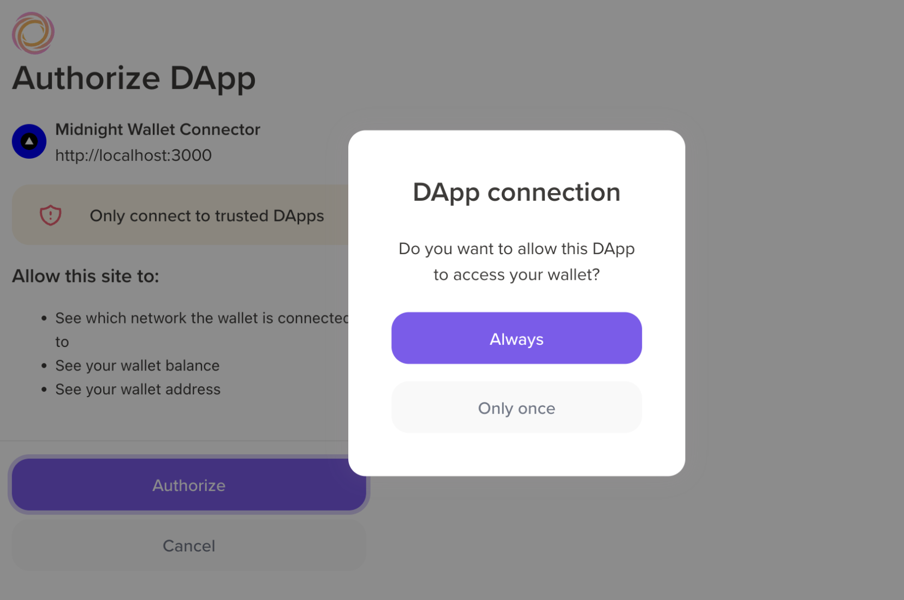
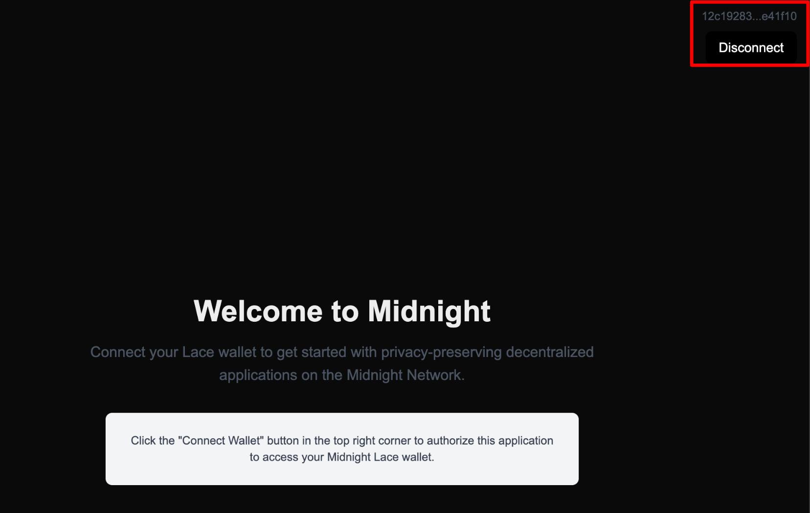
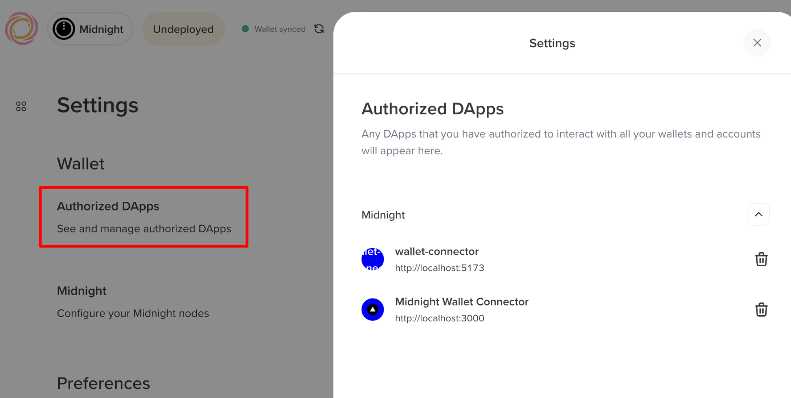

import Tabs from '@theme/Tabs';
import TabItem from '@theme/TabItem';
import Step, { StepsProvider } from "@site/src/components/Step/Step";

# Connect a wallet from your frontend

With a contract deployed, the next step is giving users a way to interact with it, and that starts with connecting their wallet. In this guide, you build a frontend that connects to a Midnight wallet using the DApp Connector API: a simple interface that displays connection status and wallet addresses, providing a foundation for more complex decentralized applications.

The same connection flow works in any frontend framework. This guide covers two popular setups side by side: pick the **Vite + React** tab for a plain single-page app, or the **Next.js** tab if you use server-side rendering and the App Router.

The code examples focus on core functionality and intentionally omit CSS styling. You can add your preferred styling solution (Tailwind, styled-components, CSS modules, etc.) to match your application's design.

## Prerequisites {#prerequisites}

Before you begin, make sure you have:

- Basic knowledge of TypeScript and JavaScript
- Familiarity with React fundamentals (components, state, hooks)
- Node.js and npm installed on your system
- A Midnight wallet extension, such as the [Midnight Lace wallet](https://chromewebstore.google.com/detail/lace/gafhhkghbfjjkeiendhlofajokpaflmk), installed in your browser

:::note
This guide uses the DApp Connector API v4.0.1. For more information, see the [DApp Connector API documentation](/api-reference/dapp-connector).
:::

## Build the wallet connection flow {#build-the-wallet-connection-flow}

<Tabs groupId="framework">
<TabItem value="react" label="Vite + React">

If you don't have a React project yet, create one using Vite:

```bash
npm create vite@latest my-wallet-app -- --template react-ts
cd my-wallet-app
```

Then install the DApp Connector API package:

```bash
npm install @midnight-ntwrk/dapp-connector-api
```

After completing this tutorial, you'll understand:

- The Midnight wallet connection flow
- How to use the DApp Connector API
- Best practices for managing wallet state in React applications

<StepsProvider>
<Step>

### Define TypeScript interfaces {#define-typescript-interfaces}

Start by creating type definitions for your components. These interfaces provide type safety and clear contracts between components.

Create a new file `types.ts` within the `src` directory and add the following code:

```typescript
export interface WalletCardProps {
  isConnected: boolean;
  walletAddress: string | null;
  onConnect: () => void;
  onDisconnect: () => void;
}
```

The `WalletCardProps` interface defines the shape of data your `WalletCard` component will receive. 
It includes the connection state, the wallet address, and callback functions for connect and disconnect actions.

</Step>
<Step>

### Create the WalletCard component {#create-the-walletcard-component}

Now you'll build the `WalletCard` component, which displays the wallet connection status and provides connect/disconnect buttons.

Create `WalletCard.tsx` within the `src` directory and add the following code:

```typescript
import React from "react";
import type { WalletCardProps } from "./types";

const WalletCard: React.FC<WalletCardProps> = ({
  isConnected,
  walletAddress,
  onConnect,
  onDisconnect,
}) => {
  return (
    <div>
      <div>
        <h2>Connection Status</h2>
        <div>
          {isConnected ? "Connected" : "Disconnected"}
        </div>
      </div>

      <div>
        {isConnected && walletAddress ? (
          <>
            <p>Wallet Address:</p>
            <p title={walletAddress}>{walletAddress}</p>
          </>
        ) : (
          <p>Please connect your wallet to proceed.</p>
        )}
      </div>

      <div>
        {isConnected ? (
          <button onClick={onDisconnect}>Disconnect Wallet</button>
        ) : (
          <button onClick={onConnect}>Connect Wallet</button>
        )}
      </div>
    </div>
  );
};

export default WalletCard;
```

This component handles the presentation layer of your wallet connection. It shows the current status, 
displays the address when connected, and provides appropriate action buttons based on the connection state.

</Step>
<Step>

### Select a wallet {#select-a-wallet}

Wallets inject their Initial API instances under the global `window.midnight` object, each keyed by a freshly generated UUID rather than a fixed name. A single browser may also have more than one wallet available at once, for example when two wallets are loaded from the same seed phrase. Because of this, you read the entries on `window.midnight` and choose one, rather than reaching for a hardcoded key.

Create a new file `selectWallet.ts` within the `src` directory and add the following code:

```typescript
import type { InitialAPI } from '@midnight-ntwrk/dapp-connector-api';

export const listWallets = (): InitialAPI[] => {
  const injected = window.midnight;
  return injected ? Object.values(injected) : [];
};

export const selectWallet = (): InitialAPI => {
  const wallets = listWallets();

  if (wallets.length === 0) {
    throw new Error('No Midnight wallet found. Please install a Midnight wallet extension.');
  }

  return wallets[0];
};
```

The `selectWallet` function reads the installed wallets and returns the first one, which keeps this example focused on the connection flow. When more than one wallet is available, the DApp Connector API specification expects you to let the user choose rather than picking for them. Use `listWallets` to render the options, and when displaying each wallet, render its `name` and `icon` safely to prevent XSS.

</Step>
<Step>

### Integrate the DApp Connector API {#integrate-the-dapp-connector-api}

Next, we'll use the `App` component to manage the wallet connection logic using the DApp Connector API and the `selectWallet` helper from the previous step.

Create or open `App.tsx` within the `src` directory and replace the existing code with the following:

```typescript App.tsx
import React, { useState } from 'react';
import WalletCard from './WalletCard';
import '@midnight-ntwrk/dapp-connector-api';
import { selectWallet } from './selectWallet';

const App: React.FC = () => {
  const [isConnected, setIsConnected] = useState<boolean>(false);
  const [walletAddress, setWalletAddress] = useState<string | null>(null);

  const handleConnect = async () => {
    console.log('Connect button clicked');
    let isConnected = false;
    let address = null;

    try {
      const wallet = selectWallet();

      // Connect to the specified network (use 'undeployed' for local development)
      const connectedApi = await wallet.connect('preprod');

      // Retrieve the unshielded address from the wallet
      const { unshieldedAddress } = await connectedApi.getUnshieldedAddress();
      address = unshieldedAddress;

      // Optional: Get the service URI configuration
      const serviceUriConfig = await connectedApi.getConfiguration();
      console.log('Service URI Config:', serviceUriConfig);

      // Check if the connection is established
      const connectionStatus = await connectedApi.getConnectionStatus();
      if (connectionStatus.status === 'connected') {
        isConnected = true;
        console.log("Connected to the wallet:", address);
      }
    } catch (error) {
      console.log("An error occurred:", error);
    }

    setIsConnected(isConnected);
    setWalletAddress(address);
  };

  const handleDisconnect = () => {
    setWalletAddress(null);
    setIsConnected(false);
  };

  return (
    <div>
      <header>
        <h1>Midnight Wallet Connector</h1>
      </header>
      <main>
        <WalletCard
          isConnected={isConnected}
          walletAddress={walletAddress}
          onConnect={handleConnect}
          onDisconnect={handleDisconnect}
        />
      </main>
    </div>
  );
};

export default App;
```

Let's break down the wallet connection process:

1. **Select a wallet**: The `selectWallet` helper reads the installed wallets from `window.midnight` and returns one to connect to. It throws if no wallet is found, which the surrounding `try/catch` handles.
2. **Connect to network**: Call the `connect()` method and pass the network ID as an argument. 
In our example, we used `'preprod'`. You can use `'undeployed'` for local development or `'preview'` for the Preview network.
3. **Retrieve the address**: After connecting to the network, call the `getUnshieldedAddress()` method to get the wallet's unshielded address. Request the shielded address only when your application actually needs it.
4. **Check status**: Verify the connection with `getConnectionStatus()`, which resolves to an object whose `status` is `'connected'` or `'disconnected'`.

The `handleConnect` event handler manages all these steps and updates your component's state accordingly. 
When users click the **Connect Wallet** button, their wallet will prompt them to authorize the connection.

</Step>
<Step>

### Set up the entry point {#set-up-the-entry-point}

Create the entry point that bootstraps your React application. For this, create or open `main.tsx` within the `src` directory 
and replace the existing code with the following:

```typescript
import { StrictMode } from 'react';
import { createRoot } from 'react-dom/client';
import App from './App.tsx';

createRoot(document.getElementById('root')!).render(
  <StrictMode>
    <App />
  </StrictMode>,
);
```

Finally, create or open `index.html` in the project root and replace the existing code with the following:

```html
<!doctype html>
<html lang="en">
  <head>
    <meta charset="UTF-8" />
    <meta name="viewport" content="width=device-width, initial-scale=1.0" />
    <title>Midnight Wallet Connector</title>
  </head>
  <body>
    <div id="root"></div>
    <script type="module" src="/src/main.tsx"></script>
  </body>
</html>
```

</Step>
<Step>

### Run your application {#run-your-application}

After setting up the entry point, start your development server:

```bash
npm run dev
```

Now, open your browser and navigate to the local development URL (typically `http://localhost:5173`). 

When you click **Connect Wallet**, your wallet extension will prompt you to authorize the connection. 


After approval, your application will display the connection status and your wallet's unshielded address.


</Step>
</StepsProvider>

</TabItem>
<TabItem value="nextjs" label="Next.js">

If you don't have a Next.js project yet, create one using the following command:

```bash
npm create-next-app@latest <project-name>
```

When prompted, select the following options:
- **TypeScript**: Yes
- **ESLint**: Yes
- **Tailwind CSS**: Yes (optional, but recommended)
- **App Router**: Yes
- **Other options**: Choose based on your preference

Then navigate to the project directory and install the DApp Connector API package:

```bash
cd <project-name>
npm install @midnight-ntwrk/dapp-connector-api
```

After completing this tutorial, you'll understand:

- How to integrate wallet connections in Next.js applications
- The differences between client and server components when working with wallets
- How to manage wallet state in Next.js
- Best practices for using the DApp Connector API in Next.js

<StepsProvider>
<Step>

### Create the wallet selection helper {#nextjs-create-the-wallet-selection-helper}

Wallets inject their Initial API instances under the global `window.midnight` object, each keyed by a freshly generated UUID rather than a fixed name such as `mnLace`. A single browser may also have more than one wallet available at once. Because of this, you read the entries on `window.midnight` and choose one, rather than reaching for a hardcoded key.

Create `app/components/selectWallet.ts`:

```typescript
import type { InitialAPI } from '@midnight-ntwrk/dapp-connector-api';

export const listWallets = (): InitialAPI[] => {
  const injected = window.midnight;
  return injected ? Object.values(injected) : [];
};

export const selectWallet = (): InitialAPI => {
  const wallets = listWallets();

  if (wallets.length === 0) {
    throw new Error('No Midnight wallet found. Please install a Midnight wallet extension.');
  }

  return wallets[0];
};
```

The `selectWallet` function reads the installed wallets and returns the first one, which keeps this example focused on the connection flow. When more than one wallet is available, the DApp Connector API specification expects you to let the user choose rather than picking for them. Use `listWallets` to render the options, and when displaying each wallet, render its `name` and `icon` safely to prevent XSS.

</Step>
<Step>

### Create the wallet connection component {#create-the-wallet-connection-component}

You'll build a client-side component that handles wallet connection. Since wallet interactions require browser APIs, this component must run on the client side using Next.js's `"use client"` directive.

Create `app/components/ConnectWalletButton.tsx`:

```typescript
"use client"; // Next.js directive for client-side rendering

import { useState } from "react";
import "@midnight-ntwrk/dapp-connector-api";
import { selectWallet } from "./selectWallet";

export default function ConnectWalletButton() {
  const [connected, setConnected] = useState(false);
  const [walletAddress, setWalletAddress] = useState<string | null>(null);

  const handleConnect = async () => {
    try {
      // Select an installed Midnight wallet from window.midnight
      const wallet = selectWallet();
      
      // Connect to the specified network (use 'undeployed' for local development)
      const connectedApi = await wallet.connect('preprod');
      
      // Retrieve the shielded addresses from the wallet
      const addresses = await connectedApi.getShieldedAddresses();
      const address = addresses.shieldedAddress;

      // Check if the connection is established
      const connectionStatus = await connectedApi.getConnectionStatus();
      
      if (connectionStatus.status === 'connected') {
        setConnected(true);
        setWalletAddress(address);
        console.log("Connected to wallet:", address);
      }
    } catch (error) {
      console.log("Failed to connect:", error);
    }
  };

  const handleDisconnect = () => {
    setConnected(false);
    setWalletAddress(null);
  };

  return (
    <nav className="flex items-center w-full p-4">
      <div className="ml-auto flex flex-col items-end gap-2">
        {connected && walletAddress && (
          <div className="text-sm text-gray-600">
            {walletAddress.slice(0, 8)}...{walletAddress.slice(-6)}
          </div>
        )}
        <button
          type="button"
          onClick={connected ? handleDisconnect : handleConnect}
          className="px-4 py-2 rounded-lg bg-black text-white hover:bg-gray-800 transition-colors"
        >
          {connected ? "Disconnect" : "Connect Wallet"}
        </button>
      </div>
    </nav>
  );
}
```

This component manages the wallet connection flow:

1. **Client-side rendering**: The `"use client"` directive ensures this component runs in the browser where wallet APIs are available.
2. **State management**: Uses React's `useState` hook to track connection status and wallet address.
3. **Connection logic**: The `handleConnect` function selects an installed wallet with the `selectWallet` helper, connects to the specified network, and retrieves the wallet's shielded address.
4. **User feedback**: Displays the wallet address (truncated) and provides connect/disconnect actions.

</Step>
<Step>

### Add the component to your layout {#add-the-component-to-your-layout}

Now integrate the wallet button into your application's layout so it appears on every page.

Update `app/layout.tsx`:

```typescript
import type { Metadata } from "next";
import "./globals.css";
import ConnectWalletButton from "./components/ConnectWalletButton";

export const metadata: Metadata = {
  title: "Midnight Wallet Connector",
  description: "Connect to a Midnight wallet",
};

export default function RootLayout({
  children,
}: {
  children: React.ReactNode;
}) {
  return (
    <html lang="en">
      <body>
        <ConnectWalletButton />
        <main className="container mx-auto px-4 py-8">
          {children}
        </main>
      </body>
    </html>
  );
}
```

The `ConnectWalletButton` component now appears at the top of every page in your application. Next.js's layout system makes it easy to create persistent UI elements across routes.

</Step>
<Step>

### Create a welcome page {#create-a-welcome-page}

Create a simple landing page that encourages users to connect their wallet.

For this, replace the content of `app/page.tsx` with the following:

```typescript
export default function Home() {
  return (
    <div className="flex flex-col items-center justify-center min-h-[60vh] text-center">
      <h1 className="text-4xl font-bold mb-4">
        Welcome to Midnight
      </h1>
      <p className="text-lg text-gray-600 mb-8 max-w-2xl">
        Connect your Lace wallet to get started with privacy-preserving
        decentralized applications on the Midnight Network.
      </p>
      <div className="bg-gray-100 p-6 rounded-lg max-w-xl">
        <p className="text-sm text-gray-700">
          Click the "Connect Wallet" button in the top right corner to authorize
          this application to access your Midnight Lace wallet.
        </p>
      </div>
    </div>
  );
}
```

</Step>
<Step>

### Run your application {#nextjs-run-your-application}

Start the Next.js development server:

```bash
npm run dev
```

Open your browser and navigate to `http://localhost:3000`.

When you click **Connect Wallet**, the Midnight Lace wallet extension prompts you to authorize the connection. 



The wallet asks you to choose your preferred authorization level:

- **Always**: Grants persistent authorization. The application remains authorized even after closing your browser, and you won't need to reconnect on future visits.
- **Only once**: Grants temporary authorization. You must reauthorize the connection each time you visit the application.



After approval, the button changes to "Disconnect" and displays your truncated wallet address.



</Step>
<Step>

### Verify the connection {#verify-the-connection}

You can verify that your wallet is connected to the application:

1. Open the Midnight Lace wallet extension in your browser.
2. Click on your wallet name in the top right corner, then select **Settings**.
3. Navigate to **Authorized DApps**.

You should see `http://localhost:3000` listed as an authorized application.



You can revoke access at any time from this panel by clicking the **trash** icon next to the application.

</Step>
</StepsProvider>

</TabItem>
</Tabs>

## Troubleshooting {#troubleshooting}

The following are some common issues you might encounter and how to resolve them.

### "window is not defined" error (Next.js only)

This error occurs because Next.js tries to render components on the server by default, but wallet APIs only exist in the browser environment.

**How to fix it**: Make sure your wallet component includes the `"use client"` directive at the top of the file.

### Wallet not detected

If you see errors about `window.midnight` being undefined, or `No Midnight wallet found`:

- Verify a Midnight wallet extension is installed and enabled in your browser.
- Refresh the page after installing or enabling the extension.
- Confirm you are reading the wallet from `window.midnight` by enumeration (`Object.values(window.midnight)`) and not from a fixed key such as `window.midnight.mnLace`. Wallets inject their Initial API under a UUID key, so a hardcoded name resolves to `undefined`.
- Check the browser console for any extension-related errors.
- In Next.js, ensure you're testing in a browser, not during server-side rendering.

### Connection fails

If the connection attempt fails:

- Ensure the network ID specified in the `connect()` method matches the network ID configured in your wallet. For local development, use `'undeployed'`. For the Preprod environment, use `'preprod'`.
- Check that the wallet is unlocked and synced.
- Review the browser console for specific error messages.
- Verify the DApp Connector API package is correctly installed.

## Next steps {#next-steps}

Now that you have a working wallet connector, you can extend your application with additional functionality:

- **Transfer coins**: Implement a form that allows users to send tokens to other addresses.
- **Sign messages**: Add a text input where users can sign arbitrary messages with their wallet.
- **Display balances**: Show the user's token balances for different assets.
- **Transaction history**: Query and display the user's transaction history.
- **Multi-network support**: Add a network selector to switch between different Midnight networks.
- **Create protected routes** (Next.js): Use Next.js middleware to restrict access to pages that require wallet connection.

## Reference {#reference}

- [DApp Connector API documentation](/api-reference/dapp-connector)
- [Next.js documentation](https://nextjs.org/docs)
- [Midnight Lace wallet](https://chromewebstore.google.com/detail/lace/gafhhkghbfjjkeiendhlofajokpaflmk)
