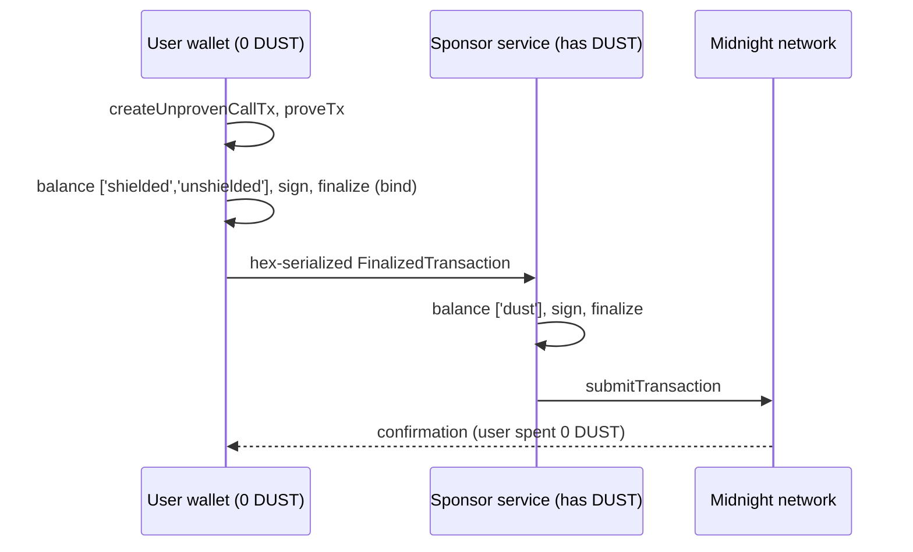

# Sponsor transaction fees with DUST

DUST sponsorship lets one wallet pay transaction fees on behalf of another. The user authorizes the action, the sponsor pays the DUST fee, and the two roles never mix. The result is a gasless experience: a user with zero DUST can transact from their first click.

:::info What this page assumes
You know that Midnight transactions cost [DUST](../concepts/dust-architecture.mdx), that DUST generates from NIGHT registered for DUST generation, and that circuits run on the user's device. All code on this page comes from the reference implementation in [example-private-party](https://github.com/midnightntwrk/example-private-party), summarized in its [SPONSORSHIP.md](https://github.com/midnightntwrk/example-private-party/blob/main/docs/SPONSORSHIP.md). Check the [support matrix](../relnotes/support-matrix.mdx) for tested component versions.
:::

## The problem sponsorship solves

A new user installs a wallet, opens your DApp, and clicks a button. Nothing happens: transactions cost DUST, DUST comes from holding registered NIGHT over time, and a brand-new user has neither. Sponsorship removes that wall for onboarding flows, free tiers, and enterprise deployments where the organization covers usage.

## The principle: who pays is not who is authorized

| Role | Holds | Can do | Cannot do |
|---|---|---|---|
| User | The contract secret, zero DUST | Prove and authorize the action | Pay the fee |
| Sponsor | NIGHT registered for DUST generation | Add a DUST fee offer and submit | Act as the user, alter the sealed transaction, or reach the user's secret |

Three mechanisms enforce the separation:

1. **The smart contract authenticates by secret, not by fee payer.** In the reference example, the `checkIn` circuit requires `commitAddress(_secret, address.bytes)` to match the RSVP on the ledger. Only a caller who knows the secret can produce a valid proof, so the sponsor's money buys nothing but the fee.
2. **The user binds the transaction first.** The user proves, balances its own side, signs, and finalizes before the handoff. What crosses the wire is a bound `FinalizedTransaction` the sponsor can add a DUST fee offer to, and nothing else.
3. **The network rejects modified transactions.** A cryptographic binding ties the contract call to the transaction. Change anything after finalization, and verification fails.

:::danger Never authenticate with ownPublicKey()
`ownPublicKey()` is a witness: the prover's machine chooses its return value, and the protocol never checks it against the signing wallet. Any check built on it is bypassable, by the sponsor or by anyone else. Authorization must come from proving knowledge of a secret, as the reference contract does. Use `ownPublicKey()` only to route tokens to the caller.
:::

## The flow



The split is enforced by one option, `tokenKindsToBalance`: the user balances `['shielded', 'unshielded']` to cover the transaction's value, and the sponsor balances `['dust']` to cover its fee. The user is always the prover, so the secret that authenticates the caller never reaches the sponsor.

## The user side: prove, balance, bind

From `src/sponsor.ts` in the reference implementation. The hex string this returns is the network boundary: in production this function runs where the user's keys live, such as a browser wallet.

```ts title="src/sponsor.ts (user side)"
export async function prepareSponsoredCall<
  C extends Contract.Any,
  PCK extends Contract.ProvableCircuitId<C>,
>(
  logger: Logger,
  user: MidnightWalletProvider,
  providers: PartyProviders,
  call: CallTxOptionsWithPrivateStateId<C, PCK>,
): Promise<string> {
  const unsubmitted = await createUnprovenCallTx<C, PCK>(providers, call);

  // Proving happens here, on the user's side — which is why the secret that
  // authenticates the caller never reaches the sponsor.
  const unboundTx = await providers.proofProvider.proveTx(unsubmitted.private.unprovenTx);

  // Balance only the user's own value side (no DUST), sign, and bind.
  const finalized = await user.balanceOwnValueAndFinalize(unboundTx);

  return toHex(finalized.serialize());
}
```

Note what is not here: no DUST, no fee estimation, no sponsor keys. A wallet with zero DUST can run every line. Inside `balanceOwnValueAndFinalize`, the wallet calls `balanceUnboundTransaction` with `tokenKindsToBalance: ['shielded', 'unshielded']`, then `signRecipe`, then `finalizeRecipe`.

## The sponsor side: pay the fee, submit

Typically a small backend service. It can apply acceptance policy, such as rate limits and allowlists, before spending anything.

```ts title="src/sponsor.ts (sponsor side)"
export async function sponsorAndSubmit(
  logger: Logger,
  sponsor: MidnightWalletProvider,
  userTxHex: string,
): Promise<string> {
  // The marker triple matches FinalizedTransaction = Transaction<SignatureEnabled, Proof, Binding>.
  const userTx = Transaction.deserialize<SignatureEnabled, Proof, Binding>(
    'signature',
    'proof',
    'binding',
    fromHex(userTxHex),
  );

  // Attach a DUST fee offer paid by the sponsor, then submit.
  const sponsored = await sponsor.addDustFeesAndFinalize(userTx);

  const txId = await sponsor.wallet.submitTransaction(sponsored);
  return txId;
}
```

Inside `addDustFeesAndFinalize`, the wallet calls `balanceFinalizedTransaction` with `tokenKindsToBalance: ['dust']`, then `signRecipe`, then `finalizeRecipe`. The sponsor is a payer, never an author.

## Why the order matters

The user proves, balances, signs, and finalizes **first**. Because the sponsor receives an already-bound transaction, the guarantees fall out of the mechanism itself:

| Guarantee | Why it holds |
|---|---|
| The sponsor cannot alter the call | The transaction is bound before handoff; the network rejects modifications |
| The sponsor cannot reach the secret | The user generated the proof; only the proof travels |
| The sponsor cannot act as the user | The contract authenticates by secret, which the sponsor does not hold |
| The user cannot spend the sponsor's funds | The sponsor balances only `['dust']`, signs its own additions, and applies policy first |
| DUST cannot be extracted from the sponsor | DUST is not transferable; it can only be spent on fees the sponsor approves |

:::warning Follow this exact ordering
If the user hands over an unbalanced or unsigned transaction, the receiving side could reshape it. Balance, sign, and finalize on the user's side before anything leaves the user's machine.
:::

## Run the reference example

The implementation ships in [example-private-party](https://github.com/midnightntwrk/example-private-party), where a zero-DUST guest checks in to a party while a sponsor pays the fee.

```bash
yarn env:up             # start the local environment
yarn wait:dust          # wait until the sponsor wallet has generated DUST
yarn test:sponsorship   # run the sponsored flow, including the negative cases
yarn sponsor:serve      # or run the sponsor as an HTTP service
```

| File | What it contains |
|---|---|
| `src/sponsor.ts` | `prepareSponsoredCall` (user side) and `sponsorAndSubmit` (sponsor side) |
| `src/wallet.ts` | The role-specific balancing methods described above |
| `src/test/sponsorship.test.ts` | Security validation: the sponsored happy path, plus proof that the payer cannot act and the actor cannot pay |
| `scripts/sponsor-service.ts` | The sponsor as a small HTTP service |

To adopt the pattern, swap in your own smart contract. Your contract supplies the authorization rule; the two functions and their ordering stay the same.

## Reference

**Token units:**

| Resource | Atomic unit | Ratio |
|---|---|---|
| NIGHT | STAR | 1 NIGHT = 10^6 STAR |
| DUST | SPECK | 1 DUST = 10^15 SPECK |

**DUST facts that shape sponsor economics:** DUST is not transferable and only pays fees. It generates from registered NIGHT toward a cap, roughly 5 DUST per NIGHT under initial parameters, and decays when the backing NIGHT is spent. Fees for the whole transaction are collected in the guaranteed phase, so a fallible-phase failure still consumes the fee. Smart contracts do not hold or spend DUST in the current protocol; sponsorship is a wallet-side mechanism.

**Errors you may meet** (submission failures surface as `1010: Invalid Transaction: Custom error: N`):

| Code | Name | Fix |
|---|---|---|
| `170` | `InvalidDustSpendProof` | Regenerate the DUST spend proof through the proof server |
| `173` | `InsufficientDustForRegistrationFee` | Wait for generation before registering; see `waitForGeneratedDust` in the wallet SDK |
| `196` | `DustDoubleSpend` | Stale wallet view reused spent DUST; resync the sponsor wallet and rebuild |

## Frequently asked questions

**Does registering NIGHT for DUST generation transfer or spend the NIGHT?** No. Registration designates UTXOs for generation; the NIGHT stays in the wallet and remains spendable, although spending it stops generation.

**Can the sponsor perform the action it is paying for?** No. Proving the circuit requires a secret the sponsor does not hold, so proof generation fails on the sponsor's machine before any fee is involved.

**Can a user drain the sponsor?** No. The sponsor balances only `['dust']`, signs its own additions, and can reject requests by policy before spending. DUST itself cannot be transferred out.

**Can a smart contract hold DUST and sponsor fees itself?** No. DUST spends preserve the owner's public key, and DUST wallets are wallet-side constructs. Sponsorship runs through a sponsor wallet or service.

## Next steps

- Clone [example-private-party](https://github.com/midnightntwrk/example-private-party) and run `yarn test:sponsorship`.
- Read the repository's [SPONSORSHIP.md](https://github.com/midnightntwrk/example-private-party/blob/main/docs/SPONSORSHIP.md) technical summary.
- Review [how transaction fees work](../concepts/how-midnight-works/semantics.mdx) for the guaranteed and fallible phase model behind fee collection.
