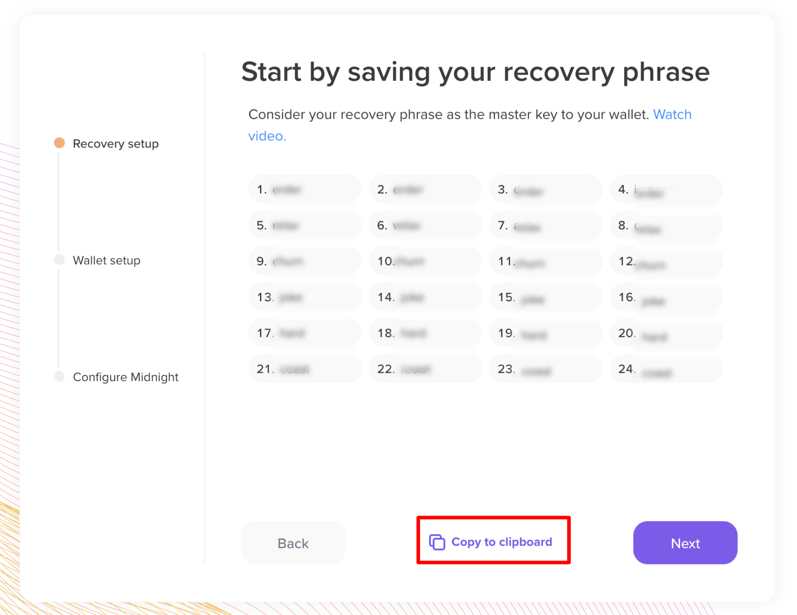
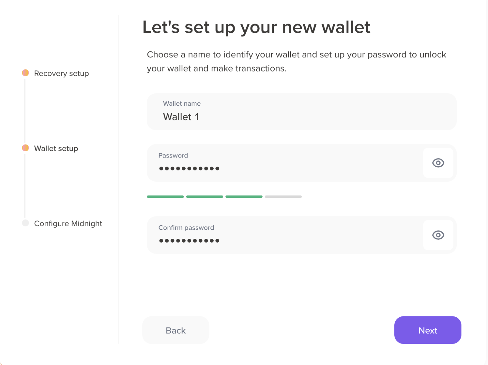
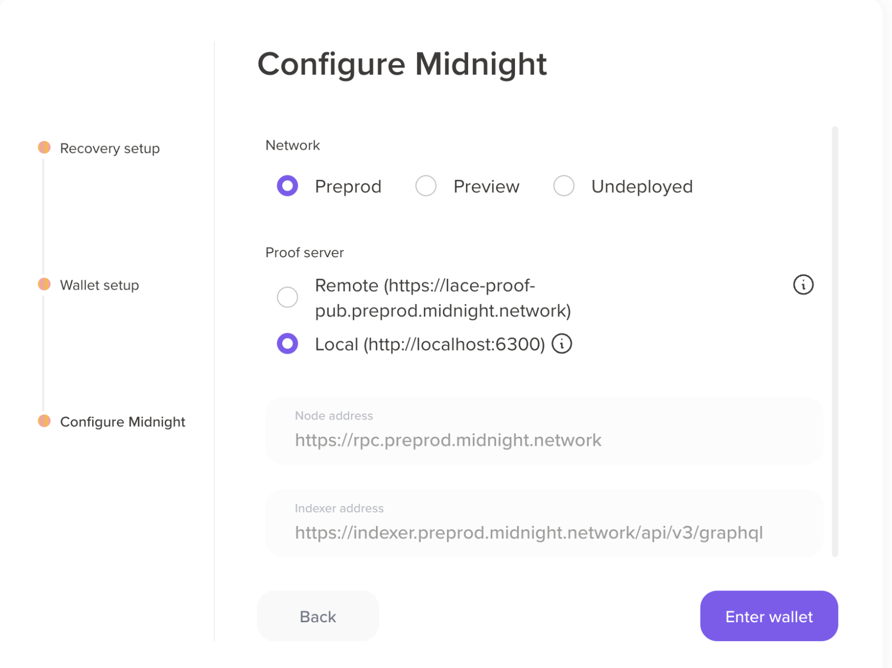
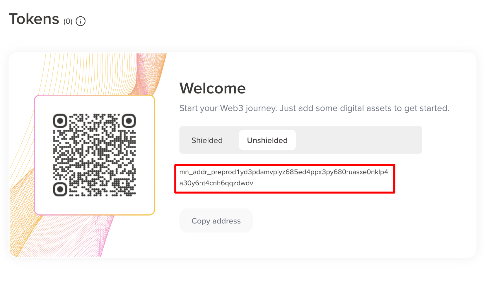

import Step, { StepsProvider } from '@site/src/components/Step/Step';

# Lace wallet

The Lace wallet is a Chrome extension. This guide is aimed at Testnet DApp users who are setting up the Lace wallet for the first time.

:::important Chrome browser

You must use the Chrome web browser or its derivatives to complete
web-based transactions on the Midnight testnet.

Only the Chrome browser itself is fully supported. The Lace
wallet may not be able to connect to your local proof server from
Chrome derivatives. If you choose to use Brave, for example, it is
necessary to disable Brave shields when running the Hello World DApp, so that the DApp (hosted at one address) can contact
your local proof server (hosted on your system, at a different
address) through the Lace extension.

:::

## Install the Lace Midnight Preview wallet

This section walks you through the process of installing the Lace Midnight Preview wallet, creating a new wallet, and getting test tokens.

### Download and install the Lace wallet extension

Lace Midnight Preview wallet is a browser extension for the Midnight Network. 
It is currently only compatible with Google Chrome. Here's how to install it:

<StepsProvider>
    <Step>Open the Google Chrome browser.</Step>
    <Step>Install the Midnight Lace wallet extension from the [Chrome Web Store](https://chromewebstore.google.com/detail/lace-beta/hgeekaiplokcnmakghbdfbgnlfheichg).</Step>
    <Step>Click **Add to Chrome** and confirm by clicking **Add extension**.</Step>
    <Step>Pin the extension to your toolbar for easy access (recommended).</Step>
</StepsProvider>

**Verification**: The Lace wallet icon appears in your Chrome toolbar.

### Create your wallet

To create a new wallet, follow these steps:

<StepsProvider>
    <Step>Click the Lace wallet icon in your browser's toolbar.</Step>
    <Step>Select the **Create** button to create a new wallet.</Step>
    <Step>Copy the seed phrase to your clipboard, and then click **Next** to continue.</Step>
    

    :::warning
    Write down your seed phrase on paper and store it in a secure, offline location. Never store it digitally or share it.
    :::

    <Step>Paste the seed phrase into the confirmation field, and then click **Confirm** to complete the setup.</Step>
    <Step>Enter your wallet name, choose a strong password, and click **Next** to continue.</Step>

    

    <Step>Choose your network and proof server address.</Step>

    

    <Step>Click **Enter wallet** to complete the setup.</Step>
</StepsProvider>

**Verification**: Your wallet dashboard opens, showing your shielded and unshielded wallet addresses.

### Get test tokens (tDUST)

tDUST is the network resource used to process transactions and interact with DApps on the Midnight Network. 
It has no real-world value and is used for testing transactions and interacting with DApps.

<StepsProvider>
    <Step>In your Lace wallet, click **Receive**, and then copy your Unshielded wallet address.</Step>
    
    <Step>Go to the Preprod Faucet: https://faucet.preprod.midnight.network/.</Step>
    <Step>Paste your address into the form and click **Request tokens**. Wait a few minutes for the tokens to arrive.</Step>
    <Step>Once the tokens are received, you must delegate them to your wallet to generate tDUST. Click **Generate tDUST** and select your wallet address.</Step>
    
    <Step>Click **Review transaction** to proceed, and then select **Confirm** to submit the transaction.</Step>
    
    <Step>Once the transaction is confirmed, you'll see your tDUST balance in your Lace wallet.</Step>
</StepsProvider>

**Verification**: Your Lace wallet shows a new balance of tDUST tokens.

## Next Steps

At this point, the Lace wallet displays a balance of tokens for interacting with testnet DApps. In order to process transactions, Lace requires a proof server to be running on your machine. Follow the [proof server guide](./run-proof-server) to get it up and running.

