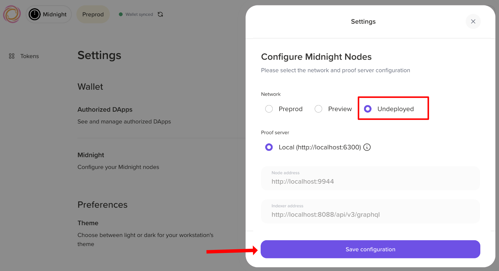
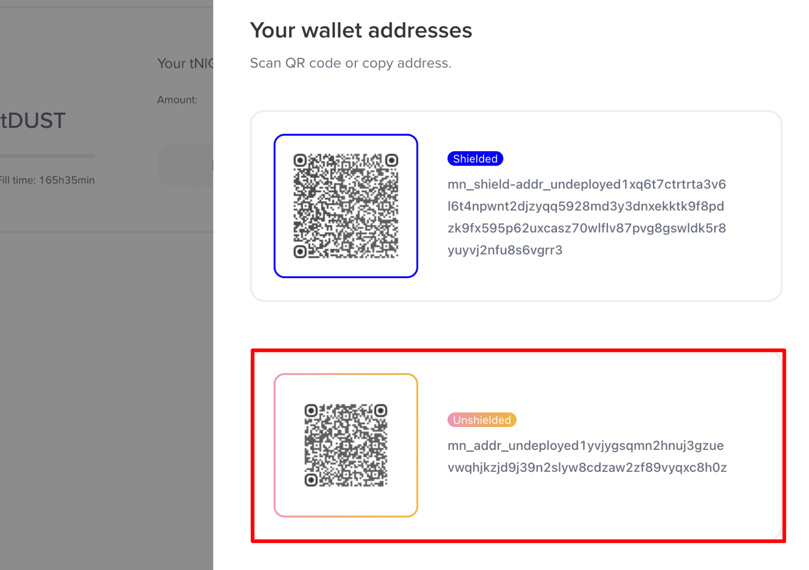

import Tabs from '@theme/Tabs';
import TabItem from '@theme/TabItem';
import Step, { StepsProvider } from "@site/src/components/Step/Step";

# From local network to testnet

A Midnight DApp usually grows through three stages: you test it against a local network with funded test wallets, you wire up the Midnight.js providers that connect your code to network services, and then you deploy to **Preprod**, the public Midnight testnet used for final testing before mainnet. This guide walks through all three stages in order.

## Prerequisites {#prerequisites}

Before you proceed, ensure you have:

- [Docker Desktop](https://docs.docker.com/get-docker/) installed and running. If you haven't set up your environment yet, start with [Set up your environment](./development-environment).
- Node.js version 22.x or higher installed. Install it using [NVM](https://github.com/nvm-sh/nvm).
- A compiled Compact smart contract with the `keys/` and `zkir/` directories generated. If you haven't done so yet, then follow the [build your first contract](../getting-started/hello-world) tutorial to get started.

## Run a local Midnight network {#local-network}

The local network is a standalone tool for running a local Midnight development network and funding test wallets in the undeployed network.

### Install the local network tool {#installation}

To get started, clone the [Midnight local network repository](https://github.com/midnightntwrk/midnight-local-dev):

```bash
git clone https://github.com/midnightntwrk/midnight-local-dev.git 
cd midnight-local-dev
```

Install the dependencies:

```bash
npm install
```

### Network services {#network-services}

The local network runs three Docker containers on the following ports:

| Service | Container Name | Port | URL |
|:---:|:---:|:---:|:---:|
| **Midnight Node** | `midnight-node` | `9944` | `http://localhost:9944` |
| **Indexer** (GraphQL) | `midnight-indexer` | `8088` | `http://localhost:8088/api/v4/graphql` |
| **Indexer** (WebSocket) | `midnight-indexer` | `8088` | `ws://localhost:8088/api/v4/graphql/ws` |
| **Proof Server** | `midnight-proof-server` | `6300` | `http://localhost:6300` |

All services use the `undeployed` network ID with the `dev` node preset.

#### Docker images {#docker-images}

The `standalone.yml` file in the root of the repository defines the Docker images and specific versions pulled when you start the local network. At the time of writing, it pins:

| Service | Image | Version |
|:---:|:---:|:---:|
| Node | `midnightntwrk/midnight-node` | `0.22.5` |
| Indexer | `midnightntwrk/indexer-standalone` | `4.0.2` |
| Proof Server | `midnightntwrk/proof-server` | `8.0.3` |

#### Wallet SDK packages {#wallet-sdk-packages}

The local network's funding tool is built on the [Wallet SDK](/sdks/official/wallet-developer-guide) and Midnight.js. The exact versions are pinned in the repository's `package.json`; the key packages are:

| Package | Version |
|:---:|:---:|
| `@midnight-ntwrk/wallet-sdk` | 1.0.0 |
| `@midnight-ntwrk/midnight-js-network-id` | 4.1.1 |
| `@midnight-ntwrk/testkit-js` | 4.1.1 |

### Start the local network {#start-the-local-network}

Once the installation is complete, start the local network by running the following command:

```bash
npm start
```

This single command does the following:

- **Pull** the latest Docker images for the Midnight node, indexer, and proof server.
- **Start** all three containers with health checks.
- **Initialize** the genesis master wallet (seed `0x00...001`) which holds all minted NIGHT tokens.
- **Register DUST** for the master wallet (required to pay transaction fees).
- **Display** the master wallet balance.
- **Present an interactive menu** for funding wallets in the undeployed network.

Once running, you'll see:

```
Choose an option:
  [1] Fund accounts from config file (NIGHT + DUST registration)
  [2] Fund accounts by public key (NIGHT transfer only)
  [3] Display master wallet balances
  [4] Exit
>
```

### Fund wallets {#fund-wallets}

The local network provides two options for funding wallets:

- Fund from a config file
- Fund by public key

Each funding operation transfers _50,000 tNIGHT_ from the genesis master wallet. You can fund up to _10 accounts_ per operation.

#### Option 1: Fund from a config file {#option-1-fund-from-a-config-file}

The config option handles wallet operations such as generating the wallet seed from mnemonic, transferring tNIGHT to the unshielded address, syncing the wallet, and registering tNIGHT for DUST generation.

It pulls wallet information from a config file, which is a JSON file with the following structure:

```json
{
  "accounts": [
    {
      "name": "Alice",
      "mnemonic": "abandon abandon abandon abandon abandon abandon abandon abandon abandon abandon abandon abandon abandon abandon abandon abandon abandon abandon abandon abandon abandon abandon abandon art"
    }
  ]
}
```
Here's a breakdown of the fields:

| Field | Type | Description |
|:---:|:---:|:---:|
| `accounts` | `array` | List of accounts to fund (max 10) |
| `accounts[].name` | `string` | Display name for logging |
| `accounts[].mnemonic` | `string` | BIP39 mnemonic phrase (24 words) |

An example file is provided at `accounts.example.json`. Copy the file to `accounts.json` and edit it to add your wallet mnemonics. 

```bash
cp accounts.example.json accounts.json
```

After editing the file, select option `[1] Fund accounts from config file (NIGHT + DUST registration)` from the interactive menu.

You are prompted to enter the path to the config file.

```
> 1
Path to accounts JSON file: ./accounts.json
```

The tool funds the wallets from the config file.

#### Option 2: Fund by public key {#option-2-fund-by-public-key}

The public key option allows you to fund wallets by their Bech32 addresses. You can fund up to 10 wallets at a time.

Select option `[2] Fund accounts by public key (NIGHT transfer only)` from the interactive menu.

You are prompted to enter the Bech32 addresses of the wallets you want to fund, separated by commas.

```
> 2
Enter Bech32 addresses (comma-separated): mn1q..., mn1q...
```

Each address receives _50,000 tNIGHT_. Recipients must register for DUST generation themselves before they can pay transaction fees.

### Connect a DApp {#connect-a-dapp}

Once the network is running, any Midnight DApp can connect using the standard localhost endpoints. 

Here's an example of how to connect a DApp to the local network:

```typescript
import { setNetworkId } from '@midnight-ntwrk/midnight-js-network-id';

setNetworkId('undeployed');

const config = {
  indexer: 'http://127.0.0.1:8088/api/v4/graphql',
  indexerWS: 'ws://127.0.0.1:8088/api/v4/graphql/ws',
  node: 'http://127.0.0.1:9944',
  proofServer: 'http://127.0.0.1:6300',
  networkId: 'undeployed',
};

// Use these endpoints with the Midnight wallet SDK, contract deployment, and other DApp operations
```

### Run the network standalone {#run-the-network-standalone}

If you only need the Docker containers running without the interactive menu for wallet initialization or funding, then you can use Docker Compose directly:

```bash
docker compose -f standalone.yml up -d
```

To check the status of the containers:

```bash
docker compose -f standalone.yml ps
```

To view the logs:

```bash
docker compose -f standalone.yml logs -f
```

This is useful when:
- Your DApp handles its own wallet initialization and funding.
- You want to keep the network running across multiple test sessions.
- You're debugging container-level issues.

:::note
In this mode, you must handle genesis wallet funding and DUST registration yourself.
:::

## Configure the Midnight.js providers {#configure-providers}

Providers are the modular components that the Midnight.js packages use to interact with the Midnight Network. Whether your contract targets the local network above or a public testnet, the providers are what connect your code to the right services. This section covers how to configure them before deploying or interacting with a Compact smart contract.

### The `MidnightProviders` type {#the-midnightproviders-type}

`MidnightProviders` is a generic type imported from `@midnight-ntwrk/midnight-js-types`. It accepts three arguments that are specific to your contract:

```typescript
import { type MidnightProviders } from '@midnight-ntwrk/midnight-js-types';

// CircuitKeys  — union of circuit names from your compiled contract
// PrivateStateId — literal type of your private state storage key
// PrivateState   — shape of your contract's private state object
type MyProviders = MidnightProviders<CircuitKeys, PrivateStateId, PrivateState>;
```

A `common-types.ts` file is a good place to keep these aliases, especially if your API and UI packages share the same contract types:

```typescript
import { type MidnightProviders } from '@midnight-ntwrk/midnight-js-types';
import { type FoundContract } from '@midnight-ntwrk/midnight-js-contracts';

export const myPrivateStateKey = 'myPrivateState';
export type PrivateStateId = typeof myPrivateStateKey;

export type MyCircuitKeys = 'circuitA' | 'circuitB';
export type MyProviders = MidnightProviders<MyCircuitKeys, PrivateStateId, MyPrivateState>;
```

### Set the network ID {#set-the-network-id}

Call `setNetworkId` before initializing any providers. All Midnight.js packages read this value to target the correct network.

```typescript
import { setNetworkId } from '@midnight-ntwrk/midnight-js-network-id';

setNetworkId('preprod'); 

/** Supported network IDs: 'mainnet', 'preview', 'preprod', 'undeployed' */
```

In Node.js environments, also polyfill `WebSocket` so that GraphQL subscriptions to the indexer work:

```typescript
import { WebSocket } from 'ws';

globalThis.WebSocket = WebSocket as unknown as typeof globalThis.WebSocket;
```

### Configure the providers {#configure-the-providers}

Each provider handles one specific capability in the transaction pipeline: 

- Storing private state
- Querying the indexer
- Generating ZK proofs
- Balancing transactions
- Submitting transactions on-chain

The following sections cover how to configure each provider.

#### `privateStateProvider` {#privatestateprovider}

The private state provider stores and retrieves the contract's private state on the local device. Private state is never sent to the network.

Use `levelPrivateStateProvider` from `@midnight-ntwrk/midnight-js-level-private-state-provider`. It persists private state to a LevelDB database encrypted with AES-256-GCM.

```typescript
import { levelPrivateStateProvider } from '@midnight-ntwrk/midnight-js-level-private-state-provider';

const privateStateProvider = levelPrivateStateProvider<PrivateStateId, MyPrivateState>({
  privateStateStoreName: 'my-contract-private-state',
  signingKeyStoreName: 'my-contract-private-state-signing-keys',
  privateStoragePasswordProvider: () => 'your-encryption-password',
});
```

The table below describes the parameters for the `levelPrivateStateProvider` function.

| Parameter | Description |
|-----------|-------------|
| `privateStateStoreName` | Name of the LevelDB store for private state |
| `signingKeyStoreName` | Name of the LevelDB store for signing keys |
| `privateStoragePasswordProvider` | Function returning the encryption password |

:::warning Password security

Do not use a hardcoded password in production. Derive it from wallet credentials or a secure key management system.

:::

#### `publicDataProvider` {#publicdataprovider}

The public data provider queries and subscribes to on-chain contract state via the Midnight indexer's GraphQL API. Use `indexerPublicDataProvider` from `@midnight-ntwrk/midnight-js-indexer-public-data-provider` in both Node.js and browser environments.

```typescript
import { indexerPublicDataProvider } from '@midnight-ntwrk/midnight-js-indexer-public-data-provider';

const publicDataProvider = indexerPublicDataProvider(
  'https://indexer.preprod.midnight.network/api/v4/graphql',     // HTTP query URL
  'wss://indexer.preprod.midnight.network/api/v4/graphql/ws',   // WebSocket subscription URL
);
```

For local development, use:

```typescript
const publicDataProvider = indexerPublicDataProvider(
  'http://localhost:8088/api/v4/graphql',
  'ws://localhost:8088/api/v4/graphql/ws',
);
```

:::info Local development

These are the endpoints of the [local Midnight network](#local-network) described earlier in this guide. Use the local network to test your contract and providers before deploying to a public network.

:::

#### `zkConfigProvider` {#zkconfigprovider}

The ZK configuration provider supplies the prover key, verifier key, and ZKIR artifacts that the proof provider needs to generate zero-knowledge proofs. The right implementation depends on where you store your ZK artifacts.

<Tabs groupId="runtime">
<TabItem value="nodejs" label="Node.js">

If you are running your contract in a Node.js environment, then use `NodeZkConfigProvider` from `@midnight-ntwrk/midnight-js-node-zk-config-provider`. It reads artifacts from the local filesystem. The path should point to the directory containing the compiled contract's `keys/` and `zkir/` output.

```typescript
import { NodeZkConfigProvider } from '@midnight-ntwrk/midnight-js-node-zk-config-provider';

const zkConfigProvider = new NodeZkConfigProvider<'circuitA' | 'circuitB'>(
  '/path/to/contract/src/managed/my-contract',
);
```

The type parameter is the union of circuit names your contract exposes. This is typically the same type as your `CircuitKeys` alias.

</TabItem>
<TabItem value="remote" label="Remote">

If your ZK artifacts are hosted on a remote server, then you can use `FetchZkConfigProvider` 
from the `@midnight-ntwrk/midnight-js-fetch-zk-config-provider` package. It fetches artifacts over HTTP from a URL.

```typescript
import { FetchZkConfigProvider } from '@midnight-ntwrk/midnight-js-fetch-zk-config-provider';

const zkConfigProvider = new FetchZkConfigProvider<'circuitA' | 'circuitB'>('https://example.com/zk-artifacts');
```

</TabItem>
</Tabs>

#### `proofProvider` {#proofprovider}

The proof provider calls the Midnight proof server to generate zero-knowledge proofs from unproven transactions. Use `httpClientProofProvider` from `@midnight-ntwrk/midnight-js-http-client-proof-provider`.

It takes the proof server URL and the `zkConfigProvider` instance. The proof server needs access to the same ZK artifacts, which it retrieves via the `zkConfigProvider`.

```typescript
import { httpClientProofProvider } from '@midnight-ntwrk/midnight-js-http-client-proof-provider';

const proofProvider = httpClientProofProvider(
  'http://localhost:6300',  // proof server URL
  zkConfigProvider,
);
```

:::info Proof server

The proof server is a Docker container you run locally or point to a hosted instance. See the [proof server guide](./development-environment#run-the-proof-server) for setup instructions.

:::

#### `walletProvider` {#walletprovider}

The wallet provider exposes the public keys needed to receive shielded tokens and decrypts transaction data. It also balances unbound transactions by selecting UTXOs to cover fees and adding change outputs.

In a Node.js CLI, you can implement `WalletProvider` using the [Wallet SDK](/sdks/official/wallet-developer-guide) facade.

```typescript
import {
  type CoinPublicKey,
  type EncPublicKey,
  type FinalizedTransaction,
  ZswapSecretKeys,
  DustSecretKey,
} from '@midnight-ntwrk/ledger-v8';
import { type WalletProvider, UnboundTransaction } from '@midnight-ntwrk/midnight-js-types';
import { ttlOneHour } from '@midnight-ntwrk/midnight-js-utils';
import { type WalletFacade } from '@midnight-ntwrk/wallet-sdk-facade';

class MyWalletProvider implements WalletProvider {
  constructor(
    private readonly wallet: WalletFacade,
    private readonly zswapSecretKeys: ZswapSecretKeys,
    private readonly dustSecretKey: DustSecretKey,
  ) {}

  getCoinPublicKey(): CoinPublicKey {
    return this.zswapSecretKeys.coinPublicKey;
  }

  getEncryptionPublicKey(): EncPublicKey {
    return this.zswapSecretKeys.encryptionPublicKey;
  }

  async balanceTx(tx: UnboundTransaction, ttl: Date = ttlOneHour()): Promise<FinalizedTransaction> {
    const recipe = await this.wallet.balanceUnboundTransaction(
      tx,
      { shieldedSecretKeys: this.zswapSecretKeys, dustSecretKey: this.dustSecretKey },
      { ttl },
    );
    return await this.wallet.finalizeRecipe(recipe);
  }
}
```

The class takes a `WalletFacade` instance together with the `ZswapSecretKeys` and `DustSecretKey` derived from the wallet seed. It exposes three methods that the SDK calls during the transaction lifecycle:

- `getCoinPublicKey`: Returns the shielded address used to receive tokens.
- `getEncryptionPublicKey`: Returns the key used to decrypt incoming shielded transaction data.
- `balanceTx`: Selects UTXOs to cover fees, adds change outputs, and finalizes the transaction ready for proof generation and submission.

:::warning DUST requirements

DUST is the network resource that fuels transactions on the Midnight Network. You must have DUST in your wallet to pay for transaction fees. For more information, see the [Generating DUST programmatically](./generating-dust-programmatically) guide.

:::

The same class that implements `WalletProvider` can also implement `MidnightProvider`, since the `WalletFacade` exposes both capabilities.

```typescript
import { type MidnightProvider } from '@midnight-ntwrk/midnight-js-types';
import { type FinalizedTransaction } from '@midnight-ntwrk/ledger-v8';

class MyWalletProvider implements WalletProvider, MidnightProvider {
  // ...other methods...

  submitTx(tx: FinalizedTransaction): Promise<string> {
    return this.wallet.submitTransaction(tx);
  }
}
```

A single instance is then passed as both `walletProvider` and `midnightProvider` in the providers object.

### Assemble the providers object {#assemble-the-providers-object}

Once each provider is initialized, assemble them into the `MidnightProviders` object and pass it to your smart contract API.

```typescript
import { levelPrivateStateProvider } from '@midnight-ntwrk/midnight-js-level-private-state-provider';
import { indexerPublicDataProvider } from '@midnight-ntwrk/midnight-js-indexer-public-data-provider';
import { httpClientProofProvider } from '@midnight-ntwrk/midnight-js-http-client-proof-provider';
import { NodeZkConfigProvider } from '@midnight-ntwrk/midnight-js-node-zk-config-provider';

const zkConfigProvider = new NodeZkConfigProvider<MyCircuitKeys>('/path/to/contract/managed/my-contract');

const walletProvider = new MyWalletProvider(wallet, zswapSecretKeys, dustSecretKey);

const providers: MyProviders = {
  privateStateProvider: levelPrivateStateProvider<PrivateStateId, MyPrivateState>({
    privateStateStoreName: 'my-contract-private-state',
    signingKeyStoreName: 'my-contract-private-state-signing-keys',
    privateStoragePasswordProvider: () => 'your-encryption-password',
  }),
  publicDataProvider: indexerPublicDataProvider(
    'https://indexer.preprod.midnight.network/api/v4/graphql',
    'wss://indexer.preprod.midnight.network/api/v4/graphql/ws',
  ),
  zkConfigProvider,
  proofProvider: httpClientProofProvider('http://localhost:6300', zkConfigProvider),
  walletProvider,
  midnightProvider: walletProvider,
};
```

Pass this object to `deployContract` or `findDeployedContract`:

```typescript
import { deployContract, findDeployedContract } from '@midnight-ntwrk/midnight-js-contracts';

// Deploy a new contract
const deployed = await deployContract(providers, {
  compiledContract: CompiledMyContract,
  privateStateId: myPrivateStateKey,
  initialPrivateState: myInitialPrivateState,
});

// Or connect to an existing one
const deployed = await findDeployedContract(providers, {
  contractAddress,
  compiledContract: CompiledMyContract,
  privateStateId: myPrivateStateKey,
  initialPrivateState: myInitialPrivateState,
});
```

The `deployContract` and `findDeployedContract` functions take the `MidnightProviders` object and the contract details as parameters.

:::note Note

For more information on using these functions, see the [Midnight.js SDK](/sdks/official/midnight-js) documentation.

:::

## Deploy to Preprod {#deploy-to-preprod}

With a local run under your belt and the providers understood, the last stage is deploying to a public testnet. The [Hello World tutorial](../getting-started/hello-world) deploys the contract to a Docker-based local devnet with pre-funded wallets. In this section, you deploy the same `example-hello-world` contract to **Preprod**. After deployment, the contract is visible on the Preprod block explorer and reachable from any Preprod indexer.

Before you begin, ensure you have:

- Completed the [Hello World tutorial](../getting-started/hello-world) against the local devnet (`yarn test:local` passing).
- A clone of [`example-hello-world`](https://github.com/midnightntwrk/example-hello-world) with the contract already compiled (`contracts/managed/hello-world/` populated).
- A Midnight-compatible wallet (such as Lace or 1AM) configured for the Preprod network, or an existing 24-word mnemonic / 64-character hex seed you control.
- Docker engine running (the proof server runs as a container).

<StepsProvider>
<Step>

### Generate a wallet {#generate-a-wallet}

You need a wallet on the Preprod network to sign the deployment and call transactions. The test suite accepts either a 24-word BIP-39 mnemonic or a 64-character hex seed; pick whichever your wallet exports.

**Using a Midnight-compatible wallet** (such as Lace or 1AM):
1. In your wallet, switch the network to **Preprod** and create a new wallet. Save the seed phrase securely.
2. Note your **Unshielded** address. You will paste it into the faucet in the next step.

Paste this seed phrase into `.env.preprod` in step 3.

**Bring your own key**: Any 24-word BIP-39 mnemonic or 64-hex-character seed works. The test suite derives both the shielded and unshielded keys from it.

</Step>
<Step>

### Fund the wallet with tNIGHT and tDUST {#fund-the-wallet-with-tnight-and-tdust}

Preprod transactions are paid in **tDUST**, which is generated by holding (and delegating) **tNIGHT**. Request tNIGHT from the faucet for your Unshielded address, then delegate it to start generating tDUST. [Fund your wallet](./acquire-tokens) covers both stages and the common faucet issues. Without tDUST the test script fails with `Wallet.InsufficientFunds`.

:::tip Verify balances before continuing
Confirm both tNIGHT and tDUST balances in your wallet before running the test. Wait until the tDUST balance is non-zero. DUST generation begins only after the network confirms the delegation transaction on-chain.
:::

</Step>
<Step>

### Configure `.env.preprod` {#configure-envpreprod}

The repo ships with an example file. From the repository root:

```bash
cp .env.preprod.example .env.preprod
```

Open `.env.preprod` and **set only one** of the two variables. Delete the other line entirely. Defining both raises an error.

```bash
# Use this line if your wallet exports a 24-word phrase:
MIDNIGHT_PREPROD_MNEMONIC=word1 word2 word3 ... word24

# Or this line if you have a raw seed (hex, no 0x prefix):
MIDNIGHT_PREPROD_SEED=abcd1234...                  # 64 hex characters
```

:::warning Keep `.env.preprod` private
The file contains the secret that controls your Preprod wallet. It is already listed in `.gitignore`; do not commit it, share it, or paste it into chat.
:::

</Step>
<Step>

### Start the proof server {#start-the-proof-server}

The [proof server](./development-environment#run-the-proof-server) generates the zero-knowledge proofs the test submits to the network. On Preprod you only need the proof server itself, not the rest of the local devnet stack (the test connects to the public Preprod endpoints, so no local node or indexer is required).

In a separate terminal, from the project root:

```bash
yarn proof:up
```

This starts only the `proof-server` service from `compose.yml` and waits for it to become healthy on `http://127.0.0.1:6300`.

</Step>
<Step>

### Run the test against Preprod {#run-the-test-against-preprod}

Back in your main terminal:

```bash
yarn test:preprod
```

The script:

1. Build a wallet from the secret in `.env.preprod`.
2. Sync the wallet against the Preprod indexer. This can take a long time on first run (the default sync timeout is 60 minutes for remote networks, versus 10 for local). The log emits one line per state emission so you can watch progress.
3. Verify funds are available and register the wallet for DUST generation if not already registered.
4. Deploy the `hello-world` contract and submit a call to `storeMessage("Hello World!")`.

A successful run ends with output similar to:

```bash
INFO: Wallet sync complete after 23 emissions
INFO: Wallet NIGHT balance on 'preprod': ...
INFO: Providers initialized on 'preprod'. Ready to test!
INFO: Creating private state...
INFO: Setting the contract address...
INFO: Contract deployed at: bba6579743ae23b44301d4a9f8df30dbd5244d63a59d8fbc2c9fc7ea521a04f8
 ✓ src/test/hw.test.ts (2 tests)
   ✓ Hello World Contract (preprod) > Deploys the contract
   ✓ Hello World Contract (preprod) > Stores Hello World!
```

</Step>
<Step>

### Verify on the block explorer {#verify-on-the-block-explorer}

Copy the contract address from the log line `Contract deployed at: ...` and look it up on a Preprod explorer:

- [preprod.midnightexplorer.com](https://preprod.midnightexplorer.com/)
- [midnight-preprod.subscan.io](https://midnight-preprod.subscan.io/)

The explorer shows the deploy transaction and the subsequent call transaction.

</Step>
<Step>

### Shut down {#shut-down}

When you're done, stop the proof server:

```bash
yarn proof:down
```

The container exits but its image stays cached for the next run.

</Step>
</StepsProvider>

## Deploy to Preview {#deploy-to-preview}

The repository supports Preview with the same pattern:

1. Copy `.env.preview.example` to `.env.preview` and fill in `MIDNIGHT_PREVIEW_MNEMONIC` or `MIDNIGHT_PREVIEW_SEED`.
2. Fund the wallet from the [Preview faucet](https://midnight-tmnight-preview.nethermind.dev/) and delegate for tDUST.
3. Run `yarn test:preview`.

See [Environments and endpoints](../relnotes/network) for the full list of network URLs and explorers.

## Troubleshoot {#troubleshoot}

### Local network issues {#local-network-issues}

#### Port already in use {#port-already-in-use}

```
Error: Bind for 0.0.0.0:9944 failed: port is already allocated
```

Another process or a previous run is using the port. Stop it:

```bash
docker compose -f standalone.yml down
# or find and kill the process
lsof -i :9944
```

#### Invalid wallet address {#invalid-wallet-address}

If you receive an error similar to this:

```
Operation failed: Expected undeployed address, got Preprod address
```

It means you're trying to fund a wallet with a Preprod address. You need to use the Undeployed network address instead.

If you're using the Lace wallet, then you must configure the wallet to use the Undeployed network. 

1. In the Lace wallet extension, click the **Settings** icon and then select the **Network** tab. 
2. Under the Midnight section, select the **Undeployed** network and then click **Confirm**.



After that, you'll see your wallet addresses for the local Undeployed network. Make sure to use the Unshielded wallet address for the local Undeployed network.



#### Containers not starting {#containers-not-starting}

Check Docker is running and you have access to the Midnight Docker registry:

```bash
docker compose -f standalone.yml pull
docker compose -f standalone.yml up
```

Watch the logs for specific errors:

```bash
docker compose -f standalone.yml logs -f node
docker compose -f standalone.yml logs -f indexer
docker compose -f standalone.yml logs -f proof-server
```

#### Wallet sync takes too long {#wallet-sync-takes-too-long}

The indexer needs time to catch up with the node after startup. If the sync seems stuck:

1. Check the indexer logs: `docker compose -f standalone.yml logs -f indexer`
2. Verify the node is producing blocks: `curl http://localhost:9944/health`
3. Set `DEBUG_LEVEL=debug` in `.env` for more detailed wallet logs

### Preprod deployment issues {#preprod-deployment-issues}

**`Wallet.InsufficientFunds`**: The wallet has no spendable tDUST. Confirm in your wallet that the tDUST balance is non-zero (not just tNIGHT). DUST generation only starts after the delegation transaction is confirmed.

**Sync never completes**: Preprod sync from a brand-new wallet can be slow. If you hit the default 60-minute timeout, raise it with the `MIDNIGHT_SYNC_TIMEOUT_MS` environment variable:

```bash
MIDNIGHT_SYNC_TIMEOUT_MS=7200000 yarn test:preprod   # 2 hours
```

**`Set only one of MIDNIGHT_PREPROD_MNEMONIC or MIDNIGHT_PREPROD_SEED`**: You defined both variables in `.env.preprod`. Delete one.

**Proof server unreachable**: Check that `yarn proof:up` finished and `http://127.0.0.1:6300` responds. If port 6300 is in use, stop the conflicting process or change the host port in `compose.yml`.

## Next steps {#next-steps}

Your contract is live on a public testnet. From here the journey continues in two directions:

- [Work with your compiled contract](./work-with-compiled-contract): implement witnesses, call circuits, and write unit tests against the generated JavaScript implementation.
- Give your DApp a user interface by [connecting a wallet from your frontend](./react-wallet-connect).
