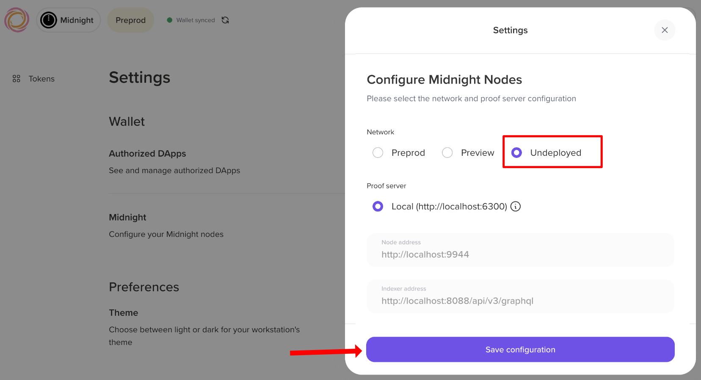
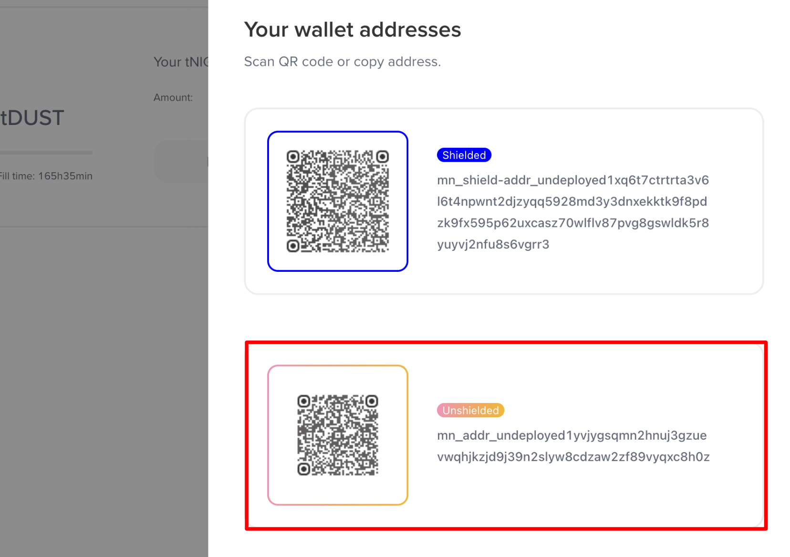

# Midnight local network

The local network is a standalone tool for running a local Midnight development network and funding test wallets.

This guide walks you through the process of setting up a local Midnight network and funding test wallets in the undeployed network.

## Prerequisites

Before you proceed, ensure you have::

- [Docker Desktop](https://docs.docker.com/get-docker/)
- Node.js >= 22.0.0

## Installation

To get started, clone the [Midnight local network repository](https://github.com/midnightntwrk/midnight-local-dev):

```bash
git clone https://github.com/midnightntwrk/midnight-local-dev.git 
cd midnight-local-dev
```

Install the dependencies:

```bash
npm install
```

## Network services

The local network runs three Docker containers on the following ports:

| Service | Container Name | Port | URL |
|:---:|:---:|:---:|:---:|
| **Midnight Node** | `midnight-node` | `9944` | `http://localhost:9944` |
| **Indexer** (GraphQL) | `midnight-indexer` | `8088` | `http://localhost:8088/api/v4/graphql` |
| **Indexer** (WebSocket) | `midnight-indexer` | `8088` | `ws://localhost:8088/api/v4/graphql/ws` |
| **Proof Server** | `midnight-proof-server` | `6300` | `http://localhost:6300` |

All services use the `undeployed` network ID with the `dev` node preset.

### Docker images

The `standalone.yml` file in the root of the repository defines the Docker images and specific versions pulled when you start the local network.

| Service | Image | Version |
|:---:|:---:|:---:|
| Node | `midnightntwrk/midnight-node` | `0.22.3` |
| Indexer | `midnightntwrk/indexer-standalone` | `4.0.1` |
| Proof Server | `midnightntwrk/proof-server` | `8.0.3` |

### Wallet SDK packages

The local network uses the following Wallet SDK packages:

| Package | Version |
|:---:|:---:|
| `@midnight-ntwrk/wallet-sdk-facade` | 3.0.0 |
| `@midnight-ntwrk/wallet-sdk-abstractions` | 2.0.0 |
| `@midnight-ntwrk/wallet-sdk-shielded` | 2.1.0 |
| `@midnight-ntwrk/wallet-sdk-dust-wallet` | 3.0.0 |
| `@midnight-ntwrk/wallet-sdk-unshielded-wallet` | 2.1.0 |
| `@midnight-ntwrk/wallet-sdk-address-format` | 3.1.0 |
| `@midnight-ntwrk/wallet-sdk-hd` | 3.0.1 |
| `@midnight-ntwrk/ledger-v8` | 8.0.3 |
| `@midnight-ntwrk/midnight-js-network-id` | 4.0.2 |

## Start the local network

Once the installation is complete, start the local network by running the following command:

```bash
npm start
```

This single command does the following:

- **Pull** the latest Docker images for the Midnight node, indexer, and proof server.
- **Start** all three containers with health checks.
- **Initialize** the genesis master wallet (seed `0x00...001`) which holds all minted NIGHT tokens.
- **Register DUST** for the master wallet (required to pay transaction fees).
- **Display** the master wallet balance.
- **Present an interactive menu** for funding wallets in the undeployed network.

Once running, you'll see:

```
Choose an option:
  [1] Fund accounts from config file (NIGHT + DUST registration)
  [2] Fund accounts by public key (NIGHT transfer only)
  [3] Display master wallet balances
  [4] Exit
>
```

## Fund wallets

The local network provides two options for funding wallets:

- Fund from a config file
- Fund by public key

Each funding operation transfers _50,000 tNIGHT_ from the genesis master wallet. You can fund up to _10 accounts_ per operation.

### Option 1: Fund from a config file

The config option handles wallet operations such as generating the wallet seed from mnemonic, transferring tNIGHT to the unshielded address, syncing the wallet, and registering tNIGHT for DUST generation.

It pulls wallet information from a config file, which is a JSON file with the following structure:

```json
{
  "accounts": [
    {
      "name": "Alice",
      "mnemonic": "abandon abandon abandon abandon abandon abandon abandon abandon abandon abandon abandon abandon abandon abandon abandon abandon abandon abandon abandon abandon abandon abandon abandon art"
    }
  ]
}
```
Here's a breakdown of the fields:

| Field | Type | Description |
|:---:|:---:|:---:|
| `accounts` | `array` | List of accounts to fund (max 10) |
| `accounts[].name` | `string` | Display name for logging |
| `accounts[].mnemonic` | `string` | BIP39 mnemonic phrase (24 words) |

An example file is provided at `accounts.example.json`. Copy the file to `accounts.json` and edit it to add your wallet mnemonics. 

```bash
cp accounts.example.json accounts.json
```

After editing the file, select option `[1] Fund accounts from config file (NIGHT + DUST registration)` from the interactive menu.

You are prompted to enter the path to the config file.

```
> 1
Path to accounts JSON file: ./accounts.json
```

The tool funds the wallets from the config file.

### Option 2: Fund by public key

The public key option allows you to fund wallets by their Bech32 addresses. You can fund up to 10 wallets at a time.

Select option `[2] Fund accounts by public key (NIGHT transfer only)` from the interactive menu.

You are prompted to enter the Bech32 addresses of the wallets you want to fund, separated by commas.

```
> 2
Enter Bech32 addresses (comma-separated): mn1q..., mn1q...
```

Each address receives _50,000 tNIGHT_. Recipients must register for DUST generation themselves before they can pay transaction fees.

## Connect a DApp

Once the network is running, any Midnight DApp can connect using the standard localhost endpoints. 

Here's an example of how to connect a DApp to the local network:

```typescript
import { setNetworkId } from '@midnight-ntwrk/midnight-js-network-id';

setNetworkId('undeployed');

const config = {
  indexer: 'http://127.0.0.1:8088/api/v4/graphql',
  indexerWS: 'ws://127.0.0.1:8088/api/v4/graphql/ws',
  node: 'http://127.0.0.1:9944',
  proofServer: 'http://127.0.0.1:6300',
  networkId: 'undeployed',
};

// Use these endpoints with the Midnight wallet SDK, contract deployment, and other DApp operations
```

## Run the network standalone

If you only need the Docker containers running without the interactive menu for wallet initialization or funding, then you can use Docker Compose directly:

```bash
docker compose -f standalone.yml up -d
```

To check the status of the containers:

```bash
docker compose -f standalone.yml ps
```

To view the logs:

```bash
docker compose -f standalone.yml logs -f
```

This is useful when:
- Your DApp handles its own wallet initialization and funding.
- You want to keep the network running across multiple test sessions.
- You're debugging container-level issues.

:::note
In this mode, you must handle genesis wallet funding and DUST registration yourself.
:::

## Troubleshoot

Below are some of the common issues that you might encounter and how to fix them.

### Port already in use

```
Error: Bind for 0.0.0.0:9944 failed: port is already allocated
```

Another process or a previous run is using the port. Stop it:

```bash
docker compose -f standalone.yml down
# or find and kill the process
lsof -i :9944
```

### Invalid wallet address

If you receive an error similar to this:

```
Operation failed: Expected undeployed address, got Preprod address
```

It means you're trying to fund a wallet with a Preprod address. You need to use the Undeployed network address instead.

If you're using the Lace wallet, then you need to configure the wallet to use the Undeployed network. 

1. In the Lace wallet extension, navigate to the **Settings** page and click **Midnight** under the Wallet section. 
2. Select the **Undeployed** network and click **Save configuration**.



After that, you'll see your wallet addresses for the local Undeployed network. Make sure to use the Unshielded wallet address for the local Undeployed network.



### Containers not starting

Check Docker is running and you have access to the Midnight Docker registry:

```bash
docker compose -f standalone.yml pull
docker compose -f standalone.yml up
```

Watch the logs for specific errors:

```bash
docker compose -f standalone.yml logs -f node
docker compose -f standalone.yml logs -f indexer
docker compose -f standalone.yml logs -f proof-server
```

### Wallet sync takes too long

The indexer needs time to catch up with the node after startup. If the sync seems stuck:

1. Check the indexer logs: `docker compose -f standalone.yml logs -f indexer`
2. Verify the node is producing blocks: `curl http://localhost:9944/health`
3. Set `DEBUG_LEVEL=debug` in `.env` for more detailed wallet logs

## Next steps

Now that you have a local network running, you can start building your DApp. See our guide to learn how to [deploy a contract](./deploy-mn-app) to the Midnight blockchain.
