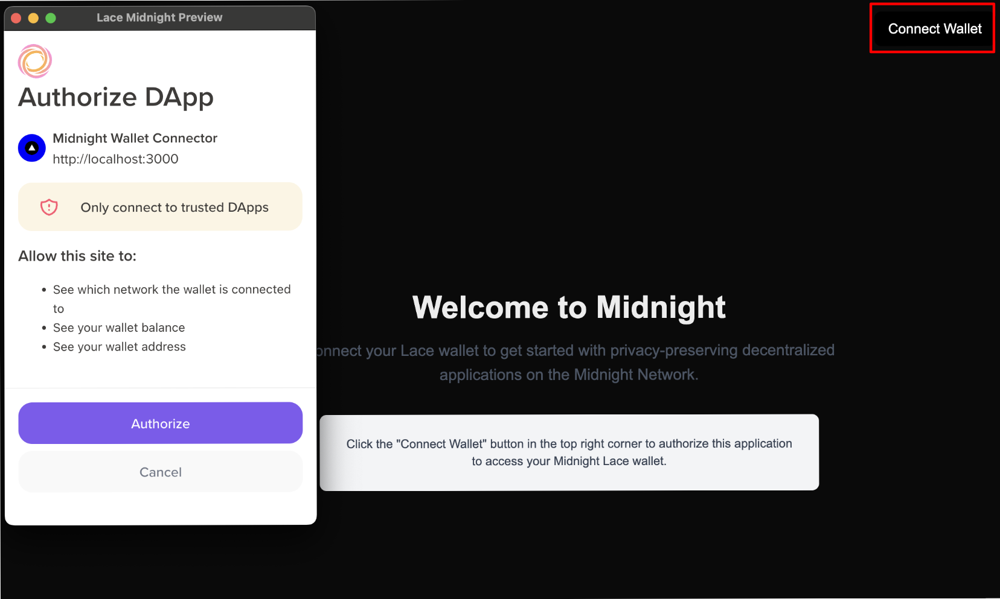
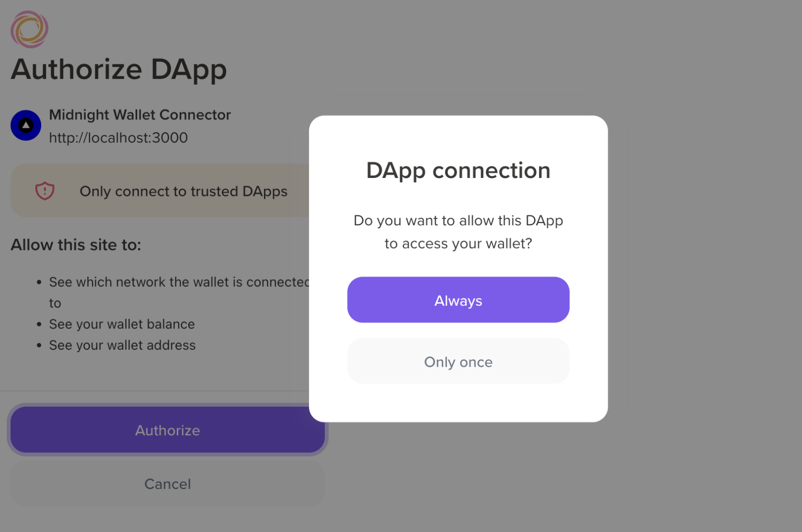
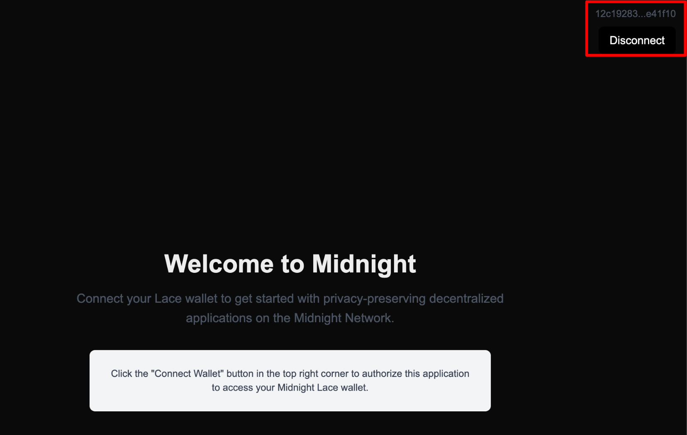
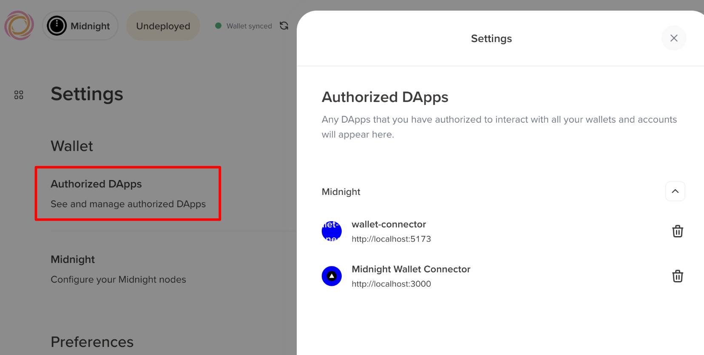

import Step, { StepsProvider } from "@site/src/components/Step/Step";

In this guide, you'll create a Next.js application that connects to the Midnight Lace wallet using the DApp Connector API. 
You'll build a wallet connection button that displays connection status, providing a foundation for building more complex DApps.

The code examples focus on core functionality and intentionally omit CSS styling. You can add your preferred styling solution (Tailwind, styled-components, CSS modules, etc.) to match your application's design.

## Prerequisites

Before you begin, make sure you have:

- Basic knowledge of TypeScript and JavaScript
- Familiarity with React and Next.js fundamentals
- Node.js and npm installed on your system
- [Midnight Lace wallet extension](./lace-wallet) installed in your browser

### Set up a Next.js project

If you don't have a Next.js project yet, create one using the following command:

```bash
npm create-next-app@latest <project-name>
```

When prompted, select the following options:
- TypeScript: Yes
- ESLint: Yes
- Tailwind CSS: Yes (optional, but recommended)
- App Router: Yes
- Other options: Choose based on your preference

Then navigate to the project directory and install the DApp Connector API package:

```bash
cd <project-name>
npm install @midnight-ntwrk/dapp-connector-api
```

:::note
This guide uses the DApp Connector API v4.0.0. For more information, see the [DApp Connector API documentation](/api-reference/dapp-connector).
:::

After completing this tutorial, you'll understand:

- How to integrate wallet connections in Next.js applications
- The differences between client and server components when working with wallets
- How to manage wallet state in Next.js
- Best practices for using the DApp Connector API in Next.js

<StepsProvider>
<Step>

## Create the wallet connection component

You'll build a client-side component that handles wallet connection. Since wallet interactions require browser APIs, this component must run on the client side using Next.js's `"use client"` directive.

Create `app/components/ConnectWalletButton.tsx`:

```typescript
"use client"; // Next.js directive for client-side rendering

import { useState } from "react";
import "@midnight-ntwrk/dapp-connector-api";
import type { InitialAPI } from "@midnight-ntwrk/dapp-connector-api";

export default function ConnectWalletButton() {
  const [connected, setConnected] = useState(false);
  const [walletAddress, setWalletAddress] = useState<string | null>(null);

  const handleConnect = async () => {
    try {
      // Access the Midnight Lace wallet through the window object
      const wallet: InitialAPI = await window.midnight!.mnLace;
      
      // Connect to the specified network (use 'undeployed' for local development)
      const connectedApi = await wallet.connect('undeployed');
      
      // Retrieve the shielded addresses from the wallet
      const addresses = await connectedApi.getShieldedAddresses();
      const address = addresses.shieldedAddress;

      // Check if the connection is established
      const connectionStatus = await connectedApi.getConnectionStatus();
      
      if (connectionStatus) {
        setConnected(true);
        setWalletAddress(address);
        console.log("Connected to wallet:", address);
      }
    } catch (error) {
      console.log("Failed to connect:", error);
    }
  };

  const handleDisconnect = () => {
    setConnected(false);
    setWalletAddress(null);
  };

  return (
    <nav className="flex items-center w-full p-4">
      <div className="ml-auto flex flex-col items-end gap-2">
        {connected && walletAddress && (
          <div className="text-sm text-gray-600">
            {walletAddress.slice(0, 8)}...{walletAddress.slice(-6)}
          </div>
        )}
        <button
          type="button"
          onClick={connected ? handleDisconnect : handleConnect}
          className="px-4 py-2 rounded-lg bg-black text-white hover:bg-gray-800 transition-colors"
        >
          {connected ? "Disconnect" : "Connect Wallet"}
        </button>
      </div>
    </nav>
  );
}
```

This component manages the wallet connection flow:

1. **Client-side rendering**: The `"use client"` directive ensures this component runs in the browser where wallet APIs are available.
2. **State management**: Uses React's `useState` hook to track connection status and wallet address.
3. **Connection logic**: The `handleConnect` function accesses the wallet through `window.midnight.mnLace`, connects to the specified network, and retrieves the wallet's shielded address.
4. **User feedback**: Displays the wallet address (truncated) and provides connect/disconnect actions.

</Step>
<Step>

## Add the component to your layout

Now integrate the wallet button into your application's layout so it appears on every page.

Update `app/layout.tsx`:

```typescript
import type { Metadata } from "next";
import "./globals.css";
import ConnectWalletButton from "./components/ConnectWalletButton";

export const metadata: Metadata = {
  title: "Midnight Wallet Connector",
  description: "Connect to Midnight Lace wallet",
};

export default function RootLayout({
  children,
}: {
  children: React.ReactNode;
}) {
  return (
    <html lang="en">
      <body>
        <ConnectWalletButton />
        <main className="container mx-auto px-4 py-8">
          {children}
        </main>
      </body>
    </html>
  );
}
```

The `ConnectWalletButton` component now appears at the top of every page in your application. Next.js's layout system makes it easy to create persistent UI elements across routes.

</Step>
<Step>

## Create a welcome page

Create a simple landing page that encourages users to connect their wallet.

For this, replace the content of `app/page.tsx` with the following:

```typescript
export default function Home() {
  return (
    <div className="flex flex-col items-center justify-center min-h-[60vh] text-center">
      <h1 className="text-4xl font-bold mb-4">
        Welcome to Midnight
      </h1>
      <p className="text-lg text-gray-600 mb-8 max-w-2xl">
        Connect your Lace wallet to get started with privacy-preserving
        decentralized applications on the Midnight Network.
      </p>
      <div className="bg-gray-100 p-6 rounded-lg max-w-xl">
        <p className="text-sm text-gray-700">
          Click the "Connect Wallet" button in the top right corner to authorize
          this application to access your Midnight Lace wallet.
        </p>
      </div>
    </div>
  );
}
```

</Step>
<Step>

## Run your application

Start the Next.js development server:

```bash
npm run dev
```

Open your browser and navigate to `http://localhost:3000`.

When you click "Connect Wallet", the Midnight Lace wallet extension will prompt you to authorize the connection. 



The wallet will ask you to choose your preferred authorization level:

- **Always**: Grants persistent authorization. The application will remain authorized even after closing your browser, and you won't need to reconnect on future visits.
- **Only once**: Grants temporary authorization. You'll need to reauthorize the connection each time you visit the application.



After approval, the button will update to show "Disconnect" and display your truncated wallet address.



</Step>
<Step>

## Verify the connection

You can verify that your wallet is connected to the application. To do so, open the Midnight Lace wallet extension in your browser
and click on your wallet name in the top right corner. 

Then, navigate to **Settings » Authorized DApps**. You should see `http://localhost:3000` listed as an authorized application.



You can revoke access at any time from this panel by clicking the **trash** icon next to the application.

</Step>
</StepsProvider>

## Troubleshooting

These are some of the common issues you might encounter and how to resolve them.

### "window is not defined" error

If you see this error, make sure your wallet component includes the `"use client"` directive at the top of the file. 
Next.js tries to render components on the server by default, but wallet APIs only exist in the browser.

### Wallet not detected

If you encounter errors about `window.midnight` being undefined:

- Verify the Midnight Lace wallet extension is installed and enabled.
- Refresh the page after installing the extension.
- Check the browser console for extension-related errors.
- Ensure you're testing in a browser (not during server-side rendering).

### Connection fails

If the connection attempt fails:

- Confirm you're using the correct network ID ('undeployed' for local development).
- Make sure the Lace wallet is unlocked.
- Check the browser console for specific error messages.
- Verify the DApp Connector API package is correctly installed.

## Next steps

Now that you have a working wallet connector in Next.js, you can extend your application:

- **Create protected routes**: Use Next.js middleware to restrict access to pages that require wallet connection.
- **Transfer coins**: Build a form that allows users to send tokens to other addresses.
- **Display balances**: Show the user's token balances on a dashboard page.
- **Transaction history**: Create a page that queries and displays transaction history.

## Reference

- [DApp Connector API documentation](/api-reference/dapp-connector)
- [Next.js documentation](https://nextjs.org/docs)
- [Midnight Lace wallet](https://chromewebstore.google.com/detail/lace-beta/hgeekaiplokcnmakghbdfbgnlfheichg)