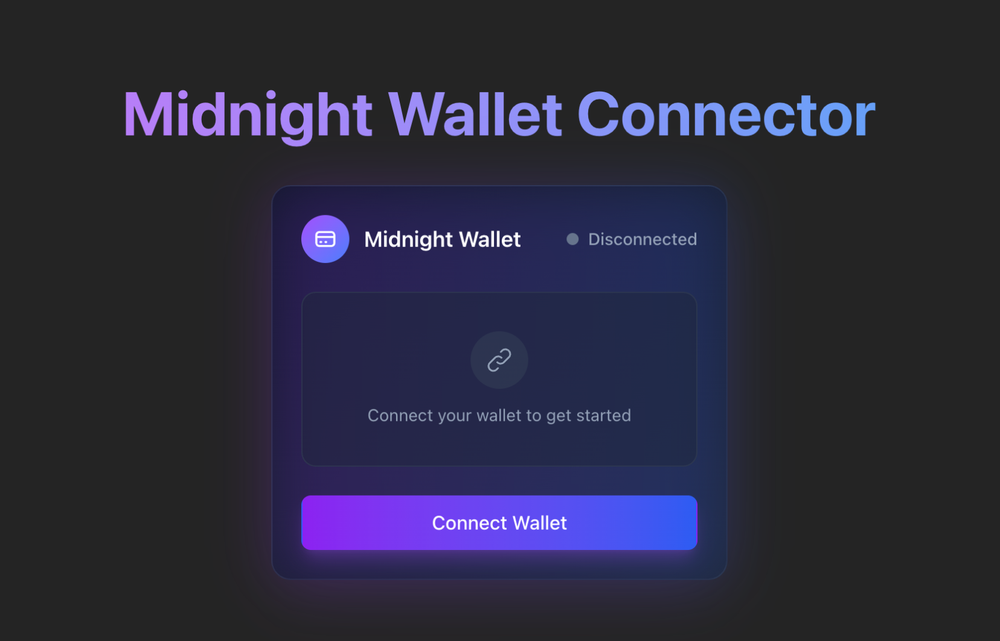
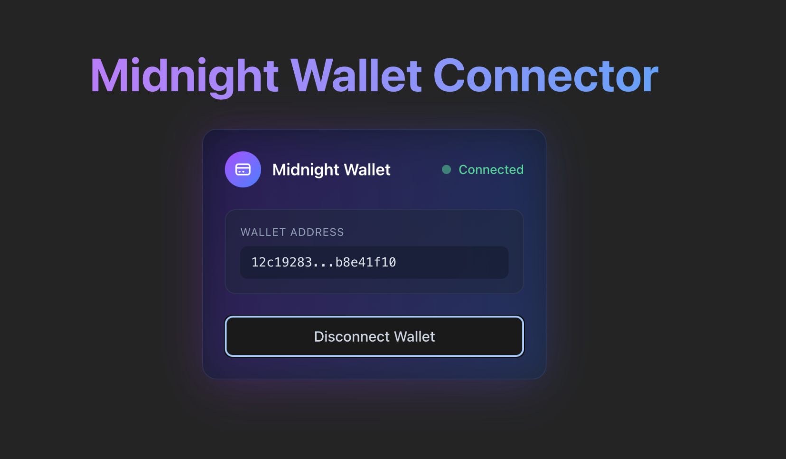

import Step, { StepsProvider } from "@site/src/components/Step/Step";

In this guide, you'll create a React application that connects to the Midnight Lace wallet using the DApp Connector API. 
You'll build a simple interface that displays connection status and wallet addresses, providing a foundation for more complex decentralized applications.

The code examples focus on core functionality and intentionally omit CSS styling. You can add your preferred styling solution (Tailwind, styled-components, CSS modules, etc.) to match your application's design.

## Prerequisites

Before you begin, make sure you have:

- Basic knowledge of TypeScript and JavaScript
- Familiarity with React fundamentals (components, state, hooks)
- Node.js and npm installed on your system
- [Midnight Lace wallet extension](./lace-wallet) installed in your browser

### Set up a React project

If you don't have a React project yet, create one using Vite:

```bash
npm create vite@latest my-wallet-app -- --template react-ts
cd my-wallet-app
```

Then install the DApp Connector API package:

```bash
npm install @midnight-ntwrk/dapp-connector-api
```

After completing this tutorial, you'll understand:

- The Midnight wallet connection flow
- How to use the DApp Connector API
- Best practices for managing wallet state in React applications

<StepsProvider>
<Step>

## Define TypeScript interfaces

Start by creating type definitions for your components. These interfaces provide type safety and clear contracts between components.

Create a new file `types.ts` within the `src` directory and add the following code:

```typescript
export interface WalletCardProps {
  isConnected: boolean;
  walletAddress: string | null;
  onConnect: () => void;
  onDisconnect: () => void;
}
```

The `WalletCardProps` interface defines the shape of data your `WalletCard` component will receive. 
It includes the connection state, the wallet address, and callback functions for connect and disconnect actions.

</Step>
<Step>

## Create the WalletCard component

Now you'll build the `WalletCard` component, which displays the wallet connection status and provides connect/disconnect buttons.

Create `WalletCard.tsx` within the `src` directory and add the following code:

```typescript
import React from "react";
import type { WalletCardProps } from "./types";

const WalletCard: React.FC<WalletCardProps> = ({
  isConnected,
  walletAddress,
  onConnect,
  onDisconnect,
}) => {
  return (
    <div>
      <div>
        <h2>Connection Status</h2>
        <div>
          {isConnected ? "Connected" : "Disconnected"}
        </div>
      </div>

      <div>
        {isConnected && walletAddress ? (
          <>
            <p>Wallet Address:</p>
            <p title={walletAddress}>{walletAddress}</p>
          </>
        ) : (
          <p>Please connect your wallet to proceed.</p>
        )}
      </div>

      <div>
        {isConnected ? (
          <button onClick={onDisconnect}>Disconnect Wallet</button>
        ) : (
          <button onClick={onConnect}>Connect Wallet</button>
        )}
      </div>
    </div>
  );
};

export default WalletCard;
```

This component handles the presentation layer of your wallet connection. It shows the current status, 
displays the address when connected, and provides appropriate action buttons based on the connection state.

</Step>
<Step>

## Integrate the DApp Connector API

Next, we'll use the `App` component to manage the wallet connection logic using the DApp Connector API.

Create or open `App.tsx` within the `src` directory and replace the existing code with the following:

```typescript App.tsx
import React, { useState } from 'react';
import WalletCard from './WalletCard';
import '@midnight-ntwrk/dapp-connector-api';
import type { InitialAPI } from '@midnight-ntwrk/dapp-connector-api';

const App: React.FC = () => {
  const [isConnected, setIsConnected] = useState<boolean>(false);
  const [walletAddress, setWalletAddress] = useState<string | null>(null);

  const handleConnect = async () => {
    console.log('Connect button clicked');
    let isConnected = false;
    let address = null;
    
    try {
      // Access the Midnight Lace wallet through the window object
      const wallet: InitialAPI = window.midnight!.mnLace;
      
      // Connect to the specified network (use 'undeployed' for local development)
      const connectedApi = await wallet.connect('undeployed');
      
      // Retrieve the shielded addresses from the wallet
      const addresses = await connectedApi.getShieldedAddresses();
      address = addresses.shieldedAddress;

      // Optional: Get the service URI configuration
      const serviceUriConfig = await connectedApi.getConfiguration();
      console.log('Service URI Config:', serviceUriConfig);
  
      // Check if the connection is established
      const connectionStatus = await connectedApi.getConnectionStatus();
      if (connectionStatus) {
        isConnected = true;
        console.log("Connected to the wallet:", address);
      }
    } catch (error) {
      console.log("An error occurred:", error);
    }
  
    setIsConnected(isConnected);
    setWalletAddress(address);
  };

  const handleDisconnect = () => {
    setWalletAddress(null);
    setIsConnected(false);
  };

  return (
    <div>
      <header>
        <h1>Midnight Wallet Connector</h1>
      </header>
      <main>
        <WalletCard
          isConnected={isConnected}
          walletAddress={walletAddress}
          onConnect={handleConnect}
          onDisconnect={handleDisconnect}
        />
      </main>
    </div>
  );
};

export default App;
```

Let's break down the wallet connection process:

1. **Access the wallet**: The DApp Connector API exposes the wallet through `window.midnight.{walletProvider}`. 
In our example, we used `window.midnight.mnLace` to access the Midnight Lace wallet.
2. **Connect to network**: Call the `connect()` method and pass the network ID as an argument. 
In our example, we used `'undeployed'` for local development. You can use `'preview'` for the Preview testnet or `'preprod'` for the PreProd network.
3. **Retrieve addresses**: After connecting to the network, call the `getShieldedAddresses()` method to get the wallet's shielded address.
4. **Check status**: Verify the connection with `getConnectionStatus()`.

The `handleConnect` event handler manages all these steps and updates your component's state accordingly. 
When users click the **Connect Wallet** button, they'll see a prompt from the Lace wallet to authorize the connection.

</Step>
<Step>

## Set up the entry point

Create the entry point that bootstraps your React application. For this, create or open `main.tsx` within the `src` directory 
and replace the existing code with the following:

```typescript
import { StrictMode } from 'react';
import { createRoot } from 'react-dom/client';
import App from './App.tsx';

createRoot(document.getElementById('root')!).render(
  <StrictMode>
    <App />
  </StrictMode>,
);
```

Finally, create or open `index.html` in the project root and replace the existing code with the following:

```html
<!doctype html>
<html lang="en">
  <head>
    <meta charset="UTF-8" />
    <meta name="viewport" content="width=device-width, initial-scale=1.0" />
    <title>Midnight Wallet Connector</title>
  </head>
  <body>
    <div id="root"></div>
    <script type="module" src="/src/main.tsx"></script>
  </body>
</html>
```

</Step>
<Step>

## Run your application

After setting up the entry point, start your development server:

```bash
npm run dev
```

Now, open your browser and navigate to the local development URL (typically `http://localhost:5173`). 

When you click **Connect Wallet**, the Midnight Lace wallet extension will prompt you to authorize the connection. 



After approval, your application will display the connection status and your wallet's shielded address.



</Step>
</StepsProvider>

## Troubleshooting

The following are some common issues you might encounter and how to resolve them.

### Wallet not detected

If you see errors about `window.midnight` being undefined:

- Verify the Midnight Lace wallet extension is installed and enabled in your browser.
- Refresh the page after installing or enabling the extension.
- Check the browser console for any extension-related errors.

### Connection fails

If the connection attempt fails:

- Ensure the network ID specified in the `connect()` method matches the network ID configured in your wallet.
- Check that the Lace wallet is unlocked and synced.
- Review the browser console for specific error messages.
- Verify the DApp Connector API package is correctly installed.

## Next steps

Now that you have a working wallet connector, you can extend your application with additional functionality:

- **Transfer coins**: Implement a form that allows users to send tokens to other addresses.
- **Sign messages**: Add a text input where users can sign arbitrary messages with their wallet.
- **Display balances**: Show the user's token balances for different assets.
- **Transaction history**: Query and display the user's transaction history.
- **Multi-network support**: Add a network selector to switch between different Midnight networks.

## Reference

- [DApp Connector API documentation](/api-reference/dapp-connector)
- [Example application with full styling](https://github.com/bochaco/react-mn-wallet-connect)