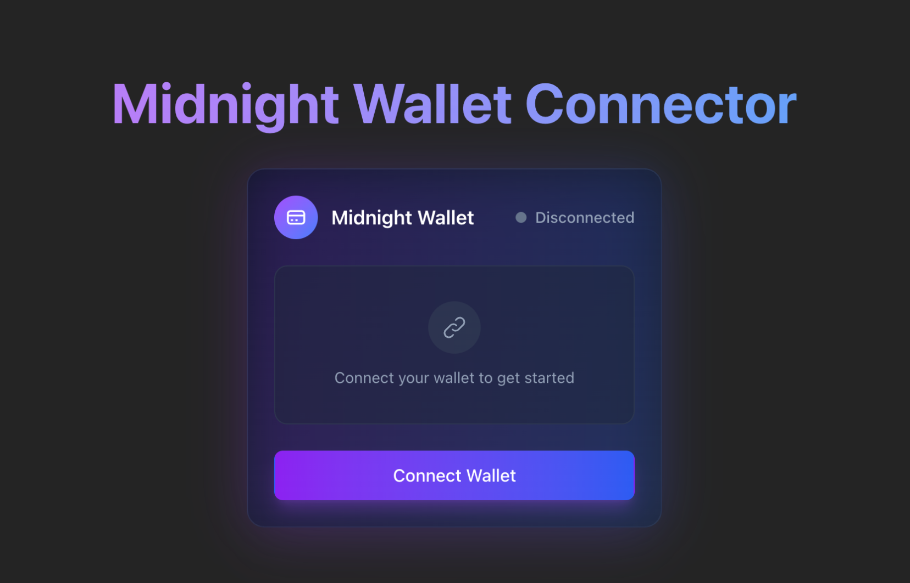
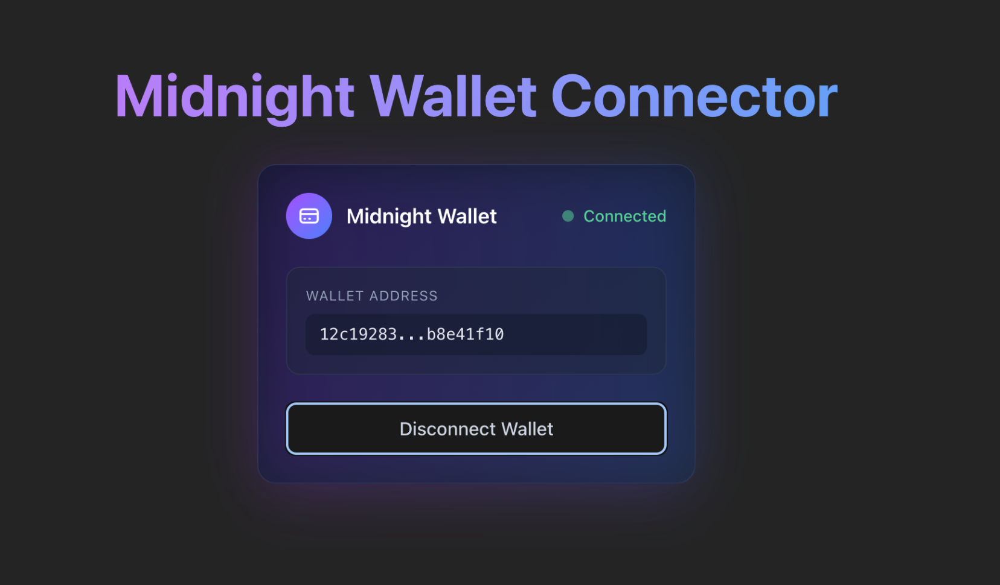

import Step, { StepsProvider } from "@site/src/components/Step/Step";

In this guide, you'll create a React application that connects to a Midnight wallet using the DApp Connector API. 
You'll build a simple interface that displays connection status and wallet addresses, providing a foundation for more complex decentralized applications.

The code examples focus on core functionality and intentionally omit CSS styling. You can add your preferred styling solution (Tailwind, styled-components, CSS modules, etc.) to match your application's design.

## Prerequisites

Before you begin, make sure you have:

- Basic knowledge of TypeScript and JavaScript
- Familiarity with React fundamentals (components, state, hooks)
- Node.js and npm installed on your system
- A Midnight wallet extension installed in your browser

### Set up a React project

If you don't have a React project yet, create one using Vite:

```bash
npm create vite@latest my-wallet-app -- --template react-ts
cd my-wallet-app
```

Then install the DApp Connector API package:

```bash
npm install @midnight-ntwrk/dapp-connector-api
```

After completing this tutorial, you'll understand:

- The Midnight wallet connection flow
- How to use the DApp Connector API
- Best practices for managing wallet state in React applications

<StepsProvider>
<Step>

## Define TypeScript interfaces

Start by creating type definitions for your components. These interfaces provide type safety and clear contracts between components.

Create a new file `types.ts` within the `src` directory and add the following code:

```typescript
export interface WalletCardProps {
  isConnected: boolean;
  walletAddress: string | null;
  onConnect: () => void;
  onDisconnect: () => void;
}
```

The `WalletCardProps` interface defines the shape of data your `WalletCard` component will receive. 
It includes the connection state, the wallet address, and callback functions for connect and disconnect actions.

</Step>
<Step>

## Create the WalletCard component

Now you'll build the `WalletCard` component, which displays the wallet connection status and provides connect/disconnect buttons.

Create `WalletCard.tsx` within the `src` directory and add the following code:

```typescript
import React from "react";
import type { WalletCardProps } from "./types";

const WalletCard: React.FC<WalletCardProps> = ({
  isConnected,
  walletAddress,
  onConnect,
  onDisconnect,
}) => {
  return (
    <div>
      <div>
        <h2>Connection Status</h2>
        <div>
          {isConnected ? "Connected" : "Disconnected"}
        </div>
      </div>

      <div>
        {isConnected && walletAddress ? (
          <>
            <p>Wallet Address:</p>
            <p title={walletAddress}>{walletAddress}</p>
          </>
        ) : (
          <p>Please connect your wallet to proceed.</p>
        )}
      </div>

      <div>
        {isConnected ? (
          <button onClick={onDisconnect}>Disconnect Wallet</button>
        ) : (
          <button onClick={onConnect}>Connect Wallet</button>
        )}
      </div>
    </div>
  );
};

export default WalletCard;
```

This component handles the presentation layer of your wallet connection. It shows the current status, 
displays the address when connected, and provides appropriate action buttons based on the connection state.

</Step>
<Step>

## Select a wallet

Wallets inject their Initial API instances under the global `window.midnight` object, each keyed by a freshly generated UUID rather than a fixed name. A single browser may also have more than one wallet available at once, for example when two wallets are loaded from the same seed phrase. Because of this, you read the entries on `window.midnight` and choose one, rather than reaching for a hardcoded key.

Create a new file `selectWallet.ts` within the `src` directory and add the following code:

```typescript
import type { InitialAPI } from '@midnight-ntwrk/dapp-connector-api';

export const listWallets = (): InitialAPI[] => {
  const injected = window.midnight;
  return injected ? Object.values(injected) : [];
};

export const selectWallet = (): InitialAPI => {
  const wallets = listWallets();

  if (wallets.length === 0) {
    throw new Error('No Midnight wallet found. Please install a Midnight wallet extension.');
  }

  return wallets[0];
};
```

The `selectWallet` function reads the installed wallets and returns the first one, which keeps this example focused on the connection flow. When more than one wallet is available, the DApp Connector API specification expects you to let the user choose rather than picking for them. Use `listWallets` to render the options, and when displaying each wallet, render its `name` and `icon` safely to prevent XSS.

</Step>
<Step>

## Integrate the DApp Connector API

Next, we'll use the `App` component to manage the wallet connection logic using the DApp Connector API and the `selectWallet` helper from the previous step.

Create or open `App.tsx` within the `src` directory and replace the existing code with the following:

```typescript App.tsx
import React, { useState } from 'react';
import WalletCard from './WalletCard';
import '@midnight-ntwrk/dapp-connector-api';
import { selectWallet } from './selectWallet';

const App: React.FC = () => {
  const [isConnected, setIsConnected] = useState<boolean>(false);
  const [walletAddress, setWalletAddress] = useState<string | null>(null);

  const handleConnect = async () => {
    console.log('Connect button clicked');
    let isConnected = false;
    let address = null;

    try {
      const wallet = selectWallet();

      // Connect to the specified network (use 'undeployed' for local development)
      const connectedApi = await wallet.connect('preprod');

      // Retrieve the unshielded address from the wallet
      const { unshieldedAddress } = await connectedApi.getUnshieldedAddress();
      address = unshieldedAddress;

      // Optional: Get the service URI configuration
      const serviceUriConfig = await connectedApi.getConfiguration();
      console.log('Service URI Config:', serviceUriConfig);

      // Check if the connection is established
      const connectionStatus = await connectedApi.getConnectionStatus();
      if (connectionStatus.status === 'connected') {
        isConnected = true;
        console.log("Connected to the wallet:", address);
      }
    } catch (error) {
      console.log("An error occurred:", error);
    }

    setIsConnected(isConnected);
    setWalletAddress(address);
  };

  const handleDisconnect = () => {
    setWalletAddress(null);
    setIsConnected(false);
  };

  return (
    <div>
      <header>
        <h1>Midnight Wallet Connector</h1>
      </header>
      <main>
        <WalletCard
          isConnected={isConnected}
          walletAddress={walletAddress}
          onConnect={handleConnect}
          onDisconnect={handleDisconnect}
        />
      </main>
    </div>
  );
};

export default App;
```

Let's break down the wallet connection process:

1. **Select a wallet**: The `selectWallet` helper reads the installed wallets from `window.midnight` and returns one to connect to. It throws if no wallet is found, which the surrounding `try/catch` handles.
2. **Connect to network**: Call the `connect()` method and pass the network ID as an argument. 
In our example, we used `'preprod'`. You can use `'undeployed'` for local development or `'preview'` for the Preview network.
3. **Retrieve the address**: After connecting to the network, call the `getUnshieldedAddress()` method to get the wallet's unshielded address. Request the shielded address only when your application actually needs it.
4. **Check status**: Verify the connection with `getConnectionStatus()`, which resolves to an object whose `status` is `'connected'` or `'disconnected'`.

The `handleConnect` event handler manages all these steps and updates your component's state accordingly. 
When users click the **Connect Wallet** button, their wallet will prompt them to authorize the connection.

</Step>
<Step>

## Set up the entry point

Create the entry point that bootstraps your React application. For this, create or open `main.tsx` within the `src` directory 
and replace the existing code with the following:

```typescript
import { StrictMode } from 'react';
import { createRoot } from 'react-dom/client';
import App from './App.tsx';

createRoot(document.getElementById('root')!).render(
  <StrictMode>
    <App />
  </StrictMode>,
);
```

Finally, create or open `index.html` in the project root and replace the existing code with the following:

```html
<!doctype html>
<html lang="en">
  <head>
    <meta charset="UTF-8" />
    <meta name="viewport" content="width=device-width, initial-scale=1.0" />
    <title>Midnight Wallet Connector</title>
  </head>
  <body>
    <div id="root"></div>
    <script type="module" src="/src/main.tsx"></script>
  </body>
</html>
```

</Step>
<Step>

## Run your application

After setting up the entry point, start your development server:

```bash
npm run dev
```

Now, open your browser and navigate to the local development URL (typically `http://localhost:5173`). 

When you click **Connect Wallet**, your wallet extension will prompt you to authorize the connection. 



After approval, your application will display the connection status and your wallet's unshielded address.



</Step>
</StepsProvider>

## Troubleshooting

The following are some common issues you might encounter and how to resolve them.

### Wallet not detected

If you see errors about `window.midnight` being undefined, or `No Midnight wallet found`:

- Verify a Midnight wallet extension is installed and enabled in your browser.
- Refresh the page after installing or enabling the extension.
- Confirm you are reading the wallet from `window.midnight` by enumeration (`Object.values(window.midnight)`) and not from a fixed key such as `window.midnight.mnLace`. Wallets inject their Initial API under a UUID key, so a hardcoded name resolves to `undefined`.
- Check the browser console for any extension-related errors.

### Connection fails

If the connection attempt fails:

- Ensure the network ID specified in the `connect()` method matches the network ID configured in your wallet.
- Check that the wallet is unlocked and synced.
- Review the browser console for specific error messages.
- Verify the DApp Connector API package is correctly installed.

## Next steps

Now that you have a working wallet connector, you can extend your application with additional functionality:

- **Transfer coins**: Implement a form that allows users to send tokens to other addresses.
- **Sign messages**: Add a text input where users can sign arbitrary messages with their wallet.
- **Display balances**: Show the user's token balances for different assets.
- **Transaction history**: Query and display the user's transaction history.
- **Multi-network support**: Add a network selector to switch between different Midnight networks.

## Reference

- [DApp Connector API documentation](/api-reference/dapp-connector)
- [Example application with full styling](https://github.com/bochaco/react-mn-wallet-connect)
