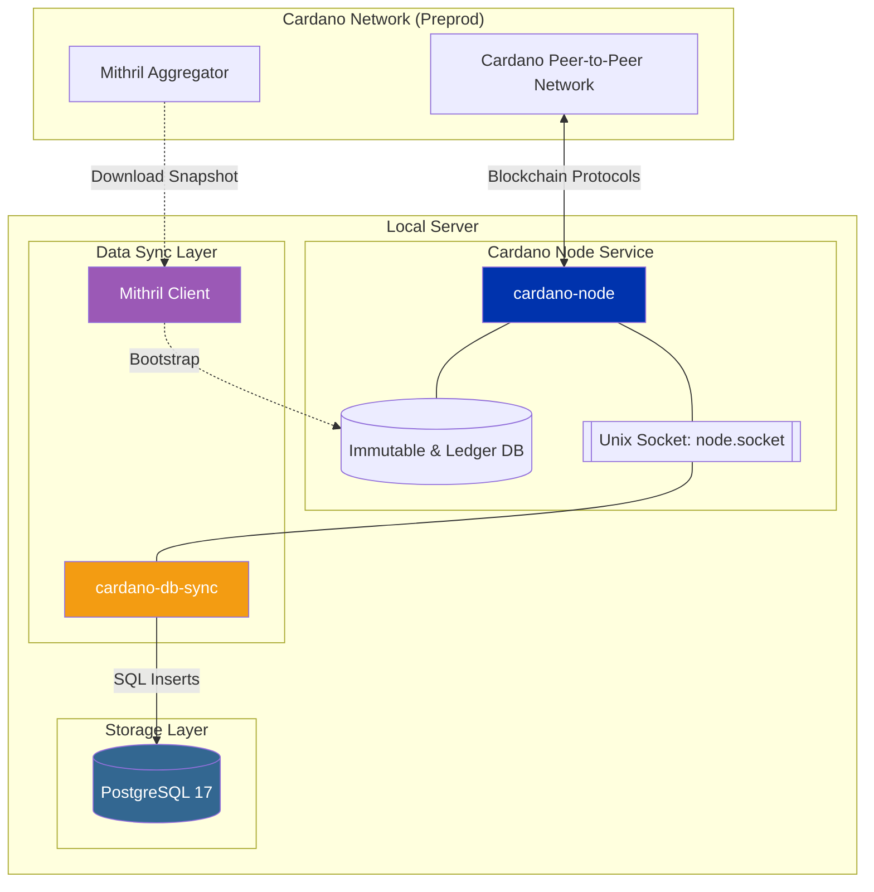

import Tabs from '@theme/Tabs';
import TabItem from '@theme/TabItem';

# Set up Cardano node

Midnight operates as a partner chain to Cardano, enabling interoperability and shared security. 
To maintain synchronization with the Cardano blockchain, the Midnight node requires a persistent connection to a PostgreSQL database populated by Cardano-db-sync. This database indexes Cardano's on-chain data and provides queryable access to it.

This guide provides step-by-step instructions for setting up a Cardano relay node and a synchronized PostgreSQL database via cardano-db-sync. 

## Prerequisites

To run all nodes successfully, you need to aim for the following:

<details>
<summary>System requirements</summary>

Linux operating systems must be compatible with GLIBC version 2.39 or greater. Use one of the following:

* Ubuntu 24.04 or later
* Debian 13 or later

Verify your GLIBC version with: `ldd --version`

</details>

<details>
<summary>Hardware requirements</summary>

| **Requirement**      | **Cardano Mainnet**                                                                                      | **Preview/Preprod Testnet**                                          |
| -------------------- | -------------------------------------------------------------------------------------------------------- | -------------------------------------------------------------------- |
| **Operating System** | 64-bit Linux (Ubuntu 24.04 LTS recommended)                                                              | 64-bit Linux (Ubuntu 24.04 LTS recommended)                          |
| **Memory**           | 32 GB or more                                                                                            | 16 GB or more                                                        |
| **CPU Cores**        | 4 or more                                                                                                | 4 or more                                                            |
| **IOPS**             | 60,000 IOPS or better. Lower ratings will lead to slower sync times and/or falling behind the chain tip. | 30,000 IOPS or better. Lower ratings will lead to slower sync times. |
| **Disk Storage**     | 320 GB NVMe SSD                                                                                          | 40 GB NVMe SSD (minimum)                                             |
| **Network**          | Stable 100 Mbps or better    
</details>

<details>
<summary>User segregation</summary>

You can optionally create a non-privileged user to run the node service. Not running blockchain node as root is a security best practice.

Create a non-privileged user named "midnight" to run the node service.

```bash
sudo adduser midnight
```

Grant sudo privileges to the user:

```bash
sudo usermod -aG sudo midnight
```

Switch to the "midnight" user:

```bash
su - midnight
```

Confirm profile:

```bash
whoami # should return "midnight" 
```

</details>

## Mithril setup

This guide uses [Mithril](https://mithril.network/) to download a verified snapshot of the Cardano blockchain, reducing sync time from days to roughly 20 minutes.



### Install Mithril tooling

Create a temporary directory and navigate to it:

```bash
mkdir -p $HOME/tmp/mithril && cd $HOME/tmp/mithril
```

Install Mithril signer, client, and aggregator (pre-release):

```bash
curl --proto '=https' --tlsv1.2 -sSf https://raw.githubusercontent.com/input-output-hk/mithril/refs/heads/main/mithril-install.sh | sh -s -- -c mithril-signer -d unstable -p $(pwd)
curl --proto '=https' --tlsv1.2 -sSf https://raw.githubusercontent.com/input-output-hk/mithril/refs/heads/main/mithril-install.sh | sh -s -- -c mithril-client -d unstable -p $(pwd)
curl --proto '=https' --tlsv1.2 -sSf https://raw.githubusercontent.com/input-output-hk/mithril/refs/heads/main/mithril-install.sh | sh -s -- -c mithril-aggregator -d unstable -p $(pwd)
```

### Configure Cardano environment variables (for Mithril)

:::info
To get the latest Mithril network configurations, see [https://mithril.network/doc/manual/getting-started/network-configurations](https://mithril.network/doc/manual/getting-started/network-configurations).
:::

Set the following variables to point to the Cardano network you are using:

<Tabs>
<TabItem value="preprod" label="Preprod">

```bash
export CARDANO_NETWORK=preprod
export AGGREGATOR_ENDPOINT=https://aggregator.release-preprod.api.mithril.network/aggregator
export GENESIS_VERIFICATION_KEY=$(wget -q -O - https://raw.githubusercontent.com/input-output-hk/mithril/main/mithril-infra/configuration/release-preprod/genesis.vkey)
export ANCILLARY_VERIFICATION_KEY=$(wget -q -O - https://raw.githubusercontent.com/input-output-hk/mithril/main/mithril-infra/configuration/release-preprod/ancillary.vkey)
export SNAPSHOT_DIGEST=latest
```

</TabItem>
<TabItem value="mainnet" label="Mainnet">

```bash
export CARDANO_NETWORK=mainnet
export AGGREGATOR_ENDPOINT=https://aggregator.release-mainnet.api.mithril.network/aggregator
export GENESIS_VERIFICATION_KEY=$(wget -q -O - https://raw.githubusercontent.com/input-output-hk/mithril/main/mithril-infra/configuration/release-mainnet/genesis.vkey)
export ANCILLARY_VERIFICATION_KEY=$(wget -q -O - https://raw.githubusercontent.com/input-output-hk/mithril/main/mithril-infra/configuration/release-mainnet/ancillary.vkey)
export SNAPSHOT_DIGEST=latest
```

:::warning
The Cardano mainnet database is much larger than testnet databases. Therefore, downloading the mainnet snapshot takes longer. 
:::

</TabItem>
</Tabs>

### Download Cardano database snapshot

List and verify the latest snapshot:

```bash
./mithril-client cardano-db snapshot list
./mithril-client cardano-db snapshot show $SNAPSHOT_DIGEST
```

Download and verify the database:

```bash
./mithril-client cardano-db download --include-ancillary $SNAPSHOT_DIGEST
```

The Mithril client downloads the snapshot to a `db/` directory in the working directory, which in this case is `/tmp/mithril/db`. This database will be used to bootstrap the Cardano node.

## Setup Cardano relay node

Cardano node is the official Cardano client. There are many methods to install the node. This guide uses the official pre-compiled binary release. 

:::note
If you want to build from source and explore additional methods, then use the [official Cardano documentation](https://developers.cardano.org/docs/operate-a-stake-pool/relay-configuration/relay-node-configuration/).
:::

### Download Cardano node pre-compiled binary

Install Cardano node pre-compiled binary into `~/.local/bin` by running the following command:

Always check for the latest release from the official [Cardano node release page](https://github.com/IntersectMBO/cardano-node/releases) on GitHub.

```bash
VERSION="10.6.2"
ARCH="linux-amd64"
URL="https://github.com/IntersectMBO/cardano-node/releases/download/${VERSION}/cardano-node-${VERSION}-${ARCH}.tar.gz"
```

Ensure the destination exists by running the following command:

```bash
mkdir -p ~/.local/bin
mkdir -p ~/.local/share
```

Download and extract directly to the right spots by running the following command:

```bash
# --strip-components=1 removes the top-level 'bin/' or 'share/' wrapper
curl -L "$URL" | tar -xz -C ~/.local/bin --strip-components=2 ./bin
curl -L "$URL" | tar -xz -C ~/.local/share --strip-components=1 ./share
```

Make sure they are executable by running the following command:

```bash
chmod +x ~/.local/bin/cardano-*
```

This downloads and unpacks binary contents (`~/.local/bin`) and Cardano node config files for each Cardano network (`~/.local/share/<network>`).

Verify binaries and config files exist by running the following command:

```bash
ls ~/.local/bin ~/.local/share
```

Example output:

```bash
~/.local/bin:
bech32       cardano-node        cardano-testnet  db-analyser     db-truncater        tx-generator
cardano-cli  cardano-submit-api  cardano-tracer   db-synthesizer  snapshot-converter

~/.local/share:
mainnet  preprod  preview
```

Refresh shell session and verify the Cardano node binary can be invoked:

```bash
source ~/.bashrc # or ~/.zshrc
which cardano-node
# /$HOME/$USER/.local/bin/cardano-node
cardano-node --version
# cardano-node 10.5.3 - linux-x86_64 - ghc-9.6
# git rev 6c034ec038d8d276a3595e10e2d38643f09bd1f2
```

### Inject Mithril snapshot (optional)

This is where you may consider your desired data storage options. For this guide, create a `~/cardano-data` directory for the Cardano node’s database and node socket path.

```bash
mkdir ~/cardano-data
```

Move the Cardano database snapshot:

```bash
mv ~/tmp/mithril/db/ ~/cardano-data/
```

Verify thedatabase has been moved:

```bash
ls ~/cardano-data/db
```

### Run Cardano node

Starting `cardano-node` must be invoked providing config file paths `~/.local/bin/share/<network: preprod, mainnet, preview>` and database path. However, the Mithril client has already downloaded a snapshot of the *Cardano Preprod* database in `~/cardano-preprod/db`.

Start the node interactively in shell:

<Tabs>
<TabItem value="preprod" label="Preprod">

```bash
cardano-node run \
--topology ~/.local/share/preprod/topology.json \
--database-path ~/cardano-data/db \
--socket-path ~/cardano-data/db/node.socket \
--host-addr 0.0.0.0 \
--port 3001 \
--config ~/.local/share/preprod/config.json
```

</TabItem>
<TabItem value="mainnet" label="Mainnet">

```bash
cardano-node run \
--topology ~/.local/share/mainnet/topology.json \
--database-path ~/cardano-data/db \
--socket-path ~/cardano-data/db/node.socket \
--host-addr 0.0.0.0 \
--port 3001 \
--config ~/.local/share/mainnet/config.json
```
</TabItem>
</Tabs>

If you took the snapshot of the mainnet database, then the `node.socket` file is *not* created until the node has completed its internal initialization. The process includes validating the database and replaying any necessary blocks. Therefore, you will need to wait. 

The example log below shows the Cardano node has replayed only 1.76% of the chain. This may take around 20 minutes to complete.

```bash
Mar 10 21:36:58 mnf-mainnet-validator-1 cardano-node[7201]: [mnf-main:cardano.node.ChainDB:Info:5] [2026-03-10 21:36:58.11 UTC] Replayed block: slot 3196799 out of 181548256. Progress: 1.76%
```

Check latest block height of `cardano-node`:

```bash
export CARDANO_NODE_SOCKET_PATH="$HOME/cardano-data/db/node.socket"

# You must use --testnet-magic 1 (preprod) or 2 (preview) with Cardano testnets
cardano-cli query tip --testnet-magic 1

# To query mainnet simply pass --mainnet like so
# cardano-cli query tip --mainnet
```

Example output:

```bash
{
    "block": 136111,
    "epoch": 10,
    "era": "Alonzo",
    "hash": "dc7767c3e2d116f3be63b33033a223fc5429a2ad65ade92578d1c40795a5f5b1",
    "slot": 2815017,
    "slotInEpoch": 136617,
    "slotsToEpochEnd": 295383,
    "syncProgress": "3.91"
}
```

When you run `cardano-cli query tip`, you are asking your local node for its "current view" of the blockchain. Since your node is still syncing, this output represents where your node is currently positioned compared to the total history of the network.

- **`"block"`**: This is the height of the last block your node has processed. In this case, it has reached block *136,111*.
- **`"epoch"`**: The current epoch your node is looking at. An epoch is a specific time period, equivalent to 5 days on mainnet, but varies on testnets. The node is currently in *Epoch 10*.
- **`"era"`**: The protocol version (hard fork) the node is currently processing. Seeing *"Alonzo"* means your node is currently replaying history from the era that introduced smart contracts. As it syncs further, you will see this change to *"Babbage"* and eventually *"Conway"* (the current era).
- **`"hash"`**: The unique digital fingerprint of the most recent block your node processed.
- **`"slot"`**: The total number of seconds/slots that have passed since the network started (the "Genesis").
- **`"slotInEpoch"`** & **`"slotsToEpochEnd"`**: These tell you how far into the current epoch you are. The node has completed 136,617 slots in Epoch 10, with 295,383 slots remaining before Epoch 11 begins.
- **`"syncProgress"`**: *This is the most important number.* It shows that the node has only downloaded and verified *3.91%* of the blockchain.

### Create Cardano node `systemd` service files

Create the service file for the relay node:

```bash
sudo vim /etc/systemd/system/cardano-node.service
```

Paste the following contents into the service file:

<Tabs>
<TabItem value="preprod" label="Preprod">

```bash
[Unit]
Description=Cardano Relay Node
Wants=network-online.target
After=network-online.target

[Service]
User=midnight
Type=simple
WorkingDirectory=/home/midnight/cardano-preprod
ExecStart=/home/midnight/.local/bin/cardano-node run \
    --topology /home/midnight/.local/share/preprod/topology.json \
    --database-path /home/midnight/cardano-preprod/db \
    --socket-path /home/midnight/cardano-preprod/db/node.socket \
    --host-addr 0.0.0.0 \
    --port 3001 \
    --config /home/midnight/.local/share/preprod/config.json
KillSignal=SIGINT
Restart=always
RestartSec=5
LimitNOFILE=32768

[Install]
WantedBy=multi-user.target
```
</TabItem>
<TabItem value="mainnet" label="Mainnet">

```bash
[Unit]
Description=Cardano Mainnet Node
Wants=network-online.target
After=network-online.target

[Service]
User=midnight
Type=simple
# Ensure this directory exists or update it to where you want the process to trigger from
WorkingDirectory=/home/midnight/cardano-data
ExecStart=/home/midnight/.local/bin/cardano-node run \
    --topology /home/midnight/.local/share/mainnet/topology.json \
    --database-path /home/midnight/cardano-data/db \
    --socket-path /home/midnight/cardano-data/db/node.socket \
    --host-addr 0.0.0.0 \
    --port 3001 \
    --config /home/midnight/.local/share/mainnet/config.json
KillSignal=SIGINT
Restart=always
RestartSec=5
LimitNOFILE=32768

[Install]
WantedBy=multi-user.target
```
</TabItem>
</Tabs>

Reload systemd to recognize new files:

```bash
sudo systemctl daemon-reload
```

Enable services to start on boot:

```bash
sudo systemctl enable cardano-node
```

Start the Cardano node service and check status:

```bash
sudo systemctl start cardano-node
sudo systemctl status cardano-node
```

Follow the logs:

```bash
journalctl -fu cardano-node
```

## Next steps

With the Cardano relay node running, proceed to [setup the PostgreSQL database and Cardano-db-sync](./cardano-db-sync).