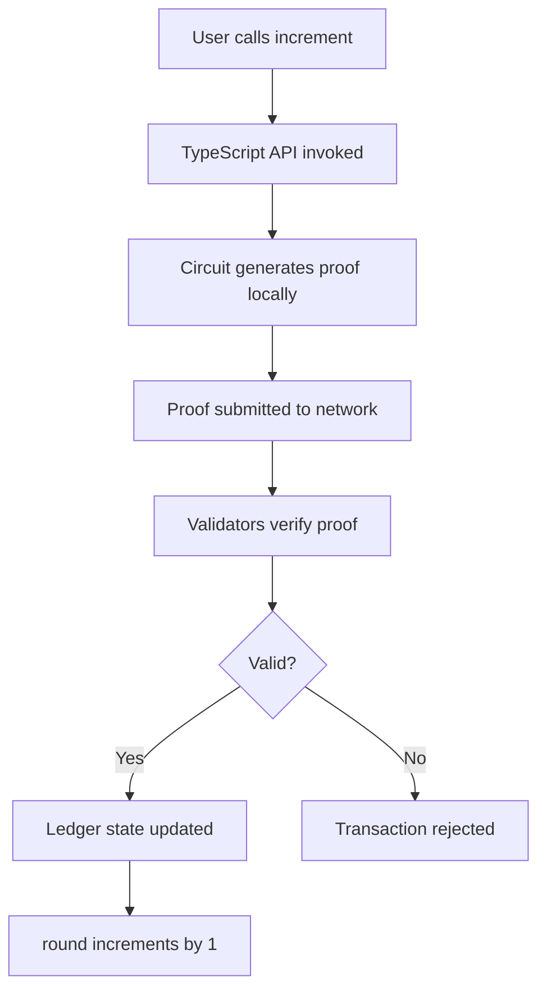

# Build the counter contract

This tutorial shows you how to build a smart contract that maintains a counter value on the Midnight blockchain. 
This contract demonstrates the fundamentals of Compact programming, including ledger state management, circuit definitions, and Zero Knowledge (ZK) proof generation.

## Overview

By the end of this tutorial, you will:

- Create a Compact smart contract with public ledger state
- Define a circuit that modifies on-chain state
- Compile the contract into Zero Knowledge (ZK) circuits
- Understand the generated TypeScript API
- Implement witness functions for contract interaction

The Counter contract is intentionally minimal to focus on core concepts. It maintains a single public counter value that can be incremented through a Zero Knowledge (ZK) proof-based transaction.

<details>
<summary><strong>Prerequisites</strong></summary>

Before you begin, ensure you have:

- **Compact toolchain installed**: For instructions, refer to the [install the toolchain](../../../getting-started/installation) guide
- **Proof server running**: For instructions, refer to the [run the proof server](../../../guides/run-proof-server) guide
- **Node.js version 22 or higher**: Verify with `node --version`
- **TypeScript knowledge**: Familiarity with types and interfaces
- **Command-line proficiency**: Comfortable with terminal operations
</details>

## Project structure

The Counter project uses a modular structure that separates the smart contract from the application logic:

```
example-counter/
├── contract/                    # Smart contract sub-project
│   ├── src/
│   │   ├── counter.compact     # The Compact smart contract
│   │   ├── witnesses.ts        # Witness implementations
│   │   ├── index.ts            # Re-exports contract API
│   │   └── test/               # Contract unit tests
│   ├── managed/                # Compiler-generated code (created during build)
│   └── package.json            # Contract dependencies
└── counter-cli/                # CLI application (Part 2)
    ├── src/
    └── package.json
```

This separation allows you to:

- Test contract logic independently from the user interface.
- Reuse the contract in multiple applications (CLI, web, mobile).
- Update the contract without modifying application code.
- Share contract code across development teams.

## Set up the project

This section walks you through the process of setting up the project and creating the contract file.

### Create the directory structure

Create the project root and contract directories:

```bash
mkdir -p example-counter/contract/src
cd example-counter/contract
```

Your directory structure should now look like this:

```
example-counter/
└── contract/
    └── src/
```

### Initialize the npm package

Create a `package.json` file in the `contract` directory:

```bash
npm init -y
```

This generates a basic `package.json` file.

### Configure TypeScript

Create a `tsconfig.json` file in the `contract` directory:

```json
{
  "include": ["src/**/*.ts"],
  "compilerOptions": {
    "rootDir": "src",
    "outDir": "dist",
    "declaration": true,
    "lib": ["ESNext"],
    "target": "ES2022",
    "module": "ESNext",
    "moduleResolution": "node",
    "allowJs": true,
    "forceConsistentCasingInFileNames": true,
    "noImplicitAny": true,
    "strict": true,
    "isolatedModules": true,
    "sourceMap": true,
    "resolveJsonModule": true,
    "esModuleInterop": true,
    "skipLibCheck": true
  }
}
```

The key configuration options are:

- `target` and `module`: Set to ES2022 for modern JavaScript features
- `declaration`: Generates `.d.ts` type definition files for TypeScript consumers
- `outDir`: Compiled JavaScript files go to `./dist`
- `rootDir`: Source TypeScript files are in `./src`
- `strict`: Enables strict type checking for better code quality

## Write the smart contract

This section walks you through the process of writing the smart contract and understanding the key concepts.

### Create the contract file

Create `contract/src/counter.compact`:

```bash
touch src/counter.compact
```

Open this file in your code editor.

### Add the language version

The `pragma language_version` directive specifies which version of Compact your contract uses:

```compact
pragma language_version 0.20;
```

This directive:

- Locks your contract to a specific Compact version
- Prevents breaking changes in future compiler versions
- Ensures consistent compilation across development environments

### Import the standard library

Import Compact's standard library for built-in types and functions:

```compact
pragma language_version 0.20;

import CompactStandardLibrary;
```

The `CompactStandardLibrary` provides built-in types and functions, such as the `Counter` type which is used to increment and decrement the counter value.

### Define the ledger state

The ledger represents the public, on-chain state of your contract. 

Add the ledger declaration:

```compact
pragma language_version 0.20;

import CompactStandardLibrary;

// public state
export ledger round: Counter;
```

Breaking it down:

- `export`: Makes the ledger state accessible from TypeScript code
- `ledger`: Declares this as on-chain public state
- `round`: The variable name for your counter
- `Counter`: The `Counter` type from the `CompactStandardLibrary` that initializes to zero and provides increment/decrement methods

### Create the increment circuit

Circuits are the entry points to your smart contract. They define the logic that modifies state and generates Zero Knowledge (ZK) proofs. 

Add the `increment` circuit definition:

```compact
pragma language_version 0.20;

import CompactStandardLibrary;

// public state
export ledger round: Counter;

// transition function changing public state
export circuit increment(): [] {
  round.increment(1);
}
```

Breaking it down:

- `export circuit`: Marks this as a callable entry point and includes it in the deployed contract.
- `increment()`: The circuit name and parameter list. In this case, it is empty because the circuit does not take any parameters.
- `: []`: The return type. In this case, it is an empty tuple, indicating no return value.
- `round.increment(1)`: Calls the `Counter` type's built-in `increment` method with a value of 1.

Your complete counter contract should now look like this:

```compact
pragma language_version 0.20;

import CompactStandardLibrary;

// public state
export ledger round: Counter;

// transition function changing public state
export circuit increment(): [] {
  round.increment(1);
}
```

## Compile the contract

Compilation transforms your Compact code into Zero Knowledge (ZK) circuits and generates TypeScript APIs for interacting with the contract.

### Run the compiler

From the `contract` directory, compile the contract:

```bash
compact compile src/counter.compact src/managed/counter
```

Breaking it down:

- `compact compile`: The command to compile the contract
- `src/counter.compact`: The source file to compile
- `src/managed/counter`: The output directory for generated files

You should see output similar to:

```
Compiling 1 circuits:
  circuit "increment" (k=5, rows=24)
Overall progress [====================] 1/1
```

The compiler performs the following steps:

1. It parses the Compact code and validates syntax.
2. It generates Zero Knowledge (ZK) circuits from your logic.
3. It creates proving and verifying keys for each circuit.
4. It produces TypeScript API and type definitions.

### Examine the generated files

After compilation, the `src/managed/counter` directory contains:

```
src/managed/counter/
├── contract/                 
│   ├── index.d.ts            # Type definitions
│   ├── index.js              # JavaScript implementation
│   └── index.js.map          
├── keys/                     # Cryptographic keys
│   ├── increment.prover     
│   ├── increment.verifier    
├── zkir/                     # Zero Knowledge (ZK) Intermediate Representation
│   ├── increment.zkir        
│   └── increment.bzkir       
└── compiler/                 # Compiler metadata
    └── contract-info.json    
```

Each directory serves the following purpose:

- `contract/`: Contains the generated TypeScript API and JavaScript implementation that your DApp uses to interact with the contract
- `keys/`: Cryptographic keys used for generating and verifying Zero Knowledge (ZK) proofs
- `zkir/`: Intermediate circuit representations used by the proof server
- `compiler/`: Metadata about circuits, types, and structure in JSON format

## Understand the generated API

The Compact compiler generates TypeScript definitions that correspond to your contract code. Open `managed/counter/contract/index.d.ts` to examine the generated types.

### Circuit types

The `Circuits` type defines the callable functions:

```typescript
export type Circuits<PS> = {
  increment(context: __compactRuntime.CircuitContext<PS>): __compactRuntime.CircuitResults<PS, []>;
}
```

This type defines the following:

- The `increment()` method corresponds to the circuit you defined in the Compact contract.
- Each circuit method returns a `CircuitResults` type containing the Zero Knowledge (ZK) proof and any circuit outputs.
- The type uses the `PS` parameter to represent the private state type.

### Ledger types

The `Ledger` type defines the public state structure:

```typescript
export type Ledger = {
  round: bigint;
}
```

This type defines the following:

- The `round` field corresponds to the ledger state you declared in the Compact contract.
- The type uses `bigint` to represent the Counter value in JavaScript.
- The ledger state is read-only from TypeScript, meaning all modifications must happen through circuit calls.

### Witness types

The `Witnesses` type defines the private state type:

```typescript
export type Witnesses<PS> = {
  // Empty - this contract has no witnesses
}
```

Since the Counter contract defines no private state or witness functions, this type is empty. You'll see non-empty witness types in more complex contracts.

### Contract type

The `Contract` class ties everything together:

```typescript
export declare class Contract<PS = any, W extends Witnesses<PS> = Witnesses<PS>> {
  witnesses: W;
  circuits: Circuits<PS>;
  impureCircuits: ImpureCircuits<PS>;
  constructor(witnesses: W);
  initialState(context: __compactRuntime.ConstructorContext<PS>): __compactRuntime.ConstructorResult<PS>;
}
```

Breaking it down:

- The class uses two type parameters: `PS` for the private state type and `W` for the witnesses type.
- The `circuits` field provides access to pure circuit functions.
- The `impureCircuits` field provides access to impure circuit functions.
- The constructor accepts a `witnesses` parameter to initialize the contract's witness implementations.
- The `initialState` method accepts a `context` parameter and returns a `ConstructorResult` type containing the initial contract state.

## Implement witness functions

Even though the Counter contract has no private state, you must provide a witness implementation for the TypeScript API.

### Create the witnesses file

Create `contract/src/witnesses.ts`:

```typescript
export type CounterPrivateState = {
  privateCounter: number;
};

export const witnesses = {};
```

This code defines the following:

- `CounterPrivateState`: Defines the private state type with a `privateCounter` property of type `number`. 
This represents any off-chain data your DApp needs to track locally.
- `witnesses`: An empty object since the Counter contract declares no witness functions in the Compact code. 
Witnesses provide access to private data during circuit execution, but this simple contract doesn't require any.

### Create the index file

Create `contract/src/index.ts` to re-export the contract API:

```typescript
/**
 * Counter contract API.
 * 
 * This file re-exports the generated contract code and witness implementations,
 * providing a single entry point for consuming applications.
 */

// Re-export all generated contract types and functions
export * as Counter from './managed/counter/contract/index.js';

// Re-export witness implementations and types
export * from './witnesses';
```

This file:

- Provides a single import point for consumers
- Re-exports the generated contract API
- Includes the witness implementations

### Add build scripts

Update your `contract/package.json` to include build scripts:

```json
{
  "name": "@midnight-ntwrk/counter-contract",
  "version": "0.1.0",
  "license": "Apache-2.0",
  "private": true,
  "type": "module",
  "main": "dist/index.js",
  "module": "dist/index.js",
  "types": "./dist/index.d.ts",
  "exports": {
    ".": {
      "types": "./dist/index.d.ts",
      "require": "./dist/index.js",
      "import": "./dist/index.js",
      "default": "./dist/index.js"
    }
  },
  "scripts": {
    "clean": "rm -rf dist managed",
    "compile:compact": "compact compile src/counter.compact src/managed/counter",
    "compile:typescript": "tsc",
    "build": "tsc && npm run compile:compact && cp -Rf ./src/managed ./dist/managed && cp ./src/counter.compact ./dist"
  }
}
```

Each script serves the following purpose:

- `clean`: Removes compiled output for a fresh build
- `compile:compact`: Runs the Compact compiler
- `compile:typescript`: Compiles TypeScript to JavaScript
- `build`: Executes all compilation steps in order

### Build the contract

Run the complete build process:

```bash
npm run build
```

This command:

1. Cleans previous build artifacts
2. Compiles the Compact contract to circuits and TypeScript
3. Compiles TypeScript to JavaScript
4. Generates type definition files

You should see output from both the Compact compiler and TypeScript compiler. If successful, you'll have:

- `managed/counter/`: Generated contract code
- `dist/`: Compiled JavaScript and type definitions

## Understand the contract flow

Now that you've built the contract, let's understand how it works when deployed:



The key properties of this flow are:

- The increment happens atomically, either it succeeds completely or fails completely
- The proof doesn't reveal any private data, though this contract has none
- Validators don't re-execute the circuit logic, only verify the proof
- The ledger state is public and queryable by anyone

## Next steps

Now that you've built and compiled the counter contract:

- **Build the CLI**: Continue to [build the counter CLI](./counter-cli) to create an interactive command-line interface
- **Test the contract**: Add unit tests in `src/test/` to verify circuit behavior