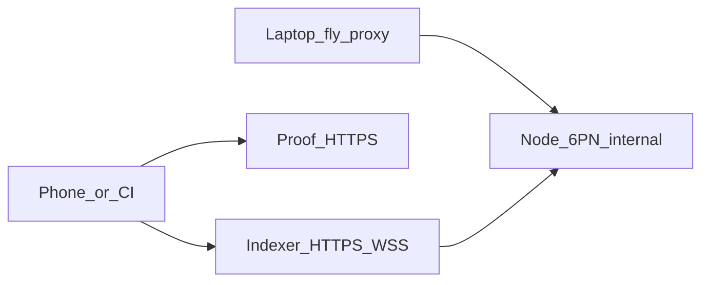

import PersonaTiles from '@site/src/components/PersonaTiles';

# NFT-ZK on Fly.io

Host the Undeployed node, indexer, and proof server on Fly.io so a phone or CI job can reach them. Then deploy the official NFT-ZK contract and call `mintAdmin` with the constructor admin key.

This tutorial fills two gaps. Official guides run Undeployed on Docker Desktop at localhost. Official NFT-ZK tests use the in-memory Compact simulator. Together, those paths never put NFT-ZK on a real chain that a remote client can call.

:::warning Remote proof servers see witness data

The proof server receives private inputs in the clear. Host it only on infrastructure you control. Do not send Mainnet secrets to a shared or public proof server. For Preprod and Preview, keep proving local. See [Run the proof server](/guides/run-proof-server).

:::

## When to use hosted Undeployed

| Goal | Network | Proof server |
| --- | --- | --- |
| Iterate on a laptop with Docker Desktop | Local `undeployed` | `http://localhost:6300` |
| Reach Undeployed from a phone or CI | Hosted `undeployed` | Public HTTPS you control |
| Share a persistent public chain | `preview` or `preprod` | Local Docker on port 6300 |
| Production | `mainnet` | Local, on a machine you control |

Hosted Undeployed is still the `undeployed` network ID. The genesis wallet stays pre-funded. There is no faucet and no explorer. Destroying the node volume invalidates every contract address on that chain.

Use local Docker when you develop on one machine. Use Fly.io when Docker Desktop is not available on the client. Move to Preview or Preprod when you need a shared public network. See [Networks and environments](/guides/networks-and-environments).

## What you build

- Three Fly.io apps: node (private), indexer (public GraphQL), proof server (public HTTPS).
- Deploy NFT-ZK from [example-nft-contracts](https://github.com/midnightntwrk/example-nft-contracts).
- Call `mintAdmin` with the same admin secret the constructor hashed on-chain.

## Compatibility

Verified against [midnight-local-dev `standalone.yml`](https://github.com/midnightntwrk/midnight-local-dev/blob/main/standalone.yml) as of August 2026.

| Component | Image tag |
| --- | --- |
| Node | `midnightntwrk/midnight-node:1.0.0` |
| Indexer | `midnightntwrk/indexer-standalone:4.3.3` |
| Proof server | `midnightntwrk/proof-server:8.1.0` |

Pin these tags. Do not use `latest`. The node image is the standalone `dev` preset (`CFG_PRESET=dev`). Do not replace it with a `2.x` node image.

## Prerequisites

- A [Fly.io](https://fly.io) account and [`flyctl`](https://fly.io/docs/flyctl/install/).
- [Node.js v22+](https://nodejs.org/) and Yarn.
- The [Compact toolchain](/getting-started/installation#install-compact).
- Docker Desktop, if you want the same stack locally first.

## Next

<PersonaTiles tiles={[
  {
    title: "Host Undeployed on Fly.io",
    body: "Create the node, indexer, and proof server apps. Keep prove traffic on public HTTPS because the proof-server binary is IPv4-only.",
    to: "/tutorials/nft-zk-fly/host-on-fly",
    cta: "Host the stack",
  },
  {
    title: "Deploy and mint NFT-ZK",
    body: "Wrap the NftZk module with admin-keypair mint, persist the constructor secret, and avoid Undeployed Compact map and private-state failures.",
    to: "/tutorials/nft-zk-fly/mint-nft-zk",
    cta: "Mint NFT-ZK",
  },
]} />
