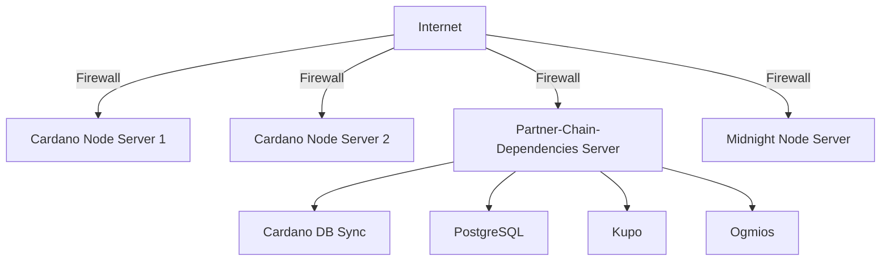

---
---

import vidThumbnail from './images/vid_thumb_become_producer.png';

# Become a Validator

This documentation is designed to guide you through the process of becoming a Midnight Validator. A Validator is responsible for producing new blocks in the Midnight blockchain. Validators play a key role in maintaining the integrity, security, and functionality of the blockchain.

{/* TBD updated Youtube video */}

## Prerequisites

#### Must-have skills
- Proficiency in setting up, running, and monitoring blockchain nodes consistently
- Proficiency in CLI usage, system administration, and networking
- Experience with blockchain technologies, especially Cardano stake pool operations

#### Nice-to-have skills
- Familiarity with scripting languages (e.g., Bash, Python) for automation
- Understanding of security best practices for blockchain infrastructure

#### Must-have gear
- Reliable internet connection with minimal downtime. 50 MB/s or more is sufficient.
- Adequate hardware to run a full node (CPU, RAM, and storage requirements as per the latest documentation)

#### Nice-to-have gear
- Redundant internet connection to ensure high availability
- Backup power supply to prevent downtime during power outages

:::info

There is no slashing if one is offline; there is only the opportunity cost of not receiving additional block rewards.

:::

:::info

To let Midnight evolve without resetting the chain, new versions of node software might introduce changes requiring a hard- or soft-fork. To handle such situations smoothly, a validator node running a compatible version of the software, will start including such information in blocks produced. When a configured threshold of blocks containing this information is reached - the changes will be scheduled, and then enabled by means of a runtime upgrade.

:::

##  Overview of validator infrastructure

This is an example of validator infrastructure. Validators may orchestrate infrastructure based on their preferences.

###  Explainer

- **Cardano Stake Pool (SPO)**: Represents an individual or group of stakeholders pooling their resources to participate in the Cardano network. At a minimum, an SPO operates a Cardano Block Producer (BP) node and one or more Cardano Relay nodes.
- **Cardano Block Producer Node**: Responsible for creating new blocks on the Cardano blockchain.
- **Cardano DB Sync**: Follows the Cardano chain and takes information from the chain and an internally maintained copy of ledger state. Data is then extracted from the chain and inserted into a PostgreSQL database
- **Cardano Relay node**: Relays information between different nodes in the Cardano network, ensuring connectivity and dissemination of data.
**: Synchronizes data between PostgreSQL and Cardano network.
- **Kupo**: Kupo is fast, lightweight and configurable chain-index for the Cardano blockchain that facilitates communication with the Midnight partnerchain scripts that reside on Cardano.
- **Midnight Validator Node**: Validates transactions and blocks within the Midnight blockchain.
- **Ogmios**: Facilitates communication between Cardano nodes and external applications.
- **PostgreSQL**: A relational database used to allow the Midnight validator node to read operations on the Cardano network.

## System requirements and software

Most node operators manage their servers and infrastructure remotely from their workstations. Currently, Mac and Linux are the recommended and tested operating systems for this purpose. If you are using a Windows workstation, then use Windows Subsystem for Linux (WSL) for compatibility.

If you are using WSL, then please use:

* Ubuntu 22.04 (or equivalent)
    * [GLIBC](https://www.gnu.org/software/libc/) 2.35

Check current GLIBC version in WSL:

```bash
ldd --version
```

Docker is a key tool utilized throughout this guide. We recommend installing Docker on both workstations and servers to streamline container management. Docker simplifies the deployment, scaling, and management of applications by packaging them into standardized units called containers, making it easier to maintain consistency across different environments.

- Visit the official Docker website to [get Docker](https://docs.docker.com/get-docker/).

### Public endpoints

Midnight requires Ogmios and Kupo. While you may run Ogmios and Kupo locally, we provide public endpoints for these services.

* [ogmios.preview.midnight.network](https://ogmios.preview.midnight.network/)
* [kupo.preview.midnight.network](https://kupo.preview.midnight.network/)

## Service Compatibility and System Requirements Reference

These are estimated system requirements for each service used within Midnight validator infrastructure.

Here's the updated table with the versions filled in:

| Service            | Version       | Quantity | CPU `testnet` | CPU `mainnet` | Memory `testnet` | Memory `mainnet` | Storage `testnet`  | Storage `mainnet`        |
|--------------------|---------------|----------|---------------|---------------|------------------|------------------|-------------------|--------------------------|
| **Cardano DB Sync**| 13.5.0.2      | 1        | 4 VCPU        | 4 VCPU        | 32 GB RAM        | 32 GB RAM        | 20 GB free         | 320 GB free              |
| **Cardano Node**   | 10.1.2         | 2        | 2 VCPU        | 4 VCPU        | 4 GB RAM         | 16 GB RAM        | 20 GB free         | 250 GB free              |
| **PostgreSQL**     | 15.5          | 1        | 0.5 VCPU      | 1 VCPU        | 1 GB RAM         | 1 GB RAM         | -                  | -                        |
| **Midnight Node**  | 0.7.0             | 1        | 4 VCPU        | 8 VCPU        | 16 GB RAM        | 32 GB RAM        | 40 GB free         | TBD                      |
| **Kupo**           | 2.9.0         | 1        | 2 VCPU        | 4 VCPU        | 0.25 - 2 GB RAM  | 2 - 4 GB RAM     | 5 GB free          | 12 GB free               |
| **Ogmios**         | 6.5.0         | 1        | 0.5 VCPU      | 1 VCPU        | 1 GB RAM         | 2 GB RAM         | -                  | -                        |

## Example Server Architecture



Here's a textual description of an example server architecture tailored for the Cardano `Preview` testnet and Midnight `Testnet`:

#### 1. **Cardano Node Servers for Stake Pool Operation (x2)**

**Purpose:**
- To run the Cardano nodes as an SPO on the Cardano environment.

**Server Specifications:**
- **CPU:** 2 VCPU (`testnet` recommendation)
- **Memory:** 4 GB RAM (`testnet` recommendation)
- **Storage:** 20 GB SSD (`testnet` recommendation)
- **OS:** A Linux distribution (e.g., Ubuntu 22.04 LTS)
- **Software:** Cardano Node configured for testnet

#### 2. **Partner-Chain-Dependencies Server**

**Purpose:**
- To host all partner-chain auxiliary services needed for Midnight validator operations.

**Server Specifications:**
- **CPU:** 4 VCPU (Combining minimal requirements for all services on testnet)
- **Memory:** 16 GB RAM (To handle DB Sync, PostgreSQL, and other services comfortably)
- **Storage:** 100 GB SSD (Considering DB Sync's lower storage need on testnet plus buffer)
- **OS:** A Linux distribution (e.g., Ubuntu 22.04 LTS)
- **Software:**
  - Cardano DB Sync v13.5.0.2
  - PostgreSQL v15.3
  - Kupo v2.9.0
  - Ogmios v6.8.0

#### 3. **Midnight Node Server**

**Purpose:**
- To run the Midnight Node in validator mode.

**Server Specifications:**
- **CPU:** 4 VCPU (`testnet` recommendation)
- **Memory:** 16 GB RAM (`testnet` recommendation)
- **Storage:** 40 GB SSD (`testnet` recommendation)
- **OS:** A Linux distribution (e.g., Ubuntu 22.04 LTS)
- **Software:** Midnight Node (version as per current development or testing phase)

### Network and Security Considerations for Testnet:

- **Firewall and Security:** Basic firewall setup with `ufw` or similar, less stringent than mainnet but still secure for testing purposes.
- **Network:** Reliable internet connection, though high-speed might not be as critical as for mainnet. Dynamic IPs might be acceptable for testnet nodes unless static IPs are required for specific tests.
- **Backup:** Less frequent backups might be necessary, but still advisable for important test configurations or data.

### Scalability in Testnet:

- **Flexibility:** Testnet environments should be flexible to quickly scale up or down based on testing needs. Cloud services could be ideal for this due to their scalability.
- **Testing New Features:** This setup allows for testing new versions or configurations of software without risking mainnet operations.

This testnet architecture focuses on providing a stable yet flexible environment for development, testing, and validation of stake pool operations and new features before they are deployed to the mainnet. The specifications are generally lower due to the experimental nature of the testnet, where the economic stakes are not as high.