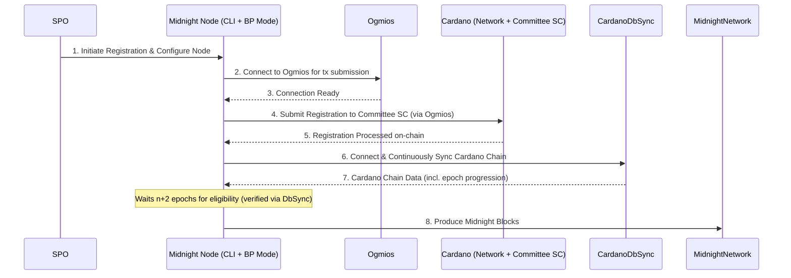
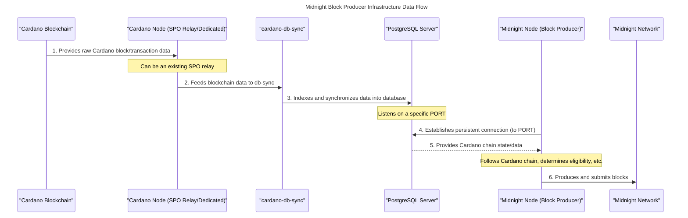

import vidThumbnail from './images/vid_thumb_become_producer.png';

# Become a Midnight Block Producer

This documentation is designed to guide you through the process of becoming a Midnight Validator. A Validator is responsible for producing new blocks in the Midnight blockchain. Validators play a key role in maintaining the integrity, security, and functionality of the blockchain.

<iframe
  width="100%"
  height="400"
  src="https://www.youtube.com/embed/aKNoR09AU1Q"
  title="Introduction to Midnight and the Midnight Developer Academy"
  frameborder="0"
  allow="accelerometer; autoplay; clipboard-write; encrypted-media; gyroscope; picture-in-picture"
  allowfullscreen
></iframe>

## Prerequisites

#### Must-have skills
- Proficiency in setting up, running, and monitoring blockchain nodes consistently
- Proficiency in CLI usage, system administration, and networking
- Experience with blockchain technologies, especially Cardano stake pool operations

#### Nice-to-have skills
- Familiarity with scripting languages (e.g., Bash, Python) for automation
- Understanding of security best practices for blockchain infrastructure

#### Must-have gear
- Reliable internet connection with minimal downtime. 50 MB/s or more is sufficient.
- Adequate hardware to run a full node (CPU, RAM, and storage requirements as per the latest documentation)

#### Nice-to-have gear
- Redundant internet connection to ensure high availability
- Backup power supply to prevent downtime during power outages

:::info

There is no slashing if one is offline; there is only the opportunity cost of not receiving additional block rewards.

:::

:::info

To let Midnight evolve without resetting the chain, new versions of node software might introduce changes requiring a hard- or soft-fork. To handle such situations smoothly, a validator node running a compatible version of the software, will start including such information in blocks produced. When a configured threshold of blocks containing this information is reached - the changes will be scheduled, and then enabled by means of a runtime upgrade.

:::

##  Midnight Block Production Overview



To become a Midnight block producer, an entity must first fulfill the prerequisite of operating as a Cardano Stake Pool Operator (SPO). This foundational requirement ensures a baseline understanding of blockchain operations and infrastructure management.

Upon satisfying the SPO requirement, an operator can register as a candidate with the Midnight Block Producer Committee. This committee is implemented as a smart contract on the Cardano blockchain and is responsible for managing the rotation and selection of SPOs for block production in each epoch. Registration is facilitated through straightforward command-line interface (CLI) commands provided by the Midnight node software.

Following successful registration, the final operational step involves configuring and running the Midnight node in block producer mode. This mode necessitates a persistent connection between the Midnight node and a PostgreSQL instance running cardano-db-sync. This connection is crucial for the Midnight node to accurately track and synchronize with the Cardano blockchain.

Eligibility for block production is typically established approximately two Cardano epochs (n+2) after successful registration. At this point, the registered Midnight node will commence its role in producing blocks.

## System requirements and software



Operating a Midnight block producer alongside a standard Cardano Stake Pool necessitates the continuous operation of several key services, complemented by one intermittently used component.

The following services must run continuously:

- **PostgreSQL Server**: This server provides a PostgreSQL port, enabling the Midnight node to accurately track and follow the Cardano blockchain.

- **Cardano-db-sync**: This component is responsible for synchronizing the PostgreSQL database with real-time data from the Cardano blockchain.

- **Cardano-node**: Cardano-db-sync indexes the Cardano database from a Cardano-node. Operators may opt to utilize an existing Cardano node (relay) from their current Cardano SPO setup to fulfill this requirement.

- **Midnight Node** (Block Producer Mode): This node maintains a persistent connection to PostgreSQL to follow the Cardano chain, actively producing blocks for the Midnight network.

In addition, **Ogmios** is employed temporarily for specific Partner-Chain CLI commands, such as submitting registration transactions to the Cardano chain. It does not, however, require continuous operation.

Most node operators manage their servers and infrastructure remotely from their workstations. Currently, Mac and Linux are the recommended and tested operating systems for this purpose. If you are using a Windows workstation, then use Windows Subsystem for Linux (WSL) for compatibility.

If you are using WSL, then please use:

* Ubuntu 22.04 (or equivalent)
    * [GLIBC](https://www.gnu.org/software/libc/) 2.35

Check current GLIBC version in WSL:

```bash
ldd --version
```

Docker is a key tool utilized throughout this guide. We recommend installing Docker on both workstations and servers to streamline container management. Docker simplifies the deployment, scaling, and management of applications by packaging them into standardized units called containers, making it easier to maintain consistency across different environments.

- Visit the official Docker website to [get Docker](https://docs.docker.com/get-docker/).

### Versioning compatibility

See [compatibility matrix](/relnotes/support-matrix).

### Estimated hardware requirements

These are estimated system requirements for each service used within Midnight validator infrastructure.

Here's the updated table with the versions filled in:

| Service            | Quantity | CPU `testnet` | CPU `mainnet` | Memory `testnet` | Memory `mainnet` | Storage `testnet`  | Storage `mainnet`        |
|--------------------|----------|---------------|---------------|------------------|------------------|-------------------|--------------------------|
| **Cardano DB Sync**| 1        | 4 VCPU        | 4 VCPU        | 32 GB RAM        | 32 GB RAM        | 20 GB free         | 320 GB free              |
| **Cardano Node** | 2        | 2 VCPU        | 4 VCPU        | 4 GB RAM         | 16 GB RAM        | 20 GB free         | 250 GB free              |
| **PostgreSQL** | 1        | 0.5 VCPU      | 1 VCPU        | 1 GB RAM         | 1 GB RAM         | -                  | -                        |
| **Midnight Node** | 1        | 4 VCPU        | 8 VCPU        | 16 GB RAM        | 32 GB RAM        | 40 GB free         | TBD                      |
| **Ogmios** | 1        | 0.5 VCPU      | 1 VCPU        | 1 GB RAM         | 2 GB RAM         | -                  | -                        |


:::tip 

An existing Cardano relay node can be repurposed for `cardano-db-sync` if the operational setup permits.

:::

## Public endpoints

Midnight-node uses partner-chains CLI commands which require on an Ogmios connect. While you may run Ogmios locally, we provide a public endpoint for the service.

* [ogmios.preview.midnight.network](https://ogmios.preview.midnight.network/)

### Network and Security Considerations for Testnet:

- **Firewall and Security:** Basic firewall setup with `ufw` or similar, less stringent than mainnet but still secure for testing purposes.
- **Network:** Reliable internet connection, though high-speed might not be as critical as for mainnet. Dynamic IPs might be acceptable for testnet nodes unless static IPs are required for specific tests.
- **Backup:** Less frequent backups might be necessary, but still advisable for important test configurations or data.
