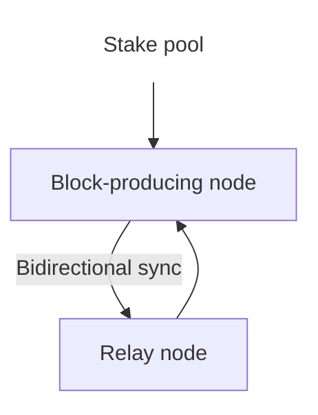

# Operate a Cardano stake pool

Midnight is a partner chain to Cardano. Cardano stake pool operators (SPOs) can help secure and decentralize Midnight by registering to produce blocks on its network.

To become a Midnight validator, you must operate (or set up) a Cardano stake pool in a supported environment.

## Supported environments

Midnight environments follow the standard Cardano naming conventions:

- Midnight Preview – Partner chain to Cardano Preview
- Midnight Preprod – Partner chain to Cardano Preprod
- Midnight Mainnet – Partner chain to Cardano Mainnet

The following table lists the currently supported environments for Midnight validator registration.

| Midnight environment | Status              | Corresponding Cardano environment |
|----------------------|---------------------|-----------------------------------|
| Preview             | Available          | Preview                          |
| Preprod             | Not yet available  | Preprod                          |
| Mainnet             | Not yet available  | Mainnet                          |

:::important

Midnight Testnet-02 will be sunset in favor for Midnight Preview. Therefore, all Testnet-02 validators are required to migrate to Midnight Preview.

:::

## Set up a Cardano stake pool

If you already operate a stake pool on the Cardano Preview environment, you can proceed to Midnight validator registration (see the main validator guide).

To set up a new stake pool on Cardano Preview:

### Requirements

- Compatible Cardano node version (check the [official releases](https://github.com/IntersectMBO/cardano-node/releases) for the current recommended version).
- At least 500 tADA for pool pledge, plus transaction fees.
- A UTxO containing funds for the Midnight validator registration fee, along with its associated payment signing key (`payment.skey`).
- Stake pool cold signing key (`cold.skey`), required during Midnight registration.
- Air-gapped device for secure key storage (recommended; optional on test environments).

A typical stake pool setup includes at least one block-producing node (secure, not publicly exposed) and one or more relay nodes (public-facing for network connectivity).

### Recommended resources

These guides provide step-by-step instructions for setting up and operating a Cardano stake pool:

- **[Cardano Course Handbook](https://cardano-course.gitbook.io/cardano-course/handbook)** – Comprehensive coverage from node setup to pool management. Highly recommended for beginners.
- **[Guild Operators Toolkit](https://cardano-community.github.io/guild-operators/)** – Practical tools and scripts for faster setup. Ideal for operators with some technical experience.
- **[CoinCashew Guide](https://www.coincashew.com/coins/overview-ada/guide-how-to-build-a-haskell-stakepool-node)** – Detailed, up-to-date procedures for node and pool configuration.

### Test environment resources

- **Cardano environment configuration files** – Download from [The Cardano Operations Book](https://book.play.dev.cardano.org/environments.html).
- **Faucet** – Request tADA (including delegated amounts for pool testing) at the [Cardano testnets faucet](https://docs.cardano.org/cardano-testnets/tools/faucet).