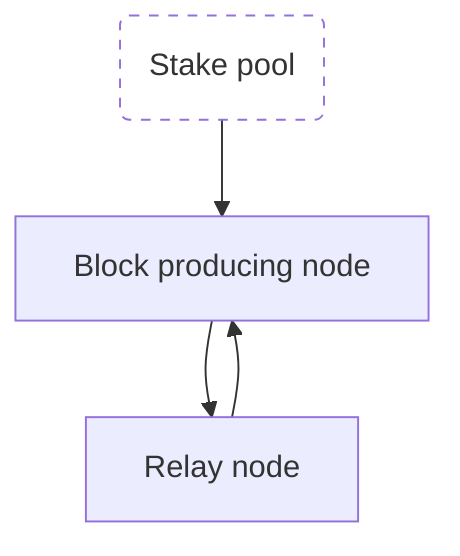

# Begin operating a Cardano Stake Pool

Midnight serves as a partner-chain to Cardano, presenting a distinctive opportunity for Cardano Stake Pool Operators (SPOs) to uphold the decentralization and security of Midnight. For SPOs interested in producing blocks for Midnight, they must register as candidates in the validator committee for the Midnight partner-chain.

To embark on the path of becoming a Midnight validator, one must either be, or become, a Cardano stake pool operator (SPO) within a Cardano environment that is supported for this role.

## Supported environments

| Cardano env. | Status | Midnight env.
|----------|----------|----------|
| `preview` | ✅ | `testnet-02` |
| `preprod` | ❌ | N/A |
| `mainnet` | ❌ | N/A |

## Become a Cardano SPO

### Requirements

1. Cardano node version [`10.1.4`](https://github.com/IntersectMBO/cardano-node/releases/tag/10.1.4). Please use this version.
2. 500 `tAda` + fee for stake pool pledge.
3. A UTXO for the Midnight validator registration fee, with its `payment.skey`.
3. SPO `cold.skey` will also be needed within the Midnight validator registration process.
4. Air-gapped device for secret storage (optional for testnets).

:::info

Use regular Ed25519 keys or extended Ed25519 keys.

:::

### Useful Cardano stake pool operation resources

- [Cardano Handbook](https://cardano-course.gitbook.io/cardano-course/handbook) - A comprehensive guide covering everything from running a Cardano node to managing a stake pool. **This is highly recommended for new Stake Pool Operators (SPOs) to grasp the fundamentals.**
- [Guild Operators SPO Toolkit](https://cardano-community.github.io/guild-operators/basics/) - A resourceful toolkit designed to expedite the setup and management of a Stake Pool Operator. **Perfect for those with some technical background who want to dive straight into practical operation without extensive reading.**

---

-   [Preview testnet configuration files](https://book.world.dev.cardano.org/env-preview.html#configuration-files)
-   [Testnets faucet to request tADA](https://docs.cardano.org/cardano-testnet/tools/faucet/)
