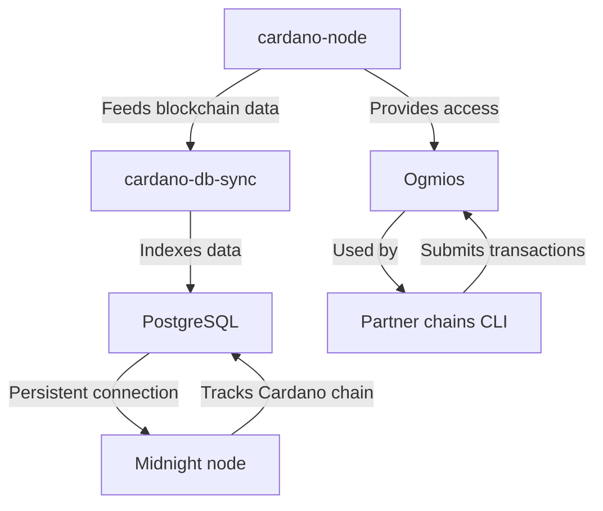

# Configure partner chain dependencies

This guide explains how to set up the required partner chain services for a Midnight validator: **cardano-node**, **cardano-db-sync**, **PostgreSQL**, and **Ogmios**.



These services support the following functions:

- **cardano-node** – Downloads and synchronizes the Cardano blockchain.
- **cardano-db-sync** and **PostgreSQL** – Indexes Cardano blockchain data into a PostgreSQL database. The Midnight node requires a persistent connection to this database to track the Cardano chain.
- **Ogmios** – Provides a lightweight WebSocket API for interacting with the Cardano chain. The partner chains CLI uses Ogmios during registration and other operations.

Use the provided `compose-partner-chains.yml` Docker Compose file to deploy these services easily.

## Prerequisites

Before you start:

- Your server meets the hardware requirements (see the system requirements section).
- You have administrative (sudo) access to the server.
- Docker and Docker Compose are installed. For instructions, see:
  - [Install Docker Engine](https://docs.docker.com/engine/install/)
  - [Install Docker Compose](https://docs.docker.com/compose/install/)
- Docker is configured to run in [rootless mode](https://docs.docker.com/engine/security/rootless/) (recommended for security).
- Docker respects UFW firewall rules. Edit `/etc/docker/daemon.json`:

  ```json
  {
    "iptables": false
  }
  ```

  Then restart Docker and verify firewall rules:

  ```bash
  sudo systemctl restart docker
  sudo ufw status
  ```

> [!NOTE]
> Always verify firewall settings after changes to maintain security.

## Deploy dependencies with Docker Compose

### Install direnv (optional but recommended)

`direnv` automatically manages environment variables for the project.

For detailed instructions, see the [direnv installation guide](https://direnv.net/docs/installation.html).

On Ubuntu/Debian:

```bash
sudo apt install direnv
```

Hook direnv into your shell by adding this line to `~/.bashrc`:

```bash
eval "$(direnv hook bash)"
```

Reload your shell:

```bash
source ~/.bashrc
```

### Clone the repository

```bash
git clone git@github.com:midnightntwrk/midnight-node-docker.git
cd midnight-node-docker
```

When you enter the directory, direnv prompts you to allow the `.envrc` file. Review it first:

```bash
cat .envrc
```

If it is safe, allow it:

```bash
direnv allow
```

direnv now loads the required environment variables automatically.

### (Optional) Customize environment variables

The default settings in `.envrc` work for most setups. Edit the file only if you need custom PostgreSQL credentials.

A random PostgreSQL password is generated automatically and stored in `postgres.password` when services start.

### Start the services

> [!NOTE]
> Docker Desktop users: Run all commands in your system terminal, not the Docker Desktop UI. Ensure Docker Desktop is running in the background.

Start the partner chain services in detached mode:

```bash
docker compose -f compose-partner-chains.yml up -d
```

> [!NOTE]
> Use the modern `docker compose` command (with a space). On older Docker versions, use `docker-compose` (with a hyphen).

Expected output example:

```bash
[+] Running 5/5
 ✔ Network midnight-node-docker_default  Created
 ✔ Container cardano-ogmios              Started
 ✔ Container db-sync-postgres            Healthy
 ✔ Container cardano-node                Started
 ✔ Container cardano-db-sync             Started
```

> [!IMPORTANT]
> Initial synchronization with the Cardano network can take several hours or longer, depending on your connection and hardware. Wait for full sync before continuing.

### Common issues and fixes

<details>
<summary>PostgreSQL authentication error in cardano-db-sync logs</summary>

Error example:

```
cardano-db-sync: libpq: failed (connection to server at "postgres" (...), port 5432 failed: FATAL: password authentication failed for user "postgres")
```

**Cause**: The PostgreSQL data volume retains an old password from a previous run.

**Fix**:

```bash
docker compose -f compose-partner-chains.yml down
docker volume rm midnight-node-docker_postgres-data
docker compose -f compose-partner-chains.yml up -d
```

This clears the persistent data and reinitializes PostgreSQL with the current password.

</details>

## Manage and monitor services

### Check container status

```bash
docker container list
```

Example output:

```
CONTAINER ID   IMAGE                                           COMMAND                  STATUS                   PORTS                                       NAMES
aeddf39b71f7   ghcr.io/intersectmbo/cardano-db-sync:13.5.0.2   ...                      Up                       ...                                         db-sync
61a6eb0ed321   cardanosolutions/ogmios:v6.5.0                  ...                      Up (healthy)             0.0.0.0:1337->1337/tcp                      ogmios
b514a818da45   postgres:15.3                                   ...                      Up (healthy)             0.0.0.0:5432->5432/tcp                      db-sync-postgres
558d2b49eddc   ghcr.io/intersectmbo/cardano-node:10.1.2        ...                      Up                       0.0.0.0:3001->3001/tcp                      cardano-node
```

### View logs

```bash
docker logs cardano-ogmios
docker logs cardano-db-sync
docker logs db-sync-postgres
docker logs cardano-node
```

### Useful Docker Compose commands

| Command                        | Description                          |
|--------------------------------|--------------------------------------|
| `docker compose stop`          | Stop running containers              |
| `docker compose start`         | Start stopped containers             |
| `docker compose restart`       | Restart containers                   |
| `docker compose down`          | Stop and remove containers/networks  |
| `docker compose stats`         | Show resource usage                  |

For full documentation, see [Docker Compose reference](https://docs.docker.com/compose/reference/).

### Monitor Ogmios

- Open the health dashboard: http://localhost:1337 (or http://<server-ip>:1337 for remote servers).
- Check health via curl:

  ```bash
  curl -s localhost:1337/health | jq '.'
  ```

### Check cardano-db-sync progress

Install the PostgreSQL client if needed:

```bash
sudo apt-get install postgresql-client
```

Run this query locally:

```bash
psql -h localhost -U postgres -d cexplorer -p 5432 -c \
"SELECT 100 * (EXTRACT(EPOCH FROM (MAX(time) AT TIME ZONE 'UTC')) - EXTRACT(EPOCH FROM (MIN(time) AT TIME ZONE 'UTC'))) / (EXTRACT(EPOCH FROM (NOW() AT TIME ZONE 'UTC')) - EXTRACT(EPOCH FROM (MIN(time) AT TIME ZONE 'UTC'))) AS sync_percent FROM block;"
```

Or from inside the container:

```bash
docker exec -it db-sync-postgres psql -U postgres -d cexplorer -c "...same query..."
```

For remote servers via SSH:

```bash
ssh user@your-server-ip -C "psql -d cexplorer -h localhost -p 5432 -U postgres -c \"SELECT 100 * (EXTRACT(EPOCH FROM (MAX(time) AT TIME ZONE 'UTC')) - EXTRACT(EPOCH FROM (MIN(time) AT TIME ZONE 'UTC'))) / (EXTRACT(EPOCH FROM (NOW() AT TIME ZONE 'UTC')) - EXTRACT(EPOCH FROM (MIN(time) AT TIME ZONE 'UTC'))) AS sync_percent FROM block;\""
```

Once synchronization reaches ~100%, you are ready to proceed with Midnight node configuration.