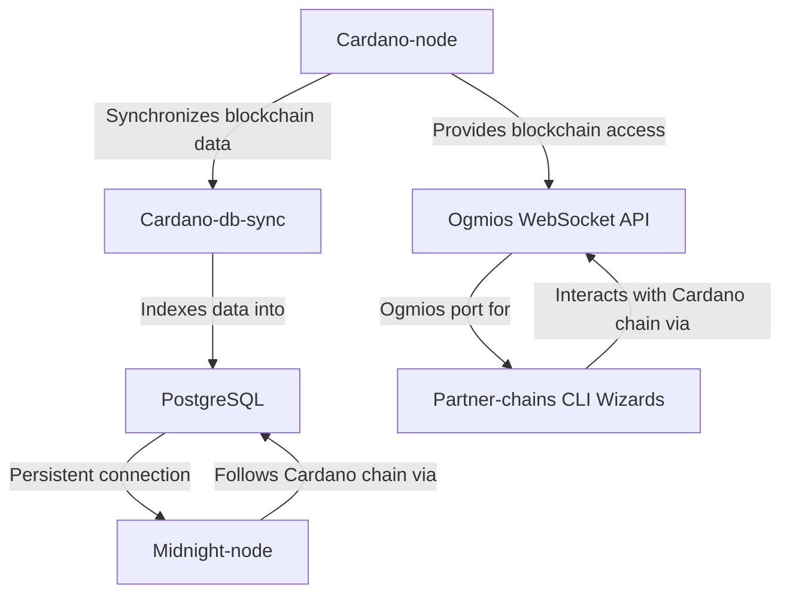

# Configure Partner-Chains Dependencies

This guide describes how to configure partner-chain dependencies, including [Cardano-node](https://github.com/IntersectMBO/cardano-node), [Cardano-db-sync](https://github.com/IntersectMBO/cardano-db-sync), PostgreSQL, and [Ogmios](https://ogmios.dev/). Why are these services needed?



- **Cardano-node**: Cardano-node is the underlining client that downloads and synchronizes the Cardano chain.
- **Cardano-db-sync** & **PostgresSQL**: Cardano-db-sync indexes the Cardano-node database into a PostgreSQL database which is accessible via a Postgres port. The Midnight-node needs a persistent connection to the Postgres port in order to follow the Cardano chain.
- **Ogmios**: Ogmios is a WebSocket API that allows applications to interact with the Cardano chain. An Ogmios port is needed when invoking the partner-chains CLI wizards that you will use throughout the registration process.

You can use the provided `compose-partner-chains.yml` file with [Docker Compose](https://docs.docker.com/compose/) to more easily launch these services.

## Prerequisites

Before you begin, ensure the following:

- Your system meets the minimum server requirements (#system-requirements).
- You have administrative access to the server.
- Docker and Docker Compose are installed. For installation instructions, see [Install Docker Engine](https://docs.docker.com/engine/install/) and [Install Docker Compose](https://docs.docker.com/compose/install/).
- **Docker is configured to run in [Rootless mode](https://docs.docker.com/engine/security/rootless/).**
- **Configure Docker to respect UFW by editing `/etc/docker/daemon.json`**
   ```bash
   {
      "iptables": false
   }
   ```
   - Restart Docker and verify firewall rules:
   ```bash
   sudo systemctl restart docker
   sudo ufw status
   ```

:::note

Always validate firewall settings after configuration to ensure security.

:::


## Set up dependencies with Docker Compose

Follow these steps to configure and start partner-chain dependencies using Docker Compose.

### Install direnv

Install `direnv` to manage environment variables. For more detailed instructions, see [direnv Installation](https://direnv.net/docs/installation.html).

- Install `direnv`:

```bash
sudo apt install direnv
```

Once installed, `direnv` must be *hooked* to your shell profile.

- Append `.bashrc` with the following line

```bash
eval "$(direnv hook bash)"
```

- Reload shell

```shell
source ~/.bashrc
```

### Clone the `Midnight-node-docker` repository

Clone the `midnight-node-docker` repository and navigate to the project directory:

```bash
git clone git@github.com:midnightntwrk/midnight-node-docker.git
cd midnight-node-docker
```

Upon entering the directory, `direnv` prompts you to allow the `.envrc` file. Inspect the file to ensure it is safe:

```bash
cat .envrc
```

If the file is acceptable, run:

```bash
direnv allow
```

This command enables `direnv` to set environment variables automatically when you enter the directory and unset them when you leave.

### Configure environment variables

(The environment variables set in `.envrc` should not need changing. This section is optional)

Edit the `.envrc` file to configure `PostgreSQL` settings for `Cardano-db-sync`:

- Open the `.envrc` file in a text editor, such as Visual Studio Code or `vim`:

```shell
vim .envrc
```

- In `vim`, press `i` to enter insert mode.
- Locate and update the `POSTGRES_*` variables, for example:

:::note

Your random PostgreSQL password is stored in the file `postgres.password` in the same directory as your `.envrc` file. This file will be automatically generated when you start the services in the next step.

:::

- Save and exit:
   - In `vim`, press `Esc`, then type `:wq` and press `Enter`.

These settings configure the database used by `Cardano-db-sync` and will be read by `midnight-node`.

### Start partner-chains dependency services

Launch the partner-chain dependencies in detached mode:

```bash
docker compose -f compose-partner-chains.yml up -d
```

:::note
Use the modern syntax `docker compose` (with a space).  
If you’re on an older Docker installation that does not support this, use the legacy command `docker-compose`.
:::


Example output:

```bash
[+] Running 5/5
 ✔ Network midnight-node-docker_default  Created                                                                 0.0s 
 ✔ Container cardano-ogmios              Started                                                                 0.3s 
 ✔ Container db-sync-postgres            Healthy                                                                 5.8s 
 ✔ Container cardano-node                Started                                                                 0.3s 
 ✔ Container cardano-db-sync             Started                                                                 5.9s 
```

:::important

Synchronization with the Cardano network may take several hours. Ensure all dependencies are fully synced before proceeding.

:::

<details>
<summary><b>Common Errors</b></summary>

1. **The error in the cardano-db-sync logs indicates that the PostgreSQL authentication is failing due to an incorrect password for the postgres user:**

```bash
cardano-db-sync: libpq: failed (connection to server at "postgres" (172.18.0.3), port 5432 failed: FATAL:  password authentication failed for user "postgres")
```
   - **Cause**: The `postgres` container may have initialized with a different password in a previous run, and the `postgres-data` volume retained that configuration. If you regenerated the `postgres.password` file or changed the password in `.envrc`, the `postgres` service might still be using the old password stored in the persistent volume.
   - **Solution**: Clear the PostgresSQL data volume:
   ```bash
   docker compose -f compose-partner-chains.yml down
   docker volume rm midnight-node-docker_postgres-data
   docker compose -f compose-partner-chains.yml up -d
   ```
   This removes the persistent PostgreSQL data, forcing the `postgres` container to reinitialize with the current `POSTGRES_PASSWORD`.

</details>

### Manage and monitor services:

1. **Verify status of services and ports:**

   - List active Docker containers along with their status, ports, and container IDs:

   ```bash
   docker container list
   ```

   Example output:

   ```shell
   CONTAINER ID   IMAGE                                           COMMAND                  CREATED         STATUS                   PORTS                                       NAMES
   aeddf39b71f7   ghcr.io/intersectmbo/cardano-db-sync:13.5.0.2   "/nix/store/mvypj83y…"   9 minutes ago   Up 9 minutes                                                         db-sync
   61a6eb0ed321   cardanosolutions/ogmios:v6.5.0                  "/bin/ogmios --node-…"   9 minutes ago   Up 9 minutes (healthy)   0.0.0.0:1337->1337/tcp, :::1337->1337/tcp   ogmios
   b514a818da45   postgres:15.3                                   "docker-entrypoint.s…"   9 minutes ago   Up 9 minutes (healthy)   0.0.0.0:5432->5432/tcp, :::5432->5432/tcp   db-sync-postgres
   558d2b49eddc   ghcr.io/intersectmbo/cardano-node:10.1.2        "entrypoint"             9 minutes ago   Up 9 minutes             0.0.0.0:3001->3001/tcp, :::3001->3001/tcp   cardano-node
   ```

2. **View logs of specific containers:**

To view logs of a particular container, use `docker logs <container name or container ID>`:

```bash
docker logs cardano-ogmios
docker logs cardano-db-sync
docker logs db-sync-postgres
docker logs cardano-node
```

3. **Useful docker-compose commands:**

   To learn more about Docker Compose, visit the official [Docker Compose documentation](https://docs.docker.com/compose/). However, here are some common commands:

   ```shell
   docker-compose stop # stop containers
   docker-compose start # start containers
   docker-compose restart # restart containers
   docker-compose down # stop and remove containers
   docker-compose stats # display resource usage statistics
   ```

4. **Monitor Ogmios service:**

   - View Ogmios dashboard at http://localhost:1337/. If Ogmios is running on a remote service then simply visit http://x.x.x.x:1337 in a browser with the respective IP address and PORT.
   - Query Ogmios healthcheck:
   ```
   curl -s localhost:1337/health | jq '.'
   ```

5. **Query Cardano-db-sync synchronization progress:**

   - **Using `psql` directly:**

     If you don’t already have the PostgreSQL client installed, you can install it using:

     ```shell
     sudo apt-get install postgresql-client
     ```

     Log in to PostgreSQL shell using `psql`: 
     
     ```shell
      psql -h localhost -U postgres -d cexplorer -p 5432
      ```
     
      Optionally, log in to PostgreSQL shell using `docker`: 

     ```shell
     docker exec -it db-sync-postgres psql -U postgres -d cexplorer
     ```

     Then, run the following query inside the PostgreSQL shell:

     ```sql
     SELECT 100 * (
         EXTRACT(EPOCH FROM (MAX(time) AT TIME ZONE 'UTC')) -
         EXTRACT(EPOCH FROM (MIN(time) AT TIME ZONE 'UTC'))
     ) / (
         EXTRACT(EPOCH FROM (NOW() AT TIME ZONE 'UTC')) -
         EXTRACT(EPOCH FROM (MIN(time) AT TIME ZONE 'UTC'))
     ) AS sync_percent
     FROM block;
     ```

   - **Using `ssh` remotely:**

     If you want to query remotely, run this command via SSH:
     
     ```shell
     ssh user@x.x.x.x -C "psql -d cexplorer -h localhost -p 5432 -U postgres -c \"SELECT 100 * (EXTRACT(EPOCH FROM (MAX(time) AT TIME ZONE 'UTC')) - EXTRACT(EPOCH FROM (MIN(time) AT TIME ZONE 'UTC'))) / (EXTRACT(EPOCH FROM (NOW() AT TIME ZONE 'UTC')) - EXTRACT(EPOCH FROM (MIN(time) AT TIME ZONE 'UTC'))) AS sync_percent FROM block;\""
     ```

     Replace `user@x.x.x.x` with your SSH username and server IP address.
