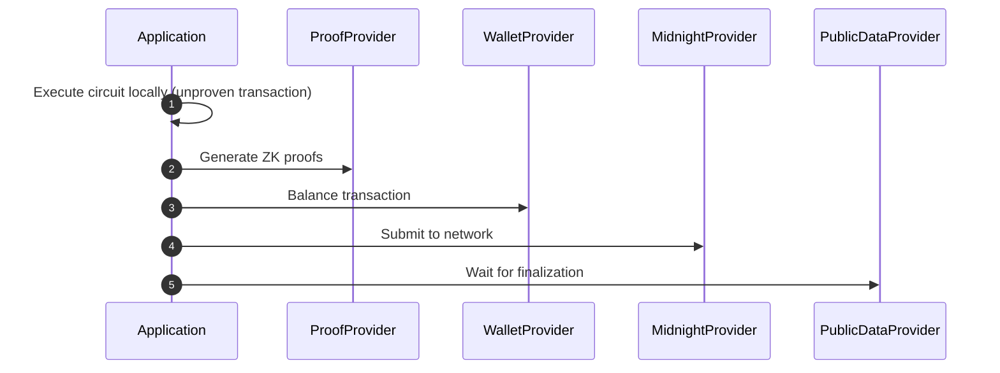

import Tabs from '@theme/Tabs';
import TabItem from '@theme/TabItem';

# Midnight.js

Midnight.js provides tools for deploying and interacting with smart contracts, managing encrypted private state, generating zero-knowledge proofs, and submitting transactions to the Midnight network.

This guide provides a comprehensive overview of the Midnight.js SDK, including its architecture, packages, and how to get started.

## Prerequisites

Before using Midnight.js, ensure you have:

- [Node.js](https://nodejs.org/) version 22.x or higher installed.
- [Docker](https://www.docker.com/) installed and running (required for the [proof server](../../guides/run-proof-server)).

## Packages

Midnight.js uses a modular architecture, with each package providing a specific functionality.

### Core

The core packages provide the foundational functionality for the SDK.

| Package | Purpose |
|---------|---------|
| `@midnight-ntwrk/midnight-js-types` | Shared types, interfaces, and provider contracts |
| `@midnight-ntwrk/midnight-js-contracts` | Contract deployment, circuit calls, and transaction submission |
| `@midnight-ntwrk/midnight-js-network-id` | Network identifier configuration for runtime and ledger WASM APIs |
| `@midnight-ntwrk/midnight-js-utils` | Shared utilities (hex encoding, bech32m, assertions) |

### Providers

The provider packages includes functionality for proof generation, private state management, and public data queries.

| Package | Purpose |
|---------|---------|
| `@midnight-ntwrk/midnight-js-indexer-public-data-provider` | GraphQL-based blockchain data provider (queries and subscriptions) |
| `@midnight-ntwrk/midnight-js-level-private-state-provider` | AES-256-GCM encrypted persistent state storage via [LevelDB](https://github.com/Level/level) |
| `@midnight-ntwrk/midnight-js-http-client-proof-provider` | HTTP client for the Midnight proof server |
| `@midnight-ntwrk/midnight-js-fetch-zk-config-provider` | Browser-compatible zero-knowledge artifact provider using the [Fetch API](https://developer.mozilla.org/en-US/docs/Web/API/Fetch_API) |
| `@midnight-ntwrk/midnight-js-node-zk-config-provider` | Node.js filesystem-based ZK artifact provider |
| `@midnight-ntwrk/midnight-js-logger-provider` | Application-specific [Pino](https://github.com/pinojs/pino) logger configuration |

### Tooling

The tooling packages provide tools for compiling Compact smart contracts.

| Package | Purpose |
|---------|---------|
| `@midnight-ntwrk/midnight-js-compact` | Compact compiler manager for contract compilation |

## Installation

To install the barrel package that provides a single entry point for the SDK.

<Tabs groupId="package-manager">
<TabItem value="npm">
```bash
npm install @midnight-ntwrk/midnight-js
```
</TabItem>
<TabItem value="yarn">
```bash
yarn add @midnight-ntwrk/midnight-js
```
</TabItem>
</Tabs>

To install the individual packages:

<Tabs groupId="package-manager">
<TabItem value="npm">

```bash
npm install @midnight-ntwrk/midnight-js-types
npm install @midnight-ntwrk/midnight-js-contracts
npm install @midnight-ntwrk/midnight-js-network-id
npm install @midnight-ntwrk/midnight-js-utils
npm install @midnight-ntwrk/midnight-js-indexer-public-data-provider
npm install @midnight-ntwrk/midnight-js-level-private-state-provider
npm install @midnight-ntwrk/midnight-js-http-client-proof-provider
npm install @midnight-ntwrk/midnight-js-fetch-zk-config-provider
npm install @midnight-ntwrk/midnight-js-node-zk-config-provider
npm install @midnight-ntwrk/midnight-js-logger-provider
npm install @midnight-ntwrk/ledger-v8
```

</TabItem>
<TabItem value="yarn">
```bash
yarn add @midnight-ntwrk/midnight-js-types
yarn add @midnight-ntwrk/midnight-js-contracts
yarn add @midnight-ntwrk/midnight-js-network-id
yarn add @midnight-ntwrk/midnight-js-utils
yarn add @midnight-ntwrk/midnight-js-indexer-public-data-provider
yarn add @midnight-ntwrk/midnight-js-level-private-state-provider
yarn add @midnight-ntwrk/midnight-js-http-client-proof-provider
yarn add @midnight-ntwrk/midnight-js-fetch-zk-config-provider
yarn add @midnight-ntwrk/midnight-js-node-zk-config-provider
yarn add @midnight-ntwrk/midnight-js-logger-provider
yarn add @midnight-ntwrk/ledger-v8
```
</TabItem>
</Tabs>
:::important

Always refers to the [Compatibility matrix](../../relnotes/support-matrix) to know which version of the SDK works with other components of the Midnight Network.

:::

## Usage patterns

This section provides usage patterns for the Midnight.js SDK.

### Configure the network

The network ID sets the network identifier for the SDK. To perform operations on the Midnight Network, you need to set the appropriate network ID. 
Other Midnight.js libraries and components use this network ID to execute operations on the network.

<Tabs groupId="network">
<TabItem value="preprod">

```typescript
import { setNetworkId } from '@midnight-ntwrk/midnight-js-network-id';

setNetworkId('preprod');

export const CONFIG = {
  indexer: 'https://indexer.preprod.midnight.network/api/v4/graphql',
  indexerWS: 'wss://indexer.preprod.midnight.network/api/v4/graphql/ws',
  node: 'https://rpc.preprod.midnight.network',
  proofServer: 'http://127.0.0.1:6300',
};
```
</TabItem>
<TabItem value="undeployed">
```typescript
import { setNetworkId } from '@midnight-ntwrk/midnight-js-network-id';

setNetworkId('undeployed');

export const CONFIG = {
  indexer: 'http://localhost:8088/api/v4/graphql',
  indexerWS: 'ws://localhost:8088/api/v4/graphql/ws',
  node: 'ws://localhost:9944',
  proofServer: 'http://localhost:6300',
};
```

:::note

The undeployed network is a local network that is not deployed to the blockchain. It is used for testing and development purposes. 
For more information, see the [Midnight local network](../../guides/midnight-local-network) guide.

:::

</TabItem>
</Tabs>

Available networks include:

| Network | Network ID |
|---------|------------|
| Mainnet | `mainnet` |
| Preview | `preview` |
| Preprod | `preprod` |
| Undeployed | `undeployed` |

For Node.js environments, enable WebSocket for GraphQL subscriptions:

```typescript
import { WebSocket } from 'ws';

globalThis.WebSocket = WebSocket;
```

### Configure providers

Providers are modular, pluggable components that each handle a specific capability required for transaction construction and submission to the Midnight blockchain. 

```typescript
import { levelPrivateStateProvider } from '@midnight-ntwrk/midnight-js-level-private-state-provider';
import { indexerPublicDataProvider } from '@midnight-ntwrk/midnight-js-indexer-public-data-provider';
import { httpClientProofProvider } from '@midnight-ntwrk/midnight-js-http-client-proof-provider';
import { FetchZkConfigProvider } from '@midnight-ntwrk/midnight-js-fetch-zk-config-provider';
import * as ledger from '@midnight-ntwrk/ledger-v8';

const zkConfigProvider = new FetchZkConfigProvider(zkArtifactsUrl);

const providers: MidnightProviders = {
  privateStateProvider: levelPrivateStateProvider({
    privateStoragePasswordProvider: () => password,
    accountId: walletAddress,
  }),
  publicDataProvider: indexerPublicDataProvider(queryUrl, subscriptionUrl),
  zkConfigProvider,
  proofProvider: httpClientProofProvider(proofServerUrl, zkConfigProvider),
  walletProvider,    // from @midnight-ntwrk/wallet-sdk-facade
  midnightProvider,  // from @midnight-ntwrk/wallet-sdk-facade
};
```

:::info
The `walletProvider` and `midnightProvider` handle transaction balancing and submission to the blockchain. The Wallet SDK package provides them. For more information, see the [Wallet SDK](./wallet-developer-guide) guide.
:::

You can either use the `FetchZkConfigProvider` or the `NodeZkConfigProvider` to provide the ZK configuration for the proof provider. 

Here is an example using the `FetchZkConfigProvider` method:

```typescript
import { FetchZkConfigProvider } from '@midnight-ntwrk/midnight-js-fetch-zk-config-provider';

const zkConfigProvider = new FetchZkConfigProvider('https://example.com/zk-artifacts');

const proverKey = await zkConfigProvider.getProverKey('myCircuit');
const verifierKey = await zkConfigProvider.getVerifierKey('myCircuit');
const zkir = await zkConfigProvider.getZKIR('myCircuit');
```

Here is an example using the `NodeZkConfigProvider` method:

```typescript
import { NodeZkConfigProvider } from '@midnight-ntwrk/midnight-js-node-zk-config-provider';

const zkConfigProvider = new NodeZkConfigProvider('/path/to/zk-artifacts');

const proverKey = await zkConfigProvider.getProverKey('myCircuit');
const verifierKey = await zkConfigProvider.getVerifierKey('myCircuit');
const zkir = await zkConfigProvider.getZKIR('myCircuit');
```

### Deploy a smart contract

The `deployContract` method deploys a smart contract to the blockchain. It takes the following parameters:

- `providers`: The providers object.
- `compiledContract`: The compiled contract.
- `privateStateId`: The private state ID.
- `initialPrivateState`: The initial private state.

```typescript
import { deployContract } from '@midnight-ntwrk/midnight-js-contracts';

const deployed = await deployContract(providers, {
  compiledContract,
  privateStateId: 'my-state',
  initialPrivateState: { counter: 0n },
});

```

The `deployContact` method returns a `deployedContract` promise. This object contains the contract address and the private state ID.

```typescript
const contractAddress = deployed.deployTxData.public.contractAddress;
console.log(`Contract Address: ${contractAddress}`);
```

### Interact with the contract

To interact with the contract, use the `findDeployedContract` method to get the deployed contract object. 

```typescript
import { findDeployedContract } from '@midnight-ntwrk/midnight-js-contracts';

const contract = await findDeployedContract(providers, {
  contractAddress: contractAddress,
  compiledContract,
  privateStateId: 'my-state',
  initialPrivateState: {},
});

```
This method takes the following parameters:

- `providers`: The providers object.
- Options containing the following properties:
  - `contractAddress`: The contract address.
  - `compiledContract`: The compiled contract.
  - `privateStateId`: The private state ID.
  - `initialPrivateState`: The initial private state.

After initializing the contract object, you can call circuits from your smart contract using the `callTx` property.

```typescript
const transaction = await contract.callTx.someCircuit(circuitArguments);
```

This operation creates a new transaction and submits it to the blockchain. To access the transaction details:

```typescript
const transaction = await contract.callTx.someCircuit(circuitArguments);
console.log('Transaction ID:', transaction.public.txId);
console.log(`Block: ${transaction.public.blockHeight}\n`);
```

### Transaction submission

When you already have transaction payloads or options objects prepared, these helpers submit call, deploy, or generic transactions through the configured providers. 
This is useful for explicit submission flows outside the `contract.callTx.*` convenience methods.

```typescript
import { submitCallTx, submitDeployTx, submitTx } from '@midnight-ntwrk/midnight-js-contracts';

// Submit a call transaction
await submitCallTx(providers, callOptions);

// Submit a deploy transaction
await submitDeployTx(providers, deployOptions);

// Generic transaction submission
await submitTx(providers, txData);
```

### Query state

After deploying a smart contract, you can query the private and public states of the contract using the `getStates` and `getPublicStates` methods.

```typescript
import { getStates, getPublicStates } from '@midnight-ntwrk/midnight-js-contracts';

const states = await getStates(providers, contractAddress, privateStateId);
const publicStates = await getPublicStates(providers, contractAddress);
```

The `getStates` method retrieves the Zswap, ledger, and private states of the deployed smart contract corresponding to the given identifier using the given providers.

It accepts the following parameters:
- `providers`: The providers object.
- `contractAddress`: The contract address.
- `privateStateId`: The private state ID.

The `getPublicStates` method fetches only the public visible (Zswap and ledger) states of a deployed smart contract. It accepts the following parameters:

- `providers`: The providers object.
- `contractAddress`: The contract address.

To get the unshielded balance of the contract, use the `getUnshieldedBalances` method passing the providers and contract address as parameters.

```typescript
const balances = await getUnshieldedBalances(providers, contractAddress);
console.log('Unshielded Balances:', balances);
```

## Key concepts

These concepts are important to understand the Midnight.js SDK and how it works.

### Contract model

The contract model uses the following terminology:

- **Circuit**: Smart contract function that executes locally and generates a zero-knowledge proof.
- **Witness**: Private computation that runs on the end-user's device.
- **Private state**: User-local state updated by circuits — never stored on-chain.
- **Ledger state**: On-chain public contract state.

### ZK artifacts

ZK artifacts are the files generated by the Compact compiler to create zero-knowledge proofs. It includes the following files:

- **Prover key**: Binary used to create zero-knowledge proofs.
- **Verifier key**: Binary used for on-chain proof verification.
- **ZKIR**: Zero-Knowledge Intermediate Representation of compiled contracts.

### Transaction flow

Submitting a contract interaction runs locally first (producing an unproven transaction), 
then uses the typed providers to prove, balance, and broadcast the transaction on the network. 

The diagram below summarizes that sequence.



### Transaction status

Transactions can have the following statuses:

- `SucceedEntirely`: All transaction segments succeeded.
- `FailFallible`: Guaranteed portion succeeded, fallible portion failed.
- `FailEntirely`: Transaction is invalid.