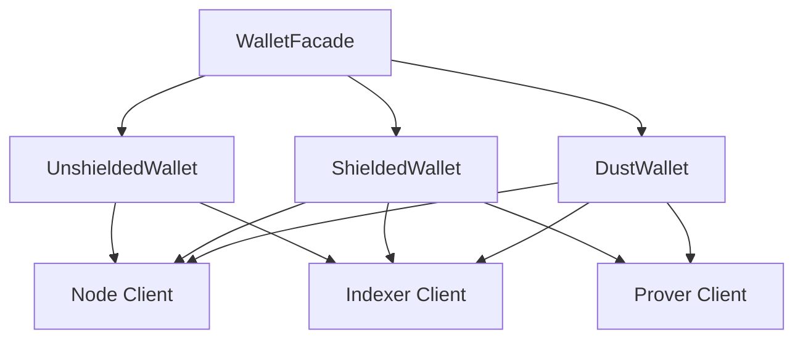

import Tabs from '@theme/Tabs';
import TabItem from '@theme/TabItem';

# Midnight wallet SDK

The Midnight wallet SDK provides a comprehensive TypeScript implementation for managing wallets on the Midnight Network. It supports the three-token system that powers Midnight: unshielded tokens (including NIGHT), shielded tokens with zero-knowledge proofs, and DUST for transaction fees.

## Overview

Wallet functionality on Midnight requires implementing common operations such as:

- Deriving cryptographic keys for multiple token types
- Managing unshielded UTxOs and shielded coin commitments
- Tracking token balances across all three token types
- Connecting to indexers and nodes for chain synchronization
- Creating and balancing transactions with automatic fee payment
- Generating zero-knowledge proofs for private transactions
- Registering NIGHT holdings for DUST generation
- Atomic swaps between parties

The Midnight wallet SDK provides a modular architecture with specialized packages for each concern.

## Packages

The wallet SDK consists of the following packages:

| Package | Purpose |
|---------|---------|
| `@midnight-ntwrk/wallet-sdk-facade` | Unified API for all wallet operations |
| `@midnight-ntwrk/wallet-sdk-unshielded-wallet` | Manages NIGHT and unshielded tokens |
| `@midnight-ntwrk/wallet-sdk-shielded-wallet` | Manages shielded tokens with ZK proofs |
| `@midnight-ntwrk/wallet-sdk-dust-wallet` | Manages DUST for transaction fees |
| `@midnight-ntwrk/wallet-sdk-hd` | Hierarchical deterministic key derivation |
| `@midnight-ntwrk/wallet-sdk-address-format` | Bech32m address encoding and decoding |
| `@midnight-ntwrk/wallet-sdk-node-client` | Communicates with Midnight nodes |
| `@midnight-ntwrk/wallet-sdk-indexer-client` | Queries the Midnight indexer |
| `@midnight-ntwrk/wallet-sdk-prover-client` | Interfaces with the proving server |

For complete package details, see the [Wallet SDK v1.0.0 release notes](../../relnotes/wallet/wallet-1-0-0).

## Installation

Install the Wallet SDK using your preferred package manager:

<Tabs>
  <TabItem value="npm">
    ```bash
    npm install @midnight-ntwrk/wallet-sdk-facade \
                @midnight-ntwrk/wallet-sdk-hd \
                @midnight-ntwrk/wallet-sdk-address-format \
                @midnight-ntwrk/wallet-sdk-unshielded-wallet \
                @midnight-ntwrk/wallet-sdk-shielded-wallet \
                @midnight-ntwrk/wallet-sdk-dust-wallet \
                @midnight-ntwrk/ledger-v7
    ```
  </TabItem>
  <TabItem value="yarn">
    ```bash
    yarn add @midnight-ntwrk/wallet-sdk-facade \
                @midnight-ntwrk/wallet-sdk-hd \
                @midnight-ntwrk/wallet-sdk-address-format \
                @midnight-ntwrk/wallet-sdk-unshielded-wallet \
                @midnight-ntwrk/wallet-sdk-shielded-wallet \
                @midnight-ntwrk/wallet-sdk-dust-wallet \
                @midnight-ntwrk/ledger-v7
    ```
  </TabItem>
</Tabs>

:::tip Version compatibility
Ensure you are referencing the correct version as defined in the [release compatibility matrix](../../relnotes/support-matrix).
:::

## Wallet architecture

The Wallet SDK uses a three-wallet architecture corresponding to Midnight's token model:



- **WalletFacade**: Unified interface that coordinates all three wallet types
- **UnshieldedWallet**: Manages NIGHT and other unshielded tokens using UTxO model
- **ShieldedWallet**: Manages privacy-preserving shielded tokens using ZK proofs
- **DustWallet**: Manages DUST for paying transaction fees

## Derive wallet keys

The Wallet SDK uses hierarchical deterministic (HD) key derivation following BIP-32/BIP-44/CIP-1852 standards. All three wallet types derive keys from a single seed.

### Derivation path

The SDK follows this derivation path:

```
m / 44' / 2400' / account' / role / index
```

Where:
- `account`: Account index (typically 0)
- `role`: 
  - `3` (Roles.Zswap) for shielded operations
  - `0` (Roles.NightExternal) for unshielded operations
  - `4` (Roles.Dust) for DUST operations
- `index`: Address index (typically 0)

### Derive keys from a seed

This example derives all three key types from a single seed:

```typescript
import * as ledger from '@midnight-ntwrk/ledger-v7';
import { HDWallet, Roles } from '@midnight-ntwrk/wallet-sdk-hd';
import { Buffer } from 'buffer';

function deriveAllKeys(seed: Uint8Array) {
  const hdWallet = HDWallet.fromSeed(seed);

  if (hdWallet.type !== 'seedOk') {
    throw new Error('Failed to derive keys');
  }

  const account = hdWallet.hdWallet.selectAccount(0);
  
  const derivationResult = account
    .selectRoles([Roles.Zswap, Roles.NightExternal, Roles.Dust])
    .deriveKeysAt(0);

  if (derivationResult.type !== 'keysDerived') {
    throw new Error('Failed to derive keys');
  }

  hdWallet.hdWallet.clear(); // Clear to avoid holding keys in memory

  const shieldedSeed = derivationResult.keys[Roles.Zswap];
  const dustSeed = derivationResult.keys[Roles.Dust];
  const unshieldedKey = derivationResult.keys[Roles.NightExternal];

  return {
    shielded: ledger.ZswapSecretKeys.fromSeed(shieldedSeed),
    dust: ledger.DustSecretKey.fromSeed(dustSeed),
    unshielded: unshieldedKey
  };
}
```

:::warning Security
Always clear the HD wallet after key derivation to avoid keeping the seed in memory longer than necessary.
:::

### Generate a random seed

For testing or creating new wallets:

```typescript
import { generateRandomSeed } from '@midnight-ntwrk/wallet-sdk-hd';

const randomSeed = generateRandomSeed();
const derivedKeys = deriveAllKeys(randomSeed);
```

For more details, see the [HD key derivation snippet](https://github.com/midnightntwrk/midnight-wallet/blob/main/packages/docs-snippets/src/snippets/hd.no-net.ts).

## Initialize the wallet

The `WalletFacade` provides a unified interface for all wallet operations. Initialize it with configuration and wallet-specific secret keys.

### Configuration

Create a configuration object with network endpoints and cost parameters:

```typescript
import { type DefaultConfiguration } from '@midnight-ntwrk/wallet-sdk-facade';
import { InMemoryTransactionHistoryStorage } from '@midnight-ntwrk/wallet-sdk-unshielded-wallet';

const configuration: DefaultConfiguration = {
  networkId: 'preprod',
  costParameters: {
    additionalFeeOverhead: 300_000_000_000_000n,
    feeBlocksMargin: 5,
  },
  relayURL: new URL('wss://rpc.preprod.midnight.network'),
  provingServerUrl: new URL('http://localhost:6300'),
  indexerClientConnection: {
    indexerHttpUrl: 'https://indexer.preprod.midnight.network/api/v3/graphql',
    indexerWsUrl: 'wss://indexer.preprod.midnight.network/api/v3/graphql/ws',
  },
  txHistoryStorage: new InMemoryTransactionHistoryStorage(),
};
```

### Complete initialization

This example initializes all three wallet types:

```typescript
import * as ledger from '@midnight-ntwrk/ledger-v7';
import { DustWallet } from '@midnight-ntwrk/wallet-sdk-dust-wallet';
import { WalletFacade } from '@midnight-ntwrk/wallet-sdk-facade';
import { ShieldedWallet } from '@midnight-ntwrk/wallet-sdk-shielded-wallet';
import {
  createKeystore,
  PublicKey,
  UnshieldedWallet,
} from '@midnight-ntwrk/wallet-sdk-unshielded-wallet';

async function initWallet(seed: Buffer) {
  // Derive keys
  const derivedKeys = deriveAllKeys(seed);
  
  const unshieldedKeystore = createKeystore(
    derivedKeys.unshielded,
    configuration.networkId
  );

  // Initialize wallet facade
  const wallet = await WalletFacade.init({
    configuration,
    shielded: (config) => 
      ShieldedWallet(config).startWithSecretKeys(derivedKeys.shielded),
    unshielded: (config) => 
      UnshieldedWallet(config).startWithPublicKey(
        PublicKey.fromKeyStore(unshieldedKeystore)
      ),
    dust: (config) =>
      DustWallet(config).startWithSecretKey(
        derivedKeys.dust,
        ledger.LedgerParameters.initialParameters().dust
      ),
  });

  await wallet.start(derivedKeys.shielded, derivedKeys.dust);

  return { wallet, derivedKeys, unshieldedKeystore };
}
```

For the complete example, see the [initialization snippet](https://github.com/midnightntwrk/midnight-wallet/blob/main/packages/docs-snippets/src/snippets/initialization.ts).

## Wallet state

The wallet exposes an observable state that updates as the blockchain synchronizes.

### Access wallet state

```typescript
import * as rx from 'rxjs';

// Wait for initial sync
const syncedState = await wallet.waitForSyncedState();

console.log('Shielded balance:', syncedState.shielded.balances);
console.log('Unshielded balance:', syncedState.unshielded.balances);
console.log('Dust balance:', syncedState.dust.totalCoins);

// Subscribe to state changes
wallet.state().subscribe((state) => {
  if (state.isSynced) {
    console.log('Wallet is synced');
    console.log('Shielded coins:', state.shielded.availableCoins.length);
    console.log('Unshielded UTxOs:', state.unshielded.availableCoins.length);
  }
});
```

### Wallet state structure

The wallet state includes:

- **Balances**: Token amounts grouped by token type
- **Available coins**: Coins ready to spend
- **Pending coins**: Coins waiting for confirmation
- **Progress**: Synchronization status
- **Addresses**: Bech32m-encoded addresses for each wallet type

## Address encoding

Midnight uses Bech32m format for all addresses. The SDK provides utilities for encoding and decoding addresses.

### Address types

Midnight supports three address types:

| Prefix | Type | Description |
|--------|------|-------------|
| `mn_addr` | Unshielded | Payment addresses for NIGHT and unshielded tokens |
| `mn_shield-addr` | Shielded | Payment addresses for shielded tokens |
| `mn_dust-addr` | Dust | Addresses for DUST generation |

Each prefix includes a network identifier:
- Mainnet: no suffix (for example, `mn_addr`)
- Preprod: `_preprod` suffix (for example, `mn_addr_preprod`)
- Preview: `_preview` suffix
- Undeployed: `_undeployed` suffix

### Encode addresses

```typescript
import {
  MidnightBech32m,
  UnshieldedAddress,
  ShieldedAddress,
  DustAddress,
  ShieldedCoinPublicKey,
  ShieldedEncryptionPublicKey,
} from '@midnight-ntwrk/wallet-sdk-address-format';
import * as ledger from '@midnight-ntwrk/ledger-v7';

const networkId = 'preprod';

// Encode unshielded address
const unshieldedAddress = new UnshieldedAddress(
  Buffer.from(ledger.addressFromKey(verifyingKey), 'hex')
);
const unshieldedBech32m = MidnightBech32m.encode(networkId, unshieldedAddress).toString();

// Encode shielded address
const shieldedAddress = new ShieldedAddress(
  new ShieldedCoinPublicKey(Buffer.from(coinPublicKey, 'hex')),
  new ShieldedEncryptionPublicKey(Buffer.from(encryptionPublicKey, 'hex'))
);
const shieldedBech32m = MidnightBech32m.encode(networkId, shieldedAddress).toString();

// Encode dust address
const dustAddress = new DustAddress(dustPublicKey);
const dustBech32m = MidnightBech32m.encode(networkId, dustAddress).toString();
```

### Decode addresses

```typescript
// Parse and decode unshielded address
const parsedUnshielded = MidnightBech32m.parse(unshieldedBech32m);
const decodedUnshielded = parsedUnshielded.decode(UnshieldedAddress, networkId);

// Parse and decode shielded address
const parsedShielded = MidnightBech32m.parse(shieldedBech32m);
const decodedShielded = parsedShielded.decode(ShieldedAddress, networkId);
```

For complete address examples, see the [addresses snippet](https://github.com/midnightntwrk/midnight-wallet/blob/main/packages/docs-snippets/src/snippets/addresses.no-net.ts).

## Make transfers

The wallet provides high-level methods for transferring tokens.

### Unshielded transfers

Transfer NIGHT or other unshielded tokens:

```typescript
import * as ledger from '@midnight-ntwrk/ledger-v7';

await wallet
  .transferTransaction(
    [
      {
        type: 'unshielded',
        outputs: [
          {
            amount: 1_000_000n,
            receiverAddress: await receiverWallet.unshielded.getAddress(),
            type: ledger.unshieldedToken().raw,
          },
        ],
      },
    ],
    {
      shieldedSecretKeys,
      dustSecretKey,
    },
    {
      ttl: new Date(Date.now() + 30 * 60 * 1000),
    }
  )
  .then((recipe) => wallet.signRecipe(recipe, (payload) => keystore.signData(payload)))
  .then((recipe) => wallet.finalizeRecipe(recipe))
  .then((tx) => wallet.submitTransaction(tx));
```

For the complete example, see the [unshielded transfer snippet](https://github.com/midnightntwrk/midnight-wallet/blob/main/packages/docs-snippets/src/snippets/unshielded-transfer.ts).

### Shielded transfers

Transfer shielded tokens with zero-knowledge proofs:

```typescript
await wallet
  .transferTransaction(
    [
      {
        type: 'shielded',
        outputs: [
          {
            amount: 1_000_000n,
            receiverAddress: await receiverWallet.shielded.getAddress(),
            type: ledger.shieldedToken().raw,
          },
        ],
      },
    ],
    {
      shieldedSecretKeys,
      dustSecretKey,
    },
    {
      ttl: new Date(Date.now() + 30 * 60 * 1000),
    }
  )
  .then((recipe) => wallet.finalizeRecipe(recipe))
  .then((tx) => wallet.submitTransaction(tx));
```

:::note
Shielded transfers do not require unshielded signatures since all operations are proven with zero-knowledge proofs.
:::

For the complete example, see the [shielded transfer snippet](https://github.com/midnightntwrk/midnight-wallet/blob/main/packages/docs-snippets/src/snippets/shielded-transfer.ts).

### Combined transfers

Transfer both unshielded and shielded tokens in a single transaction:

```typescript
await wallet
  .transferTransaction(
    [
      {
        type: 'unshielded',
        outputs: [
          {
            amount: 1_000_000n,
            receiverAddress: await receiverWallet.unshielded.getAddress(),
            type: ledger.unshieldedToken().raw,
          },
        ],
      },
      {
        type: 'shielded',
        outputs: [
          {
            amount: 1_000_000n,
            receiverAddress: await receiverWallet.shielded.getAddress(),
            type: ledger.shieldedToken().raw,
          },
        ],
      },
    ],
    {
      shieldedSecretKeys,
      dustSecretKey,
    },
    {
      ttl: new Date(Date.now() + 30 * 60 * 1000),
    }
  )
  .then((recipe) => wallet.signRecipe(recipe, (payload) => keystore.signData(payload)))
  .then((recipe) => wallet.finalizeRecipe(recipe))
  .then((tx) => wallet.submitTransaction(tx));
```

For the complete example, see the [combined transfer snippet](https://github.com/midnightntwrk/midnight-wallet/blob/main/packages/docs-snippets/src/snippets/combined-transfer.ts).

## Balance transactions

Transaction balancing automatically provides inputs to cover outputs and fees. The wallet supports balancing at different stages of transaction construction.

### Balance an unproven transaction

Balance a transaction before proof generation:

```typescript
const unprovenTx = ledger.Transaction.fromParts(
  'preprod',
  undefined,
  undefined,
  intent
);

const balancedRecipe = await wallet.balanceUnprovenTransaction(
  unprovenTx,
  {
    shieldedSecretKeys,
    dustSecretKey,
  },
  {
    ttl: new Date(Date.now() + 30 * 60 * 1000),
  }
);
```

### Balance a finalized transaction

Balance a transaction that already has proofs (useful for fee sponsorship):

```typescript
const finalizedRecipe = await wallet.balanceFinalizedTransaction(
  finalizedTx,
  {
    shieldedSecretKeys,
    dustSecretKey,
  },
  {
    ttl: new Date(Date.now() + 30 * 60 * 1000),
    tokenKindsToBalance: ['dust'], // Only balance DUST for fees
  }
);
```

For a complete balancing example, see the [balancing snippet](https://github.com/midnightntwrk/midnight-wallet/blob/main/packages/docs-snippets/src/snippets/balancing.ts).

## Manage DUST

DUST is generated from registered NIGHT holdings and is required to pay transaction fees.

### Register NIGHT for DUST generation

Designate unshielded NIGHT coins to generate DUST:

```typescript
const { unshielded } = await wallet.waitForSyncedState();

await wallet
  .registerNightUtxosForDustGeneration(
    unshielded.availableCoins,
    unshieldedKeystore.getPublicKey(),
    (payload) => unshieldedKeystore.signData(payload)
  )
  .then((recipe) => wallet.finalizeRecipe(recipe))
  .then((tx) => wallet.submitTransaction(tx));
```

:::info
DUST generation begins automatically once NIGHT is registered. You must wait for the blockchain to process the registration before DUST appears in your wallet.
:::

For the complete example, see the [designation snippet](https://github.com/midnightntwrk/midnight-wallet/blob/main/packages/docs-snippets/src/snippets/designation.ts).

### Deregister NIGHT from DUST generation

Stop generating DUST from specific NIGHT coins:

```typescript
const { unshielded } = await wallet.waitForSyncedState();

await wallet
  .deregisterFromDustGeneration(
    [unshielded.availableCoins[0]], // Deregister specific coin
    unshieldedKeystore.getPublicKey(),
    (payload) => unshieldedKeystore.signData(payload)
  )
  .then((recipe) =>
    wallet.balanceUnprovenTransaction(
      recipe.transaction,
      { shieldedSecretKeys, dustSecretKey },
      {
        ttl: new Date(Date.now() + 30 * 60 * 1000),
        tokenKindsToBalance: ['dust'],
      }
    )
  )
  .then((recipe) => wallet.finalizeRecipe(recipe))
  .then((tx) => wallet.submitTransaction(tx));
```

For the complete example, see the [deregistration snippet](https://github.com/midnightntwrk/midnight-wallet/blob/main/packages/docs-snippets/src/snippets/deregistration.ts).

### Redesignate DUST to another address

Redirect DUST generation to a different DUST address:

```typescript
await wallet
  .registerNightUtxosForDustGeneration(
    [unshielded.availableCoins[0]],
    unshieldedKeystore.getPublicKey(),
    (payload) => unshieldedKeystore.signData(payload),
    receiverDustAddress // Redirect to this address
  )
  .then((recipe) =>
    wallet.balanceUnprovenTransaction(
      recipe.transaction,
      { shieldedSecretKeys, dustSecretKey },
      {
        ttl: new Date(Date.now() + 30 * 60 * 1000),
        tokenKindsToBalance: ['dust'],
      }
    )
  )
  .then((recipe) => wallet.finalizeRecipe(recipe))
  .then((tx) => wallet.submitTransaction(tx));
```

For the complete example, see the [redesignation snippet](https://github.com/midnightntwrk/midnight-wallet/blob/main/packages/docs-snippets/src/snippets/redesignation.ts).

## DUST sponsorship

DUST sponsorship enables a service to pay transaction fees on behalf of users. This is useful for DApps that want to subsidize user fees.

### Sponsorship workflow

1. User creates and balances transaction without fees
2. Sponsor balances the transaction to add DUST for fees
3. Sponsor submits the transaction

```typescript
// User prepares transaction without fees
const userRecipe = await userWallet.balanceUnboundTransaction(
  transaction,
  { shieldedSecretKeys: userShieldedKeys, dustSecretKey: userDustKey },
  {
    ttl: new Date(Date.now() + 30 * 60 * 1000),
    tokenKindsToBalance: ['shielded', 'unshielded'], // No DUST
  }
);

const userSigned = await userWallet.signRecipe(
  userRecipe,
  (payload) => userKeystore.signData(payload)
);

const userFinalized = await userWallet.finalizeRecipe(userSigned);

// Sponsor adds fees and submits
await sponsorWallet
  .balanceFinalizedTransaction(
    userFinalized,
    { shieldedSecretKeys: sponsorShieldedKeys, dustSecretKey: sponsorDustKey },
    {
      ttl: new Date(Date.now() + 30 * 60 * 1000),
      tokenKindsToBalance: ['dust'], // Only add DUST
    }
  )
  .then((recipe) => sponsorWallet.signRecipe(recipe, (payload) => sponsorKeystore.signData(payload)))
  .then((recipe) => sponsorWallet.finalizeRecipe(recipe))
  .then((tx) => sponsorWallet.submitTransaction(tx));
```

For the complete example, see the [DUST sponsorship snippet](https://github.com/midnightntwrk/midnight-wallet/blob/main/packages/docs-snippets/src/snippets/dust-sponsorship.ts).

## Atomic swaps

Atomic swaps enable trustless token exchanges between parties. The SDK supports creating swap offers that can be merged into a single transaction.

### Create and execute a swap

```typescript
// Alice initiates swap
const aliceSwapTx = await aliceWallet
  .initSwap(
    { shielded: { [token1]: 1_000_000n } }, // Offer token1
    [
      {
        type: 'shielded',
        outputs: [
          {
            type: token2,
            amount: 1_000_000n,
            receiverAddress: aliceShieldedAddress,
          },
        ],
      },
    ], // Request token2
    { shieldedSecretKeys: aliceShieldedKeys, dustSecretKey: aliceDustKey },
    { ttl: new Date(Date.now() + 30 * 60 * 1000) }
  )
  .then((recipe) => aliceWallet.finalizeRecipe(recipe));

// Bob completes swap by balancing Alice's transaction
await bobWallet
  .balanceFinalizedTransaction(
    aliceSwapTx,
    { shieldedSecretKeys: bobShieldedKeys, dustSecretKey: bobDustKey },
    { ttl: new Date(Date.now() + 30 * 60 * 1000) }
  )
  .then((recipe) => bobWallet.finalizeRecipe(recipe))
  .then((tx) => bobWallet.submitTransaction(tx));
```

:::info
The swap is atomic - either both parties exchange tokens or the transaction fails. Token amounts and types are hidden from observers.
:::

For the complete example, see the [swap snippet](https://github.com/midnightntwrk/midnight-wallet/blob/main/packages/docs-snippets/src/snippets/swap.ts).

## Use alternative proving

By default, the wallet uses an HTTP-based proving server. For browser environments or alternative deployment scenarios, you can use WASM-based proving.

### WASM proving

```typescript
import { makeWasmProvingService } from '@midnight-ntwrk/wallet-sdk-capabilities';

const wallet = await WalletFacade.init({
  configuration,
  shielded: (config) => ShieldedWallet(config).startWithSecretKeys(shieldedKeys),
  unshielded: (config) => UnshieldedWallet(config).startWithPublicKey(publicKey),
  dust: (config) => DustWallet(config).startWithSecretKey(dustKey, dustParams),
  provingService: () => makeWasmProvingService(), // Use WASM proving
});
```

:::warning Performance
WASM proving is slower than native proving servers. Use it only when HTTP access to a proving server is not available.
:::

For the complete example, see the [WASM prover snippet](https://github.com/midnightntwrk/midnight-wallet/blob/main/packages/docs-snippets/src/snippets/wasm-prover.ts).

## Lifecycle management


### Start the wallet

Start all wallet synchronization processes:

```typescript
await wallet.start(shieldedSecretKeys, dustSecretKey);
```

### Stop the wallet

Gracefully shut down the wallet and release resources:

```typescript
await wallet.stop();
```

:::warning
Always stop the wallet before exiting your application to ensure proper cleanup of network connections and resources.
:::

## DApp integration

For DApp integration, use the DApp Connector API which provides a standardized interface for wallet interactions. The Wallet SDK can be used to implement the provider side of the DApp Connector API.

For more information, see:
- [DApp Connector API overview](/develop/reference/midnight-api/dapp-connector/)
- [Wallet Provider interface](/develop/reference/midnight-api/midnight-js/@midnight-ntwrk/midnight-js-types/interfaces/WalletProvider)

## Next steps

- Explore the [complete code examples](https://github.com/midnightntwrk/midnight-wallet/tree/main/packages/docs-snippets/src/snippets)
- Review the [Wallet SDK v1.0.0 release notes](/relnotes/wallet-sdk-1-0-0)
- Learn about [DApp development](/develop/tutorial/building/)
- Understand [Midnight's three-token model](/learn/understanding-midnights-technology/)

## Additional resources

- [Wallet SDK repository](https://github.com/midnightntwrk/midnight-wallet)
- [API reference documentation](/develop/reference/midnight-api/)
- [Midnight Discord community](https://discord.gg/midnight)