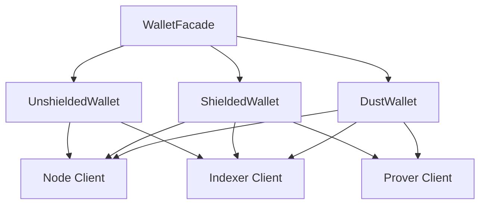

import Tabs from '@theme/Tabs';
import TabItem from '@theme/TabItem';

# Midnight wallet SDK

The Midnight wallet SDK provides a comprehensive TypeScript implementation for managing wallets on the Midnight Network. 
It supports the three-token system that powers Midnight:

- **Unshielded tokens**: NIGHT and other unshielded tokens
- **Shielded tokens**: Shielded tokens with zero-knowledge proofs
- **DUST**: DUST for transaction fees

This guide covers how to use the wallet SDK to manage wallets on the Midnight Network.

## Packages

The Midnight wallet SDK provides a modular architecture with specialized packages for each operation. It consists of the following packages:

| Package | Purpose |
|---------|---------|
| `@midnight-ntwrk/wallet-sdk-facade` | Unified API for all wallet operations |
| `@midnight-ntwrk/wallet-sdk-unshielded-wallet` | Manages NIGHT and unshielded tokens |
| `@midnight-ntwrk/wallet-sdk-shielded` | Manages shielded tokens with ZK proofs |
| `@midnight-ntwrk/wallet-sdk-dust-wallet` | Manages DUST for transaction fees |
| `@midnight-ntwrk/wallet-sdk-hd` | Hierarchical deterministic key derivation |
| `@midnight-ntwrk/wallet-sdk-address-format` | Bech32m address encoding and decoding |
| `@midnight-ntwrk/wallet-sdk-node-client` | Communicates with Midnight nodes |
| `@midnight-ntwrk/wallet-sdk-indexer-client` | Queries the Midnight indexer |
| `@midnight-ntwrk/wallet-sdk-prover-client` | Interfaces with the proving server |

For complete package details, see the [wallet SDK release notes](../../relnotes/wallet/).

## Installation

Install the wallet SDK using your preferred package manager:

<Tabs>
  <TabItem value="npm">
    ```bash
    npm install @midnight-ntwrk/wallet-sdk-facade@VERSION \
                @midnight-ntwrk/wallet-sdk-hd@VERSION \
                @midnight-ntwrk/wallet-sdk-address-format@VERSION \
                @midnight-ntwrk/wallet-sdk-unshielded-wallet@VERSION \
                @midnight-ntwrk/wallet-sdk-shielded@VERSION \
                @midnight-ntwrk/wallet-sdk-dust-wallet@VERSION \
                @midnight-ntwrk/ledger-v8
    ```
  </TabItem>
  <TabItem value="yarn">
    ```bash
    yarn add @midnight-ntwrk/wallet-sdk-facade@VERSION \
                @midnight-ntwrk/wallet-sdk-hd@VERSION \
                @midnight-ntwrk/wallet-sdk-address-format@VERSION \
                @midnight-ntwrk/wallet-sdk-unshielded-wallet@VERSION \
                @midnight-ntwrk/wallet-sdk-shielded@VERSION \
                @midnight-ntwrk/wallet-sdk-dust-wallet@VERSION \
                @midnight-ntwrk/ledger-v8
    ```
  </TabItem>
</Tabs>

Replace `VERSION` with the compatible version of the wallet SDK packages as defined in the [release compatibility matrix](../../relnotes/support-matrix).

## Wallet architecture

The Wallet SDK uses a three-wallet architecture corresponding to Midnight's token model:



- **WalletFacade**: Unified interface that coordinates all three wallet types
- **UnshieldedWallet**: Manages NIGHT and other unshielded tokens using UTxO model
- **ShieldedWallet**: Manages privacy-preserving shielded tokens using ZK proofs
- **DustWallet**: Manages DUST for paying transaction fees

## Derive wallet keys

The Wallet SDK uses hierarchical deterministic (HD) key derivation following BIP-32/BIP-44/CIP-1852 standards. All three wallet types derive keys from a single seed.

### Derivation path

The SDK follows this derivation path:

```
m / 44' / 2400' / account' / role / index
```

Path components:

- `account`: Account index, typically 0 for the first account
- `role`: Wallet type identifier that determines the key's purpose:
  - `0` (Roles.NightExternal): Unshielded operations
  - `3` (Roles.Zswap): Shielded operations
  - `4` (Roles.Dust): DUST token operations
- `index`: Address index, typically 0 for the primary address

### Derive keys from a seed

This example shows how to derive all three key types (unshielded, shielded, and DUST) from a single master seed. The function handles edge cases where key derivation might fail and automatically retries with the next index as specified in the BIP-44 standard.

```typescript
import * as ledger from '@midnight-ntwrk/ledger-v8';
import type { Role } from '@midnight-ntwrk/wallet-sdk-hd';
import { AccountKey, HDWallet, Roles } from '@midnight-ntwrk/wallet-sdk-hd';
import { Buffer } from 'buffer';

function deriveRoleKey(accountKey: AccountKey, role: Role, addressIndex: number = 0): Buffer {
  const result = accountKey.selectRole(role).deriveKeyAt(addressIndex);

  if (result.type === 'keyDerived') {
    return Buffer.from(result.key);
  }

  // There is small possibility of the derivation failing, so we retry with the next index as specified
  return deriveRoleKey(accountKey, role, addressIndex + 1);
}

function deriveAllKeys(seed: Uint8Array) {
  const hdWallet = HDWallet.fromSeed(seed);

  if (hdWallet.type !== 'seedOk') {
    throw new Error('Failed to derive keys');
  }

  const account = hdWallet.hdWallet.selectAccount(0);
  const shieldedSeed = deriveRoleKey(account, Roles.Zswap);
  const dustSeed = deriveRoleKey(account, Roles.Dust);
  const unshieldedKey = deriveRoleKey(account, Roles.NightExternal);

  hdWallet.hdWallet.clear(); // Clear the HDWallet to avoid holding the private key in memory for longer than needed

  return {
    shielded: { seed: shieldedSeed, keys: ledger.ZswapSecretKeys.fromSeed(shieldedSeed) },
    dust: { seed: dustSeed, key: ledger.DustSecretKey.fromSeed(dustSeed) },
    unshielded: unshieldedKey,
  };
}
```
### Example usage

This example shows how to derive all three key types (unshielded, shielded, and DUST) from a single master seed.

```typescript
const seed = Buffer.from(
  '0000000000000000000000000000000000000000000000000000000000000001',
  'hex'
);
const derivedKeys = deriveAllKeys(seed);

// Clear the seed from memory after use
seed.fill(0);

console.log('Derived keys successfully');
console.log('Unshielded (Night) secret key:', derivedKeys.unshielded.toString('hex'));
console.log('Shielded seed:', derivedKeys.shielded.seed.toString('hex'));
console.log('DUST seed:', derivedKeys.dust.seed.toString('hex'));
```

:::warning Security
Always clear the HD wallet after key derivation to avoid keeping the seed in memory longer than necessary.
:::

## Initialize the wallet

The `WalletFacade` provides a unified interface for all wallet operations. Initialize it with configuration and wallet-specific secret keys.

### Configuration

Before initializing the wallet, create a configuration object that specifies network endpoints, cost parameters, and transaction history storage. The configuration differs depending on whether you connect to the hosted Preprod testnet or a local undeployed development network.

<Tabs>
  <TabItem value="preprod" label="Preprod">
```typescript
import { type DefaultConfiguration } from '@midnight-ntwrk/wallet-sdk-facade';
import { InMemoryTransactionHistoryStorage } from '@midnight-ntwrk/wallet-sdk-unshielded-wallet';

const configuration: DefaultConfiguration = {
  networkId: 'preprod',
  costParameters: {
    feeBlocksMargin: 5,
  },
  relayURL: new URL('wss://rpc.preprod.midnight.network'),
  provingServerUrl: new URL('http://localhost:6300'),
  indexerClientConnection: {
    indexerHttpUrl: 'https://indexer.preprod.midnight.network/api/v4/graphql',
    indexerWsUrl: 'wss://indexer.preprod.midnight.network/api/v4/graphql/ws',
  },
  txHistoryStorage: new InMemoryTransactionHistoryStorage(),
};
```
  </TabItem>
  <TabItem value="undeployed" label="Undeployed">
```typescript
import { type DefaultConfiguration } from '@midnight-ntwrk/wallet-sdk-facade';
import { InMemoryTransactionHistoryStorage } from '@midnight-ntwrk/wallet-sdk-unshielded-wallet';

const INDEXER_PORT = Number.parseInt(process.env['INDEXER_PORT'] ?? '8088', 10);
const NODE_PORT = Number.parseInt(process.env['NODE_PORT'] ?? '9944', 10);
const PROOF_SERVER_PORT = Number.parseInt(process.env['PROOF_SERVER_PORT'] ?? '6300', 10);
const INDEXER_HTTP_URL = `http://localhost:${INDEXER_PORT}/api/v4/graphql`;
const INDEXER_WS_URL = `ws://localhost:${INDEXER_PORT}/api/v4/graphql/ws`;

const configuration: DefaultConfiguration = {
  networkId: 'undeployed',
  costParameters: {
    feeBlocksMargin: 5,
  },
  relayURL: new URL(`ws://localhost:${NODE_PORT}`),
  provingServerUrl: new URL(`http://localhost:${PROOF_SERVER_PORT}`),
  indexerClientConnection: {
    indexerHttpUrl: INDEXER_HTTP_URL,
    indexerWsUrl: INDEXER_WS_URL,
  },
  txHistoryStorage: new InMemoryTransactionHistoryStorage(),
};

```
</TabItem>
</Tabs>

### Complete initialization

This example demonstrates the complete wallet initialization process, including key derivation, keystore creation, and starting all three wallet types. The initialization pattern ensures proper key management and wallet setup before network synchronization begins.

```typescript
import * as ledger from '@midnight-ntwrk/ledger-v8';
import { DustWallet } from '@midnight-ntwrk/wallet-sdk-dust-wallet';
import { WalletFacade } from '@midnight-ntwrk/wallet-sdk-facade';
import { ShieldedWallet } from '@midnight-ntwrk/wallet-sdk-shielded';
import {
  createKeystore,
  PublicKey,
  UnshieldedWallet,
} from '@midnight-ntwrk/wallet-sdk-unshielded-wallet';

async function initWallet(seed: Buffer) {
  // Derive keys
  const derivedKeys = deriveAllKeys(seed);

  const unshieldedKeystore = createKeystore(
    derivedKeys.unshielded,
    configuration.networkId
  );

  // Initialize wallet facade
  const wallet = await WalletFacade.init({
    configuration,
    shielded: (config) =>
      ShieldedWallet(config).startWithSecretKeys(derivedKeys.shielded.keys),
    unshielded: (config) =>
      UnshieldedWallet(config).startWithPublicKey(
        PublicKey.fromKeyStore(unshieldedKeystore)
      ),
    dust: (config) =>
      DustWallet(config).startWithSecretKey(
        derivedKeys.dust.key,
        ledger.LedgerParameters.initialParameters().dust
      ),
  });

  await wallet.start(derivedKeys.shielded.keys, derivedKeys.dust.key);

  return { wallet, derivedKeys, unshieldedKeystore };
}
```

For the complete example, see the [initialization snippet](https://github.com/midnightntwrk/midnight-wallet/blob/main/packages/docs-snippets/src/snippets/initialization.ts).

## Wallet state

The wallet exposes an observable state that updates as the blockchain synchronizes.

### Access wallet state

The wallet provides methods to access both the current state snapshot and subscribe to state changes over time. Use `waitForSyncedState()` to wait until the wallet finishes its initial synchronization with the blockchain before performing operations.

```typescript
import * as rx from 'rxjs';

// Wait for initial sync
const syncedState = await wallet.waitForSyncedState();

console.log('Shielded balance:', syncedState.shielded.balances);
console.log('Unshielded balance:', syncedState.unshielded.balances);
console.log('DUST balance:', syncedState.dust.totalCoins);

// Subscribe to state changes
wallet.state().subscribe((state) => {
  if (state.isSynced) {
    console.log('Wallet is synced');
    console.log('Shielded coins:', state.shielded.availableCoins.length);
    console.log('Unshielded UTxOs:', state.unshielded.availableCoins.length);
  }
});
```

### Wallet state structure

The wallet state includes:

- **Balances**: Token amounts grouped by token type
- **Available coins**: Coins ready to spend
- **Pending coins**: Coins waiting for confirmation
- **Progress**: Synchronization status
- **Addresses**: Bech32m-encoded addresses for each wallet type

## Address encoding

Midnight uses Bech32m format for all addresses. The SDK provides utilities for encoding and decoding addresses.

### Address types

Midnight supports three address types:

| Prefix | Type | Description |
|--------|------|-------------|
| `mn_addr` | Unshielded | Payment addresses for NIGHT and unshielded tokens |
| `mn_shield-addr` | Shielded | Payment addresses for shielded tokens |
| `mn_dust` | DUST | Addresses for DUST generation |

Each prefix includes a network identifier:
- **Mainnet**: no suffix (for example, `mn_addr`)
- **Preprod**: `_preprod` suffix (for example, `mn_addr_preprod`)
- **Preview**: `_preview` suffix
- **Undeployed**: `_undeployed` suffix

### Encode addresses

Encoding converts raw public keys and addresses into human-readable Bech32m format. The encoded addresses include the network identifier and are suitable for sharing with users or displaying in user interfaces. Each wallet type requires different encoding based on its key structure.

```typescript
import {
  MidnightBech32m,
  UnshieldedAddress,
  ShieldedAddress,
  DustAddress,
  ShieldedCoinPublicKey,
  ShieldedEncryptionPublicKey,
} from '@midnight-ntwrk/wallet-sdk-address-format';
import * as ledger from '@midnight-ntwrk/ledger-v8';

const networkId = 'preprod';

// Encode unshielded address
const verifyingKey = ledger.signatureVerifyingKey(unshieldedSecretKey.toString('hex'));
const unshieldedAddress = new UnshieldedAddress(
  Buffer.from(ledger.addressFromKey(verifyingKey), 'hex')
);
const unshieldedBech32m = MidnightBech32m.encode(networkId, unshieldedAddress).toString();

// Encode shielded address
const shieldedKeys = ledger.ZswapSecretKeys.fromSeed(shieldedSeed);
const shieldedAddress = new ShieldedAddress(
  new ShieldedCoinPublicKey(Buffer.from(shieldedKeys.coinPublicKey, 'hex')),
  new ShieldedEncryptionPublicKey(Buffer.from(shieldedKeys.encryptionPublicKey, 'hex'))
);
const shieldedBech32m = MidnightBech32m.encode(networkId, shieldedAddress).toString();

// Encode dust address
const dustSecretKey = ledger.DustSecretKey.fromSeed(dustSeed);
const dustAddress = new DustAddress(dustSecretKey.publicKey);
const dustBech32m = MidnightBech32m.encode(networkId, dustAddress).toString();
```

### Decode addresses

Decoding converts Bech32m-formatted addresses back into their raw byte representations. This is necessary when you need to extract the underlying public keys or address bytes for cryptographic operations, transaction building, or verification. The decode process validates the address format and network identifier.

```typescript
// Parse and decode unshielded address
const parsedUnshielded = MidnightBech32m.parse(unshieldedBech32m);
const decodedUnshielded = parsedUnshielded.decode(UnshieldedAddress, networkId);

// Parse and decode shielded address
const parsedShielded = MidnightBech32m.parse(shieldedBech32m);
const decodedShielded = parsedShielded.decode(ShieldedAddress, networkId);
```

For complete address examples, see the [addresses snippet](https://github.com/midnightntwrk/midnight-wallet/blob/main/packages/docs-snippets/src/snippets/addresses.no-net.ts).

## Make transfers

The wallet provides high-level methods for transferring tokens. The following examples assume you have initialized the wallet and derived the necessary keys as shown in the [Initialize the wallet](#initialize-the-wallet) section.

### Unshielded transfers

Unshielded transfers move NIGHT or other unshielded tokens between addresses using standard UTxO-based transactions. These transfers are visible on the blockchain and require signing with the unshielded secret key.

```typescript
import * as ledger from '@midnight-ntwrk/ledger-v8';

await wallet
  .transferTransaction(
    [
      {
        type: 'unshielded',
        outputs: [
          {
            amount: 1_000_000n,
            receiverAddress: await receiverWallet.unshielded.getAddress(),
            type: ledger.unshieldedToken().raw,
          },
        ],
      },
    ],
    {
      shieldedSecretKeys,
      dustSecretKey,
    },
    {
      ttl: new Date(Date.now() + 30 * 60 * 1000),
    }
  )
  .then((recipe) => wallet.signRecipe(recipe, (payload) => keystore.signData(payload)))
  .then((recipe) => wallet.finalizeRecipe(recipe))
  .then((tx) => wallet.submitTransaction(tx));
```

Unshielded transfers require signing with the unshielded secret key since they involve UTxO-based transactions with Schnorr signatures.

### Shielded transfers

Shielded transfers move tokens privately using zero-knowledge proofs. These transfers hide transaction amounts and participant identities from observers while still maintaining verifiable correctness. Unlike unshielded transfers, they do not require unshielded signature operations.

```typescript
await wallet
  .transferTransaction(
    [
      {
        type: 'shielded',
        outputs: [
          {
            amount: 1_000_000n,
            receiverAddress: await receiverWallet.shielded.getAddress(),
            type: ledger.shieldedToken().raw,
          },
        ],
      },
    ],
    {
      shieldedSecretKeys,
      dustSecretKey,
    },
    {
      ttl: new Date(Date.now() + 30 * 60 * 1000),
    }
  )
  .then((recipe) => wallet.finalizeRecipe(recipe))
  .then((tx) => wallet.submitTransaction(tx));
```

:::note
Shielded transfers do not require unshielded signatures since all operations are proven with zero-knowledge proofs.
:::

### Combined transfers

The wallet supports atomic transactions that combine both unshielded and shielded token transfers. This allows you to move different token types in a single operation, reducing transaction overhead and ensuring both transfers complete together or not at all.

```typescript
await wallet
  .transferTransaction(
    [
      {
        type: 'unshielded',
        outputs: [
          {
            amount: 1_000_000n,
            receiverAddress: await receiverWallet.unshielded.getAddress(),
            type: ledger.unshieldedToken().raw,
          },
        ],
      },
      {
        type: 'shielded',
        outputs: [
          {
            amount: 1_000_000n,
            receiverAddress: await receiverWallet.shielded.getAddress(),
            type: ledger.shieldedToken().raw,
          },
        ],
      },
    ],
    {
      shieldedSecretKeys,
      dustSecretKey,
    },
    {
      ttl: new Date(Date.now() + 30 * 60 * 1000),
    }
  )
  .then((recipe) => wallet.signRecipe(recipe, (payload) => keystore.signData(payload)))
  .then((recipe) => wallet.finalizeRecipe(recipe))
  .then((tx) => wallet.submitTransaction(tx));
```

## Balance transactions

Transaction balancing automatically provides inputs to cover outputs and fees. The wallet supports balancing at different stages of transaction construction. The following examples assume you have an initialized wallet with the necessary secret keys.

### Balance an unproven transaction

Balancing an unproven transaction selects appropriate inputs to cover the specified outputs and transaction fees. This operation must occur before zero-knowledge proof generation, allowing the wallet to determine the complete set of inputs required. The example below assumes you have created a transaction intent specifying the desired outputs.

```typescript
const unprovenTx = ledger.Transaction.fromParts(
  'preprod',
  undefined,
  undefined,
  intent
);

const balancedRecipe = await wallet.balanceUnprovenTransaction(
  unprovenTx,
  {
    shieldedSecretKeys,
    dustSecretKey,
  },
  {
    ttl: new Date(Date.now() + 30 * 60 * 1000),
  }
);
```

### Balance a finalized transaction

Balancing a finalized transaction adds inputs to a transaction that already contains zero-knowledge proofs. This is particularly useful for DUST sponsorship scenarios where a separate party pays transaction fees. The `tokenKindsToBalance` parameter controls which token types to balance.

```typescript
const finalizedRecipe = await wallet.balanceFinalizedTransaction(
  finalizedTx,
  {
    shieldedSecretKeys,
    dustSecretKey,
  },
  {
    ttl: new Date(Date.now() + 30 * 60 * 1000),
    tokenKindsToBalance: ['dust'], // Only balance DUST for fees
  }
);
```

## Manage DUST

DUST is generated from registered NIGHT holdings and is required to pay transaction fees. The following examples assume you have an initialized wallet with an unshielded keystore and the necessary secret keys.

### Register NIGHT for DUST generation

Registration designates unshielded NIGHT coins to generate DUST tokens over time. Once registered, these coins continuously produce DUST that accumulates in your DUST wallet. The registered NIGHT remains in your unshielded wallet and can be deregistered later.

```typescript
const { unshielded } = await wallet.waitForSyncedState();

await wallet
  .registerNightUtxosForDustGeneration(
    unshielded.availableCoins,
    unshieldedKeystore.getPublicKey(),
    (payload) => unshieldedKeystore.signData(payload)
  )
  .then((recipe) => wallet.finalizeRecipe(recipe))
  .then((tx) => wallet.submitTransaction(tx));
```

:::info
DUST generation begins automatically once NIGHT is registered. You must wait for the blockchain to process the registration before DUST appears in your wallet.
:::

### Deregister NIGHT from DUST generation

Deregistration stops DUST generation from previously registered NIGHT coins. This operation requires DUST to pay the transaction fee, so you must balance the transaction with `tokenKindsToBalance: ['dust']` after creating the deregistration recipe.

```typescript
const { unshielded } = await wallet.waitForSyncedState();

await wallet
  .deregisterFromDustGeneration(
    [unshielded.availableCoins[0]], // Deregister specific coin
    unshieldedKeystore.getPublicKey(),
    (payload) => unshieldedKeystore.signData(payload)
  )
  .then((recipe) =>
    wallet.balanceUnprovenTransaction(
      recipe.transaction,
      { shieldedSecretKeys, dustSecretKey },
      {
        ttl: new Date(Date.now() + 30 * 60 * 1000),
        tokenKindsToBalance: ['dust'],
      }
    )
  )
  .then((recipe) => wallet.finalizeRecipe(recipe))
  .then((tx) => wallet.submitTransaction(tx));
```

### Redesignate DUST to another address

Redesignation redirects DUST generation from registered NIGHT coins to a different DUST address. This is useful when transferring DUST generation rights to another wallet or service. The redesignation operation is atomic and requires DUST for transaction fees.

```typescript
await wallet
  .registerNightUtxosForDustGeneration(
    [unshielded.availableCoins[0]],
    unshieldedKeystore.getPublicKey(),
    (payload) => unshieldedKeystore.signData(payload),
    receiverDustAddress // Redirect to this address
  )
  .then((recipe) =>
    wallet.balanceUnprovenTransaction(
      recipe.transaction,
      { shieldedSecretKeys, dustSecretKey },
      {
        ttl: new Date(Date.now() + 30 * 60 * 1000),
        tokenKindsToBalance: ['dust'],
      }
    )
  )
  .then((recipe) => wallet.finalizeRecipe(recipe))
  .then((tx) => wallet.submitTransaction(tx));
```

## DUST sponsorship

DUST sponsorship enables a service to pay transaction fees on behalf of users. This is useful for DApps that want to subsidize user fees. The following example demonstrates a two-party sponsorship flow where the user prepares a transaction and a sponsor adds the required DUST for fees.

### Sponsorship workflow

DUST sponsorship follows a three-step process that separates transaction creation from fee payment:

1. User creates and balances transaction without fees
2. Sponsor balances the transaction to add DUST for fees
3. Sponsor submits the transaction

```typescript
// User prepares transaction without fees
const userRecipe = await userWallet.balanceUnboundTransaction(
  transaction,
  { shieldedSecretKeys: userShieldedKeys, dustSecretKey: userDustKey },
  {
    ttl: new Date(Date.now() + 30 * 60 * 1000),
    tokenKindsToBalance: ['shielded', 'unshielded'], // No DUST
  }
);

const userSigned = await userWallet.signRecipe(
  userRecipe,
  (payload) => userKeystore.signData(payload)
);

const userFinalized = await userWallet.finalizeRecipe(userSigned);

// Sponsor adds fees and submits
await sponsorWallet
  .balanceFinalizedTransaction(
    userFinalized,
    { shieldedSecretKeys: sponsorShieldedKeys, dustSecretKey: sponsorDustKey },
    {
      ttl: new Date(Date.now() + 30 * 60 * 1000),
      tokenKindsToBalance: ['dust'], // Only add DUST
    }
  )
  .then((recipe) => sponsorWallet.signRecipe(recipe, (payload) => sponsorKeystore.signData(payload)))
  .then((recipe) => sponsorWallet.finalizeRecipe(recipe))
  .then((tx) => sponsorWallet.submitTransaction(tx));
```

## Atomic swaps

Atomic swaps enable trustless token exchanges between parties. The SDK supports creating swap offers that can be merged into a single transaction. The following examples assume both parties have initialized wallets with the necessary secret keys.

### Create and execute a swap

The swap process involves two parties: 
- The initiator creates a partial transaction offering tokens in exchange for different tokens.
- The counterparty completes the swap by balancing the transaction with their own inputs.

The wallet handles all cryptographic operations and ensures both parties receive their expected tokens atomically.

```typescript
// Alice initiates swap
const aliceSwapTx = await aliceWallet
  .initSwap(
    { shielded: { [token1]: 1_000_000n } }, // Offer token1
    [
      {
        type: 'shielded',
        outputs: [
          {
            type: token2,
            amount: 1_000_000n,
            receiverAddress: aliceShieldedAddress,
          },
        ],
      },
    ], // Request token2
    { shieldedSecretKeys: aliceShieldedKeys, dustSecretKey: aliceDustKey },
    { ttl: new Date(Date.now() + 30 * 60 * 1000) }
  )
  .then((recipe) => aliceWallet.finalizeRecipe(recipe));

// Bob completes swap by balancing Alice's transaction
await bobWallet
  .balanceFinalizedTransaction(
    aliceSwapTx,
    { shieldedSecretKeys: bobShieldedKeys, dustSecretKey: bobDustKey },
    { ttl: new Date(Date.now() + 30 * 60 * 1000) }
  )
  .then((recipe) => bobWallet.finalizeRecipe(recipe))
  .then((tx) => bobWallet.submitTransaction(tx));
```

:::info
The swap is atomic - either both parties exchange tokens or the transaction fails. Token amounts and types are hidden from observers.
:::

## Use alternative proving

By default, the wallet uses an HTTP-based proving server. For browser environments or alternative deployment scenarios, you can use WASM-based proving.

### WASM proving

For browser environments or situations where HTTP access to a proving server is restricted, you can use WebAssembly-based proving. This approach runs proof generation entirely in the client environment but is significantly slower than using a dedicated proving server.

```typescript
import { makeWasmProvingService } from '@midnight-ntwrk/wallet-sdk-capabilities';

const wallet = await WalletFacade.init({
  configuration,
  shielded: (config) => ShieldedWallet(config).startWithSecretKeys(shieldedKeys),
  unshielded: (config) => UnshieldedWallet(config).startWithPublicKey(publicKey),
  dust: (config) => DustWallet(config).startWithSecretKey(dustKey, dustParams),
  provingService: () => makeWasmProvingService(), // Use WASM proving
});
```

:::warning Performance
WASM proving is slower than native proving servers. Use it only when HTTP access to a proving server is not available.
:::

## Lifecycle management

The wallet lifecycle management provides control over the wallet's startup and shutdown processes.

### Start the wallet

Starting the wallet initiates all synchronization processes with the Midnight Network. This includes connecting to the node, indexer, and beginning to scan for transactions and state updates. You must call this method after initializing the wallet facade but before performing any operations.

```typescript
await wallet.start(shieldedSecretKeys, dustSecretKey);
```

### Stop the wallet

Stopping the wallet gracefully shuts down all background processes, closes network connections to the node and indexer, and releases resources. This ensures clean termination and prevents resource leaks in your application.

```typescript
await wallet.stop();
```

:::warning
Always stop the wallet before exiting your application to ensure proper cleanup of network connections and resources.
:::

## DApp integration

For DApp integration, use the DApp Connector API, which provides a standardized interface for wallet interactions. This API enables DApps to interact with browser wallets like Lace through a consistent interface. 

The example below shows how a DApp connects to and interacts with a Lace Midnight wallet.

```typescript
import { nativeToken } from '@midnight-ntwrk/ledger-v8';

// Check if wallet is available
const wallet = window.midnight?.mnLace;

if (!wallet) {
  console.error('Please install Lace Midnight wallet');
  throw new Error('Wallet not found');
}

// Display wallet information to user
console.log('Wallet name:', wallet.name);
console.log('Wallet API version:', wallet.apiVersion);

// Connect to wallet on preprod network
try {
  const connectedApi = await wallet.connect('preprod');
  console.log('Connected to wallet');

  // Get wallet configuration
  const config = await connectedApi.getConfiguration();
  console.log('Indexer URI:', config.indexerUri);
  console.log('Proving Server URI:', config.proverServerUri);
  console.log('Network ID:', config.networkId);

  // Query wallet balances
  const shieldedBalances = await connectedApi.getShieldedBalances();
  const unshieldedBalances = await connectedApi.getUnshieldedBalances();
  const dustBalance = await connectedApi.getDustBalance();

  console.log('Shielded balances:', shieldedBalances);
  console.log('Unshielded balances:', unshieldedBalances);
  console.log('Dust balance:', dustBalance);

  // Get wallet addresses
  const shieldedAddresses = await connectedApi.getShieldedAddresses();
  const unshieldedAddress = await connectedApi.getUnshieldedAddress();
  const dustAddress = await connectedApi.getDustAddress();

  console.log('Shielded address:', shieldedAddresses.shieldedAddress);
  console.log('Unshielded address:', unshieldedAddress);
  console.log('Dust address:', dustAddress);

  // Initiate a payment
  const transaction = await connectedApi.makeTransfer([
    {
      kind: 'unshielded',
      tokenType: nativeToken().raw,
      value: 10n ** 6n, // 1 NIGHT
      recipient: 'mn_addr_preprod1abcdef...', // Replace with actual address
    },
  ]);

  // Submit transaction
  await connectedApi.submitTransaction(transaction);
  console.log('Transaction submitted successfully');

} catch (error) {
  console.error('Error connecting to wallet:', error);
}
```
:::tip
To learn more about the DApp Connector API, see the [DApp Connector API](/api-reference/dapp-connector) documentation.
:::

## References

- [Wallet SDK repository](https://github.com/midnightntwrk/midnight-wallet/tree/main/packages/docs-snippets/src/snippets)
- [Wallet SDK release notes](../../relnotes/wallet/)